# Homework (Simulation)

This program, process-run.py, allows you to see how process states change as programs run and
either use the CPU (e.g., perform an add instruction) or do I/O (e.g., send a request to a disk and
wait for it to complete). See the README for details.

## Questions (Total: 104)

1. Run process-run.py with the following flags: -l 5:100,5:100. What should the CPU utilization
be (e.g., the percent of time the CPU is in use?) Why do you know this? Use the -c and -p
flags to see if you were right.

    - **My descriptions**: Because these two processes have no I/O operations, the CPU will always be busy until all jobs are done, no matter whether the CPU switches to another process or not. Therefore, CPU utilization should be 100%.
    - **Screenshot**: 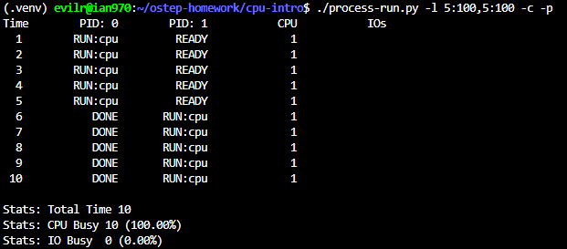

2. Now run with these flags: ./process-run.py -l 4:100,1:0. These flags specify one process with 4 instructions (all to use the CPU), and one that simply issues an I/O and waits for it to be done. How long does it take to complete both processes? Use -c and -p to find out if you were
right.

    - **My descriptions**: 4 + (1 + 5 + 1) = **11**. Process-0 has no I/O operations, so it takes 4 time units. Then the CPU switches to process-1: it takes 1 time unit to issue the I/O and another 1 time unit to finish after the I/O completes. Since the default I/O length is 5, process-1 takes (1 + 5 + 1) = 7 time units.

    ```python
    # process-run.py, line:290
    parser.add_option('-L', '--iolength', default=5, help='how long an IO takes', action='store', type='int', dest='io_length')
    ```

    - **Screenshot**: 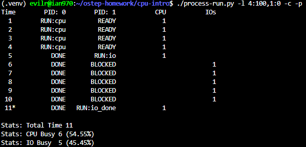

3. Switch the order of the processes: -l 1:0,4:100. What happens now? Does switching the order matter? Why? (As always, use -c and -p to see if you were right) Please include a screenshot of your execution result. (13 points)

    - **My descriptions**: Since we swap the execution order, the CPU first runs process-0 for one instruction to issue an I/O operation, and then switches to process-1 to run 4 CPU instructions while process-0 waits for its 5-time-unit I/O. Because process-1 can run during process-0's I/O wait, most waiting time is overlapped. As a result, the total completion time is much lower than in Q2. This shows that process order can matter under this scheduling behavior because it changes how much CPU work overlaps with I/O waiting time.
    - **Screenshot**: 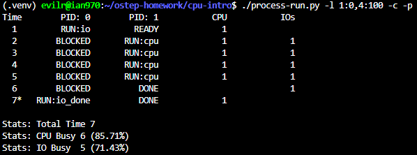

4. We’ll now explore some of the other flags. One important flag is -S, which determines how the system reacts when a process issues an I/O. With the flag set to SWITCH_ON_END, the system will NOT switch to another process while one is doing I/O, instead waiting until the
process is completely finished. What happens when you run the following two processes (-l 1:0,4:100 -c -S SWITCH_ON_END), one doing I/O and the other doing CPU work? Please include a screenshot of your execution result. (13 points)

    - **My descriptions**: When we use the SWITCH_ON_END flag, the CPU will not switch to process-1 while process-0 is blocked by I/O. Therefore, process-1 has to wait, and CPU time is wasted during the I/O wait period.
    - **Screenshot**: 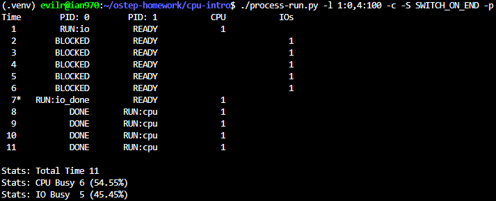

5. Now, run the same processes, but with the switching behavior set to switch to another process whenever one is WAITING for I/O (-l 1:0,4:100 -c -S SWITCH_ON_IO). What happens now? Use -c and -p to confirm that you are right. Please include a screenshot of your execution result. (13 points)

    - **My descriptions**: Since we use the SWITCH_ON_IO flag, the behavior is similar to Q3: the CPU switches to process-1 while waiting for process-0's I/O to complete.
    - **Screenshot**: 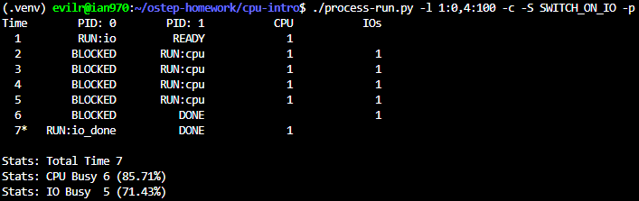

6. One other important behavior is what to do when an I/O completes. With -I IO_RUN_LATER, when an I/O completes, the process that issued it is not necessarily run right away; rather, whatever was running at the time keeps running. What happens when you run this
combination of processes? ( ./process-run.py -l 3:0,5:100,5:100,5:100 -S SWITCH_ON_IO -c -p -I IO_RUN_LATER)
Are system resources being effectively utilized? Please include a screenshot of your execution result. (13 points)

    - **My descriptions**: When we use the IO_RUN_LATER flag, after process-0 completes an I/O, the CPU keeps running whichever process is currently running. As a result, process-0 may wait a long time before issuing its next I/O, so system resources are not used effectively.
    - **Screenshot**: 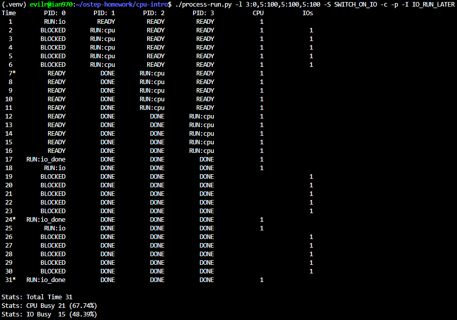

7. Now run the same processes, but with -I IO_RUN_IMMEDIATE set, which immediately runs the process that issued the I/O. How does this behavior differ? Why might running a process that just completed an I/O again be a good idea? Please include a screenshot of your execution result. (13 points)

    - **My descriptions**: This time we use the IO_RUN_IMMEDIATE flag. The CPU immediately returns to process-0 after each I/O completion so it can issue the next I/O sooner, then switches to other processes during the I/O wait. Compared with Q6, this reduces process-0's waiting time and usually lowers the total completion time, making execution more efficient.
    - **Screenshot**: 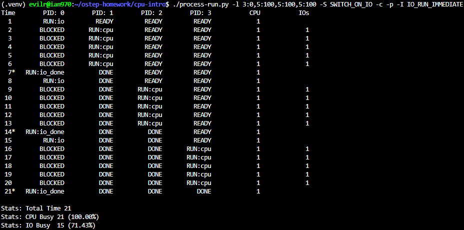

8. Now run with some randomly generated processes using flags -s 1 -l 3:50,3:50 or -s 2 -l 3:50, 3:50 or -s 3 -l 3:50, 3:50. See if you can predict how the trace will turn out. What happens when you use the flag -I IO_RUN_IMMEDIATE versus that flag -I IO_RUN_LATER? What happens when you use the flag -S SWITCH_ON_IO versus -S SWITCH_ON_END? Please include a screenshot of your execution result. (13 points)

    - **My descriptions-1**: In this case, I cannot predict the exact trace before running it, because I do not know when and how many I/O operations will occur in each process.
    - **Screenshot-1**:
      - 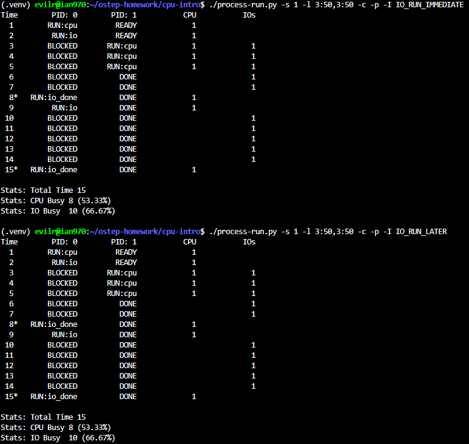
      - 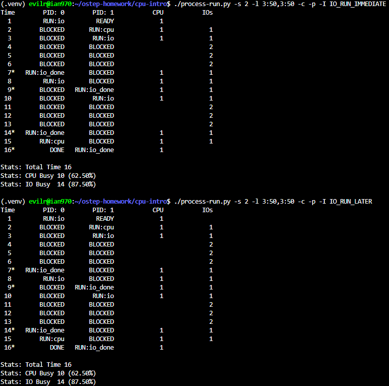
      - 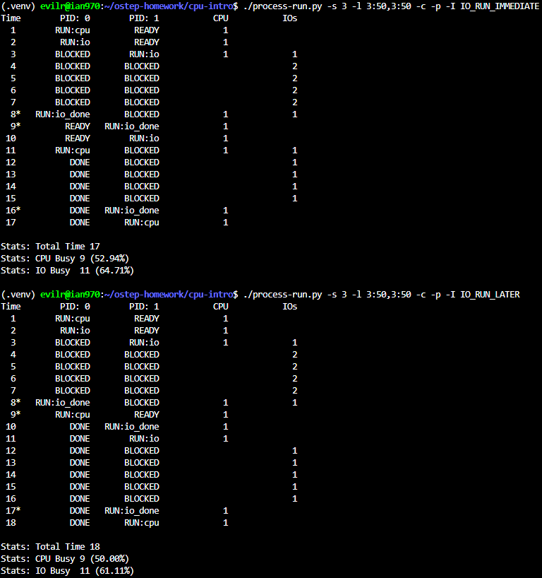
    - **My descriptions-2**: In this case, one thing I can predict is that configurations using SWITCH_ON_END should take more time to complete all jobs when at least one process contains I/O operations, because the CPU is less likely to overlap CPU work with I/O waiting time.
    - **Screenshot-2**:
      - 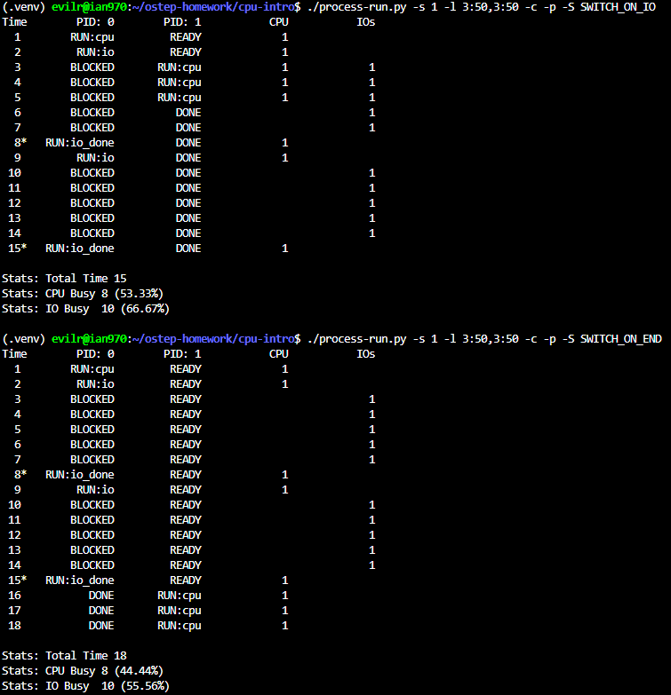
      - 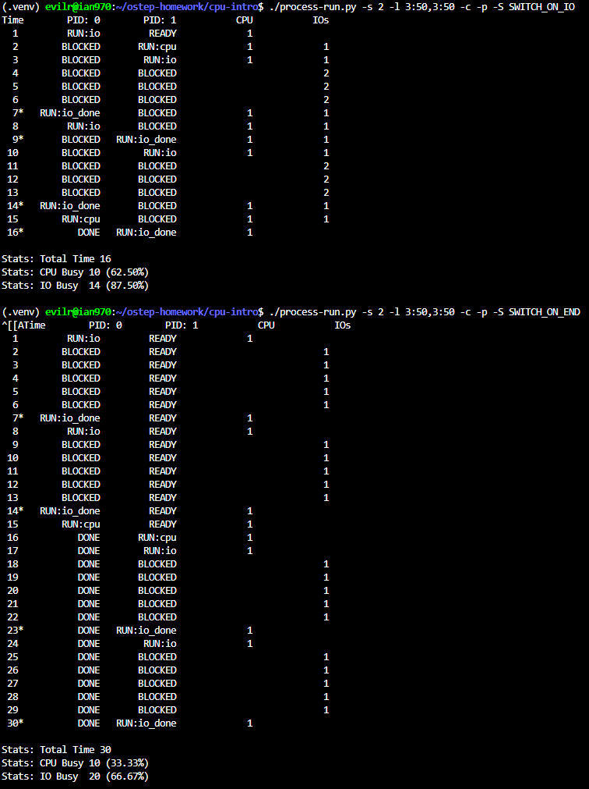
      - 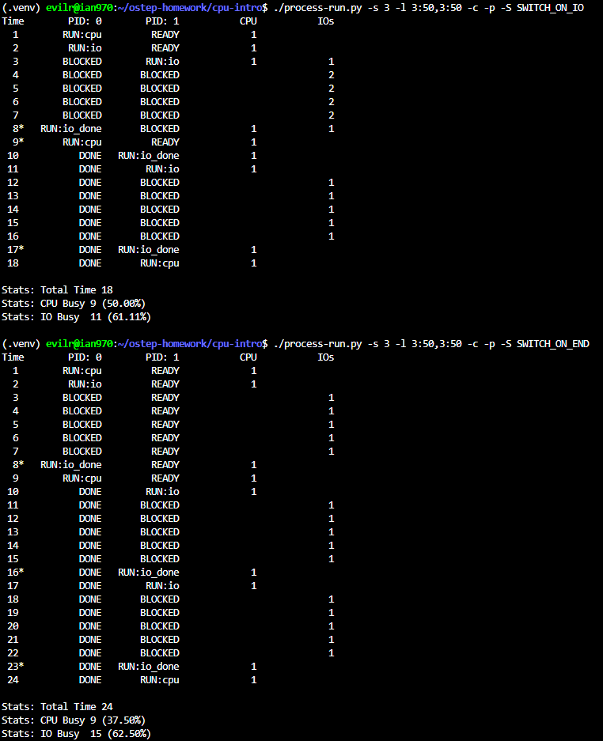
