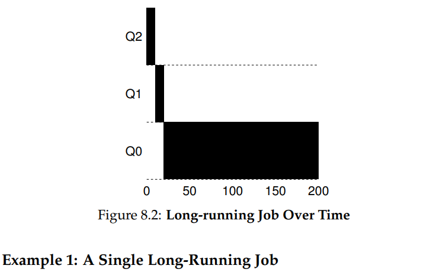
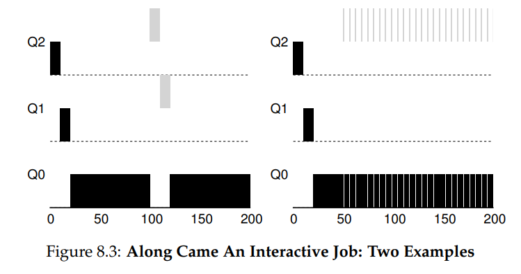
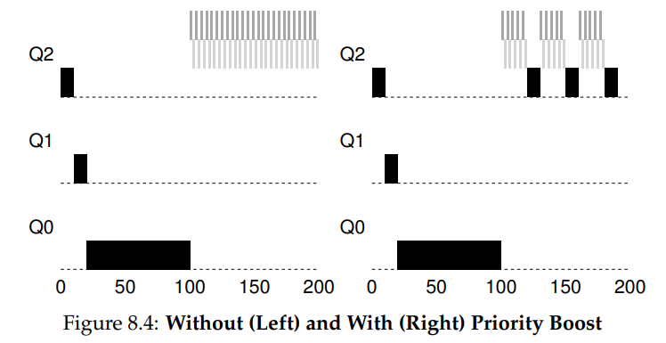
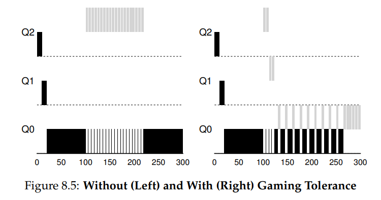
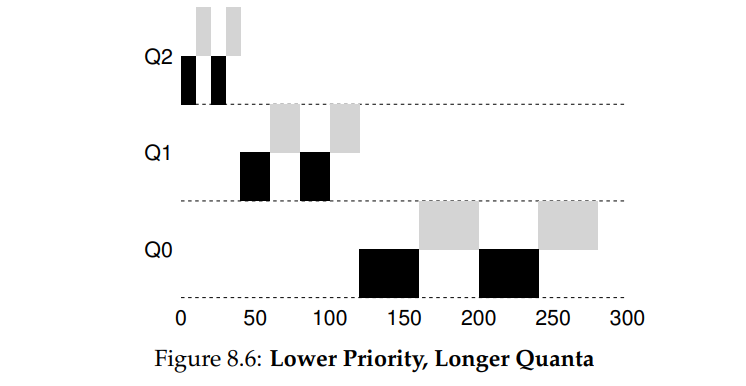

# Homework (Simulation)

This program, mlfq.py, allows you to see how the MLFQ scheduler
presented in this chapter behaves. See the README for details.

## Questions

1. Run a few randomly-generated problems with just two jobs and
two queues; compute the MLFQ execution trace for each. Make
your life easier by limiting the length of each job and turning off
I/Os.

``` text

(.venv) evilr@rog-i:~/ostep-homework/cpu-sched-mlfq$ ./mlfq.py -j 2 -n 2 -m 20 -M 0 -s 10 -c
Here is the list of inputs:
OPTIONS jobs 2
OPTIONS queues 2
OPTIONS allotments for queue  1 is   1
OPTIONS quantum length for queue  1 is  10
OPTIONS allotments for queue  0 is   1
OPTIONS quantum length for queue  0 is  10
OPTIONS boost 0
OPTIONS ioTime 5
OPTIONS stayAfterIO False
OPTIONS iobump False


For each job, three defining characteristics are given:
  startTime : at what time does the job enter the system
  runTime   : the total CPU time needed by the job to finish
  ioFreq    : every ioFreq time units, the job issues an I/O
              (the I/O takes ioTime units to complete)

Job List:
  Job  0: startTime   0 - runTime  11 - ioFreq   0
  Job  1: startTime   0 - runTime  11 - ioFreq   0


Execution Trace:

[ time 0 ] JOB BEGINS by JOB 0
[ time 0 ] JOB BEGINS by JOB 1
[ time 0 ] Run JOB 0 at PRIORITY 1 [ TICKS 9 ALLOT 1 TIME 10 (of 11) ]
[ time 1 ] Run JOB 0 at PRIORITY 1 [ TICKS 8 ALLOT 1 TIME 9 (of 11) ]
[ time 2 ] Run JOB 0 at PRIORITY 1 [ TICKS 7 ALLOT 1 TIME 8 (of 11) ]
[ time 3 ] Run JOB 0 at PRIORITY 1 [ TICKS 6 ALLOT 1 TIME 7 (of 11) ]
[ time 4 ] Run JOB 0 at PRIORITY 1 [ TICKS 5 ALLOT 1 TIME 6 (of 11) ]
[ time 5 ] Run JOB 0 at PRIORITY 1 [ TICKS 4 ALLOT 1 TIME 5 (of 11) ]
[ time 6 ] Run JOB 0 at PRIORITY 1 [ TICKS 3 ALLOT 1 TIME 4 (of 11) ]
[ time 7 ] Run JOB 0 at PRIORITY 1 [ TICKS 2 ALLOT 1 TIME 3 (of 11) ]
[ time 8 ] Run JOB 0 at PRIORITY 1 [ TICKS 1 ALLOT 1 TIME 2 (of 11) ]
[ time 9 ] Run JOB 0 at PRIORITY 1 [ TICKS 0 ALLOT 1 TIME 1 (of 11) ]
[ time 10 ] Run JOB 1 at PRIORITY 1 [ TICKS 9 ALLOT 1 TIME 10 (of 11) ]
[ time 11 ] Run JOB 1 at PRIORITY 1 [ TICKS 8 ALLOT 1 TIME 9 (of 11) ]
[ time 12 ] Run JOB 1 at PRIORITY 1 [ TICKS 7 ALLOT 1 TIME 8 (of 11) ]
[ time 13 ] Run JOB 1 at PRIORITY 1 [ TICKS 6 ALLOT 1 TIME 7 (of 11) ]
[ time 14 ] Run JOB 1 at PRIORITY 1 [ TICKS 5 ALLOT 1 TIME 6 (of 11) ]
[ time 15 ] Run JOB 1 at PRIORITY 1 [ TICKS 4 ALLOT 1 TIME 5 (of 11) ]
[ time 16 ] Run JOB 1 at PRIORITY 1 [ TICKS 3 ALLOT 1 TIME 4 (of 11) ]
[ time 17 ] Run JOB 1 at PRIORITY 1 [ TICKS 2 ALLOT 1 TIME 3 (of 11) ]
[ time 18 ] Run JOB 1 at PRIORITY 1 [ TICKS 1 ALLOT 1 TIME 2 (of 11) ]
[ time 19 ] Run JOB 1 at PRIORITY 1 [ TICKS 0 ALLOT 1 TIME 1 (of 11) ]
[ time 20 ] Run JOB 0 at PRIORITY 0 [ TICKS 9 ALLOT 1 TIME 0 (of 11) ]
[ time 21 ] FINISHED JOB 0
[ time 21 ] Run JOB 1 at PRIORITY 0 [ TICKS 9 ALLOT 1 TIME 0 (of 11) ]
[ time 22 ] FINISHED JOB 1

Final statistics:
  Job  0: startTime   0 - response   0 - turnaround  21
  Job  1: startTime   0 - response  10 - turnaround  22

  Avg  1: startTime n/a - response 5.00 - turnaround 21.50

```

2. How would you run the scheduler to reproduce each of the examples in the chapter?

- 

``` text

(.venv) evilr@rog-i:~/ostep-homework/cpu-sched-mlfq$ python mlfq.py -n 3 -q 10 -l 0,200,0 -c
Here is the list of inputs:
OPTIONS jobs 1
OPTIONS queues 3
OPTIONS allotments for queue  2 is   1
OPTIONS quantum length for queue  2 is  10
OPTIONS allotments for queue  1 is   1
OPTIONS quantum length for queue  1 is  10
OPTIONS allotments for queue  0 is   1
OPTIONS quantum length for queue  0 is  10
OPTIONS boost 0
OPTIONS ioTime 5
OPTIONS stayAfterIO False
OPTIONS iobump False


For each job, three defining characteristics are given:
  startTime : at what time does the job enter the system
  runTime   : the total CPU time needed by the job to finish
  ioFreq    : every ioFreq time units, the job issues an I/O
              (the I/O takes ioTime units to complete)

Job List:
  Job  0: startTime   0 - runTime 200 - ioFreq   0


Execution Trace:

[ time 0 ] JOB BEGINS by JOB 0
[ time 0 ] Run JOB 0 at PRIORITY 2 [ TICKS 9 ALLOT 1 TIME 199 (of 200) ]
[ time 1 ] Run JOB 0 at PRIORITY 2 [ TICKS 8 ALLOT 1 TIME 198 (of 200) ]
[ time 2 ] Run JOB 0 at PRIORITY 2 [ TICKS 7 ALLOT 1 TIME 197 (of 200) ]
[ time 3 ] Run JOB 0 at PRIORITY 2 [ TICKS 6 ALLOT 1 TIME 196 (of 200) ]
[ time 4 ] Run JOB 0 at PRIORITY 2 [ TICKS 5 ALLOT 1 TIME 195 (of 200) ]
[ time 5 ] Run JOB 0 at PRIORITY 2 [ TICKS 4 ALLOT 1 TIME 194 (of 200) ]
[ time 6 ] Run JOB 0 at PRIORITY 2 [ TICKS 3 ALLOT 1 TIME 193 (of 200) ]
[ time 7 ] Run JOB 0 at PRIORITY 2 [ TICKS 2 ALLOT 1 TIME 192 (of 200) ]
[ time 8 ] Run JOB 0 at PRIORITY 2 [ TICKS 1 ALLOT 1 TIME 191 (of 200) ]
[ time 9 ] Run JOB 0 at PRIORITY 2 [ TICKS 0 ALLOT 1 TIME 190 (of 200) ]
[ time 10 ] Run JOB 0 at PRIORITY 1 [ TICKS 9 ALLOT 1 TIME 189 (of 200) ]
[ time 11 ] Run JOB 0 at PRIORITY 1 [ TICKS 8 ALLOT 1 TIME 188 (of 200) ]
[ time 12 ] Run JOB 0 at PRIORITY 1 [ TICKS 7 ALLOT 1 TIME 187 (of 200) ]
[ time 13 ] Run JOB 0 at PRIORITY 1 [ TICKS 6 ALLOT 1 TIME 186 (of 200) ]
[ time 14 ] Run JOB 0 at PRIORITY 1 [ TICKS 5 ALLOT 1 TIME 185 (of 200) ]
[ time 15 ] Run JOB 0 at PRIORITY 1 [ TICKS 4 ALLOT 1 TIME 184 (of 200) ]
[ time 16 ] Run JOB 0 at PRIORITY 1 [ TICKS 3 ALLOT 1 TIME 183 (of 200) ]
[ time 17 ] Run JOB 0 at PRIORITY 1 [ TICKS 2 ALLOT 1 TIME 182 (of 200) ]
[ time 18 ] Run JOB 0 at PRIORITY 1 [ TICKS 1 ALLOT 1 TIME 181 (of 200) ]
[ time 19 ] Run JOB 0 at PRIORITY 1 [ TICKS 0 ALLOT 1 TIME 180 (of 200) ]
[ time 20 ] Run JOB 0 at PRIORITY 0 [ TICKS 9 ALLOT 1 TIME 179 (of 200) ]
[ time 21 ] Run JOB 0 at PRIORITY 0 [ TICKS 8 ALLOT 1 TIME 178 (of 200) ]
[ time 22 ] Run JOB 0 at PRIORITY 0 [ TICKS 7 ALLOT 1 TIME 177 (of 200) ]
[ time 23 ] Run JOB 0 at PRIORITY 0 [ TICKS 6 ALLOT 1 TIME 176 (of 200) ]
[ time 24 ] Run JOB 0 at PRIORITY 0 [ TICKS 5 ALLOT 1 TIME 175 (of 200) ]
[ time 25 ] Run JOB 0 at PRIORITY 0 [ TICKS 4 ALLOT 1 TIME 174 (of 200) ]
[ time 26 ] Run JOB 0 at PRIORITY 0 [ TICKS 3 ALLOT 1 TIME 173 (of 200) ]
[ time 27 ] Run JOB 0 at PRIORITY 0 [ TICKS 2 ALLOT 1 TIME 172 (of 200) ]
[ time 28 ] Run JOB 0 at PRIORITY 0 [ TICKS 1 ALLOT 1 TIME 171 (of 200) ]
[ time 29 ] Run JOB 0 at PRIORITY 0 [ TICKS 0 ALLOT 1 TIME 170 (of 200) ]
[ time 30 ] Run JOB 0 at PRIORITY 0 [ TICKS 9 ALLOT 1 TIME 169 (of 200) ]
[ time 31 ] Run JOB 0 at PRIORITY 0 [ TICKS 8 ALLOT 1 TIME 168 (of 200) ]
[ time 32 ] Run JOB 0 at PRIORITY 0 [ TICKS 7 ALLOT 1 TIME 167 (of 200) ]
[ time 33 ] Run JOB 0 at PRIORITY 0 [ TICKS 6 ALLOT 1 TIME 166 (of 200) ]
[ time 34 ] Run JOB 0 at PRIORITY 0 [ TICKS 5 ALLOT 1 TIME 165 (of 200) ]
[ time 35 ] Run JOB 0 at PRIORITY 0 [ TICKS 4 ALLOT 1 TIME 164 (of 200) ]
[ time 36 ] Run JOB 0 at PRIORITY 0 [ TICKS 3 ALLOT 1 TIME 163 (of 200) ]
[ time 37 ] Run JOB 0 at PRIORITY 0 [ TICKS 2 ALLOT 1 TIME 162 (of 200) ]
[ time 38 ] Run JOB 0 at PRIORITY 0 [ TICKS 1 ALLOT 1 TIME 161 (of 200) ]
[ time 39 ] Run JOB 0 at PRIORITY 0 [ TICKS 0 ALLOT 1 TIME 160 (of 200) ]
[ time 40 ] Run JOB 0 at PRIORITY 0 [ TICKS 9 ALLOT 1 TIME 159 (of 200) ]
[ time 41 ] Run JOB 0 at PRIORITY 0 [ TICKS 8 ALLOT 1 TIME 158 (of 200) ]
[ time 42 ] Run JOB 0 at PRIORITY 0 [ TICKS 7 ALLOT 1 TIME 157 (of 200) ]
[ time 43 ] Run JOB 0 at PRIORITY 0 [ TICKS 6 ALLOT 1 TIME 156 (of 200) ]
[ time 44 ] Run JOB 0 at PRIORITY 0 [ TICKS 5 ALLOT 1 TIME 155 (of 200) ]
[ time 45 ] Run JOB 0 at PRIORITY 0 [ TICKS 4 ALLOT 1 TIME 154 (of 200) ]
[ time 46 ] Run JOB 0 at PRIORITY 0 [ TICKS 3 ALLOT 1 TIME 153 (of 200) ]
[ time 47 ] Run JOB 0 at PRIORITY 0 [ TICKS 2 ALLOT 1 TIME 152 (of 200) ]
[ time 48 ] Run JOB 0 at PRIORITY 0 [ TICKS 1 ALLOT 1 TIME 151 (of 200) ]
[ time 49 ] Run JOB 0 at PRIORITY 0 [ TICKS 0 ALLOT 1 TIME 150 (of 200) ]
[ time 50 ] Run JOB 0 at PRIORITY 0 [ TICKS 9 ALLOT 1 TIME 149 (of 200) ]
[ time 51 ] Run JOB 0 at PRIORITY 0 [ TICKS 8 ALLOT 1 TIME 148 (of 200) ]
[ time 52 ] Run JOB 0 at PRIORITY 0 [ TICKS 7 ALLOT 1 TIME 147 (of 200) ]
[ time 53 ] Run JOB 0 at PRIORITY 0 [ TICKS 6 ALLOT 1 TIME 146 (of 200) ]
[ time 54 ] Run JOB 0 at PRIORITY 0 [ TICKS 5 ALLOT 1 TIME 145 (of 200) ]
[ time 55 ] Run JOB 0 at PRIORITY 0 [ TICKS 4 ALLOT 1 TIME 144 (of 200) ]
[ time 56 ] Run JOB 0 at PRIORITY 0 [ TICKS 3 ALLOT 1 TIME 143 (of 200) ]
[ time 57 ] Run JOB 0 at PRIORITY 0 [ TICKS 2 ALLOT 1 TIME 142 (of 200) ]
[ time 58 ] Run JOB 0 at PRIORITY 0 [ TICKS 1 ALLOT 1 TIME 141 (of 200) ]
[ time 59 ] Run JOB 0 at PRIORITY 0 [ TICKS 0 ALLOT 1 TIME 140 (of 200) ]
[ time 60 ] Run JOB 0 at PRIORITY 0 [ TICKS 9 ALLOT 1 TIME 139 (of 200) ]
[ time 61 ] Run JOB 0 at PRIORITY 0 [ TICKS 8 ALLOT 1 TIME 138 (of 200) ]
[ time 62 ] Run JOB 0 at PRIORITY 0 [ TICKS 7 ALLOT 1 TIME 137 (of 200) ]
[ time 63 ] Run JOB 0 at PRIORITY 0 [ TICKS 6 ALLOT 1 TIME 136 (of 200) ]
[ time 64 ] Run JOB 0 at PRIORITY 0 [ TICKS 5 ALLOT 1 TIME 135 (of 200) ]
[ time 65 ] Run JOB 0 at PRIORITY 0 [ TICKS 4 ALLOT 1 TIME 134 (of 200) ]
[ time 66 ] Run JOB 0 at PRIORITY 0 [ TICKS 3 ALLOT 1 TIME 133 (of 200) ]
[ time 67 ] Run JOB 0 at PRIORITY 0 [ TICKS 2 ALLOT 1 TIME 132 (of 200) ]
[ time 68 ] Run JOB 0 at PRIORITY 0 [ TICKS 1 ALLOT 1 TIME 131 (of 200) ]
[ time 69 ] Run JOB 0 at PRIORITY 0 [ TICKS 0 ALLOT 1 TIME 130 (of 200) ]
[ time 70 ] Run JOB 0 at PRIORITY 0 [ TICKS 9 ALLOT 1 TIME 129 (of 200) ]
[ time 71 ] Run JOB 0 at PRIORITY 0 [ TICKS 8 ALLOT 1 TIME 128 (of 200) ]
[ time 72 ] Run JOB 0 at PRIORITY 0 [ TICKS 7 ALLOT 1 TIME 127 (of 200) ]
[ time 73 ] Run JOB 0 at PRIORITY 0 [ TICKS 6 ALLOT 1 TIME 126 (of 200) ]
[ time 74 ] Run JOB 0 at PRIORITY 0 [ TICKS 5 ALLOT 1 TIME 125 (of 200) ]
[ time 75 ] Run JOB 0 at PRIORITY 0 [ TICKS 4 ALLOT 1 TIME 124 (of 200) ]
[ time 76 ] Run JOB 0 at PRIORITY 0 [ TICKS 3 ALLOT 1 TIME 123 (of 200) ]
[ time 77 ] Run JOB 0 at PRIORITY 0 [ TICKS 2 ALLOT 1 TIME 122 (of 200) ]
[ time 78 ] Run JOB 0 at PRIORITY 0 [ TICKS 1 ALLOT 1 TIME 121 (of 200) ]
[ time 79 ] Run JOB 0 at PRIORITY 0 [ TICKS 0 ALLOT 1 TIME 120 (of 200) ]
[ time 80 ] Run JOB 0 at PRIORITY 0 [ TICKS 9 ALLOT 1 TIME 119 (of 200) ]
[ time 81 ] Run JOB 0 at PRIORITY 0 [ TICKS 8 ALLOT 1 TIME 118 (of 200) ]
[ time 82 ] Run JOB 0 at PRIORITY 0 [ TICKS 7 ALLOT 1 TIME 117 (of 200) ]
[ time 83 ] Run JOB 0 at PRIORITY 0 [ TICKS 6 ALLOT 1 TIME 116 (of 200) ]
[ time 84 ] Run JOB 0 at PRIORITY 0 [ TICKS 5 ALLOT 1 TIME 115 (of 200) ]
[ time 85 ] Run JOB 0 at PRIORITY 0 [ TICKS 4 ALLOT 1 TIME 114 (of 200) ]
[ time 86 ] Run JOB 0 at PRIORITY 0 [ TICKS 3 ALLOT 1 TIME 113 (of 200) ]
[ time 87 ] Run JOB 0 at PRIORITY 0 [ TICKS 2 ALLOT 1 TIME 112 (of 200) ]
[ time 88 ] Run JOB 0 at PRIORITY 0 [ TICKS 1 ALLOT 1 TIME 111 (of 200) ]
[ time 89 ] Run JOB 0 at PRIORITY 0 [ TICKS 0 ALLOT 1 TIME 110 (of 200) ]
[ time 90 ] Run JOB 0 at PRIORITY 0 [ TICKS 9 ALLOT 1 TIME 109 (of 200) ]
[ time 91 ] Run JOB 0 at PRIORITY 0 [ TICKS 8 ALLOT 1 TIME 108 (of 200) ]
[ time 92 ] Run JOB 0 at PRIORITY 0 [ TICKS 7 ALLOT 1 TIME 107 (of 200) ]
[ time 93 ] Run JOB 0 at PRIORITY 0 [ TICKS 6 ALLOT 1 TIME 106 (of 200) ]
[ time 94 ] Run JOB 0 at PRIORITY 0 [ TICKS 5 ALLOT 1 TIME 105 (of 200) ]
[ time 95 ] Run JOB 0 at PRIORITY 0 [ TICKS 4 ALLOT 1 TIME 104 (of 200) ]
[ time 96 ] Run JOB 0 at PRIORITY 0 [ TICKS 3 ALLOT 1 TIME 103 (of 200) ]
[ time 97 ] Run JOB 0 at PRIORITY 0 [ TICKS 2 ALLOT 1 TIME 102 (of 200) ]
[ time 98 ] Run JOB 0 at PRIORITY 0 [ TICKS 1 ALLOT 1 TIME 101 (of 200) ]
[ time 99 ] Run JOB 0 at PRIORITY 0 [ TICKS 0 ALLOT 1 TIME 100 (of 200) ]
[ time 100 ] Run JOB 0 at PRIORITY 0 [ TICKS 9 ALLOT 1 TIME 99 (of 200) ]
[ time 101 ] Run JOB 0 at PRIORITY 0 [ TICKS 8 ALLOT 1 TIME 98 (of 200) ]
[ time 102 ] Run JOB 0 at PRIORITY 0 [ TICKS 7 ALLOT 1 TIME 97 (of 200) ]
[ time 103 ] Run JOB 0 at PRIORITY 0 [ TICKS 6 ALLOT 1 TIME 96 (of 200) ]
[ time 104 ] Run JOB 0 at PRIORITY 0 [ TICKS 5 ALLOT 1 TIME 95 (of 200) ]
[ time 105 ] Run JOB 0 at PRIORITY 0 [ TICKS 4 ALLOT 1 TIME 94 (of 200) ]
[ time 106 ] Run JOB 0 at PRIORITY 0 [ TICKS 3 ALLOT 1 TIME 93 (of 200) ]
[ time 107 ] Run JOB 0 at PRIORITY 0 [ TICKS 2 ALLOT 1 TIME 92 (of 200) ]
[ time 108 ] Run JOB 0 at PRIORITY 0 [ TICKS 1 ALLOT 1 TIME 91 (of 200) ]
[ time 109 ] Run JOB 0 at PRIORITY 0 [ TICKS 0 ALLOT 1 TIME 90 (of 200) ]
[ time 110 ] Run JOB 0 at PRIORITY 0 [ TICKS 9 ALLOT 1 TIME 89 (of 200) ]
[ time 111 ] Run JOB 0 at PRIORITY 0 [ TICKS 8 ALLOT 1 TIME 88 (of 200) ]
[ time 112 ] Run JOB 0 at PRIORITY 0 [ TICKS 7 ALLOT 1 TIME 87 (of 200) ]
[ time 113 ] Run JOB 0 at PRIORITY 0 [ TICKS 6 ALLOT 1 TIME 86 (of 200) ]
[ time 114 ] Run JOB 0 at PRIORITY 0 [ TICKS 5 ALLOT 1 TIME 85 (of 200) ]
[ time 115 ] Run JOB 0 at PRIORITY 0 [ TICKS 4 ALLOT 1 TIME 84 (of 200) ]
[ time 116 ] Run JOB 0 at PRIORITY 0 [ TICKS 3 ALLOT 1 TIME 83 (of 200) ]
[ time 117 ] Run JOB 0 at PRIORITY 0 [ TICKS 2 ALLOT 1 TIME 82 (of 200) ]
[ time 118 ] Run JOB 0 at PRIORITY 0 [ TICKS 1 ALLOT 1 TIME 81 (of 200) ]
[ time 119 ] Run JOB 0 at PRIORITY 0 [ TICKS 0 ALLOT 1 TIME 80 (of 200) ]
[ time 120 ] Run JOB 0 at PRIORITY 0 [ TICKS 9 ALLOT 1 TIME 79 (of 200) ]
[ time 121 ] Run JOB 0 at PRIORITY 0 [ TICKS 8 ALLOT 1 TIME 78 (of 200) ]
[ time 122 ] Run JOB 0 at PRIORITY 0 [ TICKS 7 ALLOT 1 TIME 77 (of 200) ]
[ time 123 ] Run JOB 0 at PRIORITY 0 [ TICKS 6 ALLOT 1 TIME 76 (of 200) ]
[ time 124 ] Run JOB 0 at PRIORITY 0 [ TICKS 5 ALLOT 1 TIME 75 (of 200) ]
[ time 125 ] Run JOB 0 at PRIORITY 0 [ TICKS 4 ALLOT 1 TIME 74 (of 200) ]
[ time 126 ] Run JOB 0 at PRIORITY 0 [ TICKS 3 ALLOT 1 TIME 73 (of 200) ]
[ time 127 ] Run JOB 0 at PRIORITY 0 [ TICKS 2 ALLOT 1 TIME 72 (of 200) ]
[ time 128 ] Run JOB 0 at PRIORITY 0 [ TICKS 1 ALLOT 1 TIME 71 (of 200) ]
[ time 129 ] Run JOB 0 at PRIORITY 0 [ TICKS 0 ALLOT 1 TIME 70 (of 200) ]
[ time 130 ] Run JOB 0 at PRIORITY 0 [ TICKS 9 ALLOT 1 TIME 69 (of 200) ]
[ time 131 ] Run JOB 0 at PRIORITY 0 [ TICKS 8 ALLOT 1 TIME 68 (of 200) ]
[ time 132 ] Run JOB 0 at PRIORITY 0 [ TICKS 7 ALLOT 1 TIME 67 (of 200) ]
[ time 133 ] Run JOB 0 at PRIORITY 0 [ TICKS 6 ALLOT 1 TIME 66 (of 200) ]
[ time 134 ] Run JOB 0 at PRIORITY 0 [ TICKS 5 ALLOT 1 TIME 65 (of 200) ]
[ time 135 ] Run JOB 0 at PRIORITY 0 [ TICKS 4 ALLOT 1 TIME 64 (of 200) ]
[ time 136 ] Run JOB 0 at PRIORITY 0 [ TICKS 3 ALLOT 1 TIME 63 (of 200) ]
[ time 137 ] Run JOB 0 at PRIORITY 0 [ TICKS 2 ALLOT 1 TIME 62 (of 200) ]
[ time 138 ] Run JOB 0 at PRIORITY 0 [ TICKS 1 ALLOT 1 TIME 61 (of 200) ]
[ time 139 ] Run JOB 0 at PRIORITY 0 [ TICKS 0 ALLOT 1 TIME 60 (of 200) ]
[ time 140 ] Run JOB 0 at PRIORITY 0 [ TICKS 9 ALLOT 1 TIME 59 (of 200) ]
[ time 141 ] Run JOB 0 at PRIORITY 0 [ TICKS 8 ALLOT 1 TIME 58 (of 200) ]
[ time 142 ] Run JOB 0 at PRIORITY 0 [ TICKS 7 ALLOT 1 TIME 57 (of 200) ]
[ time 143 ] Run JOB 0 at PRIORITY 0 [ TICKS 6 ALLOT 1 TIME 56 (of 200) ]
[ time 144 ] Run JOB 0 at PRIORITY 0 [ TICKS 5 ALLOT 1 TIME 55 (of 200) ]
[ time 145 ] Run JOB 0 at PRIORITY 0 [ TICKS 4 ALLOT 1 TIME 54 (of 200) ]
[ time 146 ] Run JOB 0 at PRIORITY 0 [ TICKS 3 ALLOT 1 TIME 53 (of 200) ]
[ time 147 ] Run JOB 0 at PRIORITY 0 [ TICKS 2 ALLOT 1 TIME 52 (of 200) ]
[ time 148 ] Run JOB 0 at PRIORITY 0 [ TICKS 1 ALLOT 1 TIME 51 (of 200) ]
[ time 149 ] Run JOB 0 at PRIORITY 0 [ TICKS 0 ALLOT 1 TIME 50 (of 200) ]
[ time 150 ] Run JOB 0 at PRIORITY 0 [ TICKS 9 ALLOT 1 TIME 49 (of 200) ]
[ time 151 ] Run JOB 0 at PRIORITY 0 [ TICKS 8 ALLOT 1 TIME 48 (of 200) ]
[ time 152 ] Run JOB 0 at PRIORITY 0 [ TICKS 7 ALLOT 1 TIME 47 (of 200) ]
[ time 153 ] Run JOB 0 at PRIORITY 0 [ TICKS 6 ALLOT 1 TIME 46 (of 200) ]
[ time 154 ] Run JOB 0 at PRIORITY 0 [ TICKS 5 ALLOT 1 TIME 45 (of 200) ]
[ time 155 ] Run JOB 0 at PRIORITY 0 [ TICKS 4 ALLOT 1 TIME 44 (of 200) ]
[ time 156 ] Run JOB 0 at PRIORITY 0 [ TICKS 3 ALLOT 1 TIME 43 (of 200) ]
[ time 157 ] Run JOB 0 at PRIORITY 0 [ TICKS 2 ALLOT 1 TIME 42 (of 200) ]
[ time 158 ] Run JOB 0 at PRIORITY 0 [ TICKS 1 ALLOT 1 TIME 41 (of 200) ]
[ time 159 ] Run JOB 0 at PRIORITY 0 [ TICKS 0 ALLOT 1 TIME 40 (of 200) ]
[ time 160 ] Run JOB 0 at PRIORITY 0 [ TICKS 9 ALLOT 1 TIME 39 (of 200) ]
[ time 161 ] Run JOB 0 at PRIORITY 0 [ TICKS 8 ALLOT 1 TIME 38 (of 200) ]
[ time 162 ] Run JOB 0 at PRIORITY 0 [ TICKS 7 ALLOT 1 TIME 37 (of 200) ]
[ time 163 ] Run JOB 0 at PRIORITY 0 [ TICKS 6 ALLOT 1 TIME 36 (of 200) ]
[ time 164 ] Run JOB 0 at PRIORITY 0 [ TICKS 5 ALLOT 1 TIME 35 (of 200) ]
[ time 165 ] Run JOB 0 at PRIORITY 0 [ TICKS 4 ALLOT 1 TIME 34 (of 200) ]
[ time 166 ] Run JOB 0 at PRIORITY 0 [ TICKS 3 ALLOT 1 TIME 33 (of 200) ]
[ time 167 ] Run JOB 0 at PRIORITY 0 [ TICKS 2 ALLOT 1 TIME 32 (of 200) ]
[ time 168 ] Run JOB 0 at PRIORITY 0 [ TICKS 1 ALLOT 1 TIME 31 (of 200) ]
[ time 169 ] Run JOB 0 at PRIORITY 0 [ TICKS 0 ALLOT 1 TIME 30 (of 200) ]
[ time 170 ] Run JOB 0 at PRIORITY 0 [ TICKS 9 ALLOT 1 TIME 29 (of 200) ]
[ time 171 ] Run JOB 0 at PRIORITY 0 [ TICKS 8 ALLOT 1 TIME 28 (of 200) ]
[ time 172 ] Run JOB 0 at PRIORITY 0 [ TICKS 7 ALLOT 1 TIME 27 (of 200) ]
[ time 173 ] Run JOB 0 at PRIORITY 0 [ TICKS 6 ALLOT 1 TIME 26 (of 200) ]
[ time 174 ] Run JOB 0 at PRIORITY 0 [ TICKS 5 ALLOT 1 TIME 25 (of 200) ]
[ time 175 ] Run JOB 0 at PRIORITY 0 [ TICKS 4 ALLOT 1 TIME 24 (of 200) ]
[ time 176 ] Run JOB 0 at PRIORITY 0 [ TICKS 3 ALLOT 1 TIME 23 (of 200) ]
[ time 177 ] Run JOB 0 at PRIORITY 0 [ TICKS 2 ALLOT 1 TIME 22 (of 200) ]
[ time 178 ] Run JOB 0 at PRIORITY 0 [ TICKS 1 ALLOT 1 TIME 21 (of 200) ]
[ time 179 ] Run JOB 0 at PRIORITY 0 [ TICKS 0 ALLOT 1 TIME 20 (of 200) ]
[ time 180 ] Run JOB 0 at PRIORITY 0 [ TICKS 9 ALLOT 1 TIME 19 (of 200) ]
[ time 181 ] Run JOB 0 at PRIORITY 0 [ TICKS 8 ALLOT 1 TIME 18 (of 200) ]
[ time 182 ] Run JOB 0 at PRIORITY 0 [ TICKS 7 ALLOT 1 TIME 17 (of 200) ]
[ time 183 ] Run JOB 0 at PRIORITY 0 [ TICKS 6 ALLOT 1 TIME 16 (of 200) ]
[ time 184 ] Run JOB 0 at PRIORITY 0 [ TICKS 5 ALLOT 1 TIME 15 (of 200) ]
[ time 185 ] Run JOB 0 at PRIORITY 0 [ TICKS 4 ALLOT 1 TIME 14 (of 200) ]
[ time 186 ] Run JOB 0 at PRIORITY 0 [ TICKS 3 ALLOT 1 TIME 13 (of 200) ]
[ time 187 ] Run JOB 0 at PRIORITY 0 [ TICKS 2 ALLOT 1 TIME 12 (of 200) ]
[ time 188 ] Run JOB 0 at PRIORITY 0 [ TICKS 1 ALLOT 1 TIME 11 (of 200) ]
[ time 189 ] Run JOB 0 at PRIORITY 0 [ TICKS 0 ALLOT 1 TIME 10 (of 200) ]
[ time 190 ] Run JOB 0 at PRIORITY 0 [ TICKS 9 ALLOT 1 TIME 9 (of 200) ]
[ time 191 ] Run JOB 0 at PRIORITY 0 [ TICKS 8 ALLOT 1 TIME 8 (of 200) ]
[ time 192 ] Run JOB 0 at PRIORITY 0 [ TICKS 7 ALLOT 1 TIME 7 (of 200) ]
[ time 193 ] Run JOB 0 at PRIORITY 0 [ TICKS 6 ALLOT 1 TIME 6 (of 200) ]
[ time 194 ] Run JOB 0 at PRIORITY 0 [ TICKS 5 ALLOT 1 TIME 5 (of 200) ]
[ time 195 ] Run JOB 0 at PRIORITY 0 [ TICKS 4 ALLOT 1 TIME 4 (of 200) ]
[ time 196 ] Run JOB 0 at PRIORITY 0 [ TICKS 3 ALLOT 1 TIME 3 (of 200) ]
[ time 197 ] Run JOB 0 at PRIORITY 0 [ TICKS 2 ALLOT 1 TIME 2 (of 200) ]
[ time 198 ] Run JOB 0 at PRIORITY 0 [ TICKS 1 ALLOT 1 TIME 1 (of 200) ]
[ time 199 ] Run JOB 0 at PRIORITY 0 [ TICKS 0 ALLOT 1 TIME 0 (of 200) ]
[ time 200 ] FINISHED JOB 0

Final statistics:
  Job  0: startTime   0 - response   0 - turnaround 200

  Avg  0: startTime n/a - response 0.00 - turnaround 200.00


```

- 

``` text

**left**

(.venv) evilr@rog-i:~/ostep-homework/cpu-sched-mlfq$ python mlfq.py -n 3 -q 10 -l 0,200,0:100,20,0 -c
Here is the list of inputs:
OPTIONS jobs 2
OPTIONS queues 3
OPTIONS allotments for queue  2 is   1
OPTIONS quantum length for queue  2 is  10
OPTIONS allotments for queue  1 is   1
OPTIONS quantum length for queue  1 is  10
OPTIONS allotments for queue  0 is   1
OPTIONS quantum length for queue  0 is  10
OPTIONS boost 0
OPTIONS ioTime 5
OPTIONS stayAfterIO False
OPTIONS iobump False


For each job, three defining characteristics are given:
  startTime : at what time does the job enter the system
  runTime   : the total CPU time needed by the job to finish
  ioFreq    : every ioFreq time units, the job issues an I/O
              (the I/O takes ioTime units to complete)

Job List:
  Job  0: startTime   0 - runTime 200 - ioFreq   0
  Job  1: startTime 100 - runTime  20 - ioFreq   0


Execution Trace:

[ time 0 ] JOB BEGINS by JOB 0
[ time 0 ] Run JOB 0 at PRIORITY 2 [ TICKS 9 ALLOT 1 TIME 199 (of 200) ]
[ time 1 ] Run JOB 0 at PRIORITY 2 [ TICKS 8 ALLOT 1 TIME 198 (of 200) ]
[ time 2 ] Run JOB 0 at PRIORITY 2 [ TICKS 7 ALLOT 1 TIME 197 (of 200) ]
[ time 3 ] Run JOB 0 at PRIORITY 2 [ TICKS 6 ALLOT 1 TIME 196 (of 200) ]
[ time 4 ] Run JOB 0 at PRIORITY 2 [ TICKS 5 ALLOT 1 TIME 195 (of 200) ]
[ time 5 ] Run JOB 0 at PRIORITY 2 [ TICKS 4 ALLOT 1 TIME 194 (of 200) ]
[ time 6 ] Run JOB 0 at PRIORITY 2 [ TICKS 3 ALLOT 1 TIME 193 (of 200) ]
[ time 7 ] Run JOB 0 at PRIORITY 2 [ TICKS 2 ALLOT 1 TIME 192 (of 200) ]
[ time 8 ] Run JOB 0 at PRIORITY 2 [ TICKS 1 ALLOT 1 TIME 191 (of 200) ]
[ time 9 ] Run JOB 0 at PRIORITY 2 [ TICKS 0 ALLOT 1 TIME 190 (of 200) ]
[ time 10 ] Run JOB 0 at PRIORITY 1 [ TICKS 9 ALLOT 1 TIME 189 (of 200) ]
[ time 11 ] Run JOB 0 at PRIORITY 1 [ TICKS 8 ALLOT 1 TIME 188 (of 200) ]
[ time 12 ] Run JOB 0 at PRIORITY 1 [ TICKS 7 ALLOT 1 TIME 187 (of 200) ]
[ time 13 ] Run JOB 0 at PRIORITY 1 [ TICKS 6 ALLOT 1 TIME 186 (of 200) ]
[ time 14 ] Run JOB 0 at PRIORITY 1 [ TICKS 5 ALLOT 1 TIME 185 (of 200) ]
[ time 15 ] Run JOB 0 at PRIORITY 1 [ TICKS 4 ALLOT 1 TIME 184 (of 200) ]
[ time 16 ] Run JOB 0 at PRIORITY 1 [ TICKS 3 ALLOT 1 TIME 183 (of 200) ]
[ time 17 ] Run JOB 0 at PRIORITY 1 [ TICKS 2 ALLOT 1 TIME 182 (of 200) ]
[ time 18 ] Run JOB 0 at PRIORITY 1 [ TICKS 1 ALLOT 1 TIME 181 (of 200) ]
[ time 19 ] Run JOB 0 at PRIORITY 1 [ TICKS 0 ALLOT 1 TIME 180 (of 200) ]
[ time 20 ] Run JOB 0 at PRIORITY 0 [ TICKS 9 ALLOT 1 TIME 179 (of 200) ]
[ time 21 ] Run JOB 0 at PRIORITY 0 [ TICKS 8 ALLOT 1 TIME 178 (of 200) ]
[ time 22 ] Run JOB 0 at PRIORITY 0 [ TICKS 7 ALLOT 1 TIME 177 (of 200) ]
[ time 23 ] Run JOB 0 at PRIORITY 0 [ TICKS 6 ALLOT 1 TIME 176 (of 200) ]
[ time 24 ] Run JOB 0 at PRIORITY 0 [ TICKS 5 ALLOT 1 TIME 175 (of 200) ]
[ time 25 ] Run JOB 0 at PRIORITY 0 [ TICKS 4 ALLOT 1 TIME 174 (of 200) ]
[ time 26 ] Run JOB 0 at PRIORITY 0 [ TICKS 3 ALLOT 1 TIME 173 (of 200) ]
[ time 27 ] Run JOB 0 at PRIORITY 0 [ TICKS 2 ALLOT 1 TIME 172 (of 200) ]
[ time 28 ] Run JOB 0 at PRIORITY 0 [ TICKS 1 ALLOT 1 TIME 171 (of 200) ]
[ time 29 ] Run JOB 0 at PRIORITY 0 [ TICKS 0 ALLOT 1 TIME 170 (of 200) ]
[ time 30 ] Run JOB 0 at PRIORITY 0 [ TICKS 9 ALLOT 1 TIME 169 (of 200) ]
[ time 31 ] Run JOB 0 at PRIORITY 0 [ TICKS 8 ALLOT 1 TIME 168 (of 200) ]
[ time 32 ] Run JOB 0 at PRIORITY 0 [ TICKS 7 ALLOT 1 TIME 167 (of 200) ]
[ time 33 ] Run JOB 0 at PRIORITY 0 [ TICKS 6 ALLOT 1 TIME 166 (of 200) ]
[ time 34 ] Run JOB 0 at PRIORITY 0 [ TICKS 5 ALLOT 1 TIME 165 (of 200) ]
[ time 35 ] Run JOB 0 at PRIORITY 0 [ TICKS 4 ALLOT 1 TIME 164 (of 200) ]
[ time 36 ] Run JOB 0 at PRIORITY 0 [ TICKS 3 ALLOT 1 TIME 163 (of 200) ]
[ time 37 ] Run JOB 0 at PRIORITY 0 [ TICKS 2 ALLOT 1 TIME 162 (of 200) ]
[ time 38 ] Run JOB 0 at PRIORITY 0 [ TICKS 1 ALLOT 1 TIME 161 (of 200) ]
[ time 39 ] Run JOB 0 at PRIORITY 0 [ TICKS 0 ALLOT 1 TIME 160 (of 200) ]
[ time 40 ] Run JOB 0 at PRIORITY 0 [ TICKS 9 ALLOT 1 TIME 159 (of 200) ]
[ time 41 ] Run JOB 0 at PRIORITY 0 [ TICKS 8 ALLOT 1 TIME 158 (of 200) ]
[ time 42 ] Run JOB 0 at PRIORITY 0 [ TICKS 7 ALLOT 1 TIME 157 (of 200) ]
[ time 43 ] Run JOB 0 at PRIORITY 0 [ TICKS 6 ALLOT 1 TIME 156 (of 200) ]
[ time 44 ] Run JOB 0 at PRIORITY 0 [ TICKS 5 ALLOT 1 TIME 155 (of 200) ]
[ time 45 ] Run JOB 0 at PRIORITY 0 [ TICKS 4 ALLOT 1 TIME 154 (of 200) ]
[ time 46 ] Run JOB 0 at PRIORITY 0 [ TICKS 3 ALLOT 1 TIME 153 (of 200) ]
[ time 47 ] Run JOB 0 at PRIORITY 0 [ TICKS 2 ALLOT 1 TIME 152 (of 200) ]
[ time 48 ] Run JOB 0 at PRIORITY 0 [ TICKS 1 ALLOT 1 TIME 151 (of 200) ]
[ time 49 ] Run JOB 0 at PRIORITY 0 [ TICKS 0 ALLOT 1 TIME 150 (of 200) ]
[ time 50 ] Run JOB 0 at PRIORITY 0 [ TICKS 9 ALLOT 1 TIME 149 (of 200) ]
[ time 51 ] Run JOB 0 at PRIORITY 0 [ TICKS 8 ALLOT 1 TIME 148 (of 200) ]
[ time 52 ] Run JOB 0 at PRIORITY 0 [ TICKS 7 ALLOT 1 TIME 147 (of 200) ]
[ time 53 ] Run JOB 0 at PRIORITY 0 [ TICKS 6 ALLOT 1 TIME 146 (of 200) ]
[ time 54 ] Run JOB 0 at PRIORITY 0 [ TICKS 5 ALLOT 1 TIME 145 (of 200) ]
[ time 55 ] Run JOB 0 at PRIORITY 0 [ TICKS 4 ALLOT 1 TIME 144 (of 200) ]
[ time 56 ] Run JOB 0 at PRIORITY 0 [ TICKS 3 ALLOT 1 TIME 143 (of 200) ]
[ time 57 ] Run JOB 0 at PRIORITY 0 [ TICKS 2 ALLOT 1 TIME 142 (of 200) ]
[ time 58 ] Run JOB 0 at PRIORITY 0 [ TICKS 1 ALLOT 1 TIME 141 (of 200) ]
[ time 59 ] Run JOB 0 at PRIORITY 0 [ TICKS 0 ALLOT 1 TIME 140 (of 200) ]
[ time 60 ] Run JOB 0 at PRIORITY 0 [ TICKS 9 ALLOT 1 TIME 139 (of 200) ]
[ time 61 ] Run JOB 0 at PRIORITY 0 [ TICKS 8 ALLOT 1 TIME 138 (of 200) ]
[ time 62 ] Run JOB 0 at PRIORITY 0 [ TICKS 7 ALLOT 1 TIME 137 (of 200) ]
[ time 63 ] Run JOB 0 at PRIORITY 0 [ TICKS 6 ALLOT 1 TIME 136 (of 200) ]
[ time 64 ] Run JOB 0 at PRIORITY 0 [ TICKS 5 ALLOT 1 TIME 135 (of 200) ]
[ time 65 ] Run JOB 0 at PRIORITY 0 [ TICKS 4 ALLOT 1 TIME 134 (of 200) ]
[ time 66 ] Run JOB 0 at PRIORITY 0 [ TICKS 3 ALLOT 1 TIME 133 (of 200) ]
[ time 67 ] Run JOB 0 at PRIORITY 0 [ TICKS 2 ALLOT 1 TIME 132 (of 200) ]
[ time 68 ] Run JOB 0 at PRIORITY 0 [ TICKS 1 ALLOT 1 TIME 131 (of 200) ]
[ time 69 ] Run JOB 0 at PRIORITY 0 [ TICKS 0 ALLOT 1 TIME 130 (of 200) ]
[ time 70 ] Run JOB 0 at PRIORITY 0 [ TICKS 9 ALLOT 1 TIME 129 (of 200) ]
[ time 71 ] Run JOB 0 at PRIORITY 0 [ TICKS 8 ALLOT 1 TIME 128 (of 200) ]
[ time 72 ] Run JOB 0 at PRIORITY 0 [ TICKS 7 ALLOT 1 TIME 127 (of 200) ]
[ time 73 ] Run JOB 0 at PRIORITY 0 [ TICKS 6 ALLOT 1 TIME 126 (of 200) ]
[ time 74 ] Run JOB 0 at PRIORITY 0 [ TICKS 5 ALLOT 1 TIME 125 (of 200) ]
[ time 75 ] Run JOB 0 at PRIORITY 0 [ TICKS 4 ALLOT 1 TIME 124 (of 200) ]
[ time 76 ] Run JOB 0 at PRIORITY 0 [ TICKS 3 ALLOT 1 TIME 123 (of 200) ]
[ time 77 ] Run JOB 0 at PRIORITY 0 [ TICKS 2 ALLOT 1 TIME 122 (of 200) ]
[ time 78 ] Run JOB 0 at PRIORITY 0 [ TICKS 1 ALLOT 1 TIME 121 (of 200) ]
[ time 79 ] Run JOB 0 at PRIORITY 0 [ TICKS 0 ALLOT 1 TIME 120 (of 200) ]
[ time 80 ] Run JOB 0 at PRIORITY 0 [ TICKS 9 ALLOT 1 TIME 119 (of 200) ]
[ time 81 ] Run JOB 0 at PRIORITY 0 [ TICKS 8 ALLOT 1 TIME 118 (of 200) ]
[ time 82 ] Run JOB 0 at PRIORITY 0 [ TICKS 7 ALLOT 1 TIME 117 (of 200) ]
[ time 83 ] Run JOB 0 at PRIORITY 0 [ TICKS 6 ALLOT 1 TIME 116 (of 200) ]
[ time 84 ] Run JOB 0 at PRIORITY 0 [ TICKS 5 ALLOT 1 TIME 115 (of 200) ]
[ time 85 ] Run JOB 0 at PRIORITY 0 [ TICKS 4 ALLOT 1 TIME 114 (of 200) ]
[ time 86 ] Run JOB 0 at PRIORITY 0 [ TICKS 3 ALLOT 1 TIME 113 (of 200) ]
[ time 87 ] Run JOB 0 at PRIORITY 0 [ TICKS 2 ALLOT 1 TIME 112 (of 200) ]
[ time 88 ] Run JOB 0 at PRIORITY 0 [ TICKS 1 ALLOT 1 TIME 111 (of 200) ]
[ time 89 ] Run JOB 0 at PRIORITY 0 [ TICKS 0 ALLOT 1 TIME 110 (of 200) ]
[ time 90 ] Run JOB 0 at PRIORITY 0 [ TICKS 9 ALLOT 1 TIME 109 (of 200) ]
[ time 91 ] Run JOB 0 at PRIORITY 0 [ TICKS 8 ALLOT 1 TIME 108 (of 200) ]
[ time 92 ] Run JOB 0 at PRIORITY 0 [ TICKS 7 ALLOT 1 TIME 107 (of 200) ]
[ time 93 ] Run JOB 0 at PRIORITY 0 [ TICKS 6 ALLOT 1 TIME 106 (of 200) ]
[ time 94 ] Run JOB 0 at PRIORITY 0 [ TICKS 5 ALLOT 1 TIME 105 (of 200) ]
[ time 95 ] Run JOB 0 at PRIORITY 0 [ TICKS 4 ALLOT 1 TIME 104 (of 200) ]
[ time 96 ] Run JOB 0 at PRIORITY 0 [ TICKS 3 ALLOT 1 TIME 103 (of 200) ]
[ time 97 ] Run JOB 0 at PRIORITY 0 [ TICKS 2 ALLOT 1 TIME 102 (of 200) ]
[ time 98 ] Run JOB 0 at PRIORITY 0 [ TICKS 1 ALLOT 1 TIME 101 (of 200) ]
[ time 99 ] Run JOB 0 at PRIORITY 0 [ TICKS 0 ALLOT 1 TIME 100 (of 200) ]
[ time 100 ] JOB BEGINS by JOB 1
[ time 100 ] Run JOB 1 at PRIORITY 2 [ TICKS 9 ALLOT 1 TIME 19 (of 20) ]
[ time 101 ] Run JOB 1 at PRIORITY 2 [ TICKS 8 ALLOT 1 TIME 18 (of 20) ]
[ time 102 ] Run JOB 1 at PRIORITY 2 [ TICKS 7 ALLOT 1 TIME 17 (of 20) ]
[ time 103 ] Run JOB 1 at PRIORITY 2 [ TICKS 6 ALLOT 1 TIME 16 (of 20) ]
[ time 104 ] Run JOB 1 at PRIORITY 2 [ TICKS 5 ALLOT 1 TIME 15 (of 20) ]
[ time 105 ] Run JOB 1 at PRIORITY 2 [ TICKS 4 ALLOT 1 TIME 14 (of 20) ]
[ time 106 ] Run JOB 1 at PRIORITY 2 [ TICKS 3 ALLOT 1 TIME 13 (of 20) ]
[ time 107 ] Run JOB 1 at PRIORITY 2 [ TICKS 2 ALLOT 1 TIME 12 (of 20) ]
[ time 108 ] Run JOB 1 at PRIORITY 2 [ TICKS 1 ALLOT 1 TIME 11 (of 20) ]
[ time 109 ] Run JOB 1 at PRIORITY 2 [ TICKS 0 ALLOT 1 TIME 10 (of 20) ]
[ time 110 ] Run JOB 1 at PRIORITY 1 [ TICKS 9 ALLOT 1 TIME 9 (of 20) ]
[ time 111 ] Run JOB 1 at PRIORITY 1 [ TICKS 8 ALLOT 1 TIME 8 (of 20) ]
[ time 112 ] Run JOB 1 at PRIORITY 1 [ TICKS 7 ALLOT 1 TIME 7 (of 20) ]
[ time 113 ] Run JOB 1 at PRIORITY 1 [ TICKS 6 ALLOT 1 TIME 6 (of 20) ]
[ time 114 ] Run JOB 1 at PRIORITY 1 [ TICKS 5 ALLOT 1 TIME 5 (of 20) ]
[ time 115 ] Run JOB 1 at PRIORITY 1 [ TICKS 4 ALLOT 1 TIME 4 (of 20) ]
[ time 116 ] Run JOB 1 at PRIORITY 1 [ TICKS 3 ALLOT 1 TIME 3 (of 20) ]
[ time 117 ] Run JOB 1 at PRIORITY 1 [ TICKS 2 ALLOT 1 TIME 2 (of 20) ]
[ time 118 ] Run JOB 1 at PRIORITY 1 [ TICKS 1 ALLOT 1 TIME 1 (of 20) ]
[ time 119 ] Run JOB 1 at PRIORITY 1 [ TICKS 0 ALLOT 1 TIME 0 (of 20) ]
[ time 120 ] FINISHED JOB 1
[ time 120 ] Run JOB 0 at PRIORITY 0 [ TICKS 9 ALLOT 1 TIME 99 (of 200) ]
[ time 121 ] Run JOB 0 at PRIORITY 0 [ TICKS 8 ALLOT 1 TIME 98 (of 200) ]
[ time 122 ] Run JOB 0 at PRIORITY 0 [ TICKS 7 ALLOT 1 TIME 97 (of 200) ]
[ time 123 ] Run JOB 0 at PRIORITY 0 [ TICKS 6 ALLOT 1 TIME 96 (of 200) ]
[ time 124 ] Run JOB 0 at PRIORITY 0 [ TICKS 5 ALLOT 1 TIME 95 (of 200) ]
[ time 125 ] Run JOB 0 at PRIORITY 0 [ TICKS 4 ALLOT 1 TIME 94 (of 200) ]
[ time 126 ] Run JOB 0 at PRIORITY 0 [ TICKS 3 ALLOT 1 TIME 93 (of 200) ]
[ time 127 ] Run JOB 0 at PRIORITY 0 [ TICKS 2 ALLOT 1 TIME 92 (of 200) ]
[ time 128 ] Run JOB 0 at PRIORITY 0 [ TICKS 1 ALLOT 1 TIME 91 (of 200) ]
[ time 129 ] Run JOB 0 at PRIORITY 0 [ TICKS 0 ALLOT 1 TIME 90 (of 200) ]
[ time 130 ] Run JOB 0 at PRIORITY 0 [ TICKS 9 ALLOT 1 TIME 89 (of 200) ]
[ time 131 ] Run JOB 0 at PRIORITY 0 [ TICKS 8 ALLOT 1 TIME 88 (of 200) ]
[ time 132 ] Run JOB 0 at PRIORITY 0 [ TICKS 7 ALLOT 1 TIME 87 (of 200) ]
[ time 133 ] Run JOB 0 at PRIORITY 0 [ TICKS 6 ALLOT 1 TIME 86 (of 200) ]
[ time 134 ] Run JOB 0 at PRIORITY 0 [ TICKS 5 ALLOT 1 TIME 85 (of 200) ]
[ time 135 ] Run JOB 0 at PRIORITY 0 [ TICKS 4 ALLOT 1 TIME 84 (of 200) ]
[ time 136 ] Run JOB 0 at PRIORITY 0 [ TICKS 3 ALLOT 1 TIME 83 (of 200) ]
[ time 137 ] Run JOB 0 at PRIORITY 0 [ TICKS 2 ALLOT 1 TIME 82 (of 200) ]
[ time 138 ] Run JOB 0 at PRIORITY 0 [ TICKS 1 ALLOT 1 TIME 81 (of 200) ]
[ time 139 ] Run JOB 0 at PRIORITY 0 [ TICKS 0 ALLOT 1 TIME 80 (of 200) ]
[ time 140 ] Run JOB 0 at PRIORITY 0 [ TICKS 9 ALLOT 1 TIME 79 (of 200) ]
[ time 141 ] Run JOB 0 at PRIORITY 0 [ TICKS 8 ALLOT 1 TIME 78 (of 200) ]
[ time 142 ] Run JOB 0 at PRIORITY 0 [ TICKS 7 ALLOT 1 TIME 77 (of 200) ]
[ time 143 ] Run JOB 0 at PRIORITY 0 [ TICKS 6 ALLOT 1 TIME 76 (of 200) ]
[ time 144 ] Run JOB 0 at PRIORITY 0 [ TICKS 5 ALLOT 1 TIME 75 (of 200) ]
[ time 145 ] Run JOB 0 at PRIORITY 0 [ TICKS 4 ALLOT 1 TIME 74 (of 200) ]
[ time 146 ] Run JOB 0 at PRIORITY 0 [ TICKS 3 ALLOT 1 TIME 73 (of 200) ]
[ time 147 ] Run JOB 0 at PRIORITY 0 [ TICKS 2 ALLOT 1 TIME 72 (of 200) ]
[ time 148 ] Run JOB 0 at PRIORITY 0 [ TICKS 1 ALLOT 1 TIME 71 (of 200) ]
[ time 149 ] Run JOB 0 at PRIORITY 0 [ TICKS 0 ALLOT 1 TIME 70 (of 200) ]
[ time 150 ] Run JOB 0 at PRIORITY 0 [ TICKS 9 ALLOT 1 TIME 69 (of 200) ]
[ time 151 ] Run JOB 0 at PRIORITY 0 [ TICKS 8 ALLOT 1 TIME 68 (of 200) ]
[ time 152 ] Run JOB 0 at PRIORITY 0 [ TICKS 7 ALLOT 1 TIME 67 (of 200) ]
[ time 153 ] Run JOB 0 at PRIORITY 0 [ TICKS 6 ALLOT 1 TIME 66 (of 200) ]
[ time 154 ] Run JOB 0 at PRIORITY 0 [ TICKS 5 ALLOT 1 TIME 65 (of 200) ]
[ time 155 ] Run JOB 0 at PRIORITY 0 [ TICKS 4 ALLOT 1 TIME 64 (of 200) ]
[ time 156 ] Run JOB 0 at PRIORITY 0 [ TICKS 3 ALLOT 1 TIME 63 (of 200) ]
[ time 157 ] Run JOB 0 at PRIORITY 0 [ TICKS 2 ALLOT 1 TIME 62 (of 200) ]
[ time 158 ] Run JOB 0 at PRIORITY 0 [ TICKS 1 ALLOT 1 TIME 61 (of 200) ]
[ time 159 ] Run JOB 0 at PRIORITY 0 [ TICKS 0 ALLOT 1 TIME 60 (of 200) ]
[ time 160 ] Run JOB 0 at PRIORITY 0 [ TICKS 9 ALLOT 1 TIME 59 (of 200) ]
[ time 161 ] Run JOB 0 at PRIORITY 0 [ TICKS 8 ALLOT 1 TIME 58 (of 200) ]
[ time 162 ] Run JOB 0 at PRIORITY 0 [ TICKS 7 ALLOT 1 TIME 57 (of 200) ]
[ time 163 ] Run JOB 0 at PRIORITY 0 [ TICKS 6 ALLOT 1 TIME 56 (of 200) ]
[ time 164 ] Run JOB 0 at PRIORITY 0 [ TICKS 5 ALLOT 1 TIME 55 (of 200) ]
[ time 165 ] Run JOB 0 at PRIORITY 0 [ TICKS 4 ALLOT 1 TIME 54 (of 200) ]
[ time 166 ] Run JOB 0 at PRIORITY 0 [ TICKS 3 ALLOT 1 TIME 53 (of 200) ]
[ time 167 ] Run JOB 0 at PRIORITY 0 [ TICKS 2 ALLOT 1 TIME 52 (of 200) ]
[ time 168 ] Run JOB 0 at PRIORITY 0 [ TICKS 1 ALLOT 1 TIME 51 (of 200) ]
[ time 169 ] Run JOB 0 at PRIORITY 0 [ TICKS 0 ALLOT 1 TIME 50 (of 200) ]
[ time 170 ] Run JOB 0 at PRIORITY 0 [ TICKS 9 ALLOT 1 TIME 49 (of 200) ]
[ time 171 ] Run JOB 0 at PRIORITY 0 [ TICKS 8 ALLOT 1 TIME 48 (of 200) ]
[ time 172 ] Run JOB 0 at PRIORITY 0 [ TICKS 7 ALLOT 1 TIME 47 (of 200) ]
[ time 173 ] Run JOB 0 at PRIORITY 0 [ TICKS 6 ALLOT 1 TIME 46 (of 200) ]
[ time 174 ] Run JOB 0 at PRIORITY 0 [ TICKS 5 ALLOT 1 TIME 45 (of 200) ]
[ time 175 ] Run JOB 0 at PRIORITY 0 [ TICKS 4 ALLOT 1 TIME 44 (of 200) ]
[ time 176 ] Run JOB 0 at PRIORITY 0 [ TICKS 3 ALLOT 1 TIME 43 (of 200) ]
[ time 177 ] Run JOB 0 at PRIORITY 0 [ TICKS 2 ALLOT 1 TIME 42 (of 200) ]
[ time 178 ] Run JOB 0 at PRIORITY 0 [ TICKS 1 ALLOT 1 TIME 41 (of 200) ]
[ time 179 ] Run JOB 0 at PRIORITY 0 [ TICKS 0 ALLOT 1 TIME 40 (of 200) ]
[ time 180 ] Run JOB 0 at PRIORITY 0 [ TICKS 9 ALLOT 1 TIME 39 (of 200) ]
[ time 181 ] Run JOB 0 at PRIORITY 0 [ TICKS 8 ALLOT 1 TIME 38 (of 200) ]
[ time 182 ] Run JOB 0 at PRIORITY 0 [ TICKS 7 ALLOT 1 TIME 37 (of 200) ]
[ time 183 ] Run JOB 0 at PRIORITY 0 [ TICKS 6 ALLOT 1 TIME 36 (of 200) ]
[ time 184 ] Run JOB 0 at PRIORITY 0 [ TICKS 5 ALLOT 1 TIME 35 (of 200) ]
[ time 185 ] Run JOB 0 at PRIORITY 0 [ TICKS 4 ALLOT 1 TIME 34 (of 200) ]
[ time 186 ] Run JOB 0 at PRIORITY 0 [ TICKS 3 ALLOT 1 TIME 33 (of 200) ]
[ time 187 ] Run JOB 0 at PRIORITY 0 [ TICKS 2 ALLOT 1 TIME 32 (of 200) ]
[ time 188 ] Run JOB 0 at PRIORITY 0 [ TICKS 1 ALLOT 1 TIME 31 (of 200) ]
[ time 189 ] Run JOB 0 at PRIORITY 0 [ TICKS 0 ALLOT 1 TIME 30 (of 200) ]
[ time 190 ] Run JOB 0 at PRIORITY 0 [ TICKS 9 ALLOT 1 TIME 29 (of 200) ]
[ time 191 ] Run JOB 0 at PRIORITY 0 [ TICKS 8 ALLOT 1 TIME 28 (of 200) ]
[ time 192 ] Run JOB 0 at PRIORITY 0 [ TICKS 7 ALLOT 1 TIME 27 (of 200) ]
[ time 193 ] Run JOB 0 at PRIORITY 0 [ TICKS 6 ALLOT 1 TIME 26 (of 200) ]
[ time 194 ] Run JOB 0 at PRIORITY 0 [ TICKS 5 ALLOT 1 TIME 25 (of 200) ]
[ time 195 ] Run JOB 0 at PRIORITY 0 [ TICKS 4 ALLOT 1 TIME 24 (of 200) ]
[ time 196 ] Run JOB 0 at PRIORITY 0 [ TICKS 3 ALLOT 1 TIME 23 (of 200) ]
[ time 197 ] Run JOB 0 at PRIORITY 0 [ TICKS 2 ALLOT 1 TIME 22 (of 200) ]
[ time 198 ] Run JOB 0 at PRIORITY 0 [ TICKS 1 ALLOT 1 TIME 21 (of 200) ]
[ time 199 ] Run JOB 0 at PRIORITY 0 [ TICKS 0 ALLOT 1 TIME 20 (of 200) ]
[ time 200 ] Run JOB 0 at PRIORITY 0 [ TICKS 9 ALLOT 1 TIME 19 (of 200) ]
[ time 201 ] Run JOB 0 at PRIORITY 0 [ TICKS 8 ALLOT 1 TIME 18 (of 200) ]
[ time 202 ] Run JOB 0 at PRIORITY 0 [ TICKS 7 ALLOT 1 TIME 17 (of 200) ]
[ time 203 ] Run JOB 0 at PRIORITY 0 [ TICKS 6 ALLOT 1 TIME 16 (of 200) ]
[ time 204 ] Run JOB 0 at PRIORITY 0 [ TICKS 5 ALLOT 1 TIME 15 (of 200) ]
[ time 205 ] Run JOB 0 at PRIORITY 0 [ TICKS 4 ALLOT 1 TIME 14 (of 200) ]
[ time 206 ] Run JOB 0 at PRIORITY 0 [ TICKS 3 ALLOT 1 TIME 13 (of 200) ]
[ time 207 ] Run JOB 0 at PRIORITY 0 [ TICKS 2 ALLOT 1 TIME 12 (of 200) ]
[ time 208 ] Run JOB 0 at PRIORITY 0 [ TICKS 1 ALLOT 1 TIME 11 (of 200) ]
[ time 209 ] Run JOB 0 at PRIORITY 0 [ TICKS 0 ALLOT 1 TIME 10 (of 200) ]
[ time 210 ] Run JOB 0 at PRIORITY 0 [ TICKS 9 ALLOT 1 TIME 9 (of 200) ]
[ time 211 ] Run JOB 0 at PRIORITY 0 [ TICKS 8 ALLOT 1 TIME 8 (of 200) ]
[ time 212 ] Run JOB 0 at PRIORITY 0 [ TICKS 7 ALLOT 1 TIME 7 (of 200) ]
[ time 213 ] Run JOB 0 at PRIORITY 0 [ TICKS 6 ALLOT 1 TIME 6 (of 200) ]
[ time 214 ] Run JOB 0 at PRIORITY 0 [ TICKS 5 ALLOT 1 TIME 5 (of 200) ]
[ time 215 ] Run JOB 0 at PRIORITY 0 [ TICKS 4 ALLOT 1 TIME 4 (of 200) ]
[ time 216 ] Run JOB 0 at PRIORITY 0 [ TICKS 3 ALLOT 1 TIME 3 (of 200) ]
[ time 217 ] Run JOB 0 at PRIORITY 0 [ TICKS 2 ALLOT 1 TIME 2 (of 200) ]
[ time 218 ] Run JOB 0 at PRIORITY 0 [ TICKS 1 ALLOT 1 TIME 1 (of 200) ]
[ time 219 ] Run JOB 0 at PRIORITY 0 [ TICKS 0 ALLOT 1 TIME 0 (of 200) ]
[ time 220 ] FINISHED JOB 0

Final statistics:
  Job  0: startTime   0 - response   0 - turnaround 220
  Job  1: startTime 100 - response   0 - turnaround  20

  Avg  1: startTime n/a - response 0.00 - turnaround 120.00

**right**

(.venv) evilr@rog-i:~/ostep-homework/cpu-sched-mlfq$ python mlfq.py -n 3 -q 10 -l 0,200,0:50,15,1 -i 9 -c
Here is the list of inputs:
OPTIONS jobs 2
OPTIONS queues 3
OPTIONS allotments for queue  2 is   1
OPTIONS quantum length for queue  2 is  10
OPTIONS allotments for queue  1 is   1
OPTIONS quantum length for queue  1 is  10
OPTIONS allotments for queue  0 is   1
OPTIONS quantum length for queue  0 is  10
OPTIONS boost 0
OPTIONS ioTime 9
OPTIONS stayAfterIO False
OPTIONS iobump False


For each job, three defining characteristics are given:
  startTime : at what time does the job enter the system
  runTime   : the total CPU time needed by the job to finish
  ioFreq    : every ioFreq time units, the job issues an I/O
              (the I/O takes ioTime units to complete)

Job List:
  Job  0: startTime   0 - runTime 200 - ioFreq   0
  Job  1: startTime  50 - runTime  15 - ioFreq   1


Execution Trace:

[ time 0 ] JOB BEGINS by JOB 0
[ time 0 ] Run JOB 0 at PRIORITY 2 [ TICKS 9 ALLOT 1 TIME 199 (of 200) ]
[ time 1 ] Run JOB 0 at PRIORITY 2 [ TICKS 8 ALLOT 1 TIME 198 (of 200) ]
[ time 2 ] Run JOB 0 at PRIORITY 2 [ TICKS 7 ALLOT 1 TIME 197 (of 200) ]
[ time 3 ] Run JOB 0 at PRIORITY 2 [ TICKS 6 ALLOT 1 TIME 196 (of 200) ]
[ time 4 ] Run JOB 0 at PRIORITY 2 [ TICKS 5 ALLOT 1 TIME 195 (of 200) ]
[ time 5 ] Run JOB 0 at PRIORITY 2 [ TICKS 4 ALLOT 1 TIME 194 (of 200) ]
[ time 6 ] Run JOB 0 at PRIORITY 2 [ TICKS 3 ALLOT 1 TIME 193 (of 200) ]
[ time 7 ] Run JOB 0 at PRIORITY 2 [ TICKS 2 ALLOT 1 TIME 192 (of 200) ]
[ time 8 ] Run JOB 0 at PRIORITY 2 [ TICKS 1 ALLOT 1 TIME 191 (of 200) ]
[ time 9 ] Run JOB 0 at PRIORITY 2 [ TICKS 0 ALLOT 1 TIME 190 (of 200) ]
[ time 10 ] Run JOB 0 at PRIORITY 1 [ TICKS 9 ALLOT 1 TIME 189 (of 200) ]
[ time 11 ] Run JOB 0 at PRIORITY 1 [ TICKS 8 ALLOT 1 TIME 188 (of 200) ]
[ time 12 ] Run JOB 0 at PRIORITY 1 [ TICKS 7 ALLOT 1 TIME 187 (of 200) ]
[ time 13 ] Run JOB 0 at PRIORITY 1 [ TICKS 6 ALLOT 1 TIME 186 (of 200) ]
[ time 14 ] Run JOB 0 at PRIORITY 1 [ TICKS 5 ALLOT 1 TIME 185 (of 200) ]
[ time 15 ] Run JOB 0 at PRIORITY 1 [ TICKS 4 ALLOT 1 TIME 184 (of 200) ]
[ time 16 ] Run JOB 0 at PRIORITY 1 [ TICKS 3 ALLOT 1 TIME 183 (of 200) ]
[ time 17 ] Run JOB 0 at PRIORITY 1 [ TICKS 2 ALLOT 1 TIME 182 (of 200) ]
[ time 18 ] Run JOB 0 at PRIORITY 1 [ TICKS 1 ALLOT 1 TIME 181 (of 200) ]
[ time 19 ] Run JOB 0 at PRIORITY 1 [ TICKS 0 ALLOT 1 TIME 180 (of 200) ]
[ time 20 ] Run JOB 0 at PRIORITY 0 [ TICKS 9 ALLOT 1 TIME 179 (of 200) ]
[ time 21 ] Run JOB 0 at PRIORITY 0 [ TICKS 8 ALLOT 1 TIME 178 (of 200) ]
[ time 22 ] Run JOB 0 at PRIORITY 0 [ TICKS 7 ALLOT 1 TIME 177 (of 200) ]
[ time 23 ] Run JOB 0 at PRIORITY 0 [ TICKS 6 ALLOT 1 TIME 176 (of 200) ]
[ time 24 ] Run JOB 0 at PRIORITY 0 [ TICKS 5 ALLOT 1 TIME 175 (of 200) ]
[ time 25 ] Run JOB 0 at PRIORITY 0 [ TICKS 4 ALLOT 1 TIME 174 (of 200) ]
[ time 26 ] Run JOB 0 at PRIORITY 0 [ TICKS 3 ALLOT 1 TIME 173 (of 200) ]
[ time 27 ] Run JOB 0 at PRIORITY 0 [ TICKS 2 ALLOT 1 TIME 172 (of 200) ]
[ time 28 ] Run JOB 0 at PRIORITY 0 [ TICKS 1 ALLOT 1 TIME 171 (of 200) ]
[ time 29 ] Run JOB 0 at PRIORITY 0 [ TICKS 0 ALLOT 1 TIME 170 (of 200) ]
[ time 30 ] Run JOB 0 at PRIORITY 0 [ TICKS 9 ALLOT 1 TIME 169 (of 200) ]
[ time 31 ] Run JOB 0 at PRIORITY 0 [ TICKS 8 ALLOT 1 TIME 168 (of 200) ]
[ time 32 ] Run JOB 0 at PRIORITY 0 [ TICKS 7 ALLOT 1 TIME 167 (of 200) ]
[ time 33 ] Run JOB 0 at PRIORITY 0 [ TICKS 6 ALLOT 1 TIME 166 (of 200) ]
[ time 34 ] Run JOB 0 at PRIORITY 0 [ TICKS 5 ALLOT 1 TIME 165 (of 200) ]
[ time 35 ] Run JOB 0 at PRIORITY 0 [ TICKS 4 ALLOT 1 TIME 164 (of 200) ]
[ time 36 ] Run JOB 0 at PRIORITY 0 [ TICKS 3 ALLOT 1 TIME 163 (of 200) ]
[ time 37 ] Run JOB 0 at PRIORITY 0 [ TICKS 2 ALLOT 1 TIME 162 (of 200) ]
[ time 38 ] Run JOB 0 at PRIORITY 0 [ TICKS 1 ALLOT 1 TIME 161 (of 200) ]
[ time 39 ] Run JOB 0 at PRIORITY 0 [ TICKS 0 ALLOT 1 TIME 160 (of 200) ]
[ time 40 ] Run JOB 0 at PRIORITY 0 [ TICKS 9 ALLOT 1 TIME 159 (of 200) ]
[ time 41 ] Run JOB 0 at PRIORITY 0 [ TICKS 8 ALLOT 1 TIME 158 (of 200) ]
[ time 42 ] Run JOB 0 at PRIORITY 0 [ TICKS 7 ALLOT 1 TIME 157 (of 200) ]
[ time 43 ] Run JOB 0 at PRIORITY 0 [ TICKS 6 ALLOT 1 TIME 156 (of 200) ]
[ time 44 ] Run JOB 0 at PRIORITY 0 [ TICKS 5 ALLOT 1 TIME 155 (of 200) ]
[ time 45 ] Run JOB 0 at PRIORITY 0 [ TICKS 4 ALLOT 1 TIME 154 (of 200) ]
[ time 46 ] Run JOB 0 at PRIORITY 0 [ TICKS 3 ALLOT 1 TIME 153 (of 200) ]
[ time 47 ] Run JOB 0 at PRIORITY 0 [ TICKS 2 ALLOT 1 TIME 152 (of 200) ]
[ time 48 ] Run JOB 0 at PRIORITY 0 [ TICKS 1 ALLOT 1 TIME 151 (of 200) ]
[ time 49 ] Run JOB 0 at PRIORITY 0 [ TICKS 0 ALLOT 1 TIME 150 (of 200) ]
[ time 50 ] JOB BEGINS by JOB 1
[ time 50 ] Run JOB 1 at PRIORITY 2 [ TICKS 9 ALLOT 1 TIME 14 (of 15) ]
[ time 51 ] IO_START by JOB 1
IO DONE
[ time 51 ] Run JOB 0 at PRIORITY 0 [ TICKS 9 ALLOT 1 TIME 149 (of 200) ]
[ time 52 ] Run JOB 0 at PRIORITY 0 [ TICKS 8 ALLOT 1 TIME 148 (of 200) ]
[ time 53 ] Run JOB 0 at PRIORITY 0 [ TICKS 7 ALLOT 1 TIME 147 (of 200) ]
[ time 54 ] Run JOB 0 at PRIORITY 0 [ TICKS 6 ALLOT 1 TIME 146 (of 200) ]
[ time 55 ] Run JOB 0 at PRIORITY 0 [ TICKS 5 ALLOT 1 TIME 145 (of 200) ]
[ time 56 ] Run JOB 0 at PRIORITY 0 [ TICKS 4 ALLOT 1 TIME 144 (of 200) ]
[ time 57 ] Run JOB 0 at PRIORITY 0 [ TICKS 3 ALLOT 1 TIME 143 (of 200) ]
[ time 58 ] Run JOB 0 at PRIORITY 0 [ TICKS 2 ALLOT 1 TIME 142 (of 200) ]
[ time 59 ] Run JOB 0 at PRIORITY 0 [ TICKS 1 ALLOT 1 TIME 141 (of 200) ]
[ time 60 ] IO_DONE by JOB 1
[ time 60 ] Run JOB 1 at PRIORITY 2 [ TICKS 8 ALLOT 1 TIME 13 (of 15) ]
[ time 61 ] IO_START by JOB 1
IO DONE
[ time 61 ] Run JOB 0 at PRIORITY 0 [ TICKS 0 ALLOT 1 TIME 140 (of 200) ]
[ time 62 ] Run JOB 0 at PRIORITY 0 [ TICKS 9 ALLOT 1 TIME 139 (of 200) ]
[ time 63 ] Run JOB 0 at PRIORITY 0 [ TICKS 8 ALLOT 1 TIME 138 (of 200) ]
[ time 64 ] Run JOB 0 at PRIORITY 0 [ TICKS 7 ALLOT 1 TIME 137 (of 200) ]
[ time 65 ] Run JOB 0 at PRIORITY 0 [ TICKS 6 ALLOT 1 TIME 136 (of 200) ]
[ time 66 ] Run JOB 0 at PRIORITY 0 [ TICKS 5 ALLOT 1 TIME 135 (of 200) ]
[ time 67 ] Run JOB 0 at PRIORITY 0 [ TICKS 4 ALLOT 1 TIME 134 (of 200) ]
[ time 68 ] Run JOB 0 at PRIORITY 0 [ TICKS 3 ALLOT 1 TIME 133 (of 200) ]
[ time 69 ] Run JOB 0 at PRIORITY 0 [ TICKS 2 ALLOT 1 TIME 132 (of 200) ]
[ time 70 ] IO_DONE by JOB 1
[ time 70 ] Run JOB 1 at PRIORITY 2 [ TICKS 7 ALLOT 1 TIME 12 (of 15) ]
[ time 71 ] IO_START by JOB 1
IO DONE
[ time 71 ] Run JOB 0 at PRIORITY 0 [ TICKS 1 ALLOT 1 TIME 131 (of 200) ]
[ time 72 ] Run JOB 0 at PRIORITY 0 [ TICKS 0 ALLOT 1 TIME 130 (of 200) ]
[ time 73 ] Run JOB 0 at PRIORITY 0 [ TICKS 9 ALLOT 1 TIME 129 (of 200) ]
[ time 74 ] Run JOB 0 at PRIORITY 0 [ TICKS 8 ALLOT 1 TIME 128 (of 200) ]
[ time 75 ] Run JOB 0 at PRIORITY 0 [ TICKS 7 ALLOT 1 TIME 127 (of 200) ]
[ time 76 ] Run JOB 0 at PRIORITY 0 [ TICKS 6 ALLOT 1 TIME 126 (of 200) ]
[ time 77 ] Run JOB 0 at PRIORITY 0 [ TICKS 5 ALLOT 1 TIME 125 (of 200) ]
[ time 78 ] Run JOB 0 at PRIORITY 0 [ TICKS 4 ALLOT 1 TIME 124 (of 200) ]
[ time 79 ] Run JOB 0 at PRIORITY 0 [ TICKS 3 ALLOT 1 TIME 123 (of 200) ]
[ time 80 ] IO_DONE by JOB 1
[ time 80 ] Run JOB 1 at PRIORITY 2 [ TICKS 6 ALLOT 1 TIME 11 (of 15) ]
[ time 81 ] IO_START by JOB 1
IO DONE
[ time 81 ] Run JOB 0 at PRIORITY 0 [ TICKS 2 ALLOT 1 TIME 122 (of 200) ]
[ time 82 ] Run JOB 0 at PRIORITY 0 [ TICKS 1 ALLOT 1 TIME 121 (of 200) ]
[ time 83 ] Run JOB 0 at PRIORITY 0 [ TICKS 0 ALLOT 1 TIME 120 (of 200) ]
[ time 84 ] Run JOB 0 at PRIORITY 0 [ TICKS 9 ALLOT 1 TIME 119 (of 200) ]
[ time 85 ] Run JOB 0 at PRIORITY 0 [ TICKS 8 ALLOT 1 TIME 118 (of 200) ]
[ time 86 ] Run JOB 0 at PRIORITY 0 [ TICKS 7 ALLOT 1 TIME 117 (of 200) ]
[ time 87 ] Run JOB 0 at PRIORITY 0 [ TICKS 6 ALLOT 1 TIME 116 (of 200) ]
[ time 88 ] Run JOB 0 at PRIORITY 0 [ TICKS 5 ALLOT 1 TIME 115 (of 200) ]
[ time 89 ] Run JOB 0 at PRIORITY 0 [ TICKS 4 ALLOT 1 TIME 114 (of 200) ]
[ time 90 ] IO_DONE by JOB 1
[ time 90 ] Run JOB 1 at PRIORITY 2 [ TICKS 5 ALLOT 1 TIME 10 (of 15) ]
[ time 91 ] IO_START by JOB 1
IO DONE
[ time 91 ] Run JOB 0 at PRIORITY 0 [ TICKS 3 ALLOT 1 TIME 113 (of 200) ]
[ time 92 ] Run JOB 0 at PRIORITY 0 [ TICKS 2 ALLOT 1 TIME 112 (of 200) ]
[ time 93 ] Run JOB 0 at PRIORITY 0 [ TICKS 1 ALLOT 1 TIME 111 (of 200) ]
[ time 94 ] Run JOB 0 at PRIORITY 0 [ TICKS 0 ALLOT 1 TIME 110 (of 200) ]
[ time 95 ] Run JOB 0 at PRIORITY 0 [ TICKS 9 ALLOT 1 TIME 109 (of 200) ]
[ time 96 ] Run JOB 0 at PRIORITY 0 [ TICKS 8 ALLOT 1 TIME 108 (of 200) ]
[ time 97 ] Run JOB 0 at PRIORITY 0 [ TICKS 7 ALLOT 1 TIME 107 (of 200) ]
[ time 98 ] Run JOB 0 at PRIORITY 0 [ TICKS 6 ALLOT 1 TIME 106 (of 200) ]
[ time 99 ] Run JOB 0 at PRIORITY 0 [ TICKS 5 ALLOT 1 TIME 105 (of 200) ]
[ time 100 ] IO_DONE by JOB 1
[ time 100 ] Run JOB 1 at PRIORITY 2 [ TICKS 4 ALLOT 1 TIME 9 (of 15) ]
[ time 101 ] IO_START by JOB 1
IO DONE
[ time 101 ] Run JOB 0 at PRIORITY 0 [ TICKS 4 ALLOT 1 TIME 104 (of 200) ]
[ time 102 ] Run JOB 0 at PRIORITY 0 [ TICKS 3 ALLOT 1 TIME 103 (of 200) ]
[ time 103 ] Run JOB 0 at PRIORITY 0 [ TICKS 2 ALLOT 1 TIME 102 (of 200) ]
[ time 104 ] Run JOB 0 at PRIORITY 0 [ TICKS 1 ALLOT 1 TIME 101 (of 200) ]
[ time 105 ] Run JOB 0 at PRIORITY 0 [ TICKS 0 ALLOT 1 TIME 100 (of 200) ]
[ time 106 ] Run JOB 0 at PRIORITY 0 [ TICKS 9 ALLOT 1 TIME 99 (of 200) ]
[ time 107 ] Run JOB 0 at PRIORITY 0 [ TICKS 8 ALLOT 1 TIME 98 (of 200) ]
[ time 108 ] Run JOB 0 at PRIORITY 0 [ TICKS 7 ALLOT 1 TIME 97 (of 200) ]
[ time 109 ] Run JOB 0 at PRIORITY 0 [ TICKS 6 ALLOT 1 TIME 96 (of 200) ]
[ time 110 ] IO_DONE by JOB 1
[ time 110 ] Run JOB 1 at PRIORITY 2 [ TICKS 3 ALLOT 1 TIME 8 (of 15) ]
[ time 111 ] IO_START by JOB 1
IO DONE
[ time 111 ] Run JOB 0 at PRIORITY 0 [ TICKS 5 ALLOT 1 TIME 95 (of 200) ]
[ time 112 ] Run JOB 0 at PRIORITY 0 [ TICKS 4 ALLOT 1 TIME 94 (of 200) ]
[ time 113 ] Run JOB 0 at PRIORITY 0 [ TICKS 3 ALLOT 1 TIME 93 (of 200) ]
[ time 114 ] Run JOB 0 at PRIORITY 0 [ TICKS 2 ALLOT 1 TIME 92 (of 200) ]
[ time 115 ] Run JOB 0 at PRIORITY 0 [ TICKS 1 ALLOT 1 TIME 91 (of 200) ]
[ time 116 ] Run JOB 0 at PRIORITY 0 [ TICKS 0 ALLOT 1 TIME 90 (of 200) ]
[ time 117 ] Run JOB 0 at PRIORITY 0 [ TICKS 9 ALLOT 1 TIME 89 (of 200) ]
[ time 118 ] Run JOB 0 at PRIORITY 0 [ TICKS 8 ALLOT 1 TIME 88 (of 200) ]
[ time 119 ] Run JOB 0 at PRIORITY 0 [ TICKS 7 ALLOT 1 TIME 87 (of 200) ]
[ time 120 ] IO_DONE by JOB 1
[ time 120 ] Run JOB 1 at PRIORITY 2 [ TICKS 2 ALLOT 1 TIME 7 (of 15) ]
[ time 121 ] IO_START by JOB 1
IO DONE
[ time 121 ] Run JOB 0 at PRIORITY 0 [ TICKS 6 ALLOT 1 TIME 86 (of 200) ]
[ time 122 ] Run JOB 0 at PRIORITY 0 [ TICKS 5 ALLOT 1 TIME 85 (of 200) ]
[ time 123 ] Run JOB 0 at PRIORITY 0 [ TICKS 4 ALLOT 1 TIME 84 (of 200) ]
[ time 124 ] Run JOB 0 at PRIORITY 0 [ TICKS 3 ALLOT 1 TIME 83 (of 200) ]
[ time 125 ] Run JOB 0 at PRIORITY 0 [ TICKS 2 ALLOT 1 TIME 82 (of 200) ]
[ time 126 ] Run JOB 0 at PRIORITY 0 [ TICKS 1 ALLOT 1 TIME 81 (of 200) ]
[ time 127 ] Run JOB 0 at PRIORITY 0 [ TICKS 0 ALLOT 1 TIME 80 (of 200) ]
[ time 128 ] Run JOB 0 at PRIORITY 0 [ TICKS 9 ALLOT 1 TIME 79 (of 200) ]
[ time 129 ] Run JOB 0 at PRIORITY 0 [ TICKS 8 ALLOT 1 TIME 78 (of 200) ]
[ time 130 ] IO_DONE by JOB 1
[ time 130 ] Run JOB 1 at PRIORITY 2 [ TICKS 1 ALLOT 1 TIME 6 (of 15) ]
[ time 131 ] IO_START by JOB 1
IO DONE
[ time 131 ] Run JOB 0 at PRIORITY 0 [ TICKS 7 ALLOT 1 TIME 77 (of 200) ]
[ time 132 ] Run JOB 0 at PRIORITY 0 [ TICKS 6 ALLOT 1 TIME 76 (of 200) ]
[ time 133 ] Run JOB 0 at PRIORITY 0 [ TICKS 5 ALLOT 1 TIME 75 (of 200) ]
[ time 134 ] Run JOB 0 at PRIORITY 0 [ TICKS 4 ALLOT 1 TIME 74 (of 200) ]
[ time 135 ] Run JOB 0 at PRIORITY 0 [ TICKS 3 ALLOT 1 TIME 73 (of 200) ]
[ time 136 ] Run JOB 0 at PRIORITY 0 [ TICKS 2 ALLOT 1 TIME 72 (of 200) ]
[ time 137 ] Run JOB 0 at PRIORITY 0 [ TICKS 1 ALLOT 1 TIME 71 (of 200) ]
[ time 138 ] Run JOB 0 at PRIORITY 0 [ TICKS 0 ALLOT 1 TIME 70 (of 200) ]
[ time 139 ] Run JOB 0 at PRIORITY 0 [ TICKS 9 ALLOT 1 TIME 69 (of 200) ]
[ time 140 ] IO_DONE by JOB 1
[ time 140 ] Run JOB 1 at PRIORITY 2 [ TICKS 0 ALLOT 1 TIME 5 (of 15) ]
[ time 141 ] IO_START by JOB 1
IO DONE
[ time 141 ] Run JOB 0 at PRIORITY 0 [ TICKS 8 ALLOT 1 TIME 68 (of 200) ]
[ time 142 ] Run JOB 0 at PRIORITY 0 [ TICKS 7 ALLOT 1 TIME 67 (of 200) ]
[ time 143 ] Run JOB 0 at PRIORITY 0 [ TICKS 6 ALLOT 1 TIME 66 (of 200) ]
[ time 144 ] Run JOB 0 at PRIORITY 0 [ TICKS 5 ALLOT 1 TIME 65 (of 200) ]
[ time 145 ] Run JOB 0 at PRIORITY 0 [ TICKS 4 ALLOT 1 TIME 64 (of 200) ]
[ time 146 ] Run JOB 0 at PRIORITY 0 [ TICKS 3 ALLOT 1 TIME 63 (of 200) ]
[ time 147 ] Run JOB 0 at PRIORITY 0 [ TICKS 2 ALLOT 1 TIME 62 (of 200) ]
[ time 148 ] Run JOB 0 at PRIORITY 0 [ TICKS 1 ALLOT 1 TIME 61 (of 200) ]
[ time 149 ] Run JOB 0 at PRIORITY 0 [ TICKS 0 ALLOT 1 TIME 60 (of 200) ]
[ time 150 ] IO_DONE by JOB 1
[ time 150 ] Run JOB 1 at PRIORITY 1 [ TICKS 9 ALLOT 1 TIME 4 (of 15) ]
[ time 151 ] IO_START by JOB 1
IO DONE
[ time 151 ] Run JOB 0 at PRIORITY 0 [ TICKS 9 ALLOT 1 TIME 59 (of 200) ]
[ time 152 ] Run JOB 0 at PRIORITY 0 [ TICKS 8 ALLOT 1 TIME 58 (of 200) ]
[ time 153 ] Run JOB 0 at PRIORITY 0 [ TICKS 7 ALLOT 1 TIME 57 (of 200) ]
[ time 154 ] Run JOB 0 at PRIORITY 0 [ TICKS 6 ALLOT 1 TIME 56 (of 200) ]
[ time 155 ] Run JOB 0 at PRIORITY 0 [ TICKS 5 ALLOT 1 TIME 55 (of 200) ]
[ time 156 ] Run JOB 0 at PRIORITY 0 [ TICKS 4 ALLOT 1 TIME 54 (of 200) ]
[ time 157 ] Run JOB 0 at PRIORITY 0 [ TICKS 3 ALLOT 1 TIME 53 (of 200) ]
[ time 158 ] Run JOB 0 at PRIORITY 0 [ TICKS 2 ALLOT 1 TIME 52 (of 200) ]
[ time 159 ] Run JOB 0 at PRIORITY 0 [ TICKS 1 ALLOT 1 TIME 51 (of 200) ]
[ time 160 ] IO_DONE by JOB 1
[ time 160 ] Run JOB 1 at PRIORITY 1 [ TICKS 8 ALLOT 1 TIME 3 (of 15) ]
[ time 161 ] IO_START by JOB 1
IO DONE
[ time 161 ] Run JOB 0 at PRIORITY 0 [ TICKS 0 ALLOT 1 TIME 50 (of 200) ]
[ time 162 ] Run JOB 0 at PRIORITY 0 [ TICKS 9 ALLOT 1 TIME 49 (of 200) ]
[ time 163 ] Run JOB 0 at PRIORITY 0 [ TICKS 8 ALLOT 1 TIME 48 (of 200) ]
[ time 164 ] Run JOB 0 at PRIORITY 0 [ TICKS 7 ALLOT 1 TIME 47 (of 200) ]
[ time 165 ] Run JOB 0 at PRIORITY 0 [ TICKS 6 ALLOT 1 TIME 46 (of 200) ]
[ time 166 ] Run JOB 0 at PRIORITY 0 [ TICKS 5 ALLOT 1 TIME 45 (of 200) ]
[ time 167 ] Run JOB 0 at PRIORITY 0 [ TICKS 4 ALLOT 1 TIME 44 (of 200) ]
[ time 168 ] Run JOB 0 at PRIORITY 0 [ TICKS 3 ALLOT 1 TIME 43 (of 200) ]
[ time 169 ] Run JOB 0 at PRIORITY 0 [ TICKS 2 ALLOT 1 TIME 42 (of 200) ]
[ time 170 ] IO_DONE by JOB 1
[ time 170 ] Run JOB 1 at PRIORITY 1 [ TICKS 7 ALLOT 1 TIME 2 (of 15) ]
[ time 171 ] IO_START by JOB 1
IO DONE
[ time 171 ] Run JOB 0 at PRIORITY 0 [ TICKS 1 ALLOT 1 TIME 41 (of 200) ]
[ time 172 ] Run JOB 0 at PRIORITY 0 [ TICKS 0 ALLOT 1 TIME 40 (of 200) ]
[ time 173 ] Run JOB 0 at PRIORITY 0 [ TICKS 9 ALLOT 1 TIME 39 (of 200) ]
[ time 174 ] Run JOB 0 at PRIORITY 0 [ TICKS 8 ALLOT 1 TIME 38 (of 200) ]
[ time 175 ] Run JOB 0 at PRIORITY 0 [ TICKS 7 ALLOT 1 TIME 37 (of 200) ]
[ time 176 ] Run JOB 0 at PRIORITY 0 [ TICKS 6 ALLOT 1 TIME 36 (of 200) ]
[ time 177 ] Run JOB 0 at PRIORITY 0 [ TICKS 5 ALLOT 1 TIME 35 (of 200) ]
[ time 178 ] Run JOB 0 at PRIORITY 0 [ TICKS 4 ALLOT 1 TIME 34 (of 200) ]
[ time 179 ] Run JOB 0 at PRIORITY 0 [ TICKS 3 ALLOT 1 TIME 33 (of 200) ]
[ time 180 ] IO_DONE by JOB 1
[ time 180 ] Run JOB 1 at PRIORITY 1 [ TICKS 6 ALLOT 1 TIME 1 (of 15) ]
[ time 181 ] IO_START by JOB 1
IO DONE
[ time 181 ] Run JOB 0 at PRIORITY 0 [ TICKS 2 ALLOT 1 TIME 32 (of 200) ]
[ time 182 ] Run JOB 0 at PRIORITY 0 [ TICKS 1 ALLOT 1 TIME 31 (of 200) ]
[ time 183 ] Run JOB 0 at PRIORITY 0 [ TICKS 0 ALLOT 1 TIME 30 (of 200) ]
[ time 184 ] Run JOB 0 at PRIORITY 0 [ TICKS 9 ALLOT 1 TIME 29 (of 200) ]
[ time 185 ] Run JOB 0 at PRIORITY 0 [ TICKS 8 ALLOT 1 TIME 28 (of 200) ]
[ time 186 ] Run JOB 0 at PRIORITY 0 [ TICKS 7 ALLOT 1 TIME 27 (of 200) ]
[ time 187 ] Run JOB 0 at PRIORITY 0 [ TICKS 6 ALLOT 1 TIME 26 (of 200) ]
[ time 188 ] Run JOB 0 at PRIORITY 0 [ TICKS 5 ALLOT 1 TIME 25 (of 200) ]
[ time 189 ] Run JOB 0 at PRIORITY 0 [ TICKS 4 ALLOT 1 TIME 24 (of 200) ]
[ time 190 ] IO_DONE by JOB 1
[ time 190 ] Run JOB 1 at PRIORITY 1 [ TICKS 5 ALLOT 1 TIME 0 (of 15) ]
[ time 191 ] FINISHED JOB 1
[ time 191 ] Run JOB 0 at PRIORITY 0 [ TICKS 3 ALLOT 1 TIME 23 (of 200) ]
[ time 192 ] Run JOB 0 at PRIORITY 0 [ TICKS 2 ALLOT 1 TIME 22 (of 200) ]
[ time 193 ] Run JOB 0 at PRIORITY 0 [ TICKS 1 ALLOT 1 TIME 21 (of 200) ]
[ time 194 ] Run JOB 0 at PRIORITY 0 [ TICKS 0 ALLOT 1 TIME 20 (of 200) ]
[ time 195 ] Run JOB 0 at PRIORITY 0 [ TICKS 9 ALLOT 1 TIME 19 (of 200) ]
[ time 196 ] Run JOB 0 at PRIORITY 0 [ TICKS 8 ALLOT 1 TIME 18 (of 200) ]
[ time 197 ] Run JOB 0 at PRIORITY 0 [ TICKS 7 ALLOT 1 TIME 17 (of 200) ]
[ time 198 ] Run JOB 0 at PRIORITY 0 [ TICKS 6 ALLOT 1 TIME 16 (of 200) ]
[ time 199 ] Run JOB 0 at PRIORITY 0 [ TICKS 5 ALLOT 1 TIME 15 (of 200) ]
[ time 200 ] Run JOB 0 at PRIORITY 0 [ TICKS 4 ALLOT 1 TIME 14 (of 200) ]
[ time 201 ] Run JOB 0 at PRIORITY 0 [ TICKS 3 ALLOT 1 TIME 13 (of 200) ]
[ time 202 ] Run JOB 0 at PRIORITY 0 [ TICKS 2 ALLOT 1 TIME 12 (of 200) ]
[ time 203 ] Run JOB 0 at PRIORITY 0 [ TICKS 1 ALLOT 1 TIME 11 (of 200) ]
[ time 204 ] Run JOB 0 at PRIORITY 0 [ TICKS 0 ALLOT 1 TIME 10 (of 200) ]
[ time 205 ] Run JOB 0 at PRIORITY 0 [ TICKS 9 ALLOT 1 TIME 9 (of 200) ]
[ time 206 ] Run JOB 0 at PRIORITY 0 [ TICKS 8 ALLOT 1 TIME 8 (of 200) ]
[ time 207 ] Run JOB 0 at PRIORITY 0 [ TICKS 7 ALLOT 1 TIME 7 (of 200) ]
[ time 208 ] Run JOB 0 at PRIORITY 0 [ TICKS 6 ALLOT 1 TIME 6 (of 200) ]
[ time 209 ] Run JOB 0 at PRIORITY 0 [ TICKS 5 ALLOT 1 TIME 5 (of 200) ]
[ time 210 ] Run JOB 0 at PRIORITY 0 [ TICKS 4 ALLOT 1 TIME 4 (of 200) ]
[ time 211 ] Run JOB 0 at PRIORITY 0 [ TICKS 3 ALLOT 1 TIME 3 (of 200) ]
[ time 212 ] Run JOB 0 at PRIORITY 0 [ TICKS 2 ALLOT 1 TIME 2 (of 200) ]
[ time 213 ] Run JOB 0 at PRIORITY 0 [ TICKS 1 ALLOT 1 TIME 1 (of 200) ]
[ time 214 ] Run JOB 0 at PRIORITY 0 [ TICKS 0 ALLOT 1 TIME 0 (of 200) ]
[ time 215 ] FINISHED JOB 0

Final statistics:
  Job  0: startTime   0 - response   0 - turnaround 215
  Job  1: startTime  50 - response   0 - turnaround 141

  Avg  1: startTime n/a - response 0.00 - turnaround 178.00

```

- 

``` text

**left**

(.venv) evilr@rog-i:~/ostep-homework/cpu-sched-mlfq$ python mlfq.py -n 3 -q 10 -S -l 0,200,0:100,50,1:100,50,1 -i 1 -c
Here is the list of inputs:
OPTIONS jobs 3
OPTIONS queues 3
OPTIONS allotments for queue  2 is   1
OPTIONS quantum length for queue  2 is  10
OPTIONS allotments for queue  1 is   1
OPTIONS quantum length for queue  1 is  10
OPTIONS allotments for queue  0 is   1
OPTIONS quantum length for queue  0 is  10
OPTIONS boost 0
OPTIONS ioTime 1
OPTIONS stayAfterIO True
OPTIONS iobump False


For each job, three defining characteristics are given:
  startTime : at what time does the job enter the system
  runTime   : the total CPU time needed by the job to finish
  ioFreq    : every ioFreq time units, the job issues an I/O
              (the I/O takes ioTime units to complete)

Job List:
  Job  0: startTime   0 - runTime 200 - ioFreq   0
  Job  1: startTime 100 - runTime  50 - ioFreq   1
  Job  2: startTime 100 - runTime  50 - ioFreq   1


Execution Trace:

[ time 0 ] JOB BEGINS by JOB 0
[ time 0 ] Run JOB 0 at PRIORITY 2 [ TICKS 9 ALLOT 1 TIME 199 (of 200) ]
[ time 1 ] Run JOB 0 at PRIORITY 2 [ TICKS 8 ALLOT 1 TIME 198 (of 200) ]
[ time 2 ] Run JOB 0 at PRIORITY 2 [ TICKS 7 ALLOT 1 TIME 197 (of 200) ]
[ time 3 ] Run JOB 0 at PRIORITY 2 [ TICKS 6 ALLOT 1 TIME 196 (of 200) ]
[ time 4 ] Run JOB 0 at PRIORITY 2 [ TICKS 5 ALLOT 1 TIME 195 (of 200) ]
[ time 5 ] Run JOB 0 at PRIORITY 2 [ TICKS 4 ALLOT 1 TIME 194 (of 200) ]
[ time 6 ] Run JOB 0 at PRIORITY 2 [ TICKS 3 ALLOT 1 TIME 193 (of 200) ]
[ time 7 ] Run JOB 0 at PRIORITY 2 [ TICKS 2 ALLOT 1 TIME 192 (of 200) ]
[ time 8 ] Run JOB 0 at PRIORITY 2 [ TICKS 1 ALLOT 1 TIME 191 (of 200) ]
[ time 9 ] Run JOB 0 at PRIORITY 2 [ TICKS 0 ALLOT 1 TIME 190 (of 200) ]
[ time 10 ] Run JOB 0 at PRIORITY 1 [ TICKS 9 ALLOT 1 TIME 189 (of 200) ]
[ time 11 ] Run JOB 0 at PRIORITY 1 [ TICKS 8 ALLOT 1 TIME 188 (of 200) ]
[ time 12 ] Run JOB 0 at PRIORITY 1 [ TICKS 7 ALLOT 1 TIME 187 (of 200) ]
[ time 13 ] Run JOB 0 at PRIORITY 1 [ TICKS 6 ALLOT 1 TIME 186 (of 200) ]
[ time 14 ] Run JOB 0 at PRIORITY 1 [ TICKS 5 ALLOT 1 TIME 185 (of 200) ]
[ time 15 ] Run JOB 0 at PRIORITY 1 [ TICKS 4 ALLOT 1 TIME 184 (of 200) ]
[ time 16 ] Run JOB 0 at PRIORITY 1 [ TICKS 3 ALLOT 1 TIME 183 (of 200) ]
[ time 17 ] Run JOB 0 at PRIORITY 1 [ TICKS 2 ALLOT 1 TIME 182 (of 200) ]
[ time 18 ] Run JOB 0 at PRIORITY 1 [ TICKS 1 ALLOT 1 TIME 181 (of 200) ]
[ time 19 ] Run JOB 0 at PRIORITY 1 [ TICKS 0 ALLOT 1 TIME 180 (of 200) ]
[ time 20 ] Run JOB 0 at PRIORITY 0 [ TICKS 9 ALLOT 1 TIME 179 (of 200) ]
[ time 21 ] Run JOB 0 at PRIORITY 0 [ TICKS 8 ALLOT 1 TIME 178 (of 200) ]
[ time 22 ] Run JOB 0 at PRIORITY 0 [ TICKS 7 ALLOT 1 TIME 177 (of 200) ]
[ time 23 ] Run JOB 0 at PRIORITY 0 [ TICKS 6 ALLOT 1 TIME 176 (of 200) ]
[ time 24 ] Run JOB 0 at PRIORITY 0 [ TICKS 5 ALLOT 1 TIME 175 (of 200) ]
[ time 25 ] Run JOB 0 at PRIORITY 0 [ TICKS 4 ALLOT 1 TIME 174 (of 200) ]
[ time 26 ] Run JOB 0 at PRIORITY 0 [ TICKS 3 ALLOT 1 TIME 173 (of 200) ]
[ time 27 ] Run JOB 0 at PRIORITY 0 [ TICKS 2 ALLOT 1 TIME 172 (of 200) ]
[ time 28 ] Run JOB 0 at PRIORITY 0 [ TICKS 1 ALLOT 1 TIME 171 (of 200) ]
[ time 29 ] Run JOB 0 at PRIORITY 0 [ TICKS 0 ALLOT 1 TIME 170 (of 200) ]
[ time 30 ] Run JOB 0 at PRIORITY 0 [ TICKS 9 ALLOT 1 TIME 169 (of 200) ]
[ time 31 ] Run JOB 0 at PRIORITY 0 [ TICKS 8 ALLOT 1 TIME 168 (of 200) ]
[ time 32 ] Run JOB 0 at PRIORITY 0 [ TICKS 7 ALLOT 1 TIME 167 (of 200) ]
[ time 33 ] Run JOB 0 at PRIORITY 0 [ TICKS 6 ALLOT 1 TIME 166 (of 200) ]
[ time 34 ] Run JOB 0 at PRIORITY 0 [ TICKS 5 ALLOT 1 TIME 165 (of 200) ]
[ time 35 ] Run JOB 0 at PRIORITY 0 [ TICKS 4 ALLOT 1 TIME 164 (of 200) ]
[ time 36 ] Run JOB 0 at PRIORITY 0 [ TICKS 3 ALLOT 1 TIME 163 (of 200) ]
[ time 37 ] Run JOB 0 at PRIORITY 0 [ TICKS 2 ALLOT 1 TIME 162 (of 200) ]
[ time 38 ] Run JOB 0 at PRIORITY 0 [ TICKS 1 ALLOT 1 TIME 161 (of 200) ]
[ time 39 ] Run JOB 0 at PRIORITY 0 [ TICKS 0 ALLOT 1 TIME 160 (of 200) ]
[ time 40 ] Run JOB 0 at PRIORITY 0 [ TICKS 9 ALLOT 1 TIME 159 (of 200) ]
[ time 41 ] Run JOB 0 at PRIORITY 0 [ TICKS 8 ALLOT 1 TIME 158 (of 200) ]
[ time 42 ] Run JOB 0 at PRIORITY 0 [ TICKS 7 ALLOT 1 TIME 157 (of 200) ]
[ time 43 ] Run JOB 0 at PRIORITY 0 [ TICKS 6 ALLOT 1 TIME 156 (of 200) ]
[ time 44 ] Run JOB 0 at PRIORITY 0 [ TICKS 5 ALLOT 1 TIME 155 (of 200) ]
[ time 45 ] Run JOB 0 at PRIORITY 0 [ TICKS 4 ALLOT 1 TIME 154 (of 200) ]
[ time 46 ] Run JOB 0 at PRIORITY 0 [ TICKS 3 ALLOT 1 TIME 153 (of 200) ]
[ time 47 ] Run JOB 0 at PRIORITY 0 [ TICKS 2 ALLOT 1 TIME 152 (of 200) ]
[ time 48 ] Run JOB 0 at PRIORITY 0 [ TICKS 1 ALLOT 1 TIME 151 (of 200) ]
[ time 49 ] Run JOB 0 at PRIORITY 0 [ TICKS 0 ALLOT 1 TIME 150 (of 200) ]
[ time 50 ] Run JOB 0 at PRIORITY 0 [ TICKS 9 ALLOT 1 TIME 149 (of 200) ]
[ time 51 ] Run JOB 0 at PRIORITY 0 [ TICKS 8 ALLOT 1 TIME 148 (of 200) ]
[ time 52 ] Run JOB 0 at PRIORITY 0 [ TICKS 7 ALLOT 1 TIME 147 (of 200) ]
[ time 53 ] Run JOB 0 at PRIORITY 0 [ TICKS 6 ALLOT 1 TIME 146 (of 200) ]
[ time 54 ] Run JOB 0 at PRIORITY 0 [ TICKS 5 ALLOT 1 TIME 145 (of 200) ]
[ time 55 ] Run JOB 0 at PRIORITY 0 [ TICKS 4 ALLOT 1 TIME 144 (of 200) ]
[ time 56 ] Run JOB 0 at PRIORITY 0 [ TICKS 3 ALLOT 1 TIME 143 (of 200) ]
[ time 57 ] Run JOB 0 at PRIORITY 0 [ TICKS 2 ALLOT 1 TIME 142 (of 200) ]
[ time 58 ] Run JOB 0 at PRIORITY 0 [ TICKS 1 ALLOT 1 TIME 141 (of 200) ]
[ time 59 ] Run JOB 0 at PRIORITY 0 [ TICKS 0 ALLOT 1 TIME 140 (of 200) ]
[ time 60 ] Run JOB 0 at PRIORITY 0 [ TICKS 9 ALLOT 1 TIME 139 (of 200) ]
[ time 61 ] Run JOB 0 at PRIORITY 0 [ TICKS 8 ALLOT 1 TIME 138 (of 200) ]
[ time 62 ] Run JOB 0 at PRIORITY 0 [ TICKS 7 ALLOT 1 TIME 137 (of 200) ]
[ time 63 ] Run JOB 0 at PRIORITY 0 [ TICKS 6 ALLOT 1 TIME 136 (of 200) ]
[ time 64 ] Run JOB 0 at PRIORITY 0 [ TICKS 5 ALLOT 1 TIME 135 (of 200) ]
[ time 65 ] Run JOB 0 at PRIORITY 0 [ TICKS 4 ALLOT 1 TIME 134 (of 200) ]
[ time 66 ] Run JOB 0 at PRIORITY 0 [ TICKS 3 ALLOT 1 TIME 133 (of 200) ]
[ time 67 ] Run JOB 0 at PRIORITY 0 [ TICKS 2 ALLOT 1 TIME 132 (of 200) ]
[ time 68 ] Run JOB 0 at PRIORITY 0 [ TICKS 1 ALLOT 1 TIME 131 (of 200) ]
[ time 69 ] Run JOB 0 at PRIORITY 0 [ TICKS 0 ALLOT 1 TIME 130 (of 200) ]
[ time 70 ] Run JOB 0 at PRIORITY 0 [ TICKS 9 ALLOT 1 TIME 129 (of 200) ]
[ time 71 ] Run JOB 0 at PRIORITY 0 [ TICKS 8 ALLOT 1 TIME 128 (of 200) ]
[ time 72 ] Run JOB 0 at PRIORITY 0 [ TICKS 7 ALLOT 1 TIME 127 (of 200) ]
[ time 73 ] Run JOB 0 at PRIORITY 0 [ TICKS 6 ALLOT 1 TIME 126 (of 200) ]
[ time 74 ] Run JOB 0 at PRIORITY 0 [ TICKS 5 ALLOT 1 TIME 125 (of 200) ]
[ time 75 ] Run JOB 0 at PRIORITY 0 [ TICKS 4 ALLOT 1 TIME 124 (of 200) ]
[ time 76 ] Run JOB 0 at PRIORITY 0 [ TICKS 3 ALLOT 1 TIME 123 (of 200) ]
[ time 77 ] Run JOB 0 at PRIORITY 0 [ TICKS 2 ALLOT 1 TIME 122 (of 200) ]
[ time 78 ] Run JOB 0 at PRIORITY 0 [ TICKS 1 ALLOT 1 TIME 121 (of 200) ]
[ time 79 ] Run JOB 0 at PRIORITY 0 [ TICKS 0 ALLOT 1 TIME 120 (of 200) ]
[ time 80 ] Run JOB 0 at PRIORITY 0 [ TICKS 9 ALLOT 1 TIME 119 (of 200) ]
[ time 81 ] Run JOB 0 at PRIORITY 0 [ TICKS 8 ALLOT 1 TIME 118 (of 200) ]
[ time 82 ] Run JOB 0 at PRIORITY 0 [ TICKS 7 ALLOT 1 TIME 117 (of 200) ]
[ time 83 ] Run JOB 0 at PRIORITY 0 [ TICKS 6 ALLOT 1 TIME 116 (of 200) ]
[ time 84 ] Run JOB 0 at PRIORITY 0 [ TICKS 5 ALLOT 1 TIME 115 (of 200) ]
[ time 85 ] Run JOB 0 at PRIORITY 0 [ TICKS 4 ALLOT 1 TIME 114 (of 200) ]
[ time 86 ] Run JOB 0 at PRIORITY 0 [ TICKS 3 ALLOT 1 TIME 113 (of 200) ]
[ time 87 ] Run JOB 0 at PRIORITY 0 [ TICKS 2 ALLOT 1 TIME 112 (of 200) ]
[ time 88 ] Run JOB 0 at PRIORITY 0 [ TICKS 1 ALLOT 1 TIME 111 (of 200) ]
[ time 89 ] Run JOB 0 at PRIORITY 0 [ TICKS 0 ALLOT 1 TIME 110 (of 200) ]
[ time 90 ] Run JOB 0 at PRIORITY 0 [ TICKS 9 ALLOT 1 TIME 109 (of 200) ]
[ time 91 ] Run JOB 0 at PRIORITY 0 [ TICKS 8 ALLOT 1 TIME 108 (of 200) ]
[ time 92 ] Run JOB 0 at PRIORITY 0 [ TICKS 7 ALLOT 1 TIME 107 (of 200) ]
[ time 93 ] Run JOB 0 at PRIORITY 0 [ TICKS 6 ALLOT 1 TIME 106 (of 200) ]
[ time 94 ] Run JOB 0 at PRIORITY 0 [ TICKS 5 ALLOT 1 TIME 105 (of 200) ]
[ time 95 ] Run JOB 0 at PRIORITY 0 [ TICKS 4 ALLOT 1 TIME 104 (of 200) ]
[ time 96 ] Run JOB 0 at PRIORITY 0 [ TICKS 3 ALLOT 1 TIME 103 (of 200) ]
[ time 97 ] Run JOB 0 at PRIORITY 0 [ TICKS 2 ALLOT 1 TIME 102 (of 200) ]
[ time 98 ] Run JOB 0 at PRIORITY 0 [ TICKS 1 ALLOT 1 TIME 101 (of 200) ]
[ time 99 ] Run JOB 0 at PRIORITY 0 [ TICKS 0 ALLOT 1 TIME 100 (of 200) ]
[ time 100 ] JOB BEGINS by JOB 1
[ time 100 ] JOB BEGINS by JOB 2
[ time 100 ] Run JOB 1 at PRIORITY 2 [ TICKS 9 ALLOT 1 TIME 49 (of 50) ]
[ time 101 ] IO_START by JOB 1
IO DONE
[ time 101 ] Run JOB 2 at PRIORITY 2 [ TICKS 9 ALLOT 1 TIME 49 (of 50) ]
[ time 102 ] IO_START by JOB 2
IO DONE
[ time 102 ] IO_DONE by JOB 1
[ time 102 ] Run JOB 1 at PRIORITY 2 [ TICKS 9 ALLOT 1 TIME 48 (of 50) ]
[ time 103 ] IO_START by JOB 1
IO DONE
[ time 103 ] IO_DONE by JOB 2
[ time 103 ] Run JOB 2 at PRIORITY 2 [ TICKS 9 ALLOT 1 TIME 48 (of 50) ]
[ time 104 ] IO_START by JOB 2
IO DONE
[ time 104 ] IO_DONE by JOB 1
[ time 104 ] Run JOB 1 at PRIORITY 2 [ TICKS 9 ALLOT 1 TIME 47 (of 50) ]
[ time 105 ] IO_START by JOB 1
IO DONE
[ time 105 ] IO_DONE by JOB 2
[ time 105 ] Run JOB 2 at PRIORITY 2 [ TICKS 9 ALLOT 1 TIME 47 (of 50) ]
[ time 106 ] IO_START by JOB 2
IO DONE
[ time 106 ] IO_DONE by JOB 1
[ time 106 ] Run JOB 1 at PRIORITY 2 [ TICKS 9 ALLOT 1 TIME 46 (of 50) ]
[ time 107 ] IO_START by JOB 1
IO DONE
[ time 107 ] IO_DONE by JOB 2
[ time 107 ] Run JOB 2 at PRIORITY 2 [ TICKS 9 ALLOT 1 TIME 46 (of 50) ]
[ time 108 ] IO_START by JOB 2
IO DONE
[ time 108 ] IO_DONE by JOB 1
[ time 108 ] Run JOB 1 at PRIORITY 2 [ TICKS 9 ALLOT 1 TIME 45 (of 50) ]
[ time 109 ] IO_START by JOB 1
IO DONE
[ time 109 ] IO_DONE by JOB 2
[ time 109 ] Run JOB 2 at PRIORITY 2 [ TICKS 9 ALLOT 1 TIME 45 (of 50) ]
[ time 110 ] IO_START by JOB 2
IO DONE
[ time 110 ] IO_DONE by JOB 1
[ time 110 ] Run JOB 1 at PRIORITY 2 [ TICKS 9 ALLOT 1 TIME 44 (of 50) ]
[ time 111 ] IO_START by JOB 1
IO DONE
[ time 111 ] IO_DONE by JOB 2
[ time 111 ] Run JOB 2 at PRIORITY 2 [ TICKS 9 ALLOT 1 TIME 44 (of 50) ]
[ time 112 ] IO_START by JOB 2
IO DONE
[ time 112 ] IO_DONE by JOB 1
[ time 112 ] Run JOB 1 at PRIORITY 2 [ TICKS 9 ALLOT 1 TIME 43 (of 50) ]
[ time 113 ] IO_START by JOB 1
IO DONE
[ time 113 ] IO_DONE by JOB 2
[ time 113 ] Run JOB 2 at PRIORITY 2 [ TICKS 9 ALLOT 1 TIME 43 (of 50) ]
[ time 114 ] IO_START by JOB 2
IO DONE
[ time 114 ] IO_DONE by JOB 1
[ time 114 ] Run JOB 1 at PRIORITY 2 [ TICKS 9 ALLOT 1 TIME 42 (of 50) ]
[ time 115 ] IO_START by JOB 1
IO DONE
[ time 115 ] IO_DONE by JOB 2
[ time 115 ] Run JOB 2 at PRIORITY 2 [ TICKS 9 ALLOT 1 TIME 42 (of 50) ]
[ time 116 ] IO_START by JOB 2
IO DONE
[ time 116 ] IO_DONE by JOB 1
[ time 116 ] Run JOB 1 at PRIORITY 2 [ TICKS 9 ALLOT 1 TIME 41 (of 50) ]
[ time 117 ] IO_START by JOB 1
IO DONE
[ time 117 ] IO_DONE by JOB 2
[ time 117 ] Run JOB 2 at PRIORITY 2 [ TICKS 9 ALLOT 1 TIME 41 (of 50) ]
[ time 118 ] IO_START by JOB 2
IO DONE
[ time 118 ] IO_DONE by JOB 1
[ time 118 ] Run JOB 1 at PRIORITY 2 [ TICKS 9 ALLOT 1 TIME 40 (of 50) ]
[ time 119 ] IO_START by JOB 1
IO DONE
[ time 119 ] IO_DONE by JOB 2
[ time 119 ] Run JOB 2 at PRIORITY 2 [ TICKS 9 ALLOT 1 TIME 40 (of 50) ]
[ time 120 ] IO_START by JOB 2
IO DONE
[ time 120 ] IO_DONE by JOB 1
[ time 120 ] Run JOB 1 at PRIORITY 2 [ TICKS 9 ALLOT 1 TIME 39 (of 50) ]
[ time 121 ] IO_START by JOB 1
IO DONE
[ time 121 ] IO_DONE by JOB 2
[ time 121 ] Run JOB 2 at PRIORITY 2 [ TICKS 9 ALLOT 1 TIME 39 (of 50) ]
[ time 122 ] IO_START by JOB 2
IO DONE
[ time 122 ] IO_DONE by JOB 1
[ time 122 ] Run JOB 1 at PRIORITY 2 [ TICKS 9 ALLOT 1 TIME 38 (of 50) ]
[ time 123 ] IO_START by JOB 1
IO DONE
[ time 123 ] IO_DONE by JOB 2
[ time 123 ] Run JOB 2 at PRIORITY 2 [ TICKS 9 ALLOT 1 TIME 38 (of 50) ]
[ time 124 ] IO_START by JOB 2
IO DONE
[ time 124 ] IO_DONE by JOB 1
[ time 124 ] Run JOB 1 at PRIORITY 2 [ TICKS 9 ALLOT 1 TIME 37 (of 50) ]
[ time 125 ] IO_START by JOB 1
IO DONE
[ time 125 ] IO_DONE by JOB 2
[ time 125 ] Run JOB 2 at PRIORITY 2 [ TICKS 9 ALLOT 1 TIME 37 (of 50) ]
[ time 126 ] IO_START by JOB 2
IO DONE
[ time 126 ] IO_DONE by JOB 1
[ time 126 ] Run JOB 1 at PRIORITY 2 [ TICKS 9 ALLOT 1 TIME 36 (of 50) ]
[ time 127 ] IO_START by JOB 1
IO DONE
[ time 127 ] IO_DONE by JOB 2
[ time 127 ] Run JOB 2 at PRIORITY 2 [ TICKS 9 ALLOT 1 TIME 36 (of 50) ]
[ time 128 ] IO_START by JOB 2
IO DONE
[ time 128 ] IO_DONE by JOB 1
[ time 128 ] Run JOB 1 at PRIORITY 2 [ TICKS 9 ALLOT 1 TIME 35 (of 50) ]
[ time 129 ] IO_START by JOB 1
IO DONE
[ time 129 ] IO_DONE by JOB 2
[ time 129 ] Run JOB 2 at PRIORITY 2 [ TICKS 9 ALLOT 1 TIME 35 (of 50) ]
[ time 130 ] IO_START by JOB 2
IO DONE
[ time 130 ] IO_DONE by JOB 1
[ time 130 ] Run JOB 1 at PRIORITY 2 [ TICKS 9 ALLOT 1 TIME 34 (of 50) ]
[ time 131 ] IO_START by JOB 1
IO DONE
[ time 131 ] IO_DONE by JOB 2
[ time 131 ] Run JOB 2 at PRIORITY 2 [ TICKS 9 ALLOT 1 TIME 34 (of 50) ]
[ time 132 ] IO_START by JOB 2
IO DONE
[ time 132 ] IO_DONE by JOB 1
[ time 132 ] Run JOB 1 at PRIORITY 2 [ TICKS 9 ALLOT 1 TIME 33 (of 50) ]
[ time 133 ] IO_START by JOB 1
IO DONE
[ time 133 ] IO_DONE by JOB 2
[ time 133 ] Run JOB 2 at PRIORITY 2 [ TICKS 9 ALLOT 1 TIME 33 (of 50) ]
[ time 134 ] IO_START by JOB 2
IO DONE
[ time 134 ] IO_DONE by JOB 1
[ time 134 ] Run JOB 1 at PRIORITY 2 [ TICKS 9 ALLOT 1 TIME 32 (of 50) ]
[ time 135 ] IO_START by JOB 1
IO DONE
[ time 135 ] IO_DONE by JOB 2
[ time 135 ] Run JOB 2 at PRIORITY 2 [ TICKS 9 ALLOT 1 TIME 32 (of 50) ]
[ time 136 ] IO_START by JOB 2
IO DONE
[ time 136 ] IO_DONE by JOB 1
[ time 136 ] Run JOB 1 at PRIORITY 2 [ TICKS 9 ALLOT 1 TIME 31 (of 50) ]
[ time 137 ] IO_START by JOB 1
IO DONE
[ time 137 ] IO_DONE by JOB 2
[ time 137 ] Run JOB 2 at PRIORITY 2 [ TICKS 9 ALLOT 1 TIME 31 (of 50) ]
[ time 138 ] IO_START by JOB 2
IO DONE
[ time 138 ] IO_DONE by JOB 1
[ time 138 ] Run JOB 1 at PRIORITY 2 [ TICKS 9 ALLOT 1 TIME 30 (of 50) ]
[ time 139 ] IO_START by JOB 1
IO DONE
[ time 139 ] IO_DONE by JOB 2
[ time 139 ] Run JOB 2 at PRIORITY 2 [ TICKS 9 ALLOT 1 TIME 30 (of 50) ]
[ time 140 ] IO_START by JOB 2
IO DONE
[ time 140 ] IO_DONE by JOB 1
[ time 140 ] Run JOB 1 at PRIORITY 2 [ TICKS 9 ALLOT 1 TIME 29 (of 50) ]
[ time 141 ] IO_START by JOB 1
IO DONE
[ time 141 ] IO_DONE by JOB 2
[ time 141 ] Run JOB 2 at PRIORITY 2 [ TICKS 9 ALLOT 1 TIME 29 (of 50) ]
[ time 142 ] IO_START by JOB 2
IO DONE
[ time 142 ] IO_DONE by JOB 1
[ time 142 ] Run JOB 1 at PRIORITY 2 [ TICKS 9 ALLOT 1 TIME 28 (of 50) ]
[ time 143 ] IO_START by JOB 1
IO DONE
[ time 143 ] IO_DONE by JOB 2
[ time 143 ] Run JOB 2 at PRIORITY 2 [ TICKS 9 ALLOT 1 TIME 28 (of 50) ]
[ time 144 ] IO_START by JOB 2
IO DONE
[ time 144 ] IO_DONE by JOB 1
[ time 144 ] Run JOB 1 at PRIORITY 2 [ TICKS 9 ALLOT 1 TIME 27 (of 50) ]
[ time 145 ] IO_START by JOB 1
IO DONE
[ time 145 ] IO_DONE by JOB 2
[ time 145 ] Run JOB 2 at PRIORITY 2 [ TICKS 9 ALLOT 1 TIME 27 (of 50) ]
[ time 146 ] IO_START by JOB 2
IO DONE
[ time 146 ] IO_DONE by JOB 1
[ time 146 ] Run JOB 1 at PRIORITY 2 [ TICKS 9 ALLOT 1 TIME 26 (of 50) ]
[ time 147 ] IO_START by JOB 1
IO DONE
[ time 147 ] IO_DONE by JOB 2
[ time 147 ] Run JOB 2 at PRIORITY 2 [ TICKS 9 ALLOT 1 TIME 26 (of 50) ]
[ time 148 ] IO_START by JOB 2
IO DONE
[ time 148 ] IO_DONE by JOB 1
[ time 148 ] Run JOB 1 at PRIORITY 2 [ TICKS 9 ALLOT 1 TIME 25 (of 50) ]
[ time 149 ] IO_START by JOB 1
IO DONE
[ time 149 ] IO_DONE by JOB 2
[ time 149 ] Run JOB 2 at PRIORITY 2 [ TICKS 9 ALLOT 1 TIME 25 (of 50) ]
[ time 150 ] IO_START by JOB 2
IO DONE
[ time 150 ] IO_DONE by JOB 1
[ time 150 ] Run JOB 1 at PRIORITY 2 [ TICKS 9 ALLOT 1 TIME 24 (of 50) ]
[ time 151 ] IO_START by JOB 1
IO DONE
[ time 151 ] IO_DONE by JOB 2
[ time 151 ] Run JOB 2 at PRIORITY 2 [ TICKS 9 ALLOT 1 TIME 24 (of 50) ]
[ time 152 ] IO_START by JOB 2
IO DONE
[ time 152 ] IO_DONE by JOB 1
[ time 152 ] Run JOB 1 at PRIORITY 2 [ TICKS 9 ALLOT 1 TIME 23 (of 50) ]
[ time 153 ] IO_START by JOB 1
IO DONE
[ time 153 ] IO_DONE by JOB 2
[ time 153 ] Run JOB 2 at PRIORITY 2 [ TICKS 9 ALLOT 1 TIME 23 (of 50) ]
[ time 154 ] IO_START by JOB 2
IO DONE
[ time 154 ] IO_DONE by JOB 1
[ time 154 ] Run JOB 1 at PRIORITY 2 [ TICKS 9 ALLOT 1 TIME 22 (of 50) ]
[ time 155 ] IO_START by JOB 1
IO DONE
[ time 155 ] IO_DONE by JOB 2
[ time 155 ] Run JOB 2 at PRIORITY 2 [ TICKS 9 ALLOT 1 TIME 22 (of 50) ]
[ time 156 ] IO_START by JOB 2
IO DONE
[ time 156 ] IO_DONE by JOB 1
[ time 156 ] Run JOB 1 at PRIORITY 2 [ TICKS 9 ALLOT 1 TIME 21 (of 50) ]
[ time 157 ] IO_START by JOB 1
IO DONE
[ time 157 ] IO_DONE by JOB 2
[ time 157 ] Run JOB 2 at PRIORITY 2 [ TICKS 9 ALLOT 1 TIME 21 (of 50) ]
[ time 158 ] IO_START by JOB 2
IO DONE
[ time 158 ] IO_DONE by JOB 1
[ time 158 ] Run JOB 1 at PRIORITY 2 [ TICKS 9 ALLOT 1 TIME 20 (of 50) ]
[ time 159 ] IO_START by JOB 1
IO DONE
[ time 159 ] IO_DONE by JOB 2
[ time 159 ] Run JOB 2 at PRIORITY 2 [ TICKS 9 ALLOT 1 TIME 20 (of 50) ]
[ time 160 ] IO_START by JOB 2
IO DONE
[ time 160 ] IO_DONE by JOB 1
[ time 160 ] Run JOB 1 at PRIORITY 2 [ TICKS 9 ALLOT 1 TIME 19 (of 50) ]
[ time 161 ] IO_START by JOB 1
IO DONE
[ time 161 ] IO_DONE by JOB 2
[ time 161 ] Run JOB 2 at PRIORITY 2 [ TICKS 9 ALLOT 1 TIME 19 (of 50) ]
[ time 162 ] IO_START by JOB 2
IO DONE
[ time 162 ] IO_DONE by JOB 1
[ time 162 ] Run JOB 1 at PRIORITY 2 [ TICKS 9 ALLOT 1 TIME 18 (of 50) ]
[ time 163 ] IO_START by JOB 1
IO DONE
[ time 163 ] IO_DONE by JOB 2
[ time 163 ] Run JOB 2 at PRIORITY 2 [ TICKS 9 ALLOT 1 TIME 18 (of 50) ]
[ time 164 ] IO_START by JOB 2
IO DONE
[ time 164 ] IO_DONE by JOB 1
[ time 164 ] Run JOB 1 at PRIORITY 2 [ TICKS 9 ALLOT 1 TIME 17 (of 50) ]
[ time 165 ] IO_START by JOB 1
IO DONE
[ time 165 ] IO_DONE by JOB 2
[ time 165 ] Run JOB 2 at PRIORITY 2 [ TICKS 9 ALLOT 1 TIME 17 (of 50) ]
[ time 166 ] IO_START by JOB 2
IO DONE
[ time 166 ] IO_DONE by JOB 1
[ time 166 ] Run JOB 1 at PRIORITY 2 [ TICKS 9 ALLOT 1 TIME 16 (of 50) ]
[ time 167 ] IO_START by JOB 1
IO DONE
[ time 167 ] IO_DONE by JOB 2
[ time 167 ] Run JOB 2 at PRIORITY 2 [ TICKS 9 ALLOT 1 TIME 16 (of 50) ]
[ time 168 ] IO_START by JOB 2
IO DONE
[ time 168 ] IO_DONE by JOB 1
[ time 168 ] Run JOB 1 at PRIORITY 2 [ TICKS 9 ALLOT 1 TIME 15 (of 50) ]
[ time 169 ] IO_START by JOB 1
IO DONE
[ time 169 ] IO_DONE by JOB 2
[ time 169 ] Run JOB 2 at PRIORITY 2 [ TICKS 9 ALLOT 1 TIME 15 (of 50) ]
[ time 170 ] IO_START by JOB 2
IO DONE
[ time 170 ] IO_DONE by JOB 1
[ time 170 ] Run JOB 1 at PRIORITY 2 [ TICKS 9 ALLOT 1 TIME 14 (of 50) ]
[ time 171 ] IO_START by JOB 1
IO DONE
[ time 171 ] IO_DONE by JOB 2
[ time 171 ] Run JOB 2 at PRIORITY 2 [ TICKS 9 ALLOT 1 TIME 14 (of 50) ]
[ time 172 ] IO_START by JOB 2
IO DONE
[ time 172 ] IO_DONE by JOB 1
[ time 172 ] Run JOB 1 at PRIORITY 2 [ TICKS 9 ALLOT 1 TIME 13 (of 50) ]
[ time 173 ] IO_START by JOB 1
IO DONE
[ time 173 ] IO_DONE by JOB 2
[ time 173 ] Run JOB 2 at PRIORITY 2 [ TICKS 9 ALLOT 1 TIME 13 (of 50) ]
[ time 174 ] IO_START by JOB 2
IO DONE
[ time 174 ] IO_DONE by JOB 1
[ time 174 ] Run JOB 1 at PRIORITY 2 [ TICKS 9 ALLOT 1 TIME 12 (of 50) ]
[ time 175 ] IO_START by JOB 1
IO DONE
[ time 175 ] IO_DONE by JOB 2
[ time 175 ] Run JOB 2 at PRIORITY 2 [ TICKS 9 ALLOT 1 TIME 12 (of 50) ]
[ time 176 ] IO_START by JOB 2
IO DONE
[ time 176 ] IO_DONE by JOB 1
[ time 176 ] Run JOB 1 at PRIORITY 2 [ TICKS 9 ALLOT 1 TIME 11 (of 50) ]
[ time 177 ] IO_START by JOB 1
IO DONE
[ time 177 ] IO_DONE by JOB 2
[ time 177 ] Run JOB 2 at PRIORITY 2 [ TICKS 9 ALLOT 1 TIME 11 (of 50) ]
[ time 178 ] IO_START by JOB 2
IO DONE
[ time 178 ] IO_DONE by JOB 1
[ time 178 ] Run JOB 1 at PRIORITY 2 [ TICKS 9 ALLOT 1 TIME 10 (of 50) ]
[ time 179 ] IO_START by JOB 1
IO DONE
[ time 179 ] IO_DONE by JOB 2
[ time 179 ] Run JOB 2 at PRIORITY 2 [ TICKS 9 ALLOT 1 TIME 10 (of 50) ]
[ time 180 ] IO_START by JOB 2
IO DONE
[ time 180 ] IO_DONE by JOB 1
[ time 180 ] Run JOB 1 at PRIORITY 2 [ TICKS 9 ALLOT 1 TIME 9 (of 50) ]
[ time 181 ] IO_START by JOB 1
IO DONE
[ time 181 ] IO_DONE by JOB 2
[ time 181 ] Run JOB 2 at PRIORITY 2 [ TICKS 9 ALLOT 1 TIME 9 (of 50) ]
[ time 182 ] IO_START by JOB 2
IO DONE
[ time 182 ] IO_DONE by JOB 1
[ time 182 ] Run JOB 1 at PRIORITY 2 [ TICKS 9 ALLOT 1 TIME 8 (of 50) ]
[ time 183 ] IO_START by JOB 1
IO DONE
[ time 183 ] IO_DONE by JOB 2
[ time 183 ] Run JOB 2 at PRIORITY 2 [ TICKS 9 ALLOT 1 TIME 8 (of 50) ]
[ time 184 ] IO_START by JOB 2
IO DONE
[ time 184 ] IO_DONE by JOB 1
[ time 184 ] Run JOB 1 at PRIORITY 2 [ TICKS 9 ALLOT 1 TIME 7 (of 50) ]
[ time 185 ] IO_START by JOB 1
IO DONE
[ time 185 ] IO_DONE by JOB 2
[ time 185 ] Run JOB 2 at PRIORITY 2 [ TICKS 9 ALLOT 1 TIME 7 (of 50) ]
[ time 186 ] IO_START by JOB 2
IO DONE
[ time 186 ] IO_DONE by JOB 1
[ time 186 ] Run JOB 1 at PRIORITY 2 [ TICKS 9 ALLOT 1 TIME 6 (of 50) ]
[ time 187 ] IO_START by JOB 1
IO DONE
[ time 187 ] IO_DONE by JOB 2
[ time 187 ] Run JOB 2 at PRIORITY 2 [ TICKS 9 ALLOT 1 TIME 6 (of 50) ]
[ time 188 ] IO_START by JOB 2
IO DONE
[ time 188 ] IO_DONE by JOB 1
[ time 188 ] Run JOB 1 at PRIORITY 2 [ TICKS 9 ALLOT 1 TIME 5 (of 50) ]
[ time 189 ] IO_START by JOB 1
IO DONE
[ time 189 ] IO_DONE by JOB 2
[ time 189 ] Run JOB 2 at PRIORITY 2 [ TICKS 9 ALLOT 1 TIME 5 (of 50) ]
[ time 190 ] IO_START by JOB 2
IO DONE
[ time 190 ] IO_DONE by JOB 1
[ time 190 ] Run JOB 1 at PRIORITY 2 [ TICKS 9 ALLOT 1 TIME 4 (of 50) ]
[ time 191 ] IO_START by JOB 1
IO DONE
[ time 191 ] IO_DONE by JOB 2
[ time 191 ] Run JOB 2 at PRIORITY 2 [ TICKS 9 ALLOT 1 TIME 4 (of 50) ]
[ time 192 ] IO_START by JOB 2
IO DONE
[ time 192 ] IO_DONE by JOB 1
[ time 192 ] Run JOB 1 at PRIORITY 2 [ TICKS 9 ALLOT 1 TIME 3 (of 50) ]
[ time 193 ] IO_START by JOB 1
IO DONE
[ time 193 ] IO_DONE by JOB 2
[ time 193 ] Run JOB 2 at PRIORITY 2 [ TICKS 9 ALLOT 1 TIME 3 (of 50) ]
[ time 194 ] IO_START by JOB 2
IO DONE
[ time 194 ] IO_DONE by JOB 1
[ time 194 ] Run JOB 1 at PRIORITY 2 [ TICKS 9 ALLOT 1 TIME 2 (of 50) ]
[ time 195 ] IO_START by JOB 1
IO DONE
[ time 195 ] IO_DONE by JOB 2
[ time 195 ] Run JOB 2 at PRIORITY 2 [ TICKS 9 ALLOT 1 TIME 2 (of 50) ]
[ time 196 ] IO_START by JOB 2
IO DONE
[ time 196 ] IO_DONE by JOB 1
[ time 196 ] Run JOB 1 at PRIORITY 2 [ TICKS 9 ALLOT 1 TIME 1 (of 50) ]
[ time 197 ] IO_START by JOB 1
IO DONE
[ time 197 ] IO_DONE by JOB 2
[ time 197 ] Run JOB 2 at PRIORITY 2 [ TICKS 9 ALLOT 1 TIME 1 (of 50) ]
[ time 198 ] IO_START by JOB 2
IO DONE
[ time 198 ] IO_DONE by JOB 1
[ time 198 ] Run JOB 1 at PRIORITY 2 [ TICKS 9 ALLOT 1 TIME 0 (of 50) ]
[ time 199 ] FINISHED JOB 1
[ time 199 ] IO_DONE by JOB 2
[ time 199 ] Run JOB 2 at PRIORITY 2 [ TICKS 9 ALLOT 1 TIME 0 (of 50) ]
[ time 200 ] FINISHED JOB 2
[ time 200 ] Run JOB 0 at PRIORITY 0 [ TICKS 9 ALLOT 1 TIME 99 (of 200) ]
[ time 201 ] Run JOB 0 at PRIORITY 0 [ TICKS 8 ALLOT 1 TIME 98 (of 200) ]
[ time 202 ] Run JOB 0 at PRIORITY 0 [ TICKS 7 ALLOT 1 TIME 97 (of 200) ]
[ time 203 ] Run JOB 0 at PRIORITY 0 [ TICKS 6 ALLOT 1 TIME 96 (of 200) ]
[ time 204 ] Run JOB 0 at PRIORITY 0 [ TICKS 5 ALLOT 1 TIME 95 (of 200) ]
[ time 205 ] Run JOB 0 at PRIORITY 0 [ TICKS 4 ALLOT 1 TIME 94 (of 200) ]
[ time 206 ] Run JOB 0 at PRIORITY 0 [ TICKS 3 ALLOT 1 TIME 93 (of 200) ]
[ time 207 ] Run JOB 0 at PRIORITY 0 [ TICKS 2 ALLOT 1 TIME 92 (of 200) ]
[ time 208 ] Run JOB 0 at PRIORITY 0 [ TICKS 1 ALLOT 1 TIME 91 (of 200) ]
[ time 209 ] Run JOB 0 at PRIORITY 0 [ TICKS 0 ALLOT 1 TIME 90 (of 200) ]
[ time 210 ] Run JOB 0 at PRIORITY 0 [ TICKS 9 ALLOT 1 TIME 89 (of 200) ]
[ time 211 ] Run JOB 0 at PRIORITY 0 [ TICKS 8 ALLOT 1 TIME 88 (of 200) ]
[ time 212 ] Run JOB 0 at PRIORITY 0 [ TICKS 7 ALLOT 1 TIME 87 (of 200) ]
[ time 213 ] Run JOB 0 at PRIORITY 0 [ TICKS 6 ALLOT 1 TIME 86 (of 200) ]
[ time 214 ] Run JOB 0 at PRIORITY 0 [ TICKS 5 ALLOT 1 TIME 85 (of 200) ]
[ time 215 ] Run JOB 0 at PRIORITY 0 [ TICKS 4 ALLOT 1 TIME 84 (of 200) ]
[ time 216 ] Run JOB 0 at PRIORITY 0 [ TICKS 3 ALLOT 1 TIME 83 (of 200) ]
[ time 217 ] Run JOB 0 at PRIORITY 0 [ TICKS 2 ALLOT 1 TIME 82 (of 200) ]
[ time 218 ] Run JOB 0 at PRIORITY 0 [ TICKS 1 ALLOT 1 TIME 81 (of 200) ]
[ time 219 ] Run JOB 0 at PRIORITY 0 [ TICKS 0 ALLOT 1 TIME 80 (of 200) ]
[ time 220 ] Run JOB 0 at PRIORITY 0 [ TICKS 9 ALLOT 1 TIME 79 (of 200) ]
[ time 221 ] Run JOB 0 at PRIORITY 0 [ TICKS 8 ALLOT 1 TIME 78 (of 200) ]
[ time 222 ] Run JOB 0 at PRIORITY 0 [ TICKS 7 ALLOT 1 TIME 77 (of 200) ]
[ time 223 ] Run JOB 0 at PRIORITY 0 [ TICKS 6 ALLOT 1 TIME 76 (of 200) ]
[ time 224 ] Run JOB 0 at PRIORITY 0 [ TICKS 5 ALLOT 1 TIME 75 (of 200) ]
[ time 225 ] Run JOB 0 at PRIORITY 0 [ TICKS 4 ALLOT 1 TIME 74 (of 200) ]
[ time 226 ] Run JOB 0 at PRIORITY 0 [ TICKS 3 ALLOT 1 TIME 73 (of 200) ]
[ time 227 ] Run JOB 0 at PRIORITY 0 [ TICKS 2 ALLOT 1 TIME 72 (of 200) ]
[ time 228 ] Run JOB 0 at PRIORITY 0 [ TICKS 1 ALLOT 1 TIME 71 (of 200) ]
[ time 229 ] Run JOB 0 at PRIORITY 0 [ TICKS 0 ALLOT 1 TIME 70 (of 200) ]
[ time 230 ] Run JOB 0 at PRIORITY 0 [ TICKS 9 ALLOT 1 TIME 69 (of 200) ]
[ time 231 ] Run JOB 0 at PRIORITY 0 [ TICKS 8 ALLOT 1 TIME 68 (of 200) ]
[ time 232 ] Run JOB 0 at PRIORITY 0 [ TICKS 7 ALLOT 1 TIME 67 (of 200) ]
[ time 233 ] Run JOB 0 at PRIORITY 0 [ TICKS 6 ALLOT 1 TIME 66 (of 200) ]
[ time 234 ] Run JOB 0 at PRIORITY 0 [ TICKS 5 ALLOT 1 TIME 65 (of 200) ]
[ time 235 ] Run JOB 0 at PRIORITY 0 [ TICKS 4 ALLOT 1 TIME 64 (of 200) ]
[ time 236 ] Run JOB 0 at PRIORITY 0 [ TICKS 3 ALLOT 1 TIME 63 (of 200) ]
[ time 237 ] Run JOB 0 at PRIORITY 0 [ TICKS 2 ALLOT 1 TIME 62 (of 200) ]
[ time 238 ] Run JOB 0 at PRIORITY 0 [ TICKS 1 ALLOT 1 TIME 61 (of 200) ]
[ time 239 ] Run JOB 0 at PRIORITY 0 [ TICKS 0 ALLOT 1 TIME 60 (of 200) ]
[ time 240 ] Run JOB 0 at PRIORITY 0 [ TICKS 9 ALLOT 1 TIME 59 (of 200) ]
[ time 241 ] Run JOB 0 at PRIORITY 0 [ TICKS 8 ALLOT 1 TIME 58 (of 200) ]
[ time 242 ] Run JOB 0 at PRIORITY 0 [ TICKS 7 ALLOT 1 TIME 57 (of 200) ]
[ time 243 ] Run JOB 0 at PRIORITY 0 [ TICKS 6 ALLOT 1 TIME 56 (of 200) ]
[ time 244 ] Run JOB 0 at PRIORITY 0 [ TICKS 5 ALLOT 1 TIME 55 (of 200) ]
[ time 245 ] Run JOB 0 at PRIORITY 0 [ TICKS 4 ALLOT 1 TIME 54 (of 200) ]
[ time 246 ] Run JOB 0 at PRIORITY 0 [ TICKS 3 ALLOT 1 TIME 53 (of 200) ]
[ time 247 ] Run JOB 0 at PRIORITY 0 [ TICKS 2 ALLOT 1 TIME 52 (of 200) ]
[ time 248 ] Run JOB 0 at PRIORITY 0 [ TICKS 1 ALLOT 1 TIME 51 (of 200) ]
[ time 249 ] Run JOB 0 at PRIORITY 0 [ TICKS 0 ALLOT 1 TIME 50 (of 200) ]
[ time 250 ] Run JOB 0 at PRIORITY 0 [ TICKS 9 ALLOT 1 TIME 49 (of 200) ]
[ time 251 ] Run JOB 0 at PRIORITY 0 [ TICKS 8 ALLOT 1 TIME 48 (of 200) ]
[ time 252 ] Run JOB 0 at PRIORITY 0 [ TICKS 7 ALLOT 1 TIME 47 (of 200) ]
[ time 253 ] Run JOB 0 at PRIORITY 0 [ TICKS 6 ALLOT 1 TIME 46 (of 200) ]
[ time 254 ] Run JOB 0 at PRIORITY 0 [ TICKS 5 ALLOT 1 TIME 45 (of 200) ]
[ time 255 ] Run JOB 0 at PRIORITY 0 [ TICKS 4 ALLOT 1 TIME 44 (of 200) ]
[ time 256 ] Run JOB 0 at PRIORITY 0 [ TICKS 3 ALLOT 1 TIME 43 (of 200) ]
[ time 257 ] Run JOB 0 at PRIORITY 0 [ TICKS 2 ALLOT 1 TIME 42 (of 200) ]
[ time 258 ] Run JOB 0 at PRIORITY 0 [ TICKS 1 ALLOT 1 TIME 41 (of 200) ]
[ time 259 ] Run JOB 0 at PRIORITY 0 [ TICKS 0 ALLOT 1 TIME 40 (of 200) ]
[ time 260 ] Run JOB 0 at PRIORITY 0 [ TICKS 9 ALLOT 1 TIME 39 (of 200) ]
[ time 261 ] Run JOB 0 at PRIORITY 0 [ TICKS 8 ALLOT 1 TIME 38 (of 200) ]
[ time 262 ] Run JOB 0 at PRIORITY 0 [ TICKS 7 ALLOT 1 TIME 37 (of 200) ]
[ time 263 ] Run JOB 0 at PRIORITY 0 [ TICKS 6 ALLOT 1 TIME 36 (of 200) ]
[ time 264 ] Run JOB 0 at PRIORITY 0 [ TICKS 5 ALLOT 1 TIME 35 (of 200) ]
[ time 265 ] Run JOB 0 at PRIORITY 0 [ TICKS 4 ALLOT 1 TIME 34 (of 200) ]
[ time 266 ] Run JOB 0 at PRIORITY 0 [ TICKS 3 ALLOT 1 TIME 33 (of 200) ]
[ time 267 ] Run JOB 0 at PRIORITY 0 [ TICKS 2 ALLOT 1 TIME 32 (of 200) ]
[ time 268 ] Run JOB 0 at PRIORITY 0 [ TICKS 1 ALLOT 1 TIME 31 (of 200) ]
[ time 269 ] Run JOB 0 at PRIORITY 0 [ TICKS 0 ALLOT 1 TIME 30 (of 200) ]
[ time 270 ] Run JOB 0 at PRIORITY 0 [ TICKS 9 ALLOT 1 TIME 29 (of 200) ]
[ time 271 ] Run JOB 0 at PRIORITY 0 [ TICKS 8 ALLOT 1 TIME 28 (of 200) ]
[ time 272 ] Run JOB 0 at PRIORITY 0 [ TICKS 7 ALLOT 1 TIME 27 (of 200) ]
[ time 273 ] Run JOB 0 at PRIORITY 0 [ TICKS 6 ALLOT 1 TIME 26 (of 200) ]
[ time 274 ] Run JOB 0 at PRIORITY 0 [ TICKS 5 ALLOT 1 TIME 25 (of 200) ]
[ time 275 ] Run JOB 0 at PRIORITY 0 [ TICKS 4 ALLOT 1 TIME 24 (of 200) ]
[ time 276 ] Run JOB 0 at PRIORITY 0 [ TICKS 3 ALLOT 1 TIME 23 (of 200) ]
[ time 277 ] Run JOB 0 at PRIORITY 0 [ TICKS 2 ALLOT 1 TIME 22 (of 200) ]
[ time 278 ] Run JOB 0 at PRIORITY 0 [ TICKS 1 ALLOT 1 TIME 21 (of 200) ]
[ time 279 ] Run JOB 0 at PRIORITY 0 [ TICKS 0 ALLOT 1 TIME 20 (of 200) ]
[ time 280 ] Run JOB 0 at PRIORITY 0 [ TICKS 9 ALLOT 1 TIME 19 (of 200) ]
[ time 281 ] Run JOB 0 at PRIORITY 0 [ TICKS 8 ALLOT 1 TIME 18 (of 200) ]
[ time 282 ] Run JOB 0 at PRIORITY 0 [ TICKS 7 ALLOT 1 TIME 17 (of 200) ]
[ time 283 ] Run JOB 0 at PRIORITY 0 [ TICKS 6 ALLOT 1 TIME 16 (of 200) ]
[ time 284 ] Run JOB 0 at PRIORITY 0 [ TICKS 5 ALLOT 1 TIME 15 (of 200) ]
[ time 285 ] Run JOB 0 at PRIORITY 0 [ TICKS 4 ALLOT 1 TIME 14 (of 200) ]
[ time 286 ] Run JOB 0 at PRIORITY 0 [ TICKS 3 ALLOT 1 TIME 13 (of 200) ]
[ time 287 ] Run JOB 0 at PRIORITY 0 [ TICKS 2 ALLOT 1 TIME 12 (of 200) ]
[ time 288 ] Run JOB 0 at PRIORITY 0 [ TICKS 1 ALLOT 1 TIME 11 (of 200) ]
[ time 289 ] Run JOB 0 at PRIORITY 0 [ TICKS 0 ALLOT 1 TIME 10 (of 200) ]
[ time 290 ] Run JOB 0 at PRIORITY 0 [ TICKS 9 ALLOT 1 TIME 9 (of 200) ]
[ time 291 ] Run JOB 0 at PRIORITY 0 [ TICKS 8 ALLOT 1 TIME 8 (of 200) ]
[ time 292 ] Run JOB 0 at PRIORITY 0 [ TICKS 7 ALLOT 1 TIME 7 (of 200) ]
[ time 293 ] Run JOB 0 at PRIORITY 0 [ TICKS 6 ALLOT 1 TIME 6 (of 200) ]
[ time 294 ] Run JOB 0 at PRIORITY 0 [ TICKS 5 ALLOT 1 TIME 5 (of 200) ]
[ time 295 ] Run JOB 0 at PRIORITY 0 [ TICKS 4 ALLOT 1 TIME 4 (of 200) ]
[ time 296 ] Run JOB 0 at PRIORITY 0 [ TICKS 3 ALLOT 1 TIME 3 (of 200) ]
[ time 297 ] Run JOB 0 at PRIORITY 0 [ TICKS 2 ALLOT 1 TIME 2 (of 200) ]
[ time 298 ] Run JOB 0 at PRIORITY 0 [ TICKS 1 ALLOT 1 TIME 1 (of 200) ]
[ time 299 ] Run JOB 0 at PRIORITY 0 [ TICKS 0 ALLOT 1 TIME 0 (of 200) ]
[ time 300 ] FINISHED JOB 0

Final statistics:
  Job  0: startTime   0 - response   0 - turnaround 300
  Job  1: startTime 100 - response   0 - turnaround  99
  Job  2: startTime 100 - response   1 - turnaround 100

  Avg  2: startTime n/a - response 0.33 - turnaround 166.33


**right**

(.venv) evilr@rog-i:~/ostep-homework/cpu-sched-mlfq$ python mlfq.py -n 3 -q 10 -S -l 0,200,0:100,50,1:100,50,1 -i 1 -B 50 -c
Here is the list of inputs:
OPTIONS jobs 3
OPTIONS queues 3
OPTIONS allotments for queue  2 is   1
OPTIONS quantum length for queue  2 is  10
OPTIONS allotments for queue  1 is   1
OPTIONS quantum length for queue  1 is  10
OPTIONS allotments for queue  0 is   1
OPTIONS quantum length for queue  0 is  10
OPTIONS boost 50
OPTIONS ioTime 1
OPTIONS stayAfterIO True
OPTIONS iobump False


For each job, three defining characteristics are given:
  startTime : at what time does the job enter the system
  runTime   : the total CPU time needed by the job to finish
  ioFreq    : every ioFreq time units, the job issues an I/O
              (the I/O takes ioTime units to complete)

Job List:
  Job  0: startTime   0 - runTime 200 - ioFreq   0
  Job  1: startTime 100 - runTime  50 - ioFreq   1
  Job  2: startTime 100 - runTime  50 - ioFreq   1


Execution Trace:

[ time 0 ] JOB BEGINS by JOB 0
[ time 0 ] Run JOB 0 at PRIORITY 2 [ TICKS 9 ALLOT 1 TIME 199 (of 200) ]
[ time 1 ] Run JOB 0 at PRIORITY 2 [ TICKS 8 ALLOT 1 TIME 198 (of 200) ]
[ time 2 ] Run JOB 0 at PRIORITY 2 [ TICKS 7 ALLOT 1 TIME 197 (of 200) ]
[ time 3 ] Run JOB 0 at PRIORITY 2 [ TICKS 6 ALLOT 1 TIME 196 (of 200) ]
[ time 4 ] Run JOB 0 at PRIORITY 2 [ TICKS 5 ALLOT 1 TIME 195 (of 200) ]
[ time 5 ] Run JOB 0 at PRIORITY 2 [ TICKS 4 ALLOT 1 TIME 194 (of 200) ]
[ time 6 ] Run JOB 0 at PRIORITY 2 [ TICKS 3 ALLOT 1 TIME 193 (of 200) ]
[ time 7 ] Run JOB 0 at PRIORITY 2 [ TICKS 2 ALLOT 1 TIME 192 (of 200) ]
[ time 8 ] Run JOB 0 at PRIORITY 2 [ TICKS 1 ALLOT 1 TIME 191 (of 200) ]
[ time 9 ] Run JOB 0 at PRIORITY 2 [ TICKS 0 ALLOT 1 TIME 190 (of 200) ]
[ time 10 ] Run JOB 0 at PRIORITY 1 [ TICKS 9 ALLOT 1 TIME 189 (of 200) ]
[ time 11 ] Run JOB 0 at PRIORITY 1 [ TICKS 8 ALLOT 1 TIME 188 (of 200) ]
[ time 12 ] Run JOB 0 at PRIORITY 1 [ TICKS 7 ALLOT 1 TIME 187 (of 200) ]
[ time 13 ] Run JOB 0 at PRIORITY 1 [ TICKS 6 ALLOT 1 TIME 186 (of 200) ]
[ time 14 ] Run JOB 0 at PRIORITY 1 [ TICKS 5 ALLOT 1 TIME 185 (of 200) ]
[ time 15 ] Run JOB 0 at PRIORITY 1 [ TICKS 4 ALLOT 1 TIME 184 (of 200) ]
[ time 16 ] Run JOB 0 at PRIORITY 1 [ TICKS 3 ALLOT 1 TIME 183 (of 200) ]
[ time 17 ] Run JOB 0 at PRIORITY 1 [ TICKS 2 ALLOT 1 TIME 182 (of 200) ]
[ time 18 ] Run JOB 0 at PRIORITY 1 [ TICKS 1 ALLOT 1 TIME 181 (of 200) ]
[ time 19 ] Run JOB 0 at PRIORITY 1 [ TICKS 0 ALLOT 1 TIME 180 (of 200) ]
[ time 20 ] Run JOB 0 at PRIORITY 0 [ TICKS 9 ALLOT 1 TIME 179 (of 200) ]
[ time 21 ] Run JOB 0 at PRIORITY 0 [ TICKS 8 ALLOT 1 TIME 178 (of 200) ]
[ time 22 ] Run JOB 0 at PRIORITY 0 [ TICKS 7 ALLOT 1 TIME 177 (of 200) ]
[ time 23 ] Run JOB 0 at PRIORITY 0 [ TICKS 6 ALLOT 1 TIME 176 (of 200) ]
[ time 24 ] Run JOB 0 at PRIORITY 0 [ TICKS 5 ALLOT 1 TIME 175 (of 200) ]
[ time 25 ] Run JOB 0 at PRIORITY 0 [ TICKS 4 ALLOT 1 TIME 174 (of 200) ]
[ time 26 ] Run JOB 0 at PRIORITY 0 [ TICKS 3 ALLOT 1 TIME 173 (of 200) ]
[ time 27 ] Run JOB 0 at PRIORITY 0 [ TICKS 2 ALLOT 1 TIME 172 (of 200) ]
[ time 28 ] Run JOB 0 at PRIORITY 0 [ TICKS 1 ALLOT 1 TIME 171 (of 200) ]
[ time 29 ] Run JOB 0 at PRIORITY 0 [ TICKS 0 ALLOT 1 TIME 170 (of 200) ]
[ time 30 ] Run JOB 0 at PRIORITY 0 [ TICKS 9 ALLOT 1 TIME 169 (of 200) ]
[ time 31 ] Run JOB 0 at PRIORITY 0 [ TICKS 8 ALLOT 1 TIME 168 (of 200) ]
[ time 32 ] Run JOB 0 at PRIORITY 0 [ TICKS 7 ALLOT 1 TIME 167 (of 200) ]
[ time 33 ] Run JOB 0 at PRIORITY 0 [ TICKS 6 ALLOT 1 TIME 166 (of 200) ]
[ time 34 ] Run JOB 0 at PRIORITY 0 [ TICKS 5 ALLOT 1 TIME 165 (of 200) ]
[ time 35 ] Run JOB 0 at PRIORITY 0 [ TICKS 4 ALLOT 1 TIME 164 (of 200) ]
[ time 36 ] Run JOB 0 at PRIORITY 0 [ TICKS 3 ALLOT 1 TIME 163 (of 200) ]
[ time 37 ] Run JOB 0 at PRIORITY 0 [ TICKS 2 ALLOT 1 TIME 162 (of 200) ]
[ time 38 ] Run JOB 0 at PRIORITY 0 [ TICKS 1 ALLOT 1 TIME 161 (of 200) ]
[ time 39 ] Run JOB 0 at PRIORITY 0 [ TICKS 0 ALLOT 1 TIME 160 (of 200) ]
[ time 40 ] Run JOB 0 at PRIORITY 0 [ TICKS 9 ALLOT 1 TIME 159 (of 200) ]
[ time 41 ] Run JOB 0 at PRIORITY 0 [ TICKS 8 ALLOT 1 TIME 158 (of 200) ]
[ time 42 ] Run JOB 0 at PRIORITY 0 [ TICKS 7 ALLOT 1 TIME 157 (of 200) ]
[ time 43 ] Run JOB 0 at PRIORITY 0 [ TICKS 6 ALLOT 1 TIME 156 (of 200) ]
[ time 44 ] Run JOB 0 at PRIORITY 0 [ TICKS 5 ALLOT 1 TIME 155 (of 200) ]
[ time 45 ] Run JOB 0 at PRIORITY 0 [ TICKS 4 ALLOT 1 TIME 154 (of 200) ]
[ time 46 ] Run JOB 0 at PRIORITY 0 [ TICKS 3 ALLOT 1 TIME 153 (of 200) ]
[ time 47 ] Run JOB 0 at PRIORITY 0 [ TICKS 2 ALLOT 1 TIME 152 (of 200) ]
[ time 48 ] Run JOB 0 at PRIORITY 0 [ TICKS 1 ALLOT 1 TIME 151 (of 200) ]
[ time 49 ] Run JOB 0 at PRIORITY 0 [ TICKS 0 ALLOT 1 TIME 150 (of 200) ]
[ time 50 ] BOOST ( every 50 )
[ time 50 ] Run JOB 0 at PRIORITY 2 [ TICKS 9 ALLOT 1 TIME 149 (of 200) ]
[ time 51 ] Run JOB 0 at PRIORITY 2 [ TICKS 8 ALLOT 1 TIME 148 (of 200) ]
[ time 52 ] Run JOB 0 at PRIORITY 2 [ TICKS 7 ALLOT 1 TIME 147 (of 200) ]
[ time 53 ] Run JOB 0 at PRIORITY 2 [ TICKS 6 ALLOT 1 TIME 146 (of 200) ]
[ time 54 ] Run JOB 0 at PRIORITY 2 [ TICKS 5 ALLOT 1 TIME 145 (of 200) ]
[ time 55 ] Run JOB 0 at PRIORITY 2 [ TICKS 4 ALLOT 1 TIME 144 (of 200) ]
[ time 56 ] Run JOB 0 at PRIORITY 2 [ TICKS 3 ALLOT 1 TIME 143 (of 200) ]
[ time 57 ] Run JOB 0 at PRIORITY 2 [ TICKS 2 ALLOT 1 TIME 142 (of 200) ]
[ time 58 ] Run JOB 0 at PRIORITY 2 [ TICKS 1 ALLOT 1 TIME 141 (of 200) ]
[ time 59 ] Run JOB 0 at PRIORITY 2 [ TICKS 0 ALLOT 1 TIME 140 (of 200) ]
[ time 60 ] Run JOB 0 at PRIORITY 1 [ TICKS 9 ALLOT 1 TIME 139 (of 200) ]
[ time 61 ] Run JOB 0 at PRIORITY 1 [ TICKS 8 ALLOT 1 TIME 138 (of 200) ]
[ time 62 ] Run JOB 0 at PRIORITY 1 [ TICKS 7 ALLOT 1 TIME 137 (of 200) ]
[ time 63 ] Run JOB 0 at PRIORITY 1 [ TICKS 6 ALLOT 1 TIME 136 (of 200) ]
[ time 64 ] Run JOB 0 at PRIORITY 1 [ TICKS 5 ALLOT 1 TIME 135 (of 200) ]
[ time 65 ] Run JOB 0 at PRIORITY 1 [ TICKS 4 ALLOT 1 TIME 134 (of 200) ]
[ time 66 ] Run JOB 0 at PRIORITY 1 [ TICKS 3 ALLOT 1 TIME 133 (of 200) ]
[ time 67 ] Run JOB 0 at PRIORITY 1 [ TICKS 2 ALLOT 1 TIME 132 (of 200) ]
[ time 68 ] Run JOB 0 at PRIORITY 1 [ TICKS 1 ALLOT 1 TIME 131 (of 200) ]
[ time 69 ] Run JOB 0 at PRIORITY 1 [ TICKS 0 ALLOT 1 TIME 130 (of 200) ]
[ time 70 ] Run JOB 0 at PRIORITY 0 [ TICKS 9 ALLOT 1 TIME 129 (of 200) ]
[ time 71 ] Run JOB 0 at PRIORITY 0 [ TICKS 8 ALLOT 1 TIME 128 (of 200) ]
[ time 72 ] Run JOB 0 at PRIORITY 0 [ TICKS 7 ALLOT 1 TIME 127 (of 200) ]
[ time 73 ] Run JOB 0 at PRIORITY 0 [ TICKS 6 ALLOT 1 TIME 126 (of 200) ]
[ time 74 ] Run JOB 0 at PRIORITY 0 [ TICKS 5 ALLOT 1 TIME 125 (of 200) ]
[ time 75 ] Run JOB 0 at PRIORITY 0 [ TICKS 4 ALLOT 1 TIME 124 (of 200) ]
[ time 76 ] Run JOB 0 at PRIORITY 0 [ TICKS 3 ALLOT 1 TIME 123 (of 200) ]
[ time 77 ] Run JOB 0 at PRIORITY 0 [ TICKS 2 ALLOT 1 TIME 122 (of 200) ]
[ time 78 ] Run JOB 0 at PRIORITY 0 [ TICKS 1 ALLOT 1 TIME 121 (of 200) ]
[ time 79 ] Run JOB 0 at PRIORITY 0 [ TICKS 0 ALLOT 1 TIME 120 (of 200) ]
[ time 80 ] Run JOB 0 at PRIORITY 0 [ TICKS 9 ALLOT 1 TIME 119 (of 200) ]
[ time 81 ] Run JOB 0 at PRIORITY 0 [ TICKS 8 ALLOT 1 TIME 118 (of 200) ]
[ time 82 ] Run JOB 0 at PRIORITY 0 [ TICKS 7 ALLOT 1 TIME 117 (of 200) ]
[ time 83 ] Run JOB 0 at PRIORITY 0 [ TICKS 6 ALLOT 1 TIME 116 (of 200) ]
[ time 84 ] Run JOB 0 at PRIORITY 0 [ TICKS 5 ALLOT 1 TIME 115 (of 200) ]
[ time 85 ] Run JOB 0 at PRIORITY 0 [ TICKS 4 ALLOT 1 TIME 114 (of 200) ]
[ time 86 ] Run JOB 0 at PRIORITY 0 [ TICKS 3 ALLOT 1 TIME 113 (of 200) ]
[ time 87 ] Run JOB 0 at PRIORITY 0 [ TICKS 2 ALLOT 1 TIME 112 (of 200) ]
[ time 88 ] Run JOB 0 at PRIORITY 0 [ TICKS 1 ALLOT 1 TIME 111 (of 200) ]
[ time 89 ] Run JOB 0 at PRIORITY 0 [ TICKS 0 ALLOT 1 TIME 110 (of 200) ]
[ time 90 ] Run JOB 0 at PRIORITY 0 [ TICKS 9 ALLOT 1 TIME 109 (of 200) ]
[ time 91 ] Run JOB 0 at PRIORITY 0 [ TICKS 8 ALLOT 1 TIME 108 (of 200) ]
[ time 92 ] Run JOB 0 at PRIORITY 0 [ TICKS 7 ALLOT 1 TIME 107 (of 200) ]
[ time 93 ] Run JOB 0 at PRIORITY 0 [ TICKS 6 ALLOT 1 TIME 106 (of 200) ]
[ time 94 ] Run JOB 0 at PRIORITY 0 [ TICKS 5 ALLOT 1 TIME 105 (of 200) ]
[ time 95 ] Run JOB 0 at PRIORITY 0 [ TICKS 4 ALLOT 1 TIME 104 (of 200) ]
[ time 96 ] Run JOB 0 at PRIORITY 0 [ TICKS 3 ALLOT 1 TIME 103 (of 200) ]
[ time 97 ] Run JOB 0 at PRIORITY 0 [ TICKS 2 ALLOT 1 TIME 102 (of 200) ]
[ time 98 ] Run JOB 0 at PRIORITY 0 [ TICKS 1 ALLOT 1 TIME 101 (of 200) ]
[ time 99 ] Run JOB 0 at PRIORITY 0 [ TICKS 0 ALLOT 1 TIME 100 (of 200) ]
[ time 100 ] BOOST ( every 50 )
[ time 100 ] JOB BEGINS by JOB 1
[ time 100 ] JOB BEGINS by JOB 2
[ time 100 ] Run JOB 0 at PRIORITY 2 [ TICKS 9 ALLOT 1 TIME 99 (of 200) ]
[ time 101 ] Run JOB 0 at PRIORITY 2 [ TICKS 8 ALLOT 1 TIME 98 (of 200) ]
[ time 102 ] Run JOB 0 at PRIORITY 2 [ TICKS 7 ALLOT 1 TIME 97 (of 200) ]
[ time 103 ] Run JOB 0 at PRIORITY 2 [ TICKS 6 ALLOT 1 TIME 96 (of 200) ]
[ time 104 ] Run JOB 0 at PRIORITY 2 [ TICKS 5 ALLOT 1 TIME 95 (of 200) ]
[ time 105 ] Run JOB 0 at PRIORITY 2 [ TICKS 4 ALLOT 1 TIME 94 (of 200) ]
[ time 106 ] Run JOB 0 at PRIORITY 2 [ TICKS 3 ALLOT 1 TIME 93 (of 200) ]
[ time 107 ] Run JOB 0 at PRIORITY 2 [ TICKS 2 ALLOT 1 TIME 92 (of 200) ]
[ time 108 ] Run JOB 0 at PRIORITY 2 [ TICKS 1 ALLOT 1 TIME 91 (of 200) ]
[ time 109 ] Run JOB 0 at PRIORITY 2 [ TICKS 0 ALLOT 1 TIME 90 (of 200) ]
[ time 110 ] Run JOB 1 at PRIORITY 2 [ TICKS 9 ALLOT 1 TIME 49 (of 50) ]
[ time 111 ] IO_START by JOB 1
IO DONE
[ time 111 ] Run JOB 2 at PRIORITY 2 [ TICKS 9 ALLOT 1 TIME 49 (of 50) ]
[ time 112 ] IO_START by JOB 2
IO DONE
[ time 112 ] IO_DONE by JOB 1
[ time 112 ] Run JOB 1 at PRIORITY 2 [ TICKS 9 ALLOT 1 TIME 48 (of 50) ]
[ time 113 ] IO_START by JOB 1
IO DONE
[ time 113 ] IO_DONE by JOB 2
[ time 113 ] Run JOB 2 at PRIORITY 2 [ TICKS 9 ALLOT 1 TIME 48 (of 50) ]
[ time 114 ] IO_START by JOB 2
IO DONE
[ time 114 ] IO_DONE by JOB 1
[ time 114 ] Run JOB 1 at PRIORITY 2 [ TICKS 9 ALLOT 1 TIME 47 (of 50) ]
[ time 115 ] IO_START by JOB 1
IO DONE
[ time 115 ] IO_DONE by JOB 2
[ time 115 ] Run JOB 2 at PRIORITY 2 [ TICKS 9 ALLOT 1 TIME 47 (of 50) ]
[ time 116 ] IO_START by JOB 2
IO DONE
[ time 116 ] IO_DONE by JOB 1
[ time 116 ] Run JOB 1 at PRIORITY 2 [ TICKS 9 ALLOT 1 TIME 46 (of 50) ]
[ time 117 ] IO_START by JOB 1
IO DONE
[ time 117 ] IO_DONE by JOB 2
[ time 117 ] Run JOB 2 at PRIORITY 2 [ TICKS 9 ALLOT 1 TIME 46 (of 50) ]
[ time 118 ] IO_START by JOB 2
IO DONE
[ time 118 ] IO_DONE by JOB 1
[ time 118 ] Run JOB 1 at PRIORITY 2 [ TICKS 9 ALLOT 1 TIME 45 (of 50) ]
[ time 119 ] IO_START by JOB 1
IO DONE
[ time 119 ] IO_DONE by JOB 2
[ time 119 ] Run JOB 2 at PRIORITY 2 [ TICKS 9 ALLOT 1 TIME 45 (of 50) ]
[ time 120 ] IO_START by JOB 2
IO DONE
[ time 120 ] IO_DONE by JOB 1
[ time 120 ] Run JOB 1 at PRIORITY 2 [ TICKS 9 ALLOT 1 TIME 44 (of 50) ]
[ time 121 ] IO_START by JOB 1
IO DONE
[ time 121 ] IO_DONE by JOB 2
[ time 121 ] Run JOB 2 at PRIORITY 2 [ TICKS 9 ALLOT 1 TIME 44 (of 50) ]
[ time 122 ] IO_START by JOB 2
IO DONE
[ time 122 ] IO_DONE by JOB 1
[ time 122 ] Run JOB 1 at PRIORITY 2 [ TICKS 9 ALLOT 1 TIME 43 (of 50) ]
[ time 123 ] IO_START by JOB 1
IO DONE
[ time 123 ] IO_DONE by JOB 2
[ time 123 ] Run JOB 2 at PRIORITY 2 [ TICKS 9 ALLOT 1 TIME 43 (of 50) ]
[ time 124 ] IO_START by JOB 2
IO DONE
[ time 124 ] IO_DONE by JOB 1
[ time 124 ] Run JOB 1 at PRIORITY 2 [ TICKS 9 ALLOT 1 TIME 42 (of 50) ]
[ time 125 ] IO_START by JOB 1
IO DONE
[ time 125 ] IO_DONE by JOB 2
[ time 125 ] Run JOB 2 at PRIORITY 2 [ TICKS 9 ALLOT 1 TIME 42 (of 50) ]
[ time 126 ] IO_START by JOB 2
IO DONE
[ time 126 ] IO_DONE by JOB 1
[ time 126 ] Run JOB 1 at PRIORITY 2 [ TICKS 9 ALLOT 1 TIME 41 (of 50) ]
[ time 127 ] IO_START by JOB 1
IO DONE
[ time 127 ] IO_DONE by JOB 2
[ time 127 ] Run JOB 2 at PRIORITY 2 [ TICKS 9 ALLOT 1 TIME 41 (of 50) ]
[ time 128 ] IO_START by JOB 2
IO DONE
[ time 128 ] IO_DONE by JOB 1
[ time 128 ] Run JOB 1 at PRIORITY 2 [ TICKS 9 ALLOT 1 TIME 40 (of 50) ]
[ time 129 ] IO_START by JOB 1
IO DONE
[ time 129 ] IO_DONE by JOB 2
[ time 129 ] Run JOB 2 at PRIORITY 2 [ TICKS 9 ALLOT 1 TIME 40 (of 50) ]
[ time 130 ] IO_START by JOB 2
IO DONE
[ time 130 ] IO_DONE by JOB 1
[ time 130 ] Run JOB 1 at PRIORITY 2 [ TICKS 9 ALLOT 1 TIME 39 (of 50) ]
[ time 131 ] IO_START by JOB 1
IO DONE
[ time 131 ] IO_DONE by JOB 2
[ time 131 ] Run JOB 2 at PRIORITY 2 [ TICKS 9 ALLOT 1 TIME 39 (of 50) ]
[ time 132 ] IO_START by JOB 2
IO DONE
[ time 132 ] IO_DONE by JOB 1
[ time 132 ] Run JOB 1 at PRIORITY 2 [ TICKS 9 ALLOT 1 TIME 38 (of 50) ]
[ time 133 ] IO_START by JOB 1
IO DONE
[ time 133 ] IO_DONE by JOB 2
[ time 133 ] Run JOB 2 at PRIORITY 2 [ TICKS 9 ALLOT 1 TIME 38 (of 50) ]
[ time 134 ] IO_START by JOB 2
IO DONE
[ time 134 ] IO_DONE by JOB 1
[ time 134 ] Run JOB 1 at PRIORITY 2 [ TICKS 9 ALLOT 1 TIME 37 (of 50) ]
[ time 135 ] IO_START by JOB 1
IO DONE
[ time 135 ] IO_DONE by JOB 2
[ time 135 ] Run JOB 2 at PRIORITY 2 [ TICKS 9 ALLOT 1 TIME 37 (of 50) ]
[ time 136 ] IO_START by JOB 2
IO DONE
[ time 136 ] IO_DONE by JOB 1
[ time 136 ] Run JOB 1 at PRIORITY 2 [ TICKS 9 ALLOT 1 TIME 36 (of 50) ]
[ time 137 ] IO_START by JOB 1
IO DONE
[ time 137 ] IO_DONE by JOB 2
[ time 137 ] Run JOB 2 at PRIORITY 2 [ TICKS 9 ALLOT 1 TIME 36 (of 50) ]
[ time 138 ] IO_START by JOB 2
IO DONE
[ time 138 ] IO_DONE by JOB 1
[ time 138 ] Run JOB 1 at PRIORITY 2 [ TICKS 9 ALLOT 1 TIME 35 (of 50) ]
[ time 139 ] IO_START by JOB 1
IO DONE
[ time 139 ] IO_DONE by JOB 2
[ time 139 ] Run JOB 2 at PRIORITY 2 [ TICKS 9 ALLOT 1 TIME 35 (of 50) ]
[ time 140 ] IO_START by JOB 2
IO DONE
[ time 140 ] IO_DONE by JOB 1
[ time 140 ] Run JOB 1 at PRIORITY 2 [ TICKS 9 ALLOT 1 TIME 34 (of 50) ]
[ time 141 ] IO_START by JOB 1
IO DONE
[ time 141 ] IO_DONE by JOB 2
[ time 141 ] Run JOB 2 at PRIORITY 2 [ TICKS 9 ALLOT 1 TIME 34 (of 50) ]
[ time 142 ] IO_START by JOB 2
IO DONE
[ time 142 ] IO_DONE by JOB 1
[ time 142 ] Run JOB 1 at PRIORITY 2 [ TICKS 9 ALLOT 1 TIME 33 (of 50) ]
[ time 143 ] IO_START by JOB 1
IO DONE
[ time 143 ] IO_DONE by JOB 2
[ time 143 ] Run JOB 2 at PRIORITY 2 [ TICKS 9 ALLOT 1 TIME 33 (of 50) ]
[ time 144 ] IO_START by JOB 2
IO DONE
[ time 144 ] IO_DONE by JOB 1
[ time 144 ] Run JOB 1 at PRIORITY 2 [ TICKS 9 ALLOT 1 TIME 32 (of 50) ]
[ time 145 ] IO_START by JOB 1
IO DONE
[ time 145 ] IO_DONE by JOB 2
[ time 145 ] Run JOB 2 at PRIORITY 2 [ TICKS 9 ALLOT 1 TIME 32 (of 50) ]
[ time 146 ] IO_START by JOB 2
IO DONE
[ time 146 ] IO_DONE by JOB 1
[ time 146 ] Run JOB 1 at PRIORITY 2 [ TICKS 9 ALLOT 1 TIME 31 (of 50) ]
[ time 147 ] IO_START by JOB 1
IO DONE
[ time 147 ] IO_DONE by JOB 2
[ time 147 ] Run JOB 2 at PRIORITY 2 [ TICKS 9 ALLOT 1 TIME 31 (of 50) ]
[ time 148 ] IO_START by JOB 2
IO DONE
[ time 148 ] IO_DONE by JOB 1
[ time 148 ] Run JOB 1 at PRIORITY 2 [ TICKS 9 ALLOT 1 TIME 30 (of 50) ]
[ time 149 ] IO_START by JOB 1
IO DONE
[ time 149 ] IO_DONE by JOB 2
[ time 149 ] Run JOB 2 at PRIORITY 2 [ TICKS 9 ALLOT 1 TIME 30 (of 50) ]
[ time 150 ] IO_START by JOB 2
IO DONE
[ time 150 ] BOOST ( every 50 )
[ time 150 ] IO_DONE by JOB 1
[ time 150 ] Run JOB 0 at PRIORITY 2 [ TICKS 9 ALLOT 1 TIME 89 (of 200) ]
[ time 151 ] IO_DONE by JOB 2
[ time 151 ] Run JOB 0 at PRIORITY 2 [ TICKS 8 ALLOT 1 TIME 88 (of 200) ]
[ time 152 ] Run JOB 0 at PRIORITY 2 [ TICKS 7 ALLOT 1 TIME 87 (of 200) ]
[ time 153 ] Run JOB 0 at PRIORITY 2 [ TICKS 6 ALLOT 1 TIME 86 (of 200) ]
[ time 154 ] Run JOB 0 at PRIORITY 2 [ TICKS 5 ALLOT 1 TIME 85 (of 200) ]
[ time 155 ] Run JOB 0 at PRIORITY 2 [ TICKS 4 ALLOT 1 TIME 84 (of 200) ]
[ time 156 ] Run JOB 0 at PRIORITY 2 [ TICKS 3 ALLOT 1 TIME 83 (of 200) ]
[ time 157 ] Run JOB 0 at PRIORITY 2 [ TICKS 2 ALLOT 1 TIME 82 (of 200) ]
[ time 158 ] Run JOB 0 at PRIORITY 2 [ TICKS 1 ALLOT 1 TIME 81 (of 200) ]
[ time 159 ] Run JOB 0 at PRIORITY 2 [ TICKS 0 ALLOT 1 TIME 80 (of 200) ]
[ time 160 ] Run JOB 1 at PRIORITY 2 [ TICKS 9 ALLOT 1 TIME 29 (of 50) ]
[ time 161 ] IO_START by JOB 1
IO DONE
[ time 161 ] Run JOB 2 at PRIORITY 2 [ TICKS 9 ALLOT 1 TIME 29 (of 50) ]
[ time 162 ] IO_START by JOB 2
IO DONE
[ time 162 ] IO_DONE by JOB 1
[ time 162 ] Run JOB 1 at PRIORITY 2 [ TICKS 9 ALLOT 1 TIME 28 (of 50) ]
[ time 163 ] IO_START by JOB 1
IO DONE
[ time 163 ] IO_DONE by JOB 2
[ time 163 ] Run JOB 2 at PRIORITY 2 [ TICKS 9 ALLOT 1 TIME 28 (of 50) ]
[ time 164 ] IO_START by JOB 2
IO DONE
[ time 164 ] IO_DONE by JOB 1
[ time 164 ] Run JOB 1 at PRIORITY 2 [ TICKS 9 ALLOT 1 TIME 27 (of 50) ]
[ time 165 ] IO_START by JOB 1
IO DONE
[ time 165 ] IO_DONE by JOB 2
[ time 165 ] Run JOB 2 at PRIORITY 2 [ TICKS 9 ALLOT 1 TIME 27 (of 50) ]
[ time 166 ] IO_START by JOB 2
IO DONE
[ time 166 ] IO_DONE by JOB 1
[ time 166 ] Run JOB 1 at PRIORITY 2 [ TICKS 9 ALLOT 1 TIME 26 (of 50) ]
[ time 167 ] IO_START by JOB 1
IO DONE
[ time 167 ] IO_DONE by JOB 2
[ time 167 ] Run JOB 2 at PRIORITY 2 [ TICKS 9 ALLOT 1 TIME 26 (of 50) ]
[ time 168 ] IO_START by JOB 2
IO DONE
[ time 168 ] IO_DONE by JOB 1
[ time 168 ] Run JOB 1 at PRIORITY 2 [ TICKS 9 ALLOT 1 TIME 25 (of 50) ]
[ time 169 ] IO_START by JOB 1
IO DONE
[ time 169 ] IO_DONE by JOB 2
[ time 169 ] Run JOB 2 at PRIORITY 2 [ TICKS 9 ALLOT 1 TIME 25 (of 50) ]
[ time 170 ] IO_START by JOB 2
IO DONE
[ time 170 ] IO_DONE by JOB 1
[ time 170 ] Run JOB 1 at PRIORITY 2 [ TICKS 9 ALLOT 1 TIME 24 (of 50) ]
[ time 171 ] IO_START by JOB 1
IO DONE
[ time 171 ] IO_DONE by JOB 2
[ time 171 ] Run JOB 2 at PRIORITY 2 [ TICKS 9 ALLOT 1 TIME 24 (of 50) ]
[ time 172 ] IO_START by JOB 2
IO DONE
[ time 172 ] IO_DONE by JOB 1
[ time 172 ] Run JOB 1 at PRIORITY 2 [ TICKS 9 ALLOT 1 TIME 23 (of 50) ]
[ time 173 ] IO_START by JOB 1
IO DONE
[ time 173 ] IO_DONE by JOB 2
[ time 173 ] Run JOB 2 at PRIORITY 2 [ TICKS 9 ALLOT 1 TIME 23 (of 50) ]
[ time 174 ] IO_START by JOB 2
IO DONE
[ time 174 ] IO_DONE by JOB 1
[ time 174 ] Run JOB 1 at PRIORITY 2 [ TICKS 9 ALLOT 1 TIME 22 (of 50) ]
[ time 175 ] IO_START by JOB 1
IO DONE
[ time 175 ] IO_DONE by JOB 2
[ time 175 ] Run JOB 2 at PRIORITY 2 [ TICKS 9 ALLOT 1 TIME 22 (of 50) ]
[ time 176 ] IO_START by JOB 2
IO DONE
[ time 176 ] IO_DONE by JOB 1
[ time 176 ] Run JOB 1 at PRIORITY 2 [ TICKS 9 ALLOT 1 TIME 21 (of 50) ]
[ time 177 ] IO_START by JOB 1
IO DONE
[ time 177 ] IO_DONE by JOB 2
[ time 177 ] Run JOB 2 at PRIORITY 2 [ TICKS 9 ALLOT 1 TIME 21 (of 50) ]
[ time 178 ] IO_START by JOB 2
IO DONE
[ time 178 ] IO_DONE by JOB 1
[ time 178 ] Run JOB 1 at PRIORITY 2 [ TICKS 9 ALLOT 1 TIME 20 (of 50) ]
[ time 179 ] IO_START by JOB 1
IO DONE
[ time 179 ] IO_DONE by JOB 2
[ time 179 ] Run JOB 2 at PRIORITY 2 [ TICKS 9 ALLOT 1 TIME 20 (of 50) ]
[ time 180 ] IO_START by JOB 2
IO DONE
[ time 180 ] IO_DONE by JOB 1
[ time 180 ] Run JOB 1 at PRIORITY 2 [ TICKS 9 ALLOT 1 TIME 19 (of 50) ]
[ time 181 ] IO_START by JOB 1
IO DONE
[ time 181 ] IO_DONE by JOB 2
[ time 181 ] Run JOB 2 at PRIORITY 2 [ TICKS 9 ALLOT 1 TIME 19 (of 50) ]
[ time 182 ] IO_START by JOB 2
IO DONE
[ time 182 ] IO_DONE by JOB 1
[ time 182 ] Run JOB 1 at PRIORITY 2 [ TICKS 9 ALLOT 1 TIME 18 (of 50) ]
[ time 183 ] IO_START by JOB 1
IO DONE
[ time 183 ] IO_DONE by JOB 2
[ time 183 ] Run JOB 2 at PRIORITY 2 [ TICKS 9 ALLOT 1 TIME 18 (of 50) ]
[ time 184 ] IO_START by JOB 2
IO DONE
[ time 184 ] IO_DONE by JOB 1
[ time 184 ] Run JOB 1 at PRIORITY 2 [ TICKS 9 ALLOT 1 TIME 17 (of 50) ]
[ time 185 ] IO_START by JOB 1
IO DONE
[ time 185 ] IO_DONE by JOB 2
[ time 185 ] Run JOB 2 at PRIORITY 2 [ TICKS 9 ALLOT 1 TIME 17 (of 50) ]
[ time 186 ] IO_START by JOB 2
IO DONE
[ time 186 ] IO_DONE by JOB 1
[ time 186 ] Run JOB 1 at PRIORITY 2 [ TICKS 9 ALLOT 1 TIME 16 (of 50) ]
[ time 187 ] IO_START by JOB 1
IO DONE
[ time 187 ] IO_DONE by JOB 2
[ time 187 ] Run JOB 2 at PRIORITY 2 [ TICKS 9 ALLOT 1 TIME 16 (of 50) ]
[ time 188 ] IO_START by JOB 2
IO DONE
[ time 188 ] IO_DONE by JOB 1
[ time 188 ] Run JOB 1 at PRIORITY 2 [ TICKS 9 ALLOT 1 TIME 15 (of 50) ]
[ time 189 ] IO_START by JOB 1
IO DONE
[ time 189 ] IO_DONE by JOB 2
[ time 189 ] Run JOB 2 at PRIORITY 2 [ TICKS 9 ALLOT 1 TIME 15 (of 50) ]
[ time 190 ] IO_START by JOB 2
IO DONE
[ time 190 ] IO_DONE by JOB 1
[ time 190 ] Run JOB 1 at PRIORITY 2 [ TICKS 9 ALLOT 1 TIME 14 (of 50) ]
[ time 191 ] IO_START by JOB 1
IO DONE
[ time 191 ] IO_DONE by JOB 2
[ time 191 ] Run JOB 2 at PRIORITY 2 [ TICKS 9 ALLOT 1 TIME 14 (of 50) ]
[ time 192 ] IO_START by JOB 2
IO DONE
[ time 192 ] IO_DONE by JOB 1
[ time 192 ] Run JOB 1 at PRIORITY 2 [ TICKS 9 ALLOT 1 TIME 13 (of 50) ]
[ time 193 ] IO_START by JOB 1
IO DONE
[ time 193 ] IO_DONE by JOB 2
[ time 193 ] Run JOB 2 at PRIORITY 2 [ TICKS 9 ALLOT 1 TIME 13 (of 50) ]
[ time 194 ] IO_START by JOB 2
IO DONE
[ time 194 ] IO_DONE by JOB 1
[ time 194 ] Run JOB 1 at PRIORITY 2 [ TICKS 9 ALLOT 1 TIME 12 (of 50) ]
[ time 195 ] IO_START by JOB 1
IO DONE
[ time 195 ] IO_DONE by JOB 2
[ time 195 ] Run JOB 2 at PRIORITY 2 [ TICKS 9 ALLOT 1 TIME 12 (of 50) ]
[ time 196 ] IO_START by JOB 2
IO DONE
[ time 196 ] IO_DONE by JOB 1
[ time 196 ] Run JOB 1 at PRIORITY 2 [ TICKS 9 ALLOT 1 TIME 11 (of 50) ]
[ time 197 ] IO_START by JOB 1
IO DONE
[ time 197 ] IO_DONE by JOB 2
[ time 197 ] Run JOB 2 at PRIORITY 2 [ TICKS 9 ALLOT 1 TIME 11 (of 50) ]
[ time 198 ] IO_START by JOB 2
IO DONE
[ time 198 ] IO_DONE by JOB 1
[ time 198 ] Run JOB 1 at PRIORITY 2 [ TICKS 9 ALLOT 1 TIME 10 (of 50) ]
[ time 199 ] IO_START by JOB 1
IO DONE
[ time 199 ] IO_DONE by JOB 2
[ time 199 ] Run JOB 2 at PRIORITY 2 [ TICKS 9 ALLOT 1 TIME 10 (of 50) ]
[ time 200 ] IO_START by JOB 2
IO DONE
[ time 200 ] BOOST ( every 50 )
[ time 200 ] IO_DONE by JOB 1
[ time 200 ] Run JOB 0 at PRIORITY 2 [ TICKS 9 ALLOT 1 TIME 79 (of 200) ]
[ time 201 ] IO_DONE by JOB 2
[ time 201 ] Run JOB 0 at PRIORITY 2 [ TICKS 8 ALLOT 1 TIME 78 (of 200) ]
[ time 202 ] Run JOB 0 at PRIORITY 2 [ TICKS 7 ALLOT 1 TIME 77 (of 200) ]
[ time 203 ] Run JOB 0 at PRIORITY 2 [ TICKS 6 ALLOT 1 TIME 76 (of 200) ]
[ time 204 ] Run JOB 0 at PRIORITY 2 [ TICKS 5 ALLOT 1 TIME 75 (of 200) ]
[ time 205 ] Run JOB 0 at PRIORITY 2 [ TICKS 4 ALLOT 1 TIME 74 (of 200) ]
[ time 206 ] Run JOB 0 at PRIORITY 2 [ TICKS 3 ALLOT 1 TIME 73 (of 200) ]
[ time 207 ] Run JOB 0 at PRIORITY 2 [ TICKS 2 ALLOT 1 TIME 72 (of 200) ]
[ time 208 ] Run JOB 0 at PRIORITY 2 [ TICKS 1 ALLOT 1 TIME 71 (of 200) ]
[ time 209 ] Run JOB 0 at PRIORITY 2 [ TICKS 0 ALLOT 1 TIME 70 (of 200) ]
[ time 210 ] Run JOB 1 at PRIORITY 2 [ TICKS 9 ALLOT 1 TIME 9 (of 50) ]
[ time 211 ] IO_START by JOB 1
IO DONE
[ time 211 ] Run JOB 2 at PRIORITY 2 [ TICKS 9 ALLOT 1 TIME 9 (of 50) ]
[ time 212 ] IO_START by JOB 2
IO DONE
[ time 212 ] IO_DONE by JOB 1
[ time 212 ] Run JOB 1 at PRIORITY 2 [ TICKS 9 ALLOT 1 TIME 8 (of 50) ]
[ time 213 ] IO_START by JOB 1
IO DONE
[ time 213 ] IO_DONE by JOB 2
[ time 213 ] Run JOB 2 at PRIORITY 2 [ TICKS 9 ALLOT 1 TIME 8 (of 50) ]
[ time 214 ] IO_START by JOB 2
IO DONE
[ time 214 ] IO_DONE by JOB 1
[ time 214 ] Run JOB 1 at PRIORITY 2 [ TICKS 9 ALLOT 1 TIME 7 (of 50) ]
[ time 215 ] IO_START by JOB 1
IO DONE
[ time 215 ] IO_DONE by JOB 2
[ time 215 ] Run JOB 2 at PRIORITY 2 [ TICKS 9 ALLOT 1 TIME 7 (of 50) ]
[ time 216 ] IO_START by JOB 2
IO DONE
[ time 216 ] IO_DONE by JOB 1
[ time 216 ] Run JOB 1 at PRIORITY 2 [ TICKS 9 ALLOT 1 TIME 6 (of 50) ]
[ time 217 ] IO_START by JOB 1
IO DONE
[ time 217 ] IO_DONE by JOB 2
[ time 217 ] Run JOB 2 at PRIORITY 2 [ TICKS 9 ALLOT 1 TIME 6 (of 50) ]
[ time 218 ] IO_START by JOB 2
IO DONE
[ time 218 ] IO_DONE by JOB 1
[ time 218 ] Run JOB 1 at PRIORITY 2 [ TICKS 9 ALLOT 1 TIME 5 (of 50) ]
[ time 219 ] IO_START by JOB 1
IO DONE
[ time 219 ] IO_DONE by JOB 2
[ time 219 ] Run JOB 2 at PRIORITY 2 [ TICKS 9 ALLOT 1 TIME 5 (of 50) ]
[ time 220 ] IO_START by JOB 2
IO DONE
[ time 220 ] IO_DONE by JOB 1
[ time 220 ] Run JOB 1 at PRIORITY 2 [ TICKS 9 ALLOT 1 TIME 4 (of 50) ]
[ time 221 ] IO_START by JOB 1
IO DONE
[ time 221 ] IO_DONE by JOB 2
[ time 221 ] Run JOB 2 at PRIORITY 2 [ TICKS 9 ALLOT 1 TIME 4 (of 50) ]
[ time 222 ] IO_START by JOB 2
IO DONE
[ time 222 ] IO_DONE by JOB 1
[ time 222 ] Run JOB 1 at PRIORITY 2 [ TICKS 9 ALLOT 1 TIME 3 (of 50) ]
[ time 223 ] IO_START by JOB 1
IO DONE
[ time 223 ] IO_DONE by JOB 2
[ time 223 ] Run JOB 2 at PRIORITY 2 [ TICKS 9 ALLOT 1 TIME 3 (of 50) ]
[ time 224 ] IO_START by JOB 2
IO DONE
[ time 224 ] IO_DONE by JOB 1
[ time 224 ] Run JOB 1 at PRIORITY 2 [ TICKS 9 ALLOT 1 TIME 2 (of 50) ]
[ time 225 ] IO_START by JOB 1
IO DONE
[ time 225 ] IO_DONE by JOB 2
[ time 225 ] Run JOB 2 at PRIORITY 2 [ TICKS 9 ALLOT 1 TIME 2 (of 50) ]
[ time 226 ] IO_START by JOB 2
IO DONE
[ time 226 ] IO_DONE by JOB 1
[ time 226 ] Run JOB 1 at PRIORITY 2 [ TICKS 9 ALLOT 1 TIME 1 (of 50) ]
[ time 227 ] IO_START by JOB 1
IO DONE
[ time 227 ] IO_DONE by JOB 2
[ time 227 ] Run JOB 2 at PRIORITY 2 [ TICKS 9 ALLOT 1 TIME 1 (of 50) ]
[ time 228 ] IO_START by JOB 2
IO DONE
[ time 228 ] IO_DONE by JOB 1
[ time 228 ] Run JOB 1 at PRIORITY 2 [ TICKS 9 ALLOT 1 TIME 0 (of 50) ]
[ time 229 ] FINISHED JOB 1
[ time 229 ] IO_DONE by JOB 2
[ time 229 ] Run JOB 2 at PRIORITY 2 [ TICKS 9 ALLOT 1 TIME 0 (of 50) ]
[ time 230 ] FINISHED JOB 2
[ time 230 ] Run JOB 0 at PRIORITY 1 [ TICKS 9 ALLOT 1 TIME 69 (of 200) ]
[ time 231 ] Run JOB 0 at PRIORITY 1 [ TICKS 8 ALLOT 1 TIME 68 (of 200) ]
[ time 232 ] Run JOB 0 at PRIORITY 1 [ TICKS 7 ALLOT 1 TIME 67 (of 200) ]
[ time 233 ] Run JOB 0 at PRIORITY 1 [ TICKS 6 ALLOT 1 TIME 66 (of 200) ]
[ time 234 ] Run JOB 0 at PRIORITY 1 [ TICKS 5 ALLOT 1 TIME 65 (of 200) ]
[ time 235 ] Run JOB 0 at PRIORITY 1 [ TICKS 4 ALLOT 1 TIME 64 (of 200) ]
[ time 236 ] Run JOB 0 at PRIORITY 1 [ TICKS 3 ALLOT 1 TIME 63 (of 200) ]
[ time 237 ] Run JOB 0 at PRIORITY 1 [ TICKS 2 ALLOT 1 TIME 62 (of 200) ]
[ time 238 ] Run JOB 0 at PRIORITY 1 [ TICKS 1 ALLOT 1 TIME 61 (of 200) ]
[ time 239 ] Run JOB 0 at PRIORITY 1 [ TICKS 0 ALLOT 1 TIME 60 (of 200) ]
[ time 240 ] Run JOB 0 at PRIORITY 0 [ TICKS 9 ALLOT 1 TIME 59 (of 200) ]
[ time 241 ] Run JOB 0 at PRIORITY 0 [ TICKS 8 ALLOT 1 TIME 58 (of 200) ]
[ time 242 ] Run JOB 0 at PRIORITY 0 [ TICKS 7 ALLOT 1 TIME 57 (of 200) ]
[ time 243 ] Run JOB 0 at PRIORITY 0 [ TICKS 6 ALLOT 1 TIME 56 (of 200) ]
[ time 244 ] Run JOB 0 at PRIORITY 0 [ TICKS 5 ALLOT 1 TIME 55 (of 200) ]
[ time 245 ] Run JOB 0 at PRIORITY 0 [ TICKS 4 ALLOT 1 TIME 54 (of 200) ]
[ time 246 ] Run JOB 0 at PRIORITY 0 [ TICKS 3 ALLOT 1 TIME 53 (of 200) ]
[ time 247 ] Run JOB 0 at PRIORITY 0 [ TICKS 2 ALLOT 1 TIME 52 (of 200) ]
[ time 248 ] Run JOB 0 at PRIORITY 0 [ TICKS 1 ALLOT 1 TIME 51 (of 200) ]
[ time 249 ] Run JOB 0 at PRIORITY 0 [ TICKS 0 ALLOT 1 TIME 50 (of 200) ]
[ time 250 ] BOOST ( every 50 )
[ time 250 ] Run JOB 0 at PRIORITY 2 [ TICKS 9 ALLOT 1 TIME 49 (of 200) ]
[ time 251 ] Run JOB 0 at PRIORITY 2 [ TICKS 8 ALLOT 1 TIME 48 (of 200) ]
[ time 252 ] Run JOB 0 at PRIORITY 2 [ TICKS 7 ALLOT 1 TIME 47 (of 200) ]
[ time 253 ] Run JOB 0 at PRIORITY 2 [ TICKS 6 ALLOT 1 TIME 46 (of 200) ]
[ time 254 ] Run JOB 0 at PRIORITY 2 [ TICKS 5 ALLOT 1 TIME 45 (of 200) ]
[ time 255 ] Run JOB 0 at PRIORITY 2 [ TICKS 4 ALLOT 1 TIME 44 (of 200) ]
[ time 256 ] Run JOB 0 at PRIORITY 2 [ TICKS 3 ALLOT 1 TIME 43 (of 200) ]
[ time 257 ] Run JOB 0 at PRIORITY 2 [ TICKS 2 ALLOT 1 TIME 42 (of 200) ]
[ time 258 ] Run JOB 0 at PRIORITY 2 [ TICKS 1 ALLOT 1 TIME 41 (of 200) ]
[ time 259 ] Run JOB 0 at PRIORITY 2 [ TICKS 0 ALLOT 1 TIME 40 (of 200) ]
[ time 260 ] Run JOB 0 at PRIORITY 1 [ TICKS 9 ALLOT 1 TIME 39 (of 200) ]
[ time 261 ] Run JOB 0 at PRIORITY 1 [ TICKS 8 ALLOT 1 TIME 38 (of 200) ]
[ time 262 ] Run JOB 0 at PRIORITY 1 [ TICKS 7 ALLOT 1 TIME 37 (of 200) ]
[ time 263 ] Run JOB 0 at PRIORITY 1 [ TICKS 6 ALLOT 1 TIME 36 (of 200) ]
[ time 264 ] Run JOB 0 at PRIORITY 1 [ TICKS 5 ALLOT 1 TIME 35 (of 200) ]
[ time 265 ] Run JOB 0 at PRIORITY 1 [ TICKS 4 ALLOT 1 TIME 34 (of 200) ]
[ time 266 ] Run JOB 0 at PRIORITY 1 [ TICKS 3 ALLOT 1 TIME 33 (of 200) ]
[ time 267 ] Run JOB 0 at PRIORITY 1 [ TICKS 2 ALLOT 1 TIME 32 (of 200) ]
[ time 268 ] Run JOB 0 at PRIORITY 1 [ TICKS 1 ALLOT 1 TIME 31 (of 200) ]
[ time 269 ] Run JOB 0 at PRIORITY 1 [ TICKS 0 ALLOT 1 TIME 30 (of 200) ]
[ time 270 ] Run JOB 0 at PRIORITY 0 [ TICKS 9 ALLOT 1 TIME 29 (of 200) ]
[ time 271 ] Run JOB 0 at PRIORITY 0 [ TICKS 8 ALLOT 1 TIME 28 (of 200) ]
[ time 272 ] Run JOB 0 at PRIORITY 0 [ TICKS 7 ALLOT 1 TIME 27 (of 200) ]
[ time 273 ] Run JOB 0 at PRIORITY 0 [ TICKS 6 ALLOT 1 TIME 26 (of 200) ]
[ time 274 ] Run JOB 0 at PRIORITY 0 [ TICKS 5 ALLOT 1 TIME 25 (of 200) ]
[ time 275 ] Run JOB 0 at PRIORITY 0 [ TICKS 4 ALLOT 1 TIME 24 (of 200) ]
[ time 276 ] Run JOB 0 at PRIORITY 0 [ TICKS 3 ALLOT 1 TIME 23 (of 200) ]
[ time 277 ] Run JOB 0 at PRIORITY 0 [ TICKS 2 ALLOT 1 TIME 22 (of 200) ]
[ time 278 ] Run JOB 0 at PRIORITY 0 [ TICKS 1 ALLOT 1 TIME 21 (of 200) ]
[ time 279 ] Run JOB 0 at PRIORITY 0 [ TICKS 0 ALLOT 1 TIME 20 (of 200) ]
[ time 280 ] Run JOB 0 at PRIORITY 0 [ TICKS 9 ALLOT 1 TIME 19 (of 200) ]
[ time 281 ] Run JOB 0 at PRIORITY 0 [ TICKS 8 ALLOT 1 TIME 18 (of 200) ]
[ time 282 ] Run JOB 0 at PRIORITY 0 [ TICKS 7 ALLOT 1 TIME 17 (of 200) ]
[ time 283 ] Run JOB 0 at PRIORITY 0 [ TICKS 6 ALLOT 1 TIME 16 (of 200) ]
[ time 284 ] Run JOB 0 at PRIORITY 0 [ TICKS 5 ALLOT 1 TIME 15 (of 200) ]
[ time 285 ] Run JOB 0 at PRIORITY 0 [ TICKS 4 ALLOT 1 TIME 14 (of 200) ]
[ time 286 ] Run JOB 0 at PRIORITY 0 [ TICKS 3 ALLOT 1 TIME 13 (of 200) ]
[ time 287 ] Run JOB 0 at PRIORITY 0 [ TICKS 2 ALLOT 1 TIME 12 (of 200) ]
[ time 288 ] Run JOB 0 at PRIORITY 0 [ TICKS 1 ALLOT 1 TIME 11 (of 200) ]
[ time 289 ] Run JOB 0 at PRIORITY 0 [ TICKS 0 ALLOT 1 TIME 10 (of 200) ]
[ time 290 ] Run JOB 0 at PRIORITY 0 [ TICKS 9 ALLOT 1 TIME 9 (of 200) ]
[ time 291 ] Run JOB 0 at PRIORITY 0 [ TICKS 8 ALLOT 1 TIME 8 (of 200) ]
[ time 292 ] Run JOB 0 at PRIORITY 0 [ TICKS 7 ALLOT 1 TIME 7 (of 200) ]
[ time 293 ] Run JOB 0 at PRIORITY 0 [ TICKS 6 ALLOT 1 TIME 6 (of 200) ]
[ time 294 ] Run JOB 0 at PRIORITY 0 [ TICKS 5 ALLOT 1 TIME 5 (of 200) ]
[ time 295 ] Run JOB 0 at PRIORITY 0 [ TICKS 4 ALLOT 1 TIME 4 (of 200) ]
[ time 296 ] Run JOB 0 at PRIORITY 0 [ TICKS 3 ALLOT 1 TIME 3 (of 200) ]
[ time 297 ] Run JOB 0 at PRIORITY 0 [ TICKS 2 ALLOT 1 TIME 2 (of 200) ]
[ time 298 ] Run JOB 0 at PRIORITY 0 [ TICKS 1 ALLOT 1 TIME 1 (of 200) ]
[ time 299 ] Run JOB 0 at PRIORITY 0 [ TICKS 0 ALLOT 1 TIME 0 (of 200) ]
[ time 300 ] FINISHED JOB 0

Final statistics:
  Job  0: startTime   0 - response   0 - turnaround 300
  Job  1: startTime 100 - response  10 - turnaround 129
  Job  2: startTime 100 - response  11 - turnaround 130

  Avg  2: startTime n/a - response 7.00 - turnaround 186.33

```

- 

``` text

**left**

(.venv) evilr@rog-i:~/ostep-homework/cpu-sched-mlfq$ python mlfq.py -n 3 -q 5 -S -l 0,200,0:100,100,4 -i 1 -c
Here is the list of inputs:
OPTIONS jobs 2
OPTIONS queues 3
OPTIONS allotments for queue  2 is   1
OPTIONS quantum length for queue  2 is   5
OPTIONS allotments for queue  1 is   1
OPTIONS quantum length for queue  1 is   5
OPTIONS allotments for queue  0 is   1
OPTIONS quantum length for queue  0 is   5
OPTIONS boost 0
OPTIONS ioTime 1
OPTIONS stayAfterIO True
OPTIONS iobump False


For each job, three defining characteristics are given:
  startTime : at what time does the job enter the system
  runTime   : the total CPU time needed by the job to finish
  ioFreq    : every ioFreq time units, the job issues an I/O
              (the I/O takes ioTime units to complete)

Job List:
  Job  0: startTime   0 - runTime 200 - ioFreq   0
  Job  1: startTime 100 - runTime 100 - ioFreq   4


Execution Trace:

[ time 0 ] JOB BEGINS by JOB 0
[ time 0 ] Run JOB 0 at PRIORITY 2 [ TICKS 4 ALLOT 1 TIME 199 (of 200) ]
[ time 1 ] Run JOB 0 at PRIORITY 2 [ TICKS 3 ALLOT 1 TIME 198 (of 200) ]
[ time 2 ] Run JOB 0 at PRIORITY 2 [ TICKS 2 ALLOT 1 TIME 197 (of 200) ]
[ time 3 ] Run JOB 0 at PRIORITY 2 [ TICKS 1 ALLOT 1 TIME 196 (of 200) ]
[ time 4 ] Run JOB 0 at PRIORITY 2 [ TICKS 0 ALLOT 1 TIME 195 (of 200) ]
[ time 5 ] Run JOB 0 at PRIORITY 1 [ TICKS 4 ALLOT 1 TIME 194 (of 200) ]
[ time 6 ] Run JOB 0 at PRIORITY 1 [ TICKS 3 ALLOT 1 TIME 193 (of 200) ]
[ time 7 ] Run JOB 0 at PRIORITY 1 [ TICKS 2 ALLOT 1 TIME 192 (of 200) ]
[ time 8 ] Run JOB 0 at PRIORITY 1 [ TICKS 1 ALLOT 1 TIME 191 (of 200) ]
[ time 9 ] Run JOB 0 at PRIORITY 1 [ TICKS 0 ALLOT 1 TIME 190 (of 200) ]
[ time 10 ] Run JOB 0 at PRIORITY 0 [ TICKS 4 ALLOT 1 TIME 189 (of 200) ]
[ time 11 ] Run JOB 0 at PRIORITY 0 [ TICKS 3 ALLOT 1 TIME 188 (of 200) ]
[ time 12 ] Run JOB 0 at PRIORITY 0 [ TICKS 2 ALLOT 1 TIME 187 (of 200) ]
[ time 13 ] Run JOB 0 at PRIORITY 0 [ TICKS 1 ALLOT 1 TIME 186 (of 200) ]
[ time 14 ] Run JOB 0 at PRIORITY 0 [ TICKS 0 ALLOT 1 TIME 185 (of 200) ]
[ time 15 ] Run JOB 0 at PRIORITY 0 [ TICKS 4 ALLOT 1 TIME 184 (of 200) ]
[ time 16 ] Run JOB 0 at PRIORITY 0 [ TICKS 3 ALLOT 1 TIME 183 (of 200) ]
[ time 17 ] Run JOB 0 at PRIORITY 0 [ TICKS 2 ALLOT 1 TIME 182 (of 200) ]
[ time 18 ] Run JOB 0 at PRIORITY 0 [ TICKS 1 ALLOT 1 TIME 181 (of 200) ]
[ time 19 ] Run JOB 0 at PRIORITY 0 [ TICKS 0 ALLOT 1 TIME 180 (of 200) ]
[ time 20 ] Run JOB 0 at PRIORITY 0 [ TICKS 4 ALLOT 1 TIME 179 (of 200) ]
[ time 21 ] Run JOB 0 at PRIORITY 0 [ TICKS 3 ALLOT 1 TIME 178 (of 200) ]
[ time 22 ] Run JOB 0 at PRIORITY 0 [ TICKS 2 ALLOT 1 TIME 177 (of 200) ]
[ time 23 ] Run JOB 0 at PRIORITY 0 [ TICKS 1 ALLOT 1 TIME 176 (of 200) ]
[ time 24 ] Run JOB 0 at PRIORITY 0 [ TICKS 0 ALLOT 1 TIME 175 (of 200) ]
[ time 25 ] Run JOB 0 at PRIORITY 0 [ TICKS 4 ALLOT 1 TIME 174 (of 200) ]
[ time 26 ] Run JOB 0 at PRIORITY 0 [ TICKS 3 ALLOT 1 TIME 173 (of 200) ]
[ time 27 ] Run JOB 0 at PRIORITY 0 [ TICKS 2 ALLOT 1 TIME 172 (of 200) ]
[ time 28 ] Run JOB 0 at PRIORITY 0 [ TICKS 1 ALLOT 1 TIME 171 (of 200) ]
[ time 29 ] Run JOB 0 at PRIORITY 0 [ TICKS 0 ALLOT 1 TIME 170 (of 200) ]
[ time 30 ] Run JOB 0 at PRIORITY 0 [ TICKS 4 ALLOT 1 TIME 169 (of 200) ]
[ time 31 ] Run JOB 0 at PRIORITY 0 [ TICKS 3 ALLOT 1 TIME 168 (of 200) ]
[ time 32 ] Run JOB 0 at PRIORITY 0 [ TICKS 2 ALLOT 1 TIME 167 (of 200) ]
[ time 33 ] Run JOB 0 at PRIORITY 0 [ TICKS 1 ALLOT 1 TIME 166 (of 200) ]
[ time 34 ] Run JOB 0 at PRIORITY 0 [ TICKS 0 ALLOT 1 TIME 165 (of 200) ]
[ time 35 ] Run JOB 0 at PRIORITY 0 [ TICKS 4 ALLOT 1 TIME 164 (of 200) ]
[ time 36 ] Run JOB 0 at PRIORITY 0 [ TICKS 3 ALLOT 1 TIME 163 (of 200) ]
[ time 37 ] Run JOB 0 at PRIORITY 0 [ TICKS 2 ALLOT 1 TIME 162 (of 200) ]
[ time 38 ] Run JOB 0 at PRIORITY 0 [ TICKS 1 ALLOT 1 TIME 161 (of 200) ]
[ time 39 ] Run JOB 0 at PRIORITY 0 [ TICKS 0 ALLOT 1 TIME 160 (of 200) ]
[ time 40 ] Run JOB 0 at PRIORITY 0 [ TICKS 4 ALLOT 1 TIME 159 (of 200) ]
[ time 41 ] Run JOB 0 at PRIORITY 0 [ TICKS 3 ALLOT 1 TIME 158 (of 200) ]
[ time 42 ] Run JOB 0 at PRIORITY 0 [ TICKS 2 ALLOT 1 TIME 157 (of 200) ]
[ time 43 ] Run JOB 0 at PRIORITY 0 [ TICKS 1 ALLOT 1 TIME 156 (of 200) ]
[ time 44 ] Run JOB 0 at PRIORITY 0 [ TICKS 0 ALLOT 1 TIME 155 (of 200) ]
[ time 45 ] Run JOB 0 at PRIORITY 0 [ TICKS 4 ALLOT 1 TIME 154 (of 200) ]
[ time 46 ] Run JOB 0 at PRIORITY 0 [ TICKS 3 ALLOT 1 TIME 153 (of 200) ]
[ time 47 ] Run JOB 0 at PRIORITY 0 [ TICKS 2 ALLOT 1 TIME 152 (of 200) ]
[ time 48 ] Run JOB 0 at PRIORITY 0 [ TICKS 1 ALLOT 1 TIME 151 (of 200) ]
[ time 49 ] Run JOB 0 at PRIORITY 0 [ TICKS 0 ALLOT 1 TIME 150 (of 200) ]
[ time 50 ] Run JOB 0 at PRIORITY 0 [ TICKS 4 ALLOT 1 TIME 149 (of 200) ]
[ time 51 ] Run JOB 0 at PRIORITY 0 [ TICKS 3 ALLOT 1 TIME 148 (of 200) ]
[ time 52 ] Run JOB 0 at PRIORITY 0 [ TICKS 2 ALLOT 1 TIME 147 (of 200) ]
[ time 53 ] Run JOB 0 at PRIORITY 0 [ TICKS 1 ALLOT 1 TIME 146 (of 200) ]
[ time 54 ] Run JOB 0 at PRIORITY 0 [ TICKS 0 ALLOT 1 TIME 145 (of 200) ]
[ time 55 ] Run JOB 0 at PRIORITY 0 [ TICKS 4 ALLOT 1 TIME 144 (of 200) ]
[ time 56 ] Run JOB 0 at PRIORITY 0 [ TICKS 3 ALLOT 1 TIME 143 (of 200) ]
[ time 57 ] Run JOB 0 at PRIORITY 0 [ TICKS 2 ALLOT 1 TIME 142 (of 200) ]
[ time 58 ] Run JOB 0 at PRIORITY 0 [ TICKS 1 ALLOT 1 TIME 141 (of 200) ]
[ time 59 ] Run JOB 0 at PRIORITY 0 [ TICKS 0 ALLOT 1 TIME 140 (of 200) ]
[ time 60 ] Run JOB 0 at PRIORITY 0 [ TICKS 4 ALLOT 1 TIME 139 (of 200) ]
[ time 61 ] Run JOB 0 at PRIORITY 0 [ TICKS 3 ALLOT 1 TIME 138 (of 200) ]
[ time 62 ] Run JOB 0 at PRIORITY 0 [ TICKS 2 ALLOT 1 TIME 137 (of 200) ]
[ time 63 ] Run JOB 0 at PRIORITY 0 [ TICKS 1 ALLOT 1 TIME 136 (of 200) ]
[ time 64 ] Run JOB 0 at PRIORITY 0 [ TICKS 0 ALLOT 1 TIME 135 (of 200) ]
[ time 65 ] Run JOB 0 at PRIORITY 0 [ TICKS 4 ALLOT 1 TIME 134 (of 200) ]
[ time 66 ] Run JOB 0 at PRIORITY 0 [ TICKS 3 ALLOT 1 TIME 133 (of 200) ]
[ time 67 ] Run JOB 0 at PRIORITY 0 [ TICKS 2 ALLOT 1 TIME 132 (of 200) ]
[ time 68 ] Run JOB 0 at PRIORITY 0 [ TICKS 1 ALLOT 1 TIME 131 (of 200) ]
[ time 69 ] Run JOB 0 at PRIORITY 0 [ TICKS 0 ALLOT 1 TIME 130 (of 200) ]
[ time 70 ] Run JOB 0 at PRIORITY 0 [ TICKS 4 ALLOT 1 TIME 129 (of 200) ]
[ time 71 ] Run JOB 0 at PRIORITY 0 [ TICKS 3 ALLOT 1 TIME 128 (of 200) ]
[ time 72 ] Run JOB 0 at PRIORITY 0 [ TICKS 2 ALLOT 1 TIME 127 (of 200) ]
[ time 73 ] Run JOB 0 at PRIORITY 0 [ TICKS 1 ALLOT 1 TIME 126 (of 200) ]
[ time 74 ] Run JOB 0 at PRIORITY 0 [ TICKS 0 ALLOT 1 TIME 125 (of 200) ]
[ time 75 ] Run JOB 0 at PRIORITY 0 [ TICKS 4 ALLOT 1 TIME 124 (of 200) ]
[ time 76 ] Run JOB 0 at PRIORITY 0 [ TICKS 3 ALLOT 1 TIME 123 (of 200) ]
[ time 77 ] Run JOB 0 at PRIORITY 0 [ TICKS 2 ALLOT 1 TIME 122 (of 200) ]
[ time 78 ] Run JOB 0 at PRIORITY 0 [ TICKS 1 ALLOT 1 TIME 121 (of 200) ]
[ time 79 ] Run JOB 0 at PRIORITY 0 [ TICKS 0 ALLOT 1 TIME 120 (of 200) ]
[ time 80 ] Run JOB 0 at PRIORITY 0 [ TICKS 4 ALLOT 1 TIME 119 (of 200) ]
[ time 81 ] Run JOB 0 at PRIORITY 0 [ TICKS 3 ALLOT 1 TIME 118 (of 200) ]
[ time 82 ] Run JOB 0 at PRIORITY 0 [ TICKS 2 ALLOT 1 TIME 117 (of 200) ]
[ time 83 ] Run JOB 0 at PRIORITY 0 [ TICKS 1 ALLOT 1 TIME 116 (of 200) ]
[ time 84 ] Run JOB 0 at PRIORITY 0 [ TICKS 0 ALLOT 1 TIME 115 (of 200) ]
[ time 85 ] Run JOB 0 at PRIORITY 0 [ TICKS 4 ALLOT 1 TIME 114 (of 200) ]
[ time 86 ] Run JOB 0 at PRIORITY 0 [ TICKS 3 ALLOT 1 TIME 113 (of 200) ]
[ time 87 ] Run JOB 0 at PRIORITY 0 [ TICKS 2 ALLOT 1 TIME 112 (of 200) ]
[ time 88 ] Run JOB 0 at PRIORITY 0 [ TICKS 1 ALLOT 1 TIME 111 (of 200) ]
[ time 89 ] Run JOB 0 at PRIORITY 0 [ TICKS 0 ALLOT 1 TIME 110 (of 200) ]
[ time 90 ] Run JOB 0 at PRIORITY 0 [ TICKS 4 ALLOT 1 TIME 109 (of 200) ]
[ time 91 ] Run JOB 0 at PRIORITY 0 [ TICKS 3 ALLOT 1 TIME 108 (of 200) ]
[ time 92 ] Run JOB 0 at PRIORITY 0 [ TICKS 2 ALLOT 1 TIME 107 (of 200) ]
[ time 93 ] Run JOB 0 at PRIORITY 0 [ TICKS 1 ALLOT 1 TIME 106 (of 200) ]
[ time 94 ] Run JOB 0 at PRIORITY 0 [ TICKS 0 ALLOT 1 TIME 105 (of 200) ]
[ time 95 ] Run JOB 0 at PRIORITY 0 [ TICKS 4 ALLOT 1 TIME 104 (of 200) ]
[ time 96 ] Run JOB 0 at PRIORITY 0 [ TICKS 3 ALLOT 1 TIME 103 (of 200) ]
[ time 97 ] Run JOB 0 at PRIORITY 0 [ TICKS 2 ALLOT 1 TIME 102 (of 200) ]
[ time 98 ] Run JOB 0 at PRIORITY 0 [ TICKS 1 ALLOT 1 TIME 101 (of 200) ]
[ time 99 ] Run JOB 0 at PRIORITY 0 [ TICKS 0 ALLOT 1 TIME 100 (of 200) ]
[ time 100 ] JOB BEGINS by JOB 1
[ time 100 ] Run JOB 1 at PRIORITY 2 [ TICKS 4 ALLOT 1 TIME 99 (of 100) ]
[ time 101 ] Run JOB 1 at PRIORITY 2 [ TICKS 3 ALLOT 1 TIME 98 (of 100) ]
[ time 102 ] Run JOB 1 at PRIORITY 2 [ TICKS 2 ALLOT 1 TIME 97 (of 100) ]
[ time 103 ] Run JOB 1 at PRIORITY 2 [ TICKS 1 ALLOT 1 TIME 96 (of 100) ]
[ time 104 ] IO_START by JOB 1
IO DONE
[ time 104 ] Run JOB 0 at PRIORITY 0 [ TICKS 4 ALLOT 1 TIME 99 (of 200) ]
[ time 105 ] IO_DONE by JOB 1
[ time 105 ] Run JOB 1 at PRIORITY 2 [ TICKS 4 ALLOT 1 TIME 95 (of 100) ]
[ time 106 ] Run JOB 1 at PRIORITY 2 [ TICKS 3 ALLOT 1 TIME 94 (of 100) ]
[ time 107 ] Run JOB 1 at PRIORITY 2 [ TICKS 2 ALLOT 1 TIME 93 (of 100) ]
[ time 108 ] Run JOB 1 at PRIORITY 2 [ TICKS 1 ALLOT 1 TIME 92 (of 100) ]
[ time 109 ] IO_START by JOB 1
IO DONE
[ time 109 ] Run JOB 0 at PRIORITY 0 [ TICKS 3 ALLOT 1 TIME 98 (of 200) ]
[ time 110 ] IO_DONE by JOB 1
[ time 110 ] Run JOB 1 at PRIORITY 2 [ TICKS 4 ALLOT 1 TIME 91 (of 100) ]
[ time 111 ] Run JOB 1 at PRIORITY 2 [ TICKS 3 ALLOT 1 TIME 90 (of 100) ]
[ time 112 ] Run JOB 1 at PRIORITY 2 [ TICKS 2 ALLOT 1 TIME 89 (of 100) ]
[ time 113 ] Run JOB 1 at PRIORITY 2 [ TICKS 1 ALLOT 1 TIME 88 (of 100) ]
[ time 114 ] IO_START by JOB 1
IO DONE
[ time 114 ] Run JOB 0 at PRIORITY 0 [ TICKS 2 ALLOT 1 TIME 97 (of 200) ]
[ time 115 ] IO_DONE by JOB 1
[ time 115 ] Run JOB 1 at PRIORITY 2 [ TICKS 4 ALLOT 1 TIME 87 (of 100) ]
[ time 116 ] Run JOB 1 at PRIORITY 2 [ TICKS 3 ALLOT 1 TIME 86 (of 100) ]
[ time 117 ] Run JOB 1 at PRIORITY 2 [ TICKS 2 ALLOT 1 TIME 85 (of 100) ]
[ time 118 ] Run JOB 1 at PRIORITY 2 [ TICKS 1 ALLOT 1 TIME 84 (of 100) ]
[ time 119 ] IO_START by JOB 1
IO DONE
[ time 119 ] Run JOB 0 at PRIORITY 0 [ TICKS 1 ALLOT 1 TIME 96 (of 200) ]
[ time 120 ] IO_DONE by JOB 1
[ time 120 ] Run JOB 1 at PRIORITY 2 [ TICKS 4 ALLOT 1 TIME 83 (of 100) ]
[ time 121 ] Run JOB 1 at PRIORITY 2 [ TICKS 3 ALLOT 1 TIME 82 (of 100) ]
[ time 122 ] Run JOB 1 at PRIORITY 2 [ TICKS 2 ALLOT 1 TIME 81 (of 100) ]
[ time 123 ] Run JOB 1 at PRIORITY 2 [ TICKS 1 ALLOT 1 TIME 80 (of 100) ]
[ time 124 ] IO_START by JOB 1
IO DONE
[ time 124 ] Run JOB 0 at PRIORITY 0 [ TICKS 0 ALLOT 1 TIME 95 (of 200) ]
[ time 125 ] IO_DONE by JOB 1
[ time 125 ] Run JOB 1 at PRIORITY 2 [ TICKS 4 ALLOT 1 TIME 79 (of 100) ]
[ time 126 ] Run JOB 1 at PRIORITY 2 [ TICKS 3 ALLOT 1 TIME 78 (of 100) ]
[ time 127 ] Run JOB 1 at PRIORITY 2 [ TICKS 2 ALLOT 1 TIME 77 (of 100) ]
[ time 128 ] Run JOB 1 at PRIORITY 2 [ TICKS 1 ALLOT 1 TIME 76 (of 100) ]
[ time 129 ] IO_START by JOB 1
IO DONE
[ time 129 ] Run JOB 0 at PRIORITY 0 [ TICKS 4 ALLOT 1 TIME 94 (of 200) ]
[ time 130 ] IO_DONE by JOB 1
[ time 130 ] Run JOB 1 at PRIORITY 2 [ TICKS 4 ALLOT 1 TIME 75 (of 100) ]
[ time 131 ] Run JOB 1 at PRIORITY 2 [ TICKS 3 ALLOT 1 TIME 74 (of 100) ]
[ time 132 ] Run JOB 1 at PRIORITY 2 [ TICKS 2 ALLOT 1 TIME 73 (of 100) ]
[ time 133 ] Run JOB 1 at PRIORITY 2 [ TICKS 1 ALLOT 1 TIME 72 (of 100) ]
[ time 134 ] IO_START by JOB 1
IO DONE
[ time 134 ] Run JOB 0 at PRIORITY 0 [ TICKS 3 ALLOT 1 TIME 93 (of 200) ]
[ time 135 ] IO_DONE by JOB 1
[ time 135 ] Run JOB 1 at PRIORITY 2 [ TICKS 4 ALLOT 1 TIME 71 (of 100) ]
[ time 136 ] Run JOB 1 at PRIORITY 2 [ TICKS 3 ALLOT 1 TIME 70 (of 100) ]
[ time 137 ] Run JOB 1 at PRIORITY 2 [ TICKS 2 ALLOT 1 TIME 69 (of 100) ]
[ time 138 ] Run JOB 1 at PRIORITY 2 [ TICKS 1 ALLOT 1 TIME 68 (of 100) ]
[ time 139 ] IO_START by JOB 1
IO DONE
[ time 139 ] Run JOB 0 at PRIORITY 0 [ TICKS 2 ALLOT 1 TIME 92 (of 200) ]
[ time 140 ] IO_DONE by JOB 1
[ time 140 ] Run JOB 1 at PRIORITY 2 [ TICKS 4 ALLOT 1 TIME 67 (of 100) ]
[ time 141 ] Run JOB 1 at PRIORITY 2 [ TICKS 3 ALLOT 1 TIME 66 (of 100) ]
[ time 142 ] Run JOB 1 at PRIORITY 2 [ TICKS 2 ALLOT 1 TIME 65 (of 100) ]
[ time 143 ] Run JOB 1 at PRIORITY 2 [ TICKS 1 ALLOT 1 TIME 64 (of 100) ]
[ time 144 ] IO_START by JOB 1
IO DONE
[ time 144 ] Run JOB 0 at PRIORITY 0 [ TICKS 1 ALLOT 1 TIME 91 (of 200) ]
[ time 145 ] IO_DONE by JOB 1
[ time 145 ] Run JOB 1 at PRIORITY 2 [ TICKS 4 ALLOT 1 TIME 63 (of 100) ]
[ time 146 ] Run JOB 1 at PRIORITY 2 [ TICKS 3 ALLOT 1 TIME 62 (of 100) ]
[ time 147 ] Run JOB 1 at PRIORITY 2 [ TICKS 2 ALLOT 1 TIME 61 (of 100) ]
[ time 148 ] Run JOB 1 at PRIORITY 2 [ TICKS 1 ALLOT 1 TIME 60 (of 100) ]
[ time 149 ] IO_START by JOB 1
IO DONE
[ time 149 ] Run JOB 0 at PRIORITY 0 [ TICKS 0 ALLOT 1 TIME 90 (of 200) ]
[ time 150 ] IO_DONE by JOB 1
[ time 150 ] Run JOB 1 at PRIORITY 2 [ TICKS 4 ALLOT 1 TIME 59 (of 100) ]
[ time 151 ] Run JOB 1 at PRIORITY 2 [ TICKS 3 ALLOT 1 TIME 58 (of 100) ]
[ time 152 ] Run JOB 1 at PRIORITY 2 [ TICKS 2 ALLOT 1 TIME 57 (of 100) ]
[ time 153 ] Run JOB 1 at PRIORITY 2 [ TICKS 1 ALLOT 1 TIME 56 (of 100) ]
[ time 154 ] IO_START by JOB 1
IO DONE
[ time 154 ] Run JOB 0 at PRIORITY 0 [ TICKS 4 ALLOT 1 TIME 89 (of 200) ]
[ time 155 ] IO_DONE by JOB 1
[ time 155 ] Run JOB 1 at PRIORITY 2 [ TICKS 4 ALLOT 1 TIME 55 (of 100) ]
[ time 156 ] Run JOB 1 at PRIORITY 2 [ TICKS 3 ALLOT 1 TIME 54 (of 100) ]
[ time 157 ] Run JOB 1 at PRIORITY 2 [ TICKS 2 ALLOT 1 TIME 53 (of 100) ]
[ time 158 ] Run JOB 1 at PRIORITY 2 [ TICKS 1 ALLOT 1 TIME 52 (of 100) ]
[ time 159 ] IO_START by JOB 1
IO DONE
[ time 159 ] Run JOB 0 at PRIORITY 0 [ TICKS 3 ALLOT 1 TIME 88 (of 200) ]
[ time 160 ] IO_DONE by JOB 1
[ time 160 ] Run JOB 1 at PRIORITY 2 [ TICKS 4 ALLOT 1 TIME 51 (of 100) ]
[ time 161 ] Run JOB 1 at PRIORITY 2 [ TICKS 3 ALLOT 1 TIME 50 (of 100) ]
[ time 162 ] Run JOB 1 at PRIORITY 2 [ TICKS 2 ALLOT 1 TIME 49 (of 100) ]
[ time 163 ] Run JOB 1 at PRIORITY 2 [ TICKS 1 ALLOT 1 TIME 48 (of 100) ]
[ time 164 ] IO_START by JOB 1
IO DONE
[ time 164 ] Run JOB 0 at PRIORITY 0 [ TICKS 2 ALLOT 1 TIME 87 (of 200) ]
[ time 165 ] IO_DONE by JOB 1
[ time 165 ] Run JOB 1 at PRIORITY 2 [ TICKS 4 ALLOT 1 TIME 47 (of 100) ]
[ time 166 ] Run JOB 1 at PRIORITY 2 [ TICKS 3 ALLOT 1 TIME 46 (of 100) ]
[ time 167 ] Run JOB 1 at PRIORITY 2 [ TICKS 2 ALLOT 1 TIME 45 (of 100) ]
[ time 168 ] Run JOB 1 at PRIORITY 2 [ TICKS 1 ALLOT 1 TIME 44 (of 100) ]
[ time 169 ] IO_START by JOB 1
IO DONE
[ time 169 ] Run JOB 0 at PRIORITY 0 [ TICKS 1 ALLOT 1 TIME 86 (of 200) ]
[ time 170 ] IO_DONE by JOB 1
[ time 170 ] Run JOB 1 at PRIORITY 2 [ TICKS 4 ALLOT 1 TIME 43 (of 100) ]
[ time 171 ] Run JOB 1 at PRIORITY 2 [ TICKS 3 ALLOT 1 TIME 42 (of 100) ]
[ time 172 ] Run JOB 1 at PRIORITY 2 [ TICKS 2 ALLOT 1 TIME 41 (of 100) ]
[ time 173 ] Run JOB 1 at PRIORITY 2 [ TICKS 1 ALLOT 1 TIME 40 (of 100) ]
[ time 174 ] IO_START by JOB 1
IO DONE
[ time 174 ] Run JOB 0 at PRIORITY 0 [ TICKS 0 ALLOT 1 TIME 85 (of 200) ]
[ time 175 ] IO_DONE by JOB 1
[ time 175 ] Run JOB 1 at PRIORITY 2 [ TICKS 4 ALLOT 1 TIME 39 (of 100) ]
[ time 176 ] Run JOB 1 at PRIORITY 2 [ TICKS 3 ALLOT 1 TIME 38 (of 100) ]
[ time 177 ] Run JOB 1 at PRIORITY 2 [ TICKS 2 ALLOT 1 TIME 37 (of 100) ]
[ time 178 ] Run JOB 1 at PRIORITY 2 [ TICKS 1 ALLOT 1 TIME 36 (of 100) ]
[ time 179 ] IO_START by JOB 1
IO DONE
[ time 179 ] Run JOB 0 at PRIORITY 0 [ TICKS 4 ALLOT 1 TIME 84 (of 200) ]
[ time 180 ] IO_DONE by JOB 1
[ time 180 ] Run JOB 1 at PRIORITY 2 [ TICKS 4 ALLOT 1 TIME 35 (of 100) ]
[ time 181 ] Run JOB 1 at PRIORITY 2 [ TICKS 3 ALLOT 1 TIME 34 (of 100) ]
[ time 182 ] Run JOB 1 at PRIORITY 2 [ TICKS 2 ALLOT 1 TIME 33 (of 100) ]
[ time 183 ] Run JOB 1 at PRIORITY 2 [ TICKS 1 ALLOT 1 TIME 32 (of 100) ]
[ time 184 ] IO_START by JOB 1
IO DONE
[ time 184 ] Run JOB 0 at PRIORITY 0 [ TICKS 3 ALLOT 1 TIME 83 (of 200) ]
[ time 185 ] IO_DONE by JOB 1
[ time 185 ] Run JOB 1 at PRIORITY 2 [ TICKS 4 ALLOT 1 TIME 31 (of 100) ]
[ time 186 ] Run JOB 1 at PRIORITY 2 [ TICKS 3 ALLOT 1 TIME 30 (of 100) ]
[ time 187 ] Run JOB 1 at PRIORITY 2 [ TICKS 2 ALLOT 1 TIME 29 (of 100) ]
[ time 188 ] Run JOB 1 at PRIORITY 2 [ TICKS 1 ALLOT 1 TIME 28 (of 100) ]
[ time 189 ] IO_START by JOB 1
IO DONE
[ time 189 ] Run JOB 0 at PRIORITY 0 [ TICKS 2 ALLOT 1 TIME 82 (of 200) ]
[ time 190 ] IO_DONE by JOB 1
[ time 190 ] Run JOB 1 at PRIORITY 2 [ TICKS 4 ALLOT 1 TIME 27 (of 100) ]
[ time 191 ] Run JOB 1 at PRIORITY 2 [ TICKS 3 ALLOT 1 TIME 26 (of 100) ]
[ time 192 ] Run JOB 1 at PRIORITY 2 [ TICKS 2 ALLOT 1 TIME 25 (of 100) ]
[ time 193 ] Run JOB 1 at PRIORITY 2 [ TICKS 1 ALLOT 1 TIME 24 (of 100) ]
[ time 194 ] IO_START by JOB 1
IO DONE
[ time 194 ] Run JOB 0 at PRIORITY 0 [ TICKS 1 ALLOT 1 TIME 81 (of 200) ]
[ time 195 ] IO_DONE by JOB 1
[ time 195 ] Run JOB 1 at PRIORITY 2 [ TICKS 4 ALLOT 1 TIME 23 (of 100) ]
[ time 196 ] Run JOB 1 at PRIORITY 2 [ TICKS 3 ALLOT 1 TIME 22 (of 100) ]
[ time 197 ] Run JOB 1 at PRIORITY 2 [ TICKS 2 ALLOT 1 TIME 21 (of 100) ]
[ time 198 ] Run JOB 1 at PRIORITY 2 [ TICKS 1 ALLOT 1 TIME 20 (of 100) ]
[ time 199 ] IO_START by JOB 1
IO DONE
[ time 199 ] Run JOB 0 at PRIORITY 0 [ TICKS 0 ALLOT 1 TIME 80 (of 200) ]
[ time 200 ] IO_DONE by JOB 1
[ time 200 ] Run JOB 1 at PRIORITY 2 [ TICKS 4 ALLOT 1 TIME 19 (of 100) ]
[ time 201 ] Run JOB 1 at PRIORITY 2 [ TICKS 3 ALLOT 1 TIME 18 (of 100) ]
[ time 202 ] Run JOB 1 at PRIORITY 2 [ TICKS 2 ALLOT 1 TIME 17 (of 100) ]
[ time 203 ] Run JOB 1 at PRIORITY 2 [ TICKS 1 ALLOT 1 TIME 16 (of 100) ]
[ time 204 ] IO_START by JOB 1
IO DONE
[ time 204 ] Run JOB 0 at PRIORITY 0 [ TICKS 4 ALLOT 1 TIME 79 (of 200) ]
[ time 205 ] IO_DONE by JOB 1
[ time 205 ] Run JOB 1 at PRIORITY 2 [ TICKS 4 ALLOT 1 TIME 15 (of 100) ]
[ time 206 ] Run JOB 1 at PRIORITY 2 [ TICKS 3 ALLOT 1 TIME 14 (of 100) ]
[ time 207 ] Run JOB 1 at PRIORITY 2 [ TICKS 2 ALLOT 1 TIME 13 (of 100) ]
[ time 208 ] Run JOB 1 at PRIORITY 2 [ TICKS 1 ALLOT 1 TIME 12 (of 100) ]
[ time 209 ] IO_START by JOB 1
IO DONE
[ time 209 ] Run JOB 0 at PRIORITY 0 [ TICKS 3 ALLOT 1 TIME 78 (of 200) ]
[ time 210 ] IO_DONE by JOB 1
[ time 210 ] Run JOB 1 at PRIORITY 2 [ TICKS 4 ALLOT 1 TIME 11 (of 100) ]
[ time 211 ] Run JOB 1 at PRIORITY 2 [ TICKS 3 ALLOT 1 TIME 10 (of 100) ]
[ time 212 ] Run JOB 1 at PRIORITY 2 [ TICKS 2 ALLOT 1 TIME 9 (of 100) ]
[ time 213 ] Run JOB 1 at PRIORITY 2 [ TICKS 1 ALLOT 1 TIME 8 (of 100) ]
[ time 214 ] IO_START by JOB 1
IO DONE
[ time 214 ] Run JOB 0 at PRIORITY 0 [ TICKS 2 ALLOT 1 TIME 77 (of 200) ]
[ time 215 ] IO_DONE by JOB 1
[ time 215 ] Run JOB 1 at PRIORITY 2 [ TICKS 4 ALLOT 1 TIME 7 (of 100) ]
[ time 216 ] Run JOB 1 at PRIORITY 2 [ TICKS 3 ALLOT 1 TIME 6 (of 100) ]
[ time 217 ] Run JOB 1 at PRIORITY 2 [ TICKS 2 ALLOT 1 TIME 5 (of 100) ]
[ time 218 ] Run JOB 1 at PRIORITY 2 [ TICKS 1 ALLOT 1 TIME 4 (of 100) ]
[ time 219 ] IO_START by JOB 1
IO DONE
[ time 219 ] Run JOB 0 at PRIORITY 0 [ TICKS 1 ALLOT 1 TIME 76 (of 200) ]
[ time 220 ] IO_DONE by JOB 1
[ time 220 ] Run JOB 1 at PRIORITY 2 [ TICKS 4 ALLOT 1 TIME 3 (of 100) ]
[ time 221 ] Run JOB 1 at PRIORITY 2 [ TICKS 3 ALLOT 1 TIME 2 (of 100) ]
[ time 222 ] Run JOB 1 at PRIORITY 2 [ TICKS 2 ALLOT 1 TIME 1 (of 100) ]
[ time 223 ] Run JOB 1 at PRIORITY 2 [ TICKS 1 ALLOT 1 TIME 0 (of 100) ]
[ time 224 ] FINISHED JOB 1
[ time 224 ] Run JOB 0 at PRIORITY 0 [ TICKS 0 ALLOT 1 TIME 75 (of 200) ]
[ time 225 ] Run JOB 0 at PRIORITY 0 [ TICKS 4 ALLOT 1 TIME 74 (of 200) ]
[ time 226 ] Run JOB 0 at PRIORITY 0 [ TICKS 3 ALLOT 1 TIME 73 (of 200) ]
[ time 227 ] Run JOB 0 at PRIORITY 0 [ TICKS 2 ALLOT 1 TIME 72 (of 200) ]
[ time 228 ] Run JOB 0 at PRIORITY 0 [ TICKS 1 ALLOT 1 TIME 71 (of 200) ]
[ time 229 ] Run JOB 0 at PRIORITY 0 [ TICKS 0 ALLOT 1 TIME 70 (of 200) ]
[ time 230 ] Run JOB 0 at PRIORITY 0 [ TICKS 4 ALLOT 1 TIME 69 (of 200) ]
[ time 231 ] Run JOB 0 at PRIORITY 0 [ TICKS 3 ALLOT 1 TIME 68 (of 200) ]
[ time 232 ] Run JOB 0 at PRIORITY 0 [ TICKS 2 ALLOT 1 TIME 67 (of 200) ]
[ time 233 ] Run JOB 0 at PRIORITY 0 [ TICKS 1 ALLOT 1 TIME 66 (of 200) ]
[ time 234 ] Run JOB 0 at PRIORITY 0 [ TICKS 0 ALLOT 1 TIME 65 (of 200) ]
[ time 235 ] Run JOB 0 at PRIORITY 0 [ TICKS 4 ALLOT 1 TIME 64 (of 200) ]
[ time 236 ] Run JOB 0 at PRIORITY 0 [ TICKS 3 ALLOT 1 TIME 63 (of 200) ]
[ time 237 ] Run JOB 0 at PRIORITY 0 [ TICKS 2 ALLOT 1 TIME 62 (of 200) ]
[ time 238 ] Run JOB 0 at PRIORITY 0 [ TICKS 1 ALLOT 1 TIME 61 (of 200) ]
[ time 239 ] Run JOB 0 at PRIORITY 0 [ TICKS 0 ALLOT 1 TIME 60 (of 200) ]
[ time 240 ] Run JOB 0 at PRIORITY 0 [ TICKS 4 ALLOT 1 TIME 59 (of 200) ]
[ time 241 ] Run JOB 0 at PRIORITY 0 [ TICKS 3 ALLOT 1 TIME 58 (of 200) ]
[ time 242 ] Run JOB 0 at PRIORITY 0 [ TICKS 2 ALLOT 1 TIME 57 (of 200) ]
[ time 243 ] Run JOB 0 at PRIORITY 0 [ TICKS 1 ALLOT 1 TIME 56 (of 200) ]
[ time 244 ] Run JOB 0 at PRIORITY 0 [ TICKS 0 ALLOT 1 TIME 55 (of 200) ]
[ time 245 ] Run JOB 0 at PRIORITY 0 [ TICKS 4 ALLOT 1 TIME 54 (of 200) ]
[ time 246 ] Run JOB 0 at PRIORITY 0 [ TICKS 3 ALLOT 1 TIME 53 (of 200) ]
[ time 247 ] Run JOB 0 at PRIORITY 0 [ TICKS 2 ALLOT 1 TIME 52 (of 200) ]
[ time 248 ] Run JOB 0 at PRIORITY 0 [ TICKS 1 ALLOT 1 TIME 51 (of 200) ]
[ time 249 ] Run JOB 0 at PRIORITY 0 [ TICKS 0 ALLOT 1 TIME 50 (of 200) ]
[ time 250 ] Run JOB 0 at PRIORITY 0 [ TICKS 4 ALLOT 1 TIME 49 (of 200) ]
[ time 251 ] Run JOB 0 at PRIORITY 0 [ TICKS 3 ALLOT 1 TIME 48 (of 200) ]
[ time 252 ] Run JOB 0 at PRIORITY 0 [ TICKS 2 ALLOT 1 TIME 47 (of 200) ]
[ time 253 ] Run JOB 0 at PRIORITY 0 [ TICKS 1 ALLOT 1 TIME 46 (of 200) ]
[ time 254 ] Run JOB 0 at PRIORITY 0 [ TICKS 0 ALLOT 1 TIME 45 (of 200) ]
[ time 255 ] Run JOB 0 at PRIORITY 0 [ TICKS 4 ALLOT 1 TIME 44 (of 200) ]
[ time 256 ] Run JOB 0 at PRIORITY 0 [ TICKS 3 ALLOT 1 TIME 43 (of 200) ]
[ time 257 ] Run JOB 0 at PRIORITY 0 [ TICKS 2 ALLOT 1 TIME 42 (of 200) ]
[ time 258 ] Run JOB 0 at PRIORITY 0 [ TICKS 1 ALLOT 1 TIME 41 (of 200) ]
[ time 259 ] Run JOB 0 at PRIORITY 0 [ TICKS 0 ALLOT 1 TIME 40 (of 200) ]
[ time 260 ] Run JOB 0 at PRIORITY 0 [ TICKS 4 ALLOT 1 TIME 39 (of 200) ]
[ time 261 ] Run JOB 0 at PRIORITY 0 [ TICKS 3 ALLOT 1 TIME 38 (of 200) ]
[ time 262 ] Run JOB 0 at PRIORITY 0 [ TICKS 2 ALLOT 1 TIME 37 (of 200) ]
[ time 263 ] Run JOB 0 at PRIORITY 0 [ TICKS 1 ALLOT 1 TIME 36 (of 200) ]
[ time 264 ] Run JOB 0 at PRIORITY 0 [ TICKS 0 ALLOT 1 TIME 35 (of 200) ]
[ time 265 ] Run JOB 0 at PRIORITY 0 [ TICKS 4 ALLOT 1 TIME 34 (of 200) ]
[ time 266 ] Run JOB 0 at PRIORITY 0 [ TICKS 3 ALLOT 1 TIME 33 (of 200) ]
[ time 267 ] Run JOB 0 at PRIORITY 0 [ TICKS 2 ALLOT 1 TIME 32 (of 200) ]
[ time 268 ] Run JOB 0 at PRIORITY 0 [ TICKS 1 ALLOT 1 TIME 31 (of 200) ]
[ time 269 ] Run JOB 0 at PRIORITY 0 [ TICKS 0 ALLOT 1 TIME 30 (of 200) ]
[ time 270 ] Run JOB 0 at PRIORITY 0 [ TICKS 4 ALLOT 1 TIME 29 (of 200) ]
[ time 271 ] Run JOB 0 at PRIORITY 0 [ TICKS 3 ALLOT 1 TIME 28 (of 200) ]
[ time 272 ] Run JOB 0 at PRIORITY 0 [ TICKS 2 ALLOT 1 TIME 27 (of 200) ]
[ time 273 ] Run JOB 0 at PRIORITY 0 [ TICKS 1 ALLOT 1 TIME 26 (of 200) ]
[ time 274 ] Run JOB 0 at PRIORITY 0 [ TICKS 0 ALLOT 1 TIME 25 (of 200) ]
[ time 275 ] Run JOB 0 at PRIORITY 0 [ TICKS 4 ALLOT 1 TIME 24 (of 200) ]
[ time 276 ] Run JOB 0 at PRIORITY 0 [ TICKS 3 ALLOT 1 TIME 23 (of 200) ]
[ time 277 ] Run JOB 0 at PRIORITY 0 [ TICKS 2 ALLOT 1 TIME 22 (of 200) ]
[ time 278 ] Run JOB 0 at PRIORITY 0 [ TICKS 1 ALLOT 1 TIME 21 (of 200) ]
[ time 279 ] Run JOB 0 at PRIORITY 0 [ TICKS 0 ALLOT 1 TIME 20 (of 200) ]
[ time 280 ] Run JOB 0 at PRIORITY 0 [ TICKS 4 ALLOT 1 TIME 19 (of 200) ]
[ time 281 ] Run JOB 0 at PRIORITY 0 [ TICKS 3 ALLOT 1 TIME 18 (of 200) ]
[ time 282 ] Run JOB 0 at PRIORITY 0 [ TICKS 2 ALLOT 1 TIME 17 (of 200) ]
[ time 283 ] Run JOB 0 at PRIORITY 0 [ TICKS 1 ALLOT 1 TIME 16 (of 200) ]
[ time 284 ] Run JOB 0 at PRIORITY 0 [ TICKS 0 ALLOT 1 TIME 15 (of 200) ]
[ time 285 ] Run JOB 0 at PRIORITY 0 [ TICKS 4 ALLOT 1 TIME 14 (of 200) ]
[ time 286 ] Run JOB 0 at PRIORITY 0 [ TICKS 3 ALLOT 1 TIME 13 (of 200) ]
[ time 287 ] Run JOB 0 at PRIORITY 0 [ TICKS 2 ALLOT 1 TIME 12 (of 200) ]
[ time 288 ] Run JOB 0 at PRIORITY 0 [ TICKS 1 ALLOT 1 TIME 11 (of 200) ]
[ time 289 ] Run JOB 0 at PRIORITY 0 [ TICKS 0 ALLOT 1 TIME 10 (of 200) ]
[ time 290 ] Run JOB 0 at PRIORITY 0 [ TICKS 4 ALLOT 1 TIME 9 (of 200) ]
[ time 291 ] Run JOB 0 at PRIORITY 0 [ TICKS 3 ALLOT 1 TIME 8 (of 200) ]
[ time 292 ] Run JOB 0 at PRIORITY 0 [ TICKS 2 ALLOT 1 TIME 7 (of 200) ]
[ time 293 ] Run JOB 0 at PRIORITY 0 [ TICKS 1 ALLOT 1 TIME 6 (of 200) ]
[ time 294 ] Run JOB 0 at PRIORITY 0 [ TICKS 0 ALLOT 1 TIME 5 (of 200) ]
[ time 295 ] Run JOB 0 at PRIORITY 0 [ TICKS 4 ALLOT 1 TIME 4 (of 200) ]
[ time 296 ] Run JOB 0 at PRIORITY 0 [ TICKS 3 ALLOT 1 TIME 3 (of 200) ]
[ time 297 ] Run JOB 0 at PRIORITY 0 [ TICKS 2 ALLOT 1 TIME 2 (of 200) ]
[ time 298 ] Run JOB 0 at PRIORITY 0 [ TICKS 1 ALLOT 1 TIME 1 (of 200) ]
[ time 299 ] Run JOB 0 at PRIORITY 0 [ TICKS 0 ALLOT 1 TIME 0 (of 200) ]
[ time 300 ] FINISHED JOB 0

Final statistics:
  Job  0: startTime   0 - response   0 - turnaround 300
  Job  1: startTime 100 - response   0 - turnaround 124

  Avg  1: startTime n/a - response 0.00 - turnaround 212.00

**right**

Here is the list of inputs:
OPTIONS jobs 2
OPTIONS queues 3
OPTIONS allotments for queue  2 is   1
OPTIONS quantum length for queue  2 is   5
OPTIONS allotments for queue  1 is   1
OPTIONS quantum length for queue  1 is   5
OPTIONS allotments for queue  0 is   1
OPTIONS quantum length for queue  0 is   5
OPTIONS boost 0
OPTIONS ioTime 1
OPTIONS stayAfterIO False
OPTIONS iobump False


For each job, three defining characteristics are given:
  startTime : at what time does the job enter the system
  runTime   : the total CPU time needed by the job to finish
  ioFreq    : every ioFreq time units, the job issues an I/O
              (the I/O takes ioTime units to complete)

Job List:
  Job  0: startTime   0 - runTime 200 - ioFreq   0
  Job  1: startTime 100 - runTime 100 - ioFreq   4


Execution Trace:

[ time 0 ] JOB BEGINS by JOB 0
[ time 0 ] Run JOB 0 at PRIORITY 2 [ TICKS 4 ALLOT 1 TIME 199 (of 200) ]
[ time 1 ] Run JOB 0 at PRIORITY 2 [ TICKS 3 ALLOT 1 TIME 198 (of 200) ]
[ time 2 ] Run JOB 0 at PRIORITY 2 [ TICKS 2 ALLOT 1 TIME 197 (of 200) ]
[ time 3 ] Run JOB 0 at PRIORITY 2 [ TICKS 1 ALLOT 1 TIME 196 (of 200) ]
[ time 4 ] Run JOB 0 at PRIORITY 2 [ TICKS 0 ALLOT 1 TIME 195 (of 200) ]
[ time 5 ] Run JOB 0 at PRIORITY 1 [ TICKS 4 ALLOT 1 TIME 194 (of 200) ]
[ time 6 ] Run JOB 0 at PRIORITY 1 [ TICKS 3 ALLOT 1 TIME 193 (of 200) ]
[ time 7 ] Run JOB 0 at PRIORITY 1 [ TICKS 2 ALLOT 1 TIME 192 (of 200) ]
[ time 8 ] Run JOB 0 at PRIORITY 1 [ TICKS 1 ALLOT 1 TIME 191 (of 200) ]
[ time 9 ] Run JOB 0 at PRIORITY 1 [ TICKS 0 ALLOT 1 TIME 190 (of 200) ]
[ time 10 ] Run JOB 0 at PRIORITY 0 [ TICKS 4 ALLOT 1 TIME 189 (of 200) ]
[ time 11 ] Run JOB 0 at PRIORITY 0 [ TICKS 3 ALLOT 1 TIME 188 (of 200) ]
[ time 12 ] Run JOB 0 at PRIORITY 0 [ TICKS 2 ALLOT 1 TIME 187 (of 200) ]
[ time 13 ] Run JOB 0 at PRIORITY 0 [ TICKS 1 ALLOT 1 TIME 186 (of 200) ]
[ time 14 ] Run JOB 0 at PRIORITY 0 [ TICKS 0 ALLOT 1 TIME 185 (of 200) ]
[ time 15 ] Run JOB 0 at PRIORITY 0 [ TICKS 4 ALLOT 1 TIME 184 (of 200) ]
[ time 16 ] Run JOB 0 at PRIORITY 0 [ TICKS 3 ALLOT 1 TIME 183 (of 200) ]
[ time 17 ] Run JOB 0 at PRIORITY 0 [ TICKS 2 ALLOT 1 TIME 182 (of 200) ]
[ time 18 ] Run JOB 0 at PRIORITY 0 [ TICKS 1 ALLOT 1 TIME 181 (of 200) ]
[ time 19 ] Run JOB 0 at PRIORITY 0 [ TICKS 0 ALLOT 1 TIME 180 (of 200) ]
[ time 20 ] Run JOB 0 at PRIORITY 0 [ TICKS 4 ALLOT 1 TIME 179 (of 200) ]
[ time 21 ] Run JOB 0 at PRIORITY 0 [ TICKS 3 ALLOT 1 TIME 178 (of 200) ]
[ time 22 ] Run JOB 0 at PRIORITY 0 [ TICKS 2 ALLOT 1 TIME 177 (of 200) ]
[ time 23 ] Run JOB 0 at PRIORITY 0 [ TICKS 1 ALLOT 1 TIME 176 (of 200) ]
[ time 24 ] Run JOB 0 at PRIORITY 0 [ TICKS 0 ALLOT 1 TIME 175 (of 200) ]
[ time 25 ] Run JOB 0 at PRIORITY 0 [ TICKS 4 ALLOT 1 TIME 174 (of 200) ]
[ time 26 ] Run JOB 0 at PRIORITY 0 [ TICKS 3 ALLOT 1 TIME 173 (of 200) ]
[ time 27 ] Run JOB 0 at PRIORITY 0 [ TICKS 2 ALLOT 1 TIME 172 (of 200) ]
[ time 28 ] Run JOB 0 at PRIORITY 0 [ TICKS 1 ALLOT 1 TIME 171 (of 200) ]
[ time 29 ] Run JOB 0 at PRIORITY 0 [ TICKS 0 ALLOT 1 TIME 170 (of 200) ]
[ time 30 ] Run JOB 0 at PRIORITY 0 [ TICKS 4 ALLOT 1 TIME 169 (of 200) ]
[ time 31 ] Run JOB 0 at PRIORITY 0 [ TICKS 3 ALLOT 1 TIME 168 (of 200) ]
[ time 32 ] Run JOB 0 at PRIORITY 0 [ TICKS 2 ALLOT 1 TIME 167 (of 200) ]
[ time 33 ] Run JOB 0 at PRIORITY 0 [ TICKS 1 ALLOT 1 TIME 166 (of 200) ]
[ time 34 ] Run JOB 0 at PRIORITY 0 [ TICKS 0 ALLOT 1 TIME 165 (of 200) ]
[ time 35 ] Run JOB 0 at PRIORITY 0 [ TICKS 4 ALLOT 1 TIME 164 (of 200) ]
[ time 36 ] Run JOB 0 at PRIORITY 0 [ TICKS 3 ALLOT 1 TIME 163 (of 200) ]
[ time 37 ] Run JOB 0 at PRIORITY 0 [ TICKS 2 ALLOT 1 TIME 162 (of 200) ]
[ time 38 ] Run JOB 0 at PRIORITY 0 [ TICKS 1 ALLOT 1 TIME 161 (of 200) ]
[ time 39 ] Run JOB 0 at PRIORITY 0 [ TICKS 0 ALLOT 1 TIME 160 (of 200) ]
[ time 40 ] Run JOB 0 at PRIORITY 0 [ TICKS 4 ALLOT 1 TIME 159 (of 200) ]
[ time 41 ] Run JOB 0 at PRIORITY 0 [ TICKS 3 ALLOT 1 TIME 158 (of 200) ]
[ time 42 ] Run JOB 0 at PRIORITY 0 [ TICKS 2 ALLOT 1 TIME 157 (of 200) ]
[ time 43 ] Run JOB 0 at PRIORITY 0 [ TICKS 1 ALLOT 1 TIME 156 (of 200) ]
[ time 44 ] Run JOB 0 at PRIORITY 0 [ TICKS 0 ALLOT 1 TIME 155 (of 200) ]
[ time 45 ] Run JOB 0 at PRIORITY 0 [ TICKS 4 ALLOT 1 TIME 154 (of 200) ]
[ time 46 ] Run JOB 0 at PRIORITY 0 [ TICKS 3 ALLOT 1 TIME 153 (of 200) ]
[ time 47 ] Run JOB 0 at PRIORITY 0 [ TICKS 2 ALLOT 1 TIME 152 (of 200) ]
[ time 48 ] Run JOB 0 at PRIORITY 0 [ TICKS 1 ALLOT 1 TIME 151 (of 200) ]
[ time 49 ] Run JOB 0 at PRIORITY 0 [ TICKS 0 ALLOT 1 TIME 150 (of 200) ]
[ time 50 ] Run JOB 0 at PRIORITY 0 [ TICKS 4 ALLOT 1 TIME 149 (of 200) ]
[ time 51 ] Run JOB 0 at PRIORITY 0 [ TICKS 3 ALLOT 1 TIME 148 (of 200) ]
[ time 52 ] Run JOB 0 at PRIORITY 0 [ TICKS 2 ALLOT 1 TIME 147 (of 200) ]
[ time 53 ] Run JOB 0 at PRIORITY 0 [ TICKS 1 ALLOT 1 TIME 146 (of 200) ]
[ time 54 ] Run JOB 0 at PRIORITY 0 [ TICKS 0 ALLOT 1 TIME 145 (of 200) ]
[ time 55 ] Run JOB 0 at PRIORITY 0 [ TICKS 4 ALLOT 1 TIME 144 (of 200) ]
[ time 56 ] Run JOB 0 at PRIORITY 0 [ TICKS 3 ALLOT 1 TIME 143 (of 200) ]
[ time 57 ] Run JOB 0 at PRIORITY 0 [ TICKS 2 ALLOT 1 TIME 142 (of 200) ]
[ time 58 ] Run JOB 0 at PRIORITY 0 [ TICKS 1 ALLOT 1 TIME 141 (of 200) ]
[ time 59 ] Run JOB 0 at PRIORITY 0 [ TICKS 0 ALLOT 1 TIME 140 (of 200) ]
[ time 60 ] Run JOB 0 at PRIORITY 0 [ TICKS 4 ALLOT 1 TIME 139 (of 200) ]
[ time 61 ] Run JOB 0 at PRIORITY 0 [ TICKS 3 ALLOT 1 TIME 138 (of 200) ]
[ time 62 ] Run JOB 0 at PRIORITY 0 [ TICKS 2 ALLOT 1 TIME 137 (of 200) ]
[ time 63 ] Run JOB 0 at PRIORITY 0 [ TICKS 1 ALLOT 1 TIME 136 (of 200) ]
[ time 64 ] Run JOB 0 at PRIORITY 0 [ TICKS 0 ALLOT 1 TIME 135 (of 200) ]
[ time 65 ] Run JOB 0 at PRIORITY 0 [ TICKS 4 ALLOT 1 TIME 134 (of 200) ]
[ time 66 ] Run JOB 0 at PRIORITY 0 [ TICKS 3 ALLOT 1 TIME 133 (of 200) ]
[ time 67 ] Run JOB 0 at PRIORITY 0 [ TICKS 2 ALLOT 1 TIME 132 (of 200) ]
[ time 68 ] Run JOB 0 at PRIORITY 0 [ TICKS 1 ALLOT 1 TIME 131 (of 200) ]
[ time 69 ] Run JOB 0 at PRIORITY 0 [ TICKS 0 ALLOT 1 TIME 130 (of 200) ]
[ time 70 ] Run JOB 0 at PRIORITY 0 [ TICKS 4 ALLOT 1 TIME 129 (of 200) ]
[ time 71 ] Run JOB 0 at PRIORITY 0 [ TICKS 3 ALLOT 1 TIME 128 (of 200) ]
[ time 72 ] Run JOB 0 at PRIORITY 0 [ TICKS 2 ALLOT 1 TIME 127 (of 200) ]
[ time 73 ] Run JOB 0 at PRIORITY 0 [ TICKS 1 ALLOT 1 TIME 126 (of 200) ]
[ time 74 ] Run JOB 0 at PRIORITY 0 [ TICKS 0 ALLOT 1 TIME 125 (of 200) ]
[ time 75 ] Run JOB 0 at PRIORITY 0 [ TICKS 4 ALLOT 1 TIME 124 (of 200) ]
[ time 76 ] Run JOB 0 at PRIORITY 0 [ TICKS 3 ALLOT 1 TIME 123 (of 200) ]
[ time 77 ] Run JOB 0 at PRIORITY 0 [ TICKS 2 ALLOT 1 TIME 122 (of 200) ]
[ time 78 ] Run JOB 0 at PRIORITY 0 [ TICKS 1 ALLOT 1 TIME 121 (of 200) ]
[ time 79 ] Run JOB 0 at PRIORITY 0 [ TICKS 0 ALLOT 1 TIME 120 (of 200) ]
[ time 80 ] Run JOB 0 at PRIORITY 0 [ TICKS 4 ALLOT 1 TIME 119 (of 200) ]
[ time 81 ] Run JOB 0 at PRIORITY 0 [ TICKS 3 ALLOT 1 TIME 118 (of 200) ]
[ time 82 ] Run JOB 0 at PRIORITY 0 [ TICKS 2 ALLOT 1 TIME 117 (of 200) ]
[ time 83 ] Run JOB 0 at PRIORITY 0 [ TICKS 1 ALLOT 1 TIME 116 (of 200) ]
[ time 84 ] Run JOB 0 at PRIORITY 0 [ TICKS 0 ALLOT 1 TIME 115 (of 200) ]
[ time 85 ] Run JOB 0 at PRIORITY 0 [ TICKS 4 ALLOT 1 TIME 114 (of 200) ]
[ time 86 ] Run JOB 0 at PRIORITY 0 [ TICKS 3 ALLOT 1 TIME 113 (of 200) ]
[ time 87 ] Run JOB 0 at PRIORITY 0 [ TICKS 2 ALLOT 1 TIME 112 (of 200) ]
[ time 88 ] Run JOB 0 at PRIORITY 0 [ TICKS 1 ALLOT 1 TIME 111 (of 200) ]
[ time 89 ] Run JOB 0 at PRIORITY 0 [ TICKS 0 ALLOT 1 TIME 110 (of 200) ]
[ time 90 ] Run JOB 0 at PRIORITY 0 [ TICKS 4 ALLOT 1 TIME 109 (of 200) ]
[ time 91 ] Run JOB 0 at PRIORITY 0 [ TICKS 3 ALLOT 1 TIME 108 (of 200) ]
[ time 92 ] Run JOB 0 at PRIORITY 0 [ TICKS 2 ALLOT 1 TIME 107 (of 200) ]
[ time 93 ] Run JOB 0 at PRIORITY 0 [ TICKS 1 ALLOT 1 TIME 106 (of 200) ]
[ time 94 ] Run JOB 0 at PRIORITY 0 [ TICKS 0 ALLOT 1 TIME 105 (of 200) ]
[ time 95 ] Run JOB 0 at PRIORITY 0 [ TICKS 4 ALLOT 1 TIME 104 (of 200) ]
[ time 96 ] Run JOB 0 at PRIORITY 0 [ TICKS 3 ALLOT 1 TIME 103 (of 200) ]
[ time 97 ] Run JOB 0 at PRIORITY 0 [ TICKS 2 ALLOT 1 TIME 102 (of 200) ]
[ time 98 ] Run JOB 0 at PRIORITY 0 [ TICKS 1 ALLOT 1 TIME 101 (of 200) ]
[ time 99 ] Run JOB 0 at PRIORITY 0 [ TICKS 0 ALLOT 1 TIME 100 (of 200) ]
[ time 100 ] JOB BEGINS by JOB 1
[ time 100 ] Run JOB 1 at PRIORITY 2 [ TICKS 4 ALLOT 1 TIME 99 (of 100) ]
[ time 101 ] Run JOB 1 at PRIORITY 2 [ TICKS 3 ALLOT 1 TIME 98 (of 100) ]
[ time 102 ] Run JOB 1 at PRIORITY 2 [ TICKS 2 ALLOT 1 TIME 97 (of 100) ]
[ time 103 ] Run JOB 1 at PRIORITY 2 [ TICKS 1 ALLOT 1 TIME 96 (of 100) ]
[ time 104 ] IO_START by JOB 1
IO DONE
[ time 104 ] Run JOB 0 at PRIORITY 0 [ TICKS 4 ALLOT 1 TIME 99 (of 200) ]
[ time 105 ] IO_DONE by JOB 1
[ time 105 ] Run JOB 1 at PRIORITY 2 [ TICKS 0 ALLOT 1 TIME 95 (of 100) ]
[ time 106 ] Run JOB 1 at PRIORITY 1 [ TICKS 4 ALLOT 1 TIME 94 (of 100) ]
[ time 107 ] Run JOB 1 at PRIORITY 1 [ TICKS 3 ALLOT 1 TIME 93 (of 100) ]
[ time 108 ] Run JOB 1 at PRIORITY 1 [ TICKS 2 ALLOT 1 TIME 92 (of 100) ]
[ time 109 ] IO_START by JOB 1
IO DONE
[ time 109 ] Run JOB 0 at PRIORITY 0 [ TICKS 3 ALLOT 1 TIME 98 (of 200) ]
[ time 110 ] IO_DONE by JOB 1
[ time 110 ] Run JOB 1 at PRIORITY 1 [ TICKS 1 ALLOT 1 TIME 91 (of 100) ]
[ time 111 ] Run JOB 1 at PRIORITY 1 [ TICKS 0 ALLOT 1 TIME 90 (of 100) ]
[ time 112 ] Run JOB 0 at PRIORITY 0 [ TICKS 2 ALLOT 1 TIME 97 (of 200) ]
[ time 113 ] Run JOB 0 at PRIORITY 0 [ TICKS 1 ALLOT 1 TIME 96 (of 200) ]
[ time 114 ] Run JOB 0 at PRIORITY 0 [ TICKS 0 ALLOT 1 TIME 95 (of 200) ]
[ time 115 ] Run JOB 1 at PRIORITY 0 [ TICKS 4 ALLOT 1 TIME 89 (of 100) ]
[ time 116 ] Run JOB 1 at PRIORITY 0 [ TICKS 3 ALLOT 1 TIME 88 (of 100) ]
[ time 117 ] IO_START by JOB 1
IO DONE
[ time 117 ] Run JOB 0 at PRIORITY 0 [ TICKS 4 ALLOT 1 TIME 94 (of 200) ]
[ time 118 ] IO_DONE by JOB 1
[ time 118 ] Run JOB 0 at PRIORITY 0 [ TICKS 3 ALLOT 1 TIME 93 (of 200) ]
[ time 119 ] Run JOB 0 at PRIORITY 0 [ TICKS 2 ALLOT 1 TIME 92 (of 200) ]
[ time 120 ] Run JOB 0 at PRIORITY 0 [ TICKS 1 ALLOT 1 TIME 91 (of 200) ]
[ time 121 ] Run JOB 0 at PRIORITY 0 [ TICKS 0 ALLOT 1 TIME 90 (of 200) ]
[ time 122 ] Run JOB 1 at PRIORITY 0 [ TICKS 2 ALLOT 1 TIME 87 (of 100) ]
[ time 123 ] Run JOB 1 at PRIORITY 0 [ TICKS 1 ALLOT 1 TIME 86 (of 100) ]
[ time 124 ] Run JOB 1 at PRIORITY 0 [ TICKS 0 ALLOT 1 TIME 85 (of 100) ]
[ time 125 ] Run JOB 0 at PRIORITY 0 [ TICKS 4 ALLOT 1 TIME 89 (of 200) ]
[ time 126 ] Run JOB 0 at PRIORITY 0 [ TICKS 3 ALLOT 1 TIME 88 (of 200) ]
[ time 127 ] Run JOB 0 at PRIORITY 0 [ TICKS 2 ALLOT 1 TIME 87 (of 200) ]
[ time 128 ] Run JOB 0 at PRIORITY 0 [ TICKS 1 ALLOT 1 TIME 86 (of 200) ]
[ time 129 ] Run JOB 0 at PRIORITY 0 [ TICKS 0 ALLOT 1 TIME 85 (of 200) ]
[ time 130 ] Run JOB 1 at PRIORITY 0 [ TICKS 4 ALLOT 1 TIME 84 (of 100) ]
[ time 131 ] IO_START by JOB 1
IO DONE
[ time 131 ] Run JOB 0 at PRIORITY 0 [ TICKS 4 ALLOT 1 TIME 84 (of 200) ]
[ time 132 ] IO_DONE by JOB 1
[ time 132 ] Run JOB 0 at PRIORITY 0 [ TICKS 3 ALLOT 1 TIME 83 (of 200) ]
[ time 133 ] Run JOB 0 at PRIORITY 0 [ TICKS 2 ALLOT 1 TIME 82 (of 200) ]
[ time 134 ] Run JOB 0 at PRIORITY 0 [ TICKS 1 ALLOT 1 TIME 81 (of 200) ]
[ time 135 ] Run JOB 0 at PRIORITY 0 [ TICKS 0 ALLOT 1 TIME 80 (of 200) ]
[ time 136 ] Run JOB 1 at PRIORITY 0 [ TICKS 3 ALLOT 1 TIME 83 (of 100) ]
[ time 137 ] Run JOB 1 at PRIORITY 0 [ TICKS 2 ALLOT 1 TIME 82 (of 100) ]
[ time 138 ] Run JOB 1 at PRIORITY 0 [ TICKS 1 ALLOT 1 TIME 81 (of 100) ]
[ time 139 ] Run JOB 1 at PRIORITY 0 [ TICKS 0 ALLOT 1 TIME 80 (of 100) ]
[ time 140 ] IO_START by JOB 1
IO DONE
[ time 140 ] Run JOB 0 at PRIORITY 0 [ TICKS 4 ALLOT 1 TIME 79 (of 200) ]
[ time 141 ] IO_DONE by JOB 1
[ time 141 ] Run JOB 0 at PRIORITY 0 [ TICKS 3 ALLOT 1 TIME 78 (of 200) ]
[ time 142 ] Run JOB 0 at PRIORITY 0 [ TICKS 2 ALLOT 1 TIME 77 (of 200) ]
[ time 143 ] Run JOB 0 at PRIORITY 0 [ TICKS 1 ALLOT 1 TIME 76 (of 200) ]
[ time 144 ] Run JOB 0 at PRIORITY 0 [ TICKS 0 ALLOT 1 TIME 75 (of 200) ]
[ time 145 ] Run JOB 1 at PRIORITY 0 [ TICKS 4 ALLOT 1 TIME 79 (of 100) ]
[ time 146 ] Run JOB 1 at PRIORITY 0 [ TICKS 3 ALLOT 1 TIME 78 (of 100) ]
[ time 147 ] Run JOB 1 at PRIORITY 0 [ TICKS 2 ALLOT 1 TIME 77 (of 100) ]
[ time 148 ] Run JOB 1 at PRIORITY 0 [ TICKS 1 ALLOT 1 TIME 76 (of 100) ]
[ time 149 ] IO_START by JOB 1
IO DONE
[ time 149 ] Run JOB 0 at PRIORITY 0 [ TICKS 4 ALLOT 1 TIME 74 (of 200) ]
[ time 150 ] IO_DONE by JOB 1
[ time 150 ] Run JOB 0 at PRIORITY 0 [ TICKS 3 ALLOT 1 TIME 73 (of 200) ]
[ time 151 ] Run JOB 0 at PRIORITY 0 [ TICKS 2 ALLOT 1 TIME 72 (of 200) ]
[ time 152 ] Run JOB 0 at PRIORITY 0 [ TICKS 1 ALLOT 1 TIME 71 (of 200) ]
[ time 153 ] Run JOB 0 at PRIORITY 0 [ TICKS 0 ALLOT 1 TIME 70 (of 200) ]
[ time 154 ] Run JOB 1 at PRIORITY 0 [ TICKS 0 ALLOT 1 TIME 75 (of 100) ]
[ time 155 ] Run JOB 0 at PRIORITY 0 [ TICKS 4 ALLOT 1 TIME 69 (of 200) ]
[ time 156 ] Run JOB 0 at PRIORITY 0 [ TICKS 3 ALLOT 1 TIME 68 (of 200) ]
[ time 157 ] Run JOB 0 at PRIORITY 0 [ TICKS 2 ALLOT 1 TIME 67 (of 200) ]
[ time 158 ] Run JOB 0 at PRIORITY 0 [ TICKS 1 ALLOT 1 TIME 66 (of 200) ]
[ time 159 ] Run JOB 0 at PRIORITY 0 [ TICKS 0 ALLOT 1 TIME 65 (of 200) ]
[ time 160 ] Run JOB 1 at PRIORITY 0 [ TICKS 4 ALLOT 1 TIME 74 (of 100) ]
[ time 161 ] Run JOB 1 at PRIORITY 0 [ TICKS 3 ALLOT 1 TIME 73 (of 100) ]
[ time 162 ] Run JOB 1 at PRIORITY 0 [ TICKS 2 ALLOT 1 TIME 72 (of 100) ]
[ time 163 ] IO_START by JOB 1
IO DONE
[ time 163 ] Run JOB 0 at PRIORITY 0 [ TICKS 4 ALLOT 1 TIME 64 (of 200) ]
[ time 164 ] IO_DONE by JOB 1
[ time 164 ] Run JOB 0 at PRIORITY 0 [ TICKS 3 ALLOT 1 TIME 63 (of 200) ]
[ time 165 ] Run JOB 0 at PRIORITY 0 [ TICKS 2 ALLOT 1 TIME 62 (of 200) ]
[ time 166 ] Run JOB 0 at PRIORITY 0 [ TICKS 1 ALLOT 1 TIME 61 (of 200) ]
[ time 167 ] Run JOB 0 at PRIORITY 0 [ TICKS 0 ALLOT 1 TIME 60 (of 200) ]
[ time 168 ] Run JOB 1 at PRIORITY 0 [ TICKS 1 ALLOT 1 TIME 71 (of 100) ]
[ time 169 ] Run JOB 1 at PRIORITY 0 [ TICKS 0 ALLOT 1 TIME 70 (of 100) ]
[ time 170 ] Run JOB 0 at PRIORITY 0 [ TICKS 4 ALLOT 1 TIME 59 (of 200) ]
[ time 171 ] Run JOB 0 at PRIORITY 0 [ TICKS 3 ALLOT 1 TIME 58 (of 200) ]
[ time 172 ] Run JOB 0 at PRIORITY 0 [ TICKS 2 ALLOT 1 TIME 57 (of 200) ]
[ time 173 ] Run JOB 0 at PRIORITY 0 [ TICKS 1 ALLOT 1 TIME 56 (of 200) ]
[ time 174 ] Run JOB 0 at PRIORITY 0 [ TICKS 0 ALLOT 1 TIME 55 (of 200) ]
[ time 175 ] Run JOB 1 at PRIORITY 0 [ TICKS 4 ALLOT 1 TIME 69 (of 100) ]
[ time 176 ] Run JOB 1 at PRIORITY 0 [ TICKS 3 ALLOT 1 TIME 68 (of 100) ]
[ time 177 ] IO_START by JOB 1
IO DONE
[ time 177 ] Run JOB 0 at PRIORITY 0 [ TICKS 4 ALLOT 1 TIME 54 (of 200) ]
[ time 178 ] IO_DONE by JOB 1
[ time 178 ] Run JOB 0 at PRIORITY 0 [ TICKS 3 ALLOT 1 TIME 53 (of 200) ]
[ time 179 ] Run JOB 0 at PRIORITY 0 [ TICKS 2 ALLOT 1 TIME 52 (of 200) ]
[ time 180 ] Run JOB 0 at PRIORITY 0 [ TICKS 1 ALLOT 1 TIME 51 (of 200) ]
[ time 181 ] Run JOB 0 at PRIORITY 0 [ TICKS 0 ALLOT 1 TIME 50 (of 200) ]
[ time 182 ] Run JOB 1 at PRIORITY 0 [ TICKS 2 ALLOT 1 TIME 67 (of 100) ]
[ time 183 ] Run JOB 1 at PRIORITY 0 [ TICKS 1 ALLOT 1 TIME 66 (of 100) ]
[ time 184 ] Run JOB 1 at PRIORITY 0 [ TICKS 0 ALLOT 1 TIME 65 (of 100) ]
[ time 185 ] Run JOB 0 at PRIORITY 0 [ TICKS 4 ALLOT 1 TIME 49 (of 200) ]
[ time 186 ] Run JOB 0 at PRIORITY 0 [ TICKS 3 ALLOT 1 TIME 48 (of 200) ]
[ time 187 ] Run JOB 0 at PRIORITY 0 [ TICKS 2 ALLOT 1 TIME 47 (of 200) ]
[ time 188 ] Run JOB 0 at PRIORITY 0 [ TICKS 1 ALLOT 1 TIME 46 (of 200) ]
[ time 189 ] Run JOB 0 at PRIORITY 0 [ TICKS 0 ALLOT 1 TIME 45 (of 200) ]
[ time 190 ] Run JOB 1 at PRIORITY 0 [ TICKS 4 ALLOT 1 TIME 64 (of 100) ]
[ time 191 ] IO_START by JOB 1
IO DONE
[ time 191 ] Run JOB 0 at PRIORITY 0 [ TICKS 4 ALLOT 1 TIME 44 (of 200) ]
[ time 192 ] IO_DONE by JOB 1
[ time 192 ] Run JOB 0 at PRIORITY 0 [ TICKS 3 ALLOT 1 TIME 43 (of 200) ]
[ time 193 ] Run JOB 0 at PRIORITY 0 [ TICKS 2 ALLOT 1 TIME 42 (of 200) ]
[ time 194 ] Run JOB 0 at PRIORITY 0 [ TICKS 1 ALLOT 1 TIME 41 (of 200) ]
[ time 195 ] Run JOB 0 at PRIORITY 0 [ TICKS 0 ALLOT 1 TIME 40 (of 200) ]
[ time 196 ] Run JOB 1 at PRIORITY 0 [ TICKS 3 ALLOT 1 TIME 63 (of 100) ]
[ time 197 ] Run JOB 1 at PRIORITY 0 [ TICKS 2 ALLOT 1 TIME 62 (of 100) ]
[ time 198 ] Run JOB 1 at PRIORITY 0 [ TICKS 1 ALLOT 1 TIME 61 (of 100) ]
[ time 199 ] Run JOB 1 at PRIORITY 0 [ TICKS 0 ALLOT 1 TIME 60 (of 100) ]
[ time 200 ] IO_START by JOB 1
IO DONE
[ time 200 ] Run JOB 0 at PRIORITY 0 [ TICKS 4 ALLOT 1 TIME 39 (of 200) ]
[ time 201 ] IO_DONE by JOB 1
[ time 201 ] Run JOB 0 at PRIORITY 0 [ TICKS 3 ALLOT 1 TIME 38 (of 200) ]
[ time 202 ] Run JOB 0 at PRIORITY 0 [ TICKS 2 ALLOT 1 TIME 37 (of 200) ]
[ time 203 ] Run JOB 0 at PRIORITY 0 [ TICKS 1 ALLOT 1 TIME 36 (of 200) ]
[ time 204 ] Run JOB 0 at PRIORITY 0 [ TICKS 0 ALLOT 1 TIME 35 (of 200) ]
[ time 205 ] Run JOB 1 at PRIORITY 0 [ TICKS 4 ALLOT 1 TIME 59 (of 100) ]
[ time 206 ] Run JOB 1 at PRIORITY 0 [ TICKS 3 ALLOT 1 TIME 58 (of 100) ]
[ time 207 ] Run JOB 1 at PRIORITY 0 [ TICKS 2 ALLOT 1 TIME 57 (of 100) ]
[ time 208 ] Run JOB 1 at PRIORITY 0 [ TICKS 1 ALLOT 1 TIME 56 (of 100) ]
[ time 209 ] IO_START by JOB 1
IO DONE
[ time 209 ] Run JOB 0 at PRIORITY 0 [ TICKS 4 ALLOT 1 TIME 34 (of 200) ]
[ time 210 ] IO_DONE by JOB 1
[ time 210 ] Run JOB 0 at PRIORITY 0 [ TICKS 3 ALLOT 1 TIME 33 (of 200) ]
[ time 211 ] Run JOB 0 at PRIORITY 0 [ TICKS 2 ALLOT 1 TIME 32 (of 200) ]
[ time 212 ] Run JOB 0 at PRIORITY 0 [ TICKS 1 ALLOT 1 TIME 31 (of 200) ]
[ time 213 ] Run JOB 0 at PRIORITY 0 [ TICKS 0 ALLOT 1 TIME 30 (of 200) ]
[ time 214 ] Run JOB 1 at PRIORITY 0 [ TICKS 0 ALLOT 1 TIME 55 (of 100) ]
[ time 215 ] Run JOB 0 at PRIORITY 0 [ TICKS 4 ALLOT 1 TIME 29 (of 200) ]
[ time 216 ] Run JOB 0 at PRIORITY 0 [ TICKS 3 ALLOT 1 TIME 28 (of 200) ]
[ time 217 ] Run JOB 0 at PRIORITY 0 [ TICKS 2 ALLOT 1 TIME 27 (of 200) ]
[ time 218 ] Run JOB 0 at PRIORITY 0 [ TICKS 1 ALLOT 1 TIME 26 (of 200) ]
[ time 219 ] Run JOB 0 at PRIORITY 0 [ TICKS 0 ALLOT 1 TIME 25 (of 200) ]
[ time 220 ] Run JOB 1 at PRIORITY 0 [ TICKS 4 ALLOT 1 TIME 54 (of 100) ]
[ time 221 ] Run JOB 1 at PRIORITY 0 [ TICKS 3 ALLOT 1 TIME 53 (of 100) ]
[ time 222 ] Run JOB 1 at PRIORITY 0 [ TICKS 2 ALLOT 1 TIME 52 (of 100) ]
[ time 223 ] IO_START by JOB 1
IO DONE
[ time 223 ] Run JOB 0 at PRIORITY 0 [ TICKS 4 ALLOT 1 TIME 24 (of 200) ]
[ time 224 ] IO_DONE by JOB 1
[ time 224 ] Run JOB 0 at PRIORITY 0 [ TICKS 3 ALLOT 1 TIME 23 (of 200) ]
[ time 225 ] Run JOB 0 at PRIORITY 0 [ TICKS 2 ALLOT 1 TIME 22 (of 200) ]
[ time 226 ] Run JOB 0 at PRIORITY 0 [ TICKS 1 ALLOT 1 TIME 21 (of 200) ]
[ time 227 ] Run JOB 0 at PRIORITY 0 [ TICKS 0 ALLOT 1 TIME 20 (of 200) ]
[ time 228 ] Run JOB 1 at PRIORITY 0 [ TICKS 1 ALLOT 1 TIME 51 (of 100) ]
[ time 229 ] Run JOB 1 at PRIORITY 0 [ TICKS 0 ALLOT 1 TIME 50 (of 100) ]
[ time 230 ] Run JOB 0 at PRIORITY 0 [ TICKS 4 ALLOT 1 TIME 19 (of 200) ]
[ time 231 ] Run JOB 0 at PRIORITY 0 [ TICKS 3 ALLOT 1 TIME 18 (of 200) ]
[ time 232 ] Run JOB 0 at PRIORITY 0 [ TICKS 2 ALLOT 1 TIME 17 (of 200) ]
[ time 233 ] Run JOB 0 at PRIORITY 0 [ TICKS 1 ALLOT 1 TIME 16 (of 200) ]
[ time 234 ] Run JOB 0 at PRIORITY 0 [ TICKS 0 ALLOT 1 TIME 15 (of 200) ]
[ time 235 ] Run JOB 1 at PRIORITY 0 [ TICKS 4 ALLOT 1 TIME 49 (of 100) ]
[ time 236 ] Run JOB 1 at PRIORITY 0 [ TICKS 3 ALLOT 1 TIME 48 (of 100) ]
[ time 237 ] IO_START by JOB 1
IO DONE
[ time 237 ] Run JOB 0 at PRIORITY 0 [ TICKS 4 ALLOT 1 TIME 14 (of 200) ]
[ time 238 ] IO_DONE by JOB 1
[ time 238 ] Run JOB 0 at PRIORITY 0 [ TICKS 3 ALLOT 1 TIME 13 (of 200) ]
[ time 239 ] Run JOB 0 at PRIORITY 0 [ TICKS 2 ALLOT 1 TIME 12 (of 200) ]
[ time 240 ] Run JOB 0 at PRIORITY 0 [ TICKS 1 ALLOT 1 TIME 11 (of 200) ]
[ time 241 ] Run JOB 0 at PRIORITY 0 [ TICKS 0 ALLOT 1 TIME 10 (of 200) ]
[ time 242 ] Run JOB 1 at PRIORITY 0 [ TICKS 2 ALLOT 1 TIME 47 (of 100) ]
[ time 243 ] Run JOB 1 at PRIORITY 0 [ TICKS 1 ALLOT 1 TIME 46 (of 100) ]
[ time 244 ] Run JOB 1 at PRIORITY 0 [ TICKS 0 ALLOT 1 TIME 45 (of 100) ]
[ time 245 ] Run JOB 0 at PRIORITY 0 [ TICKS 4 ALLOT 1 TIME 9 (of 200) ]
[ time 246 ] Run JOB 0 at PRIORITY 0 [ TICKS 3 ALLOT 1 TIME 8 (of 200) ]
[ time 247 ] Run JOB 0 at PRIORITY 0 [ TICKS 2 ALLOT 1 TIME 7 (of 200) ]
[ time 248 ] Run JOB 0 at PRIORITY 0 [ TICKS 1 ALLOT 1 TIME 6 (of 200) ]
[ time 249 ] Run JOB 0 at PRIORITY 0 [ TICKS 0 ALLOT 1 TIME 5 (of 200) ]
[ time 250 ] Run JOB 1 at PRIORITY 0 [ TICKS 4 ALLOT 1 TIME 44 (of 100) ]
[ time 251 ] IO_START by JOB 1
IO DONE
[ time 251 ] Run JOB 0 at PRIORITY 0 [ TICKS 4 ALLOT 1 TIME 4 (of 200) ]
[ time 252 ] IO_DONE by JOB 1
[ time 252 ] Run JOB 0 at PRIORITY 0 [ TICKS 3 ALLOT 1 TIME 3 (of 200) ]
[ time 253 ] Run JOB 0 at PRIORITY 0 [ TICKS 2 ALLOT 1 TIME 2 (of 200) ]
[ time 254 ] Run JOB 0 at PRIORITY 0 [ TICKS 1 ALLOT 1 TIME 1 (of 200) ]
[ time 255 ] Run JOB 0 at PRIORITY 0 [ TICKS 0 ALLOT 1 TIME 0 (of 200) ]
[ time 256 ] FINISHED JOB 0
[ time 256 ] Run JOB 1 at PRIORITY 0 [ TICKS 3 ALLOT 1 TIME 43 (of 100) ]
[ time 257 ] Run JOB 1 at PRIORITY 0 [ TICKS 2 ALLOT 1 TIME 42 (of 100) ]
[ time 258 ] Run JOB 1 at PRIORITY 0 [ TICKS 1 ALLOT 1 TIME 41 (of 100) ]
[ time 259 ] Run JOB 1 at PRIORITY 0 [ TICKS 0 ALLOT 1 TIME 40 (of 100) ]
[ time 260 ] IO_START by JOB 1
IO DONE
[ time 260 ] IDLE
[ time 261 ] IO_DONE by JOB 1
[ time 261 ] Run JOB 1 at PRIORITY 0 [ TICKS 4 ALLOT 1 TIME 39 (of 100) ]
[ time 262 ] Run JOB 1 at PRIORITY 0 [ TICKS 3 ALLOT 1 TIME 38 (of 100) ]
[ time 263 ] Run JOB 1 at PRIORITY 0 [ TICKS 2 ALLOT 1 TIME 37 (of 100) ]
[ time 264 ] Run JOB 1 at PRIORITY 0 [ TICKS 1 ALLOT 1 TIME 36 (of 100) ]
[ time 265 ] IO_START by JOB 1
IO DONE
[ time 265 ] IDLE
[ time 266 ] IO_DONE by JOB 1
[ time 266 ] Run JOB 1 at PRIORITY 0 [ TICKS 0 ALLOT 1 TIME 35 (of 100) ]
[ time 267 ] Run JOB 1 at PRIORITY 0 [ TICKS 4 ALLOT 1 TIME 34 (of 100) ]
[ time 268 ] Run JOB 1 at PRIORITY 0 [ TICKS 3 ALLOT 1 TIME 33 (of 100) ]
[ time 269 ] Run JOB 1 at PRIORITY 0 [ TICKS 2 ALLOT 1 TIME 32 (of 100) ]
[ time 270 ] IO_START by JOB 1
IO DONE
[ time 270 ] IDLE
[ time 271 ] IO_DONE by JOB 1
[ time 271 ] Run JOB 1 at PRIORITY 0 [ TICKS 1 ALLOT 1 TIME 31 (of 100) ]
[ time 272 ] Run JOB 1 at PRIORITY 0 [ TICKS 0 ALLOT 1 TIME 30 (of 100) ]
[ time 273 ] Run JOB 1 at PRIORITY 0 [ TICKS 4 ALLOT 1 TIME 29 (of 100) ]
[ time 274 ] Run JOB 1 at PRIORITY 0 [ TICKS 3 ALLOT 1 TIME 28 (of 100) ]
[ time 275 ] IO_START by JOB 1
IO DONE
[ time 275 ] IDLE
[ time 276 ] IO_DONE by JOB 1
[ time 276 ] Run JOB 1 at PRIORITY 0 [ TICKS 2 ALLOT 1 TIME 27 (of 100) ]
[ time 277 ] Run JOB 1 at PRIORITY 0 [ TICKS 1 ALLOT 1 TIME 26 (of 100) ]
[ time 278 ] Run JOB 1 at PRIORITY 0 [ TICKS 0 ALLOT 1 TIME 25 (of 100) ]
[ time 279 ] Run JOB 1 at PRIORITY 0 [ TICKS 4 ALLOT 1 TIME 24 (of 100) ]
[ time 280 ] IO_START by JOB 1
IO DONE
[ time 280 ] IDLE
[ time 281 ] IO_DONE by JOB 1
[ time 281 ] Run JOB 1 at PRIORITY 0 [ TICKS 3 ALLOT 1 TIME 23 (of 100) ]
[ time 282 ] Run JOB 1 at PRIORITY 0 [ TICKS 2 ALLOT 1 TIME 22 (of 100) ]
[ time 283 ] Run JOB 1 at PRIORITY 0 [ TICKS 1 ALLOT 1 TIME 21 (of 100) ]
[ time 284 ] Run JOB 1 at PRIORITY 0 [ TICKS 0 ALLOT 1 TIME 20 (of 100) ]
[ time 285 ] IO_START by JOB 1
IO DONE
[ time 285 ] IDLE
[ time 286 ] IO_DONE by JOB 1
[ time 286 ] Run JOB 1 at PRIORITY 0 [ TICKS 4 ALLOT 1 TIME 19 (of 100) ]
[ time 287 ] Run JOB 1 at PRIORITY 0 [ TICKS 3 ALLOT 1 TIME 18 (of 100) ]
[ time 288 ] Run JOB 1 at PRIORITY 0 [ TICKS 2 ALLOT 1 TIME 17 (of 100) ]
[ time 289 ] Run JOB 1 at PRIORITY 0 [ TICKS 1 ALLOT 1 TIME 16 (of 100) ]
[ time 290 ] IO_START by JOB 1
IO DONE
[ time 290 ] IDLE
[ time 291 ] IO_DONE by JOB 1
[ time 291 ] Run JOB 1 at PRIORITY 0 [ TICKS 0 ALLOT 1 TIME 15 (of 100) ]
[ time 292 ] Run JOB 1 at PRIORITY 0 [ TICKS 4 ALLOT 1 TIME 14 (of 100) ]
[ time 293 ] Run JOB 1 at PRIORITY 0 [ TICKS 3 ALLOT 1 TIME 13 (of 100) ]
[ time 294 ] Run JOB 1 at PRIORITY 0 [ TICKS 2 ALLOT 1 TIME 12 (of 100) ]
[ time 295 ] IO_START by JOB 1
IO DONE
[ time 295 ] IDLE
[ time 296 ] IO_DONE by JOB 1
[ time 296 ] Run JOB 1 at PRIORITY 0 [ TICKS 1 ALLOT 1 TIME 11 (of 100) ]
[ time 297 ] Run JOB 1 at PRIORITY 0 [ TICKS 0 ALLOT 1 TIME 10 (of 100) ]
[ time 298 ] Run JOB 1 at PRIORITY 0 [ TICKS 4 ALLOT 1 TIME 9 (of 100) ]
[ time 299 ] Run JOB 1 at PRIORITY 0 [ TICKS 3 ALLOT 1 TIME 8 (of 100) ]
[ time 300 ] IO_START by JOB 1
IO DONE
[ time 300 ] IDLE
[ time 301 ] IO_DONE by JOB 1
[ time 301 ] Run JOB 1 at PRIORITY 0 [ TICKS 2 ALLOT 1 TIME 7 (of 100) ]
[ time 302 ] Run JOB 1 at PRIORITY 0 [ TICKS 1 ALLOT 1 TIME 6 (of 100) ]
[ time 303 ] Run JOB 1 at PRIORITY 0 [ TICKS 0 ALLOT 1 TIME 5 (of 100) ]
[ time 304 ] Run JOB 1 at PRIORITY 0 [ TICKS 4 ALLOT 1 TIME 4 (of 100) ]
[ time 305 ] IO_START by JOB 1
IO DONE
[ time 305 ] IDLE
[ time 306 ] IO_DONE by JOB 1
[ time 306 ] Run JOB 1 at PRIORITY 0 [ TICKS 3 ALLOT 1 TIME 3 (of 100) ]
[ time 307 ] Run JOB 1 at PRIORITY 0 [ TICKS 2 ALLOT 1 TIME 2 (of 100) ]
[ time 308 ] Run JOB 1 at PRIORITY 0 [ TICKS 1 ALLOT 1 TIME 1 (of 100) ]
[ time 309 ] Run JOB 1 at PRIORITY 0 [ TICKS 0 ALLOT 1 TIME 0 (of 100) ]
[ time 310 ] FINISHED JOB 1

Final statistics:
  Job  0: startTime   0 - response   0 - turnaround 256
  Job  1: startTime 100 - response   0 - turnaround 210

  Avg  1: startTime n/a - response 0.00 - turnaround 233.00

```

- 

``` text

(.venv) evilr@rog-i:~/ostep-homework/cpu-sched-mlfq$ python mlfq.py -n 3 -Q 10,20,40 -l 0,140,0:0,140,0 -c
Here is the list of inputs:
OPTIONS jobs 2
OPTIONS queues 3
OPTIONS allotments for queue  2 is   1
OPTIONS quantum length for queue  2 is  10
OPTIONS allotments for queue  1 is   1
OPTIONS quantum length for queue  1 is  20
OPTIONS allotments for queue  0 is   1
OPTIONS quantum length for queue  0 is  40
OPTIONS boost 0
OPTIONS ioTime 5
OPTIONS stayAfterIO False
OPTIONS iobump False


For each job, three defining characteristics are given:
  startTime : at what time does the job enter the system
  runTime   : the total CPU time needed by the job to finish
  ioFreq    : every ioFreq time units, the job issues an I/O
              (the I/O takes ioTime units to complete)

Job List:
  Job  0: startTime   0 - runTime 140 - ioFreq   0
  Job  1: startTime   0 - runTime 140 - ioFreq   0


Execution Trace:

[ time 0 ] JOB BEGINS by JOB 0
[ time 0 ] JOB BEGINS by JOB 1
[ time 0 ] Run JOB 0 at PRIORITY 2 [ TICKS 9 ALLOT 1 TIME 139 (of 140) ]
[ time 1 ] Run JOB 0 at PRIORITY 2 [ TICKS 8 ALLOT 1 TIME 138 (of 140) ]
[ time 2 ] Run JOB 0 at PRIORITY 2 [ TICKS 7 ALLOT 1 TIME 137 (of 140) ]
[ time 3 ] Run JOB 0 at PRIORITY 2 [ TICKS 6 ALLOT 1 TIME 136 (of 140) ]
[ time 4 ] Run JOB 0 at PRIORITY 2 [ TICKS 5 ALLOT 1 TIME 135 (of 140) ]
[ time 5 ] Run JOB 0 at PRIORITY 2 [ TICKS 4 ALLOT 1 TIME 134 (of 140) ]
[ time 6 ] Run JOB 0 at PRIORITY 2 [ TICKS 3 ALLOT 1 TIME 133 (of 140) ]
[ time 7 ] Run JOB 0 at PRIORITY 2 [ TICKS 2 ALLOT 1 TIME 132 (of 140) ]
[ time 8 ] Run JOB 0 at PRIORITY 2 [ TICKS 1 ALLOT 1 TIME 131 (of 140) ]
[ time 9 ] Run JOB 0 at PRIORITY 2 [ TICKS 0 ALLOT 1 TIME 130 (of 140) ]
[ time 10 ] Run JOB 1 at PRIORITY 2 [ TICKS 9 ALLOT 1 TIME 139 (of 140) ]
[ time 11 ] Run JOB 1 at PRIORITY 2 [ TICKS 8 ALLOT 1 TIME 138 (of 140) ]
[ time 12 ] Run JOB 1 at PRIORITY 2 [ TICKS 7 ALLOT 1 TIME 137 (of 140) ]
[ time 13 ] Run JOB 1 at PRIORITY 2 [ TICKS 6 ALLOT 1 TIME 136 (of 140) ]
[ time 14 ] Run JOB 1 at PRIORITY 2 [ TICKS 5 ALLOT 1 TIME 135 (of 140) ]
[ time 15 ] Run JOB 1 at PRIORITY 2 [ TICKS 4 ALLOT 1 TIME 134 (of 140) ]
[ time 16 ] Run JOB 1 at PRIORITY 2 [ TICKS 3 ALLOT 1 TIME 133 (of 140) ]
[ time 17 ] Run JOB 1 at PRIORITY 2 [ TICKS 2 ALLOT 1 TIME 132 (of 140) ]
[ time 18 ] Run JOB 1 at PRIORITY 2 [ TICKS 1 ALLOT 1 TIME 131 (of 140) ]
[ time 19 ] Run JOB 1 at PRIORITY 2 [ TICKS 0 ALLOT 1 TIME 130 (of 140) ]
[ time 20 ] Run JOB 0 at PRIORITY 1 [ TICKS 19 ALLOT 1 TIME 129 (of 140) ]
[ time 21 ] Run JOB 0 at PRIORITY 1 [ TICKS 18 ALLOT 1 TIME 128 (of 140) ]
[ time 22 ] Run JOB 0 at PRIORITY 1 [ TICKS 17 ALLOT 1 TIME 127 (of 140) ]
[ time 23 ] Run JOB 0 at PRIORITY 1 [ TICKS 16 ALLOT 1 TIME 126 (of 140) ]
[ time 24 ] Run JOB 0 at PRIORITY 1 [ TICKS 15 ALLOT 1 TIME 125 (of 140) ]
[ time 25 ] Run JOB 0 at PRIORITY 1 [ TICKS 14 ALLOT 1 TIME 124 (of 140) ]
[ time 26 ] Run JOB 0 at PRIORITY 1 [ TICKS 13 ALLOT 1 TIME 123 (of 140) ]
[ time 27 ] Run JOB 0 at PRIORITY 1 [ TICKS 12 ALLOT 1 TIME 122 (of 140) ]
[ time 28 ] Run JOB 0 at PRIORITY 1 [ TICKS 11 ALLOT 1 TIME 121 (of 140) ]
[ time 29 ] Run JOB 0 at PRIORITY 1 [ TICKS 10 ALLOT 1 TIME 120 (of 140) ]
[ time 30 ] Run JOB 0 at PRIORITY 1 [ TICKS 9 ALLOT 1 TIME 119 (of 140) ]
[ time 31 ] Run JOB 0 at PRIORITY 1 [ TICKS 8 ALLOT 1 TIME 118 (of 140) ]
[ time 32 ] Run JOB 0 at PRIORITY 1 [ TICKS 7 ALLOT 1 TIME 117 (of 140) ]
[ time 33 ] Run JOB 0 at PRIORITY 1 [ TICKS 6 ALLOT 1 TIME 116 (of 140) ]
[ time 34 ] Run JOB 0 at PRIORITY 1 [ TICKS 5 ALLOT 1 TIME 115 (of 140) ]
[ time 35 ] Run JOB 0 at PRIORITY 1 [ TICKS 4 ALLOT 1 TIME 114 (of 140) ]
[ time 36 ] Run JOB 0 at PRIORITY 1 [ TICKS 3 ALLOT 1 TIME 113 (of 140) ]
[ time 37 ] Run JOB 0 at PRIORITY 1 [ TICKS 2 ALLOT 1 TIME 112 (of 140) ]
[ time 38 ] Run JOB 0 at PRIORITY 1 [ TICKS 1 ALLOT 1 TIME 111 (of 140) ]
[ time 39 ] Run JOB 0 at PRIORITY 1 [ TICKS 0 ALLOT 1 TIME 110 (of 140) ]
[ time 40 ] Run JOB 1 at PRIORITY 1 [ TICKS 19 ALLOT 1 TIME 129 (of 140) ]
[ time 41 ] Run JOB 1 at PRIORITY 1 [ TICKS 18 ALLOT 1 TIME 128 (of 140) ]
[ time 42 ] Run JOB 1 at PRIORITY 1 [ TICKS 17 ALLOT 1 TIME 127 (of 140) ]
[ time 43 ] Run JOB 1 at PRIORITY 1 [ TICKS 16 ALLOT 1 TIME 126 (of 140) ]
[ time 44 ] Run JOB 1 at PRIORITY 1 [ TICKS 15 ALLOT 1 TIME 125 (of 140) ]
[ time 45 ] Run JOB 1 at PRIORITY 1 [ TICKS 14 ALLOT 1 TIME 124 (of 140) ]
[ time 46 ] Run JOB 1 at PRIORITY 1 [ TICKS 13 ALLOT 1 TIME 123 (of 140) ]
[ time 47 ] Run JOB 1 at PRIORITY 1 [ TICKS 12 ALLOT 1 TIME 122 (of 140) ]
[ time 48 ] Run JOB 1 at PRIORITY 1 [ TICKS 11 ALLOT 1 TIME 121 (of 140) ]
[ time 49 ] Run JOB 1 at PRIORITY 1 [ TICKS 10 ALLOT 1 TIME 120 (of 140) ]
[ time 50 ] Run JOB 1 at PRIORITY 1 [ TICKS 9 ALLOT 1 TIME 119 (of 140) ]
[ time 51 ] Run JOB 1 at PRIORITY 1 [ TICKS 8 ALLOT 1 TIME 118 (of 140) ]
[ time 52 ] Run JOB 1 at PRIORITY 1 [ TICKS 7 ALLOT 1 TIME 117 (of 140) ]
[ time 53 ] Run JOB 1 at PRIORITY 1 [ TICKS 6 ALLOT 1 TIME 116 (of 140) ]
[ time 54 ] Run JOB 1 at PRIORITY 1 [ TICKS 5 ALLOT 1 TIME 115 (of 140) ]
[ time 55 ] Run JOB 1 at PRIORITY 1 [ TICKS 4 ALLOT 1 TIME 114 (of 140) ]
[ time 56 ] Run JOB 1 at PRIORITY 1 [ TICKS 3 ALLOT 1 TIME 113 (of 140) ]
[ time 57 ] Run JOB 1 at PRIORITY 1 [ TICKS 2 ALLOT 1 TIME 112 (of 140) ]
[ time 58 ] Run JOB 1 at PRIORITY 1 [ TICKS 1 ALLOT 1 TIME 111 (of 140) ]
[ time 59 ] Run JOB 1 at PRIORITY 1 [ TICKS 0 ALLOT 1 TIME 110 (of 140) ]
[ time 60 ] Run JOB 0 at PRIORITY 0 [ TICKS 39 ALLOT 1 TIME 109 (of 140) ]
[ time 61 ] Run JOB 0 at PRIORITY 0 [ TICKS 38 ALLOT 1 TIME 108 (of 140) ]
[ time 62 ] Run JOB 0 at PRIORITY 0 [ TICKS 37 ALLOT 1 TIME 107 (of 140) ]
[ time 63 ] Run JOB 0 at PRIORITY 0 [ TICKS 36 ALLOT 1 TIME 106 (of 140) ]
[ time 64 ] Run JOB 0 at PRIORITY 0 [ TICKS 35 ALLOT 1 TIME 105 (of 140) ]
[ time 65 ] Run JOB 0 at PRIORITY 0 [ TICKS 34 ALLOT 1 TIME 104 (of 140) ]
[ time 66 ] Run JOB 0 at PRIORITY 0 [ TICKS 33 ALLOT 1 TIME 103 (of 140) ]
[ time 67 ] Run JOB 0 at PRIORITY 0 [ TICKS 32 ALLOT 1 TIME 102 (of 140) ]
[ time 68 ] Run JOB 0 at PRIORITY 0 [ TICKS 31 ALLOT 1 TIME 101 (of 140) ]
[ time 69 ] Run JOB 0 at PRIORITY 0 [ TICKS 30 ALLOT 1 TIME 100 (of 140) ]
[ time 70 ] Run JOB 0 at PRIORITY 0 [ TICKS 29 ALLOT 1 TIME 99 (of 140) ]
[ time 71 ] Run JOB 0 at PRIORITY 0 [ TICKS 28 ALLOT 1 TIME 98 (of 140) ]
[ time 72 ] Run JOB 0 at PRIORITY 0 [ TICKS 27 ALLOT 1 TIME 97 (of 140) ]
[ time 73 ] Run JOB 0 at PRIORITY 0 [ TICKS 26 ALLOT 1 TIME 96 (of 140) ]
[ time 74 ] Run JOB 0 at PRIORITY 0 [ TICKS 25 ALLOT 1 TIME 95 (of 140) ]
[ time 75 ] Run JOB 0 at PRIORITY 0 [ TICKS 24 ALLOT 1 TIME 94 (of 140) ]
[ time 76 ] Run JOB 0 at PRIORITY 0 [ TICKS 23 ALLOT 1 TIME 93 (of 140) ]
[ time 77 ] Run JOB 0 at PRIORITY 0 [ TICKS 22 ALLOT 1 TIME 92 (of 140) ]
[ time 78 ] Run JOB 0 at PRIORITY 0 [ TICKS 21 ALLOT 1 TIME 91 (of 140) ]
[ time 79 ] Run JOB 0 at PRIORITY 0 [ TICKS 20 ALLOT 1 TIME 90 (of 140) ]
[ time 80 ] Run JOB 0 at PRIORITY 0 [ TICKS 19 ALLOT 1 TIME 89 (of 140) ]
[ time 81 ] Run JOB 0 at PRIORITY 0 [ TICKS 18 ALLOT 1 TIME 88 (of 140) ]
[ time 82 ] Run JOB 0 at PRIORITY 0 [ TICKS 17 ALLOT 1 TIME 87 (of 140) ]
[ time 83 ] Run JOB 0 at PRIORITY 0 [ TICKS 16 ALLOT 1 TIME 86 (of 140) ]
[ time 84 ] Run JOB 0 at PRIORITY 0 [ TICKS 15 ALLOT 1 TIME 85 (of 140) ]
[ time 85 ] Run JOB 0 at PRIORITY 0 [ TICKS 14 ALLOT 1 TIME 84 (of 140) ]
[ time 86 ] Run JOB 0 at PRIORITY 0 [ TICKS 13 ALLOT 1 TIME 83 (of 140) ]
[ time 87 ] Run JOB 0 at PRIORITY 0 [ TICKS 12 ALLOT 1 TIME 82 (of 140) ]
[ time 88 ] Run JOB 0 at PRIORITY 0 [ TICKS 11 ALLOT 1 TIME 81 (of 140) ]
[ time 89 ] Run JOB 0 at PRIORITY 0 [ TICKS 10 ALLOT 1 TIME 80 (of 140) ]
[ time 90 ] Run JOB 0 at PRIORITY 0 [ TICKS 9 ALLOT 1 TIME 79 (of 140) ]
[ time 91 ] Run JOB 0 at PRIORITY 0 [ TICKS 8 ALLOT 1 TIME 78 (of 140) ]
[ time 92 ] Run JOB 0 at PRIORITY 0 [ TICKS 7 ALLOT 1 TIME 77 (of 140) ]
[ time 93 ] Run JOB 0 at PRIORITY 0 [ TICKS 6 ALLOT 1 TIME 76 (of 140) ]
[ time 94 ] Run JOB 0 at PRIORITY 0 [ TICKS 5 ALLOT 1 TIME 75 (of 140) ]
[ time 95 ] Run JOB 0 at PRIORITY 0 [ TICKS 4 ALLOT 1 TIME 74 (of 140) ]
[ time 96 ] Run JOB 0 at PRIORITY 0 [ TICKS 3 ALLOT 1 TIME 73 (of 140) ]
[ time 97 ] Run JOB 0 at PRIORITY 0 [ TICKS 2 ALLOT 1 TIME 72 (of 140) ]
[ time 98 ] Run JOB 0 at PRIORITY 0 [ TICKS 1 ALLOT 1 TIME 71 (of 140) ]
[ time 99 ] Run JOB 0 at PRIORITY 0 [ TICKS 0 ALLOT 1 TIME 70 (of 140) ]
[ time 100 ] Run JOB 1 at PRIORITY 0 [ TICKS 39 ALLOT 1 TIME 109 (of 140) ]
[ time 101 ] Run JOB 1 at PRIORITY 0 [ TICKS 38 ALLOT 1 TIME 108 (of 140) ]
[ time 102 ] Run JOB 1 at PRIORITY 0 [ TICKS 37 ALLOT 1 TIME 107 (of 140) ]
[ time 103 ] Run JOB 1 at PRIORITY 0 [ TICKS 36 ALLOT 1 TIME 106 (of 140) ]
[ time 104 ] Run JOB 1 at PRIORITY 0 [ TICKS 35 ALLOT 1 TIME 105 (of 140) ]
[ time 105 ] Run JOB 1 at PRIORITY 0 [ TICKS 34 ALLOT 1 TIME 104 (of 140) ]
[ time 106 ] Run JOB 1 at PRIORITY 0 [ TICKS 33 ALLOT 1 TIME 103 (of 140) ]
[ time 107 ] Run JOB 1 at PRIORITY 0 [ TICKS 32 ALLOT 1 TIME 102 (of 140) ]
[ time 108 ] Run JOB 1 at PRIORITY 0 [ TICKS 31 ALLOT 1 TIME 101 (of 140) ]
[ time 109 ] Run JOB 1 at PRIORITY 0 [ TICKS 30 ALLOT 1 TIME 100 (of 140) ]
[ time 110 ] Run JOB 1 at PRIORITY 0 [ TICKS 29 ALLOT 1 TIME 99 (of 140) ]
[ time 111 ] Run JOB 1 at PRIORITY 0 [ TICKS 28 ALLOT 1 TIME 98 (of 140) ]
[ time 112 ] Run JOB 1 at PRIORITY 0 [ TICKS 27 ALLOT 1 TIME 97 (of 140) ]
[ time 113 ] Run JOB 1 at PRIORITY 0 [ TICKS 26 ALLOT 1 TIME 96 (of 140) ]
[ time 114 ] Run JOB 1 at PRIORITY 0 [ TICKS 25 ALLOT 1 TIME 95 (of 140) ]
[ time 115 ] Run JOB 1 at PRIORITY 0 [ TICKS 24 ALLOT 1 TIME 94 (of 140) ]
[ time 116 ] Run JOB 1 at PRIORITY 0 [ TICKS 23 ALLOT 1 TIME 93 (of 140) ]
[ time 117 ] Run JOB 1 at PRIORITY 0 [ TICKS 22 ALLOT 1 TIME 92 (of 140) ]
[ time 118 ] Run JOB 1 at PRIORITY 0 [ TICKS 21 ALLOT 1 TIME 91 (of 140) ]
[ time 119 ] Run JOB 1 at PRIORITY 0 [ TICKS 20 ALLOT 1 TIME 90 (of 140) ]
[ time 120 ] Run JOB 1 at PRIORITY 0 [ TICKS 19 ALLOT 1 TIME 89 (of 140) ]
[ time 121 ] Run JOB 1 at PRIORITY 0 [ TICKS 18 ALLOT 1 TIME 88 (of 140) ]
[ time 122 ] Run JOB 1 at PRIORITY 0 [ TICKS 17 ALLOT 1 TIME 87 (of 140) ]
[ time 123 ] Run JOB 1 at PRIORITY 0 [ TICKS 16 ALLOT 1 TIME 86 (of 140) ]
[ time 124 ] Run JOB 1 at PRIORITY 0 [ TICKS 15 ALLOT 1 TIME 85 (of 140) ]
[ time 125 ] Run JOB 1 at PRIORITY 0 [ TICKS 14 ALLOT 1 TIME 84 (of 140) ]
[ time 126 ] Run JOB 1 at PRIORITY 0 [ TICKS 13 ALLOT 1 TIME 83 (of 140) ]
[ time 127 ] Run JOB 1 at PRIORITY 0 [ TICKS 12 ALLOT 1 TIME 82 (of 140) ]
[ time 128 ] Run JOB 1 at PRIORITY 0 [ TICKS 11 ALLOT 1 TIME 81 (of 140) ]
[ time 129 ] Run JOB 1 at PRIORITY 0 [ TICKS 10 ALLOT 1 TIME 80 (of 140) ]
[ time 130 ] Run JOB 1 at PRIORITY 0 [ TICKS 9 ALLOT 1 TIME 79 (of 140) ]
[ time 131 ] Run JOB 1 at PRIORITY 0 [ TICKS 8 ALLOT 1 TIME 78 (of 140) ]
[ time 132 ] Run JOB 1 at PRIORITY 0 [ TICKS 7 ALLOT 1 TIME 77 (of 140) ]
[ time 133 ] Run JOB 1 at PRIORITY 0 [ TICKS 6 ALLOT 1 TIME 76 (of 140) ]
[ time 134 ] Run JOB 1 at PRIORITY 0 [ TICKS 5 ALLOT 1 TIME 75 (of 140) ]
[ time 135 ] Run JOB 1 at PRIORITY 0 [ TICKS 4 ALLOT 1 TIME 74 (of 140) ]
[ time 136 ] Run JOB 1 at PRIORITY 0 [ TICKS 3 ALLOT 1 TIME 73 (of 140) ]
[ time 137 ] Run JOB 1 at PRIORITY 0 [ TICKS 2 ALLOT 1 TIME 72 (of 140) ]
[ time 138 ] Run JOB 1 at PRIORITY 0 [ TICKS 1 ALLOT 1 TIME 71 (of 140) ]
[ time 139 ] Run JOB 1 at PRIORITY 0 [ TICKS 0 ALLOT 1 TIME 70 (of 140) ]
[ time 140 ] Run JOB 0 at PRIORITY 0 [ TICKS 39 ALLOT 1 TIME 69 (of 140) ]
[ time 141 ] Run JOB 0 at PRIORITY 0 [ TICKS 38 ALLOT 1 TIME 68 (of 140) ]
[ time 142 ] Run JOB 0 at PRIORITY 0 [ TICKS 37 ALLOT 1 TIME 67 (of 140) ]
[ time 143 ] Run JOB 0 at PRIORITY 0 [ TICKS 36 ALLOT 1 TIME 66 (of 140) ]
[ time 144 ] Run JOB 0 at PRIORITY 0 [ TICKS 35 ALLOT 1 TIME 65 (of 140) ]
[ time 145 ] Run JOB 0 at PRIORITY 0 [ TICKS 34 ALLOT 1 TIME 64 (of 140) ]
[ time 146 ] Run JOB 0 at PRIORITY 0 [ TICKS 33 ALLOT 1 TIME 63 (of 140) ]
[ time 147 ] Run JOB 0 at PRIORITY 0 [ TICKS 32 ALLOT 1 TIME 62 (of 140) ]
[ time 148 ] Run JOB 0 at PRIORITY 0 [ TICKS 31 ALLOT 1 TIME 61 (of 140) ]
[ time 149 ] Run JOB 0 at PRIORITY 0 [ TICKS 30 ALLOT 1 TIME 60 (of 140) ]
[ time 150 ] Run JOB 0 at PRIORITY 0 [ TICKS 29 ALLOT 1 TIME 59 (of 140) ]
[ time 151 ] Run JOB 0 at PRIORITY 0 [ TICKS 28 ALLOT 1 TIME 58 (of 140) ]
[ time 152 ] Run JOB 0 at PRIORITY 0 [ TICKS 27 ALLOT 1 TIME 57 (of 140) ]
[ time 153 ] Run JOB 0 at PRIORITY 0 [ TICKS 26 ALLOT 1 TIME 56 (of 140) ]
[ time 154 ] Run JOB 0 at PRIORITY 0 [ TICKS 25 ALLOT 1 TIME 55 (of 140) ]
[ time 155 ] Run JOB 0 at PRIORITY 0 [ TICKS 24 ALLOT 1 TIME 54 (of 140) ]
[ time 156 ] Run JOB 0 at PRIORITY 0 [ TICKS 23 ALLOT 1 TIME 53 (of 140) ]
[ time 157 ] Run JOB 0 at PRIORITY 0 [ TICKS 22 ALLOT 1 TIME 52 (of 140) ]
[ time 158 ] Run JOB 0 at PRIORITY 0 [ TICKS 21 ALLOT 1 TIME 51 (of 140) ]
[ time 159 ] Run JOB 0 at PRIORITY 0 [ TICKS 20 ALLOT 1 TIME 50 (of 140) ]
[ time 160 ] Run JOB 0 at PRIORITY 0 [ TICKS 19 ALLOT 1 TIME 49 (of 140) ]
[ time 161 ] Run JOB 0 at PRIORITY 0 [ TICKS 18 ALLOT 1 TIME 48 (of 140) ]
[ time 162 ] Run JOB 0 at PRIORITY 0 [ TICKS 17 ALLOT 1 TIME 47 (of 140) ]
[ time 163 ] Run JOB 0 at PRIORITY 0 [ TICKS 16 ALLOT 1 TIME 46 (of 140) ]
[ time 164 ] Run JOB 0 at PRIORITY 0 [ TICKS 15 ALLOT 1 TIME 45 (of 140) ]
[ time 165 ] Run JOB 0 at PRIORITY 0 [ TICKS 14 ALLOT 1 TIME 44 (of 140) ]
[ time 166 ] Run JOB 0 at PRIORITY 0 [ TICKS 13 ALLOT 1 TIME 43 (of 140) ]
[ time 167 ] Run JOB 0 at PRIORITY 0 [ TICKS 12 ALLOT 1 TIME 42 (of 140) ]
[ time 168 ] Run JOB 0 at PRIORITY 0 [ TICKS 11 ALLOT 1 TIME 41 (of 140) ]
[ time 169 ] Run JOB 0 at PRIORITY 0 [ TICKS 10 ALLOT 1 TIME 40 (of 140) ]
[ time 170 ] Run JOB 0 at PRIORITY 0 [ TICKS 9 ALLOT 1 TIME 39 (of 140) ]
[ time 171 ] Run JOB 0 at PRIORITY 0 [ TICKS 8 ALLOT 1 TIME 38 (of 140) ]
[ time 172 ] Run JOB 0 at PRIORITY 0 [ TICKS 7 ALLOT 1 TIME 37 (of 140) ]
[ time 173 ] Run JOB 0 at PRIORITY 0 [ TICKS 6 ALLOT 1 TIME 36 (of 140) ]
[ time 174 ] Run JOB 0 at PRIORITY 0 [ TICKS 5 ALLOT 1 TIME 35 (of 140) ]
[ time 175 ] Run JOB 0 at PRIORITY 0 [ TICKS 4 ALLOT 1 TIME 34 (of 140) ]
[ time 176 ] Run JOB 0 at PRIORITY 0 [ TICKS 3 ALLOT 1 TIME 33 (of 140) ]
[ time 177 ] Run JOB 0 at PRIORITY 0 [ TICKS 2 ALLOT 1 TIME 32 (of 140) ]
[ time 178 ] Run JOB 0 at PRIORITY 0 [ TICKS 1 ALLOT 1 TIME 31 (of 140) ]
[ time 179 ] Run JOB 0 at PRIORITY 0 [ TICKS 0 ALLOT 1 TIME 30 (of 140) ]
[ time 180 ] Run JOB 1 at PRIORITY 0 [ TICKS 39 ALLOT 1 TIME 69 (of 140) ]
[ time 181 ] Run JOB 1 at PRIORITY 0 [ TICKS 38 ALLOT 1 TIME 68 (of 140) ]
[ time 182 ] Run JOB 1 at PRIORITY 0 [ TICKS 37 ALLOT 1 TIME 67 (of 140) ]
[ time 183 ] Run JOB 1 at PRIORITY 0 [ TICKS 36 ALLOT 1 TIME 66 (of 140) ]
[ time 184 ] Run JOB 1 at PRIORITY 0 [ TICKS 35 ALLOT 1 TIME 65 (of 140) ]
[ time 185 ] Run JOB 1 at PRIORITY 0 [ TICKS 34 ALLOT 1 TIME 64 (of 140) ]
[ time 186 ] Run JOB 1 at PRIORITY 0 [ TICKS 33 ALLOT 1 TIME 63 (of 140) ]
[ time 187 ] Run JOB 1 at PRIORITY 0 [ TICKS 32 ALLOT 1 TIME 62 (of 140) ]
[ time 188 ] Run JOB 1 at PRIORITY 0 [ TICKS 31 ALLOT 1 TIME 61 (of 140) ]
[ time 189 ] Run JOB 1 at PRIORITY 0 [ TICKS 30 ALLOT 1 TIME 60 (of 140) ]
[ time 190 ] Run JOB 1 at PRIORITY 0 [ TICKS 29 ALLOT 1 TIME 59 (of 140) ]
[ time 191 ] Run JOB 1 at PRIORITY 0 [ TICKS 28 ALLOT 1 TIME 58 (of 140) ]
[ time 192 ] Run JOB 1 at PRIORITY 0 [ TICKS 27 ALLOT 1 TIME 57 (of 140) ]
[ time 193 ] Run JOB 1 at PRIORITY 0 [ TICKS 26 ALLOT 1 TIME 56 (of 140) ]
[ time 194 ] Run JOB 1 at PRIORITY 0 [ TICKS 25 ALLOT 1 TIME 55 (of 140) ]
[ time 195 ] Run JOB 1 at PRIORITY 0 [ TICKS 24 ALLOT 1 TIME 54 (of 140) ]
[ time 196 ] Run JOB 1 at PRIORITY 0 [ TICKS 23 ALLOT 1 TIME 53 (of 140) ]
[ time 197 ] Run JOB 1 at PRIORITY 0 [ TICKS 22 ALLOT 1 TIME 52 (of 140) ]
[ time 198 ] Run JOB 1 at PRIORITY 0 [ TICKS 21 ALLOT 1 TIME 51 (of 140) ]
[ time 199 ] Run JOB 1 at PRIORITY 0 [ TICKS 20 ALLOT 1 TIME 50 (of 140) ]
[ time 200 ] Run JOB 1 at PRIORITY 0 [ TICKS 19 ALLOT 1 TIME 49 (of 140) ]
[ time 201 ] Run JOB 1 at PRIORITY 0 [ TICKS 18 ALLOT 1 TIME 48 (of 140) ]
[ time 202 ] Run JOB 1 at PRIORITY 0 [ TICKS 17 ALLOT 1 TIME 47 (of 140) ]
[ time 203 ] Run JOB 1 at PRIORITY 0 [ TICKS 16 ALLOT 1 TIME 46 (of 140) ]
[ time 204 ] Run JOB 1 at PRIORITY 0 [ TICKS 15 ALLOT 1 TIME 45 (of 140) ]
[ time 205 ] Run JOB 1 at PRIORITY 0 [ TICKS 14 ALLOT 1 TIME 44 (of 140) ]
[ time 206 ] Run JOB 1 at PRIORITY 0 [ TICKS 13 ALLOT 1 TIME 43 (of 140) ]
[ time 207 ] Run JOB 1 at PRIORITY 0 [ TICKS 12 ALLOT 1 TIME 42 (of 140) ]
[ time 208 ] Run JOB 1 at PRIORITY 0 [ TICKS 11 ALLOT 1 TIME 41 (of 140) ]
[ time 209 ] Run JOB 1 at PRIORITY 0 [ TICKS 10 ALLOT 1 TIME 40 (of 140) ]
[ time 210 ] Run JOB 1 at PRIORITY 0 [ TICKS 9 ALLOT 1 TIME 39 (of 140) ]
[ time 211 ] Run JOB 1 at PRIORITY 0 [ TICKS 8 ALLOT 1 TIME 38 (of 140) ]
[ time 212 ] Run JOB 1 at PRIORITY 0 [ TICKS 7 ALLOT 1 TIME 37 (of 140) ]
[ time 213 ] Run JOB 1 at PRIORITY 0 [ TICKS 6 ALLOT 1 TIME 36 (of 140) ]
[ time 214 ] Run JOB 1 at PRIORITY 0 [ TICKS 5 ALLOT 1 TIME 35 (of 140) ]
[ time 215 ] Run JOB 1 at PRIORITY 0 [ TICKS 4 ALLOT 1 TIME 34 (of 140) ]
[ time 216 ] Run JOB 1 at PRIORITY 0 [ TICKS 3 ALLOT 1 TIME 33 (of 140) ]
[ time 217 ] Run JOB 1 at PRIORITY 0 [ TICKS 2 ALLOT 1 TIME 32 (of 140) ]
[ time 218 ] Run JOB 1 at PRIORITY 0 [ TICKS 1 ALLOT 1 TIME 31 (of 140) ]
[ time 219 ] Run JOB 1 at PRIORITY 0 [ TICKS 0 ALLOT 1 TIME 30 (of 140) ]
[ time 220 ] Run JOB 0 at PRIORITY 0 [ TICKS 39 ALLOT 1 TIME 29 (of 140) ]
[ time 221 ] Run JOB 0 at PRIORITY 0 [ TICKS 38 ALLOT 1 TIME 28 (of 140) ]
[ time 222 ] Run JOB 0 at PRIORITY 0 [ TICKS 37 ALLOT 1 TIME 27 (of 140) ]
[ time 223 ] Run JOB 0 at PRIORITY 0 [ TICKS 36 ALLOT 1 TIME 26 (of 140) ]
[ time 224 ] Run JOB 0 at PRIORITY 0 [ TICKS 35 ALLOT 1 TIME 25 (of 140) ]
[ time 225 ] Run JOB 0 at PRIORITY 0 [ TICKS 34 ALLOT 1 TIME 24 (of 140) ]
[ time 226 ] Run JOB 0 at PRIORITY 0 [ TICKS 33 ALLOT 1 TIME 23 (of 140) ]
[ time 227 ] Run JOB 0 at PRIORITY 0 [ TICKS 32 ALLOT 1 TIME 22 (of 140) ]
[ time 228 ] Run JOB 0 at PRIORITY 0 [ TICKS 31 ALLOT 1 TIME 21 (of 140) ]
[ time 229 ] Run JOB 0 at PRIORITY 0 [ TICKS 30 ALLOT 1 TIME 20 (of 140) ]
[ time 230 ] Run JOB 0 at PRIORITY 0 [ TICKS 29 ALLOT 1 TIME 19 (of 140) ]
[ time 231 ] Run JOB 0 at PRIORITY 0 [ TICKS 28 ALLOT 1 TIME 18 (of 140) ]
[ time 232 ] Run JOB 0 at PRIORITY 0 [ TICKS 27 ALLOT 1 TIME 17 (of 140) ]
[ time 233 ] Run JOB 0 at PRIORITY 0 [ TICKS 26 ALLOT 1 TIME 16 (of 140) ]
[ time 234 ] Run JOB 0 at PRIORITY 0 [ TICKS 25 ALLOT 1 TIME 15 (of 140) ]
[ time 235 ] Run JOB 0 at PRIORITY 0 [ TICKS 24 ALLOT 1 TIME 14 (of 140) ]
[ time 236 ] Run JOB 0 at PRIORITY 0 [ TICKS 23 ALLOT 1 TIME 13 (of 140) ]
[ time 237 ] Run JOB 0 at PRIORITY 0 [ TICKS 22 ALLOT 1 TIME 12 (of 140) ]
[ time 238 ] Run JOB 0 at PRIORITY 0 [ TICKS 21 ALLOT 1 TIME 11 (of 140) ]
[ time 239 ] Run JOB 0 at PRIORITY 0 [ TICKS 20 ALLOT 1 TIME 10 (of 140) ]
[ time 240 ] Run JOB 0 at PRIORITY 0 [ TICKS 19 ALLOT 1 TIME 9 (of 140) ]
[ time 241 ] Run JOB 0 at PRIORITY 0 [ TICKS 18 ALLOT 1 TIME 8 (of 140) ]
[ time 242 ] Run JOB 0 at PRIORITY 0 [ TICKS 17 ALLOT 1 TIME 7 (of 140) ]
[ time 243 ] Run JOB 0 at PRIORITY 0 [ TICKS 16 ALLOT 1 TIME 6 (of 140) ]
[ time 244 ] Run JOB 0 at PRIORITY 0 [ TICKS 15 ALLOT 1 TIME 5 (of 140) ]
[ time 245 ] Run JOB 0 at PRIORITY 0 [ TICKS 14 ALLOT 1 TIME 4 (of 140) ]
[ time 246 ] Run JOB 0 at PRIORITY 0 [ TICKS 13 ALLOT 1 TIME 3 (of 140) ]
[ time 247 ] Run JOB 0 at PRIORITY 0 [ TICKS 12 ALLOT 1 TIME 2 (of 140) ]
[ time 248 ] Run JOB 0 at PRIORITY 0 [ TICKS 11 ALLOT 1 TIME 1 (of 140) ]
[ time 249 ] Run JOB 0 at PRIORITY 0 [ TICKS 10 ALLOT 1 TIME 0 (of 140) ]
[ time 250 ] FINISHED JOB 0
[ time 250 ] Run JOB 1 at PRIORITY 0 [ TICKS 39 ALLOT 1 TIME 29 (of 140) ]
[ time 251 ] Run JOB 1 at PRIORITY 0 [ TICKS 38 ALLOT 1 TIME 28 (of 140) ]
[ time 252 ] Run JOB 1 at PRIORITY 0 [ TICKS 37 ALLOT 1 TIME 27 (of 140) ]
[ time 253 ] Run JOB 1 at PRIORITY 0 [ TICKS 36 ALLOT 1 TIME 26 (of 140) ]
[ time 254 ] Run JOB 1 at PRIORITY 0 [ TICKS 35 ALLOT 1 TIME 25 (of 140) ]
[ time 255 ] Run JOB 1 at PRIORITY 0 [ TICKS 34 ALLOT 1 TIME 24 (of 140) ]
[ time 256 ] Run JOB 1 at PRIORITY 0 [ TICKS 33 ALLOT 1 TIME 23 (of 140) ]
[ time 257 ] Run JOB 1 at PRIORITY 0 [ TICKS 32 ALLOT 1 TIME 22 (of 140) ]
[ time 258 ] Run JOB 1 at PRIORITY 0 [ TICKS 31 ALLOT 1 TIME 21 (of 140) ]
[ time 259 ] Run JOB 1 at PRIORITY 0 [ TICKS 30 ALLOT 1 TIME 20 (of 140) ]
[ time 260 ] Run JOB 1 at PRIORITY 0 [ TICKS 29 ALLOT 1 TIME 19 (of 140) ]
[ time 261 ] Run JOB 1 at PRIORITY 0 [ TICKS 28 ALLOT 1 TIME 18 (of 140) ]
[ time 262 ] Run JOB 1 at PRIORITY 0 [ TICKS 27 ALLOT 1 TIME 17 (of 140) ]
[ time 263 ] Run JOB 1 at PRIORITY 0 [ TICKS 26 ALLOT 1 TIME 16 (of 140) ]
[ time 264 ] Run JOB 1 at PRIORITY 0 [ TICKS 25 ALLOT 1 TIME 15 (of 140) ]
[ time 265 ] Run JOB 1 at PRIORITY 0 [ TICKS 24 ALLOT 1 TIME 14 (of 140) ]
[ time 266 ] Run JOB 1 at PRIORITY 0 [ TICKS 23 ALLOT 1 TIME 13 (of 140) ]
[ time 267 ] Run JOB 1 at PRIORITY 0 [ TICKS 22 ALLOT 1 TIME 12 (of 140) ]
[ time 268 ] Run JOB 1 at PRIORITY 0 [ TICKS 21 ALLOT 1 TIME 11 (of 140) ]
[ time 269 ] Run JOB 1 at PRIORITY 0 [ TICKS 20 ALLOT 1 TIME 10 (of 140) ]
[ time 270 ] Run JOB 1 at PRIORITY 0 [ TICKS 19 ALLOT 1 TIME 9 (of 140) ]
[ time 271 ] Run JOB 1 at PRIORITY 0 [ TICKS 18 ALLOT 1 TIME 8 (of 140) ]
[ time 272 ] Run JOB 1 at PRIORITY 0 [ TICKS 17 ALLOT 1 TIME 7 (of 140) ]
[ time 273 ] Run JOB 1 at PRIORITY 0 [ TICKS 16 ALLOT 1 TIME 6 (of 140) ]
[ time 274 ] Run JOB 1 at PRIORITY 0 [ TICKS 15 ALLOT 1 TIME 5 (of 140) ]
[ time 275 ] Run JOB 1 at PRIORITY 0 [ TICKS 14 ALLOT 1 TIME 4 (of 140) ]
[ time 276 ] Run JOB 1 at PRIORITY 0 [ TICKS 13 ALLOT 1 TIME 3 (of 140) ]
[ time 277 ] Run JOB 1 at PRIORITY 0 [ TICKS 12 ALLOT 1 TIME 2 (of 140) ]
[ time 278 ] Run JOB 1 at PRIORITY 0 [ TICKS 11 ALLOT 1 TIME 1 (of 140) ]
[ time 279 ] Run JOB 1 at PRIORITY 0 [ TICKS 10 ALLOT 1 TIME 0 (of 140) ]
[ time 280 ] FINISHED JOB 1

Final statistics:
  Job  0: startTime   0 - response   0 - turnaround 250
  Job  1: startTime   0 - response  10 - turnaround 280

  Avg  1: startTime n/a - response 5.00 - turnaround 265.00

```

3. How would you configure the scheduler parameters to behave just
like a round-robin scheduler?

- The key is use -n flag and set it to 1 which means scheduler has only one queue, so that scheduler will looks like use round-robin policy.

4. Craft a workload with two jobs and scheduler parameters so that
one job takes advantage of the older Rules 4a and 4b (turned on
with the -S flag) to game the scheduler and obtain 99% of the CPU
over a particular time interval.

- Reference the q2 Figure 8.5 answer

5. Given a system with a quantum length of 10 ms in its highest queue,
how often would you have to boost jobs back to the highest priority
level (with the -B flag) in order to guarantee that a single longrunning (and potentially-starving) job gets at least 5% of the CPU?

- 10 / S >= 0.05, S <= 200(ms)

``` bash

./mlfq.py -n 3 -q 10 -S -l 0,500,0:0,500,9:0,500,9 -i 1 -B 200 -c

```

6. One question that arises in scheduling is which end of a queue to
add a job that just finished I/O; the -I flag changes this behavior
for this scheduling simulator. Play around with some workloads
and see if you can see the effect of this flag.

- Not using -I: ./mlfq.py -n 1 -q 10 -l 0,30,5:0,30,0:0,30,0 -i 5 -c

``` text

(.venv) evilr@rog-i:~/ostep-homework/cpu-sched-mlfq$ ./mlfq.py -n 1 -q 10 -l 0,30,5:0,30,0:0,30,0 -i 5 -c
Here is the list of inputs:
OPTIONS jobs 3
OPTIONS queues 1
OPTIONS allotments for queue  0 is   1
OPTIONS quantum length for queue  0 is  10
OPTIONS boost 0
OPTIONS ioTime 5
OPTIONS stayAfterIO False
OPTIONS iobump False


For each job, three defining characteristics are given:
  startTime : at what time does the job enter the system
  runTime   : the total CPU time needed by the job to finish
  ioFreq    : every ioFreq time units, the job issues an I/O
              (the I/O takes ioTime units to complete)

Job List:
  Job  0: startTime   0 - runTime  30 - ioFreq   5
  Job  1: startTime   0 - runTime  30 - ioFreq   0
  Job  2: startTime   0 - runTime  30 - ioFreq   0


Execution Trace:

[ time 0 ] JOB BEGINS by JOB 0
[ time 0 ] JOB BEGINS by JOB 1
[ time 0 ] JOB BEGINS by JOB 2
[ time 0 ] Run JOB 0 at PRIORITY 0 [ TICKS 9 ALLOT 1 TIME 29 (of 30) ]
[ time 1 ] Run JOB 0 at PRIORITY 0 [ TICKS 8 ALLOT 1 TIME 28 (of 30) ]
[ time 2 ] Run JOB 0 at PRIORITY 0 [ TICKS 7 ALLOT 1 TIME 27 (of 30) ]
[ time 3 ] Run JOB 0 at PRIORITY 0 [ TICKS 6 ALLOT 1 TIME 26 (of 30) ]
[ time 4 ] Run JOB 0 at PRIORITY 0 [ TICKS 5 ALLOT 1 TIME 25 (of 30) ]
[ time 5 ] IO_START by JOB 0
IO DONE
[ time 5 ] Run JOB 1 at PRIORITY 0 [ TICKS 9 ALLOT 1 TIME 29 (of 30) ]
[ time 6 ] Run JOB 1 at PRIORITY 0 [ TICKS 8 ALLOT 1 TIME 28 (of 30) ]
[ time 7 ] Run JOB 1 at PRIORITY 0 [ TICKS 7 ALLOT 1 TIME 27 (of 30) ]
[ time 8 ] Run JOB 1 at PRIORITY 0 [ TICKS 6 ALLOT 1 TIME 26 (of 30) ]
[ time 9 ] Run JOB 1 at PRIORITY 0 [ TICKS 5 ALLOT 1 TIME 25 (of 30) ]
[ time 10 ] IO_DONE by JOB 0
[ time 10 ] Run JOB 1 at PRIORITY 0 [ TICKS 4 ALLOT 1 TIME 24 (of 30) ]
[ time 11 ] Run JOB 1 at PRIORITY 0 [ TICKS 3 ALLOT 1 TIME 23 (of 30) ]
[ time 12 ] Run JOB 1 at PRIORITY 0 [ TICKS 2 ALLOT 1 TIME 22 (of 30) ]
[ time 13 ] Run JOB 1 at PRIORITY 0 [ TICKS 1 ALLOT 1 TIME 21 (of 30) ]
[ time 14 ] Run JOB 1 at PRIORITY 0 [ TICKS 0 ALLOT 1 TIME 20 (of 30) ]
[ time 15 ] Run JOB 2 at PRIORITY 0 [ TICKS 9 ALLOT 1 TIME 29 (of 30) ]
[ time 16 ] Run JOB 2 at PRIORITY 0 [ TICKS 8 ALLOT 1 TIME 28 (of 30) ]
[ time 17 ] Run JOB 2 at PRIORITY 0 [ TICKS 7 ALLOT 1 TIME 27 (of 30) ]
[ time 18 ] Run JOB 2 at PRIORITY 0 [ TICKS 6 ALLOT 1 TIME 26 (of 30) ]
[ time 19 ] Run JOB 2 at PRIORITY 0 [ TICKS 5 ALLOT 1 TIME 25 (of 30) ]
[ time 20 ] Run JOB 2 at PRIORITY 0 [ TICKS 4 ALLOT 1 TIME 24 (of 30) ]
[ time 21 ] Run JOB 2 at PRIORITY 0 [ TICKS 3 ALLOT 1 TIME 23 (of 30) ]
[ time 22 ] Run JOB 2 at PRIORITY 0 [ TICKS 2 ALLOT 1 TIME 22 (of 30) ]
[ time 23 ] Run JOB 2 at PRIORITY 0 [ TICKS 1 ALLOT 1 TIME 21 (of 30) ]
[ time 24 ] Run JOB 2 at PRIORITY 0 [ TICKS 0 ALLOT 1 TIME 20 (of 30) ]
[ time 25 ] Run JOB 0 at PRIORITY 0 [ TICKS 4 ALLOT 1 TIME 24 (of 30) ]
[ time 26 ] Run JOB 0 at PRIORITY 0 [ TICKS 3 ALLOT 1 TIME 23 (of 30) ]
[ time 27 ] Run JOB 0 at PRIORITY 0 [ TICKS 2 ALLOT 1 TIME 22 (of 30) ]
[ time 28 ] Run JOB 0 at PRIORITY 0 [ TICKS 1 ALLOT 1 TIME 21 (of 30) ]
[ time 29 ] Run JOB 0 at PRIORITY 0 [ TICKS 0 ALLOT 1 TIME 20 (of 30) ]
[ time 30 ] IO_START by JOB 0
IO DONE
[ time 30 ] Run JOB 1 at PRIORITY 0 [ TICKS 9 ALLOT 1 TIME 19 (of 30) ]
[ time 31 ] Run JOB 1 at PRIORITY 0 [ TICKS 8 ALLOT 1 TIME 18 (of 30) ]
[ time 32 ] Run JOB 1 at PRIORITY 0 [ TICKS 7 ALLOT 1 TIME 17 (of 30) ]
[ time 33 ] Run JOB 1 at PRIORITY 0 [ TICKS 6 ALLOT 1 TIME 16 (of 30) ]
[ time 34 ] Run JOB 1 at PRIORITY 0 [ TICKS 5 ALLOT 1 TIME 15 (of 30) ]
[ time 35 ] IO_DONE by JOB 0
[ time 35 ] Run JOB 1 at PRIORITY 0 [ TICKS 4 ALLOT 1 TIME 14 (of 30) ]
[ time 36 ] Run JOB 1 at PRIORITY 0 [ TICKS 3 ALLOT 1 TIME 13 (of 30) ]
[ time 37 ] Run JOB 1 at PRIORITY 0 [ TICKS 2 ALLOT 1 TIME 12 (of 30) ]
[ time 38 ] Run JOB 1 at PRIORITY 0 [ TICKS 1 ALLOT 1 TIME 11 (of 30) ]
[ time 39 ] Run JOB 1 at PRIORITY 0 [ TICKS 0 ALLOT 1 TIME 10 (of 30) ]
[ time 40 ] Run JOB 2 at PRIORITY 0 [ TICKS 9 ALLOT 1 TIME 19 (of 30) ]
[ time 41 ] Run JOB 2 at PRIORITY 0 [ TICKS 8 ALLOT 1 TIME 18 (of 30) ]
[ time 42 ] Run JOB 2 at PRIORITY 0 [ TICKS 7 ALLOT 1 TIME 17 (of 30) ]
[ time 43 ] Run JOB 2 at PRIORITY 0 [ TICKS 6 ALLOT 1 TIME 16 (of 30) ]
[ time 44 ] Run JOB 2 at PRIORITY 0 [ TICKS 5 ALLOT 1 TIME 15 (of 30) ]
[ time 45 ] Run JOB 2 at PRIORITY 0 [ TICKS 4 ALLOT 1 TIME 14 (of 30) ]
[ time 46 ] Run JOB 2 at PRIORITY 0 [ TICKS 3 ALLOT 1 TIME 13 (of 30) ]
[ time 47 ] Run JOB 2 at PRIORITY 0 [ TICKS 2 ALLOT 1 TIME 12 (of 30) ]
[ time 48 ] Run JOB 2 at PRIORITY 0 [ TICKS 1 ALLOT 1 TIME 11 (of 30) ]
[ time 49 ] Run JOB 2 at PRIORITY 0 [ TICKS 0 ALLOT 1 TIME 10 (of 30) ]
[ time 50 ] Run JOB 0 at PRIORITY 0 [ TICKS 9 ALLOT 1 TIME 19 (of 30) ]
[ time 51 ] Run JOB 0 at PRIORITY 0 [ TICKS 8 ALLOT 1 TIME 18 (of 30) ]
[ time 52 ] Run JOB 0 at PRIORITY 0 [ TICKS 7 ALLOT 1 TIME 17 (of 30) ]
[ time 53 ] Run JOB 0 at PRIORITY 0 [ TICKS 6 ALLOT 1 TIME 16 (of 30) ]
[ time 54 ] Run JOB 0 at PRIORITY 0 [ TICKS 5 ALLOT 1 TIME 15 (of 30) ]
[ time 55 ] IO_START by JOB 0
IO DONE
[ time 55 ] Run JOB 1 at PRIORITY 0 [ TICKS 9 ALLOT 1 TIME 9 (of 30) ]
[ time 56 ] Run JOB 1 at PRIORITY 0 [ TICKS 8 ALLOT 1 TIME 8 (of 30) ]
[ time 57 ] Run JOB 1 at PRIORITY 0 [ TICKS 7 ALLOT 1 TIME 7 (of 30) ]
[ time 58 ] Run JOB 1 at PRIORITY 0 [ TICKS 6 ALLOT 1 TIME 6 (of 30) ]
[ time 59 ] Run JOB 1 at PRIORITY 0 [ TICKS 5 ALLOT 1 TIME 5 (of 30) ]
[ time 60 ] IO_DONE by JOB 0
[ time 60 ] Run JOB 1 at PRIORITY 0 [ TICKS 4 ALLOT 1 TIME 4 (of 30) ]
[ time 61 ] Run JOB 1 at PRIORITY 0 [ TICKS 3 ALLOT 1 TIME 3 (of 30) ]
[ time 62 ] Run JOB 1 at PRIORITY 0 [ TICKS 2 ALLOT 1 TIME 2 (of 30) ]
[ time 63 ] Run JOB 1 at PRIORITY 0 [ TICKS 1 ALLOT 1 TIME 1 (of 30) ]
[ time 64 ] Run JOB 1 at PRIORITY 0 [ TICKS 0 ALLOT 1 TIME 0 (of 30) ]
[ time 65 ] FINISHED JOB 1
[ time 65 ] Run JOB 2 at PRIORITY 0 [ TICKS 9 ALLOT 1 TIME 9 (of 30) ]
[ time 66 ] Run JOB 2 at PRIORITY 0 [ TICKS 8 ALLOT 1 TIME 8 (of 30) ]
[ time 67 ] Run JOB 2 at PRIORITY 0 [ TICKS 7 ALLOT 1 TIME 7 (of 30) ]
[ time 68 ] Run JOB 2 at PRIORITY 0 [ TICKS 6 ALLOT 1 TIME 6 (of 30) ]
[ time 69 ] Run JOB 2 at PRIORITY 0 [ TICKS 5 ALLOT 1 TIME 5 (of 30) ]
[ time 70 ] Run JOB 2 at PRIORITY 0 [ TICKS 4 ALLOT 1 TIME 4 (of 30) ]
[ time 71 ] Run JOB 2 at PRIORITY 0 [ TICKS 3 ALLOT 1 TIME 3 (of 30) ]
[ time 72 ] Run JOB 2 at PRIORITY 0 [ TICKS 2 ALLOT 1 TIME 2 (of 30) ]
[ time 73 ] Run JOB 2 at PRIORITY 0 [ TICKS 1 ALLOT 1 TIME 1 (of 30) ]
[ time 74 ] Run JOB 2 at PRIORITY 0 [ TICKS 0 ALLOT 1 TIME 0 (of 30) ]
[ time 75 ] FINISHED JOB 2
[ time 75 ] Run JOB 0 at PRIORITY 0 [ TICKS 4 ALLOT 1 TIME 14 (of 30) ]
[ time 76 ] Run JOB 0 at PRIORITY 0 [ TICKS 3 ALLOT 1 TIME 13 (of 30) ]
[ time 77 ] Run JOB 0 at PRIORITY 0 [ TICKS 2 ALLOT 1 TIME 12 (of 30) ]
[ time 78 ] Run JOB 0 at PRIORITY 0 [ TICKS 1 ALLOT 1 TIME 11 (of 30) ]
[ time 79 ] Run JOB 0 at PRIORITY 0 [ TICKS 0 ALLOT 1 TIME 10 (of 30) ]
[ time 80 ] IO_START by JOB 0
IO DONE
[ time 80 ] IDLE
[ time 81 ] IDLE
[ time 82 ] IDLE
[ time 83 ] IDLE
[ time 84 ] IDLE
[ time 85 ] IO_DONE by JOB 0
[ time 85 ] Run JOB 0 at PRIORITY 0 [ TICKS 9 ALLOT 1 TIME 9 (of 30) ]
[ time 86 ] Run JOB 0 at PRIORITY 0 [ TICKS 8 ALLOT 1 TIME 8 (of 30) ]
[ time 87 ] Run JOB 0 at PRIORITY 0 [ TICKS 7 ALLOT 1 TIME 7 (of 30) ]
[ time 88 ] Run JOB 0 at PRIORITY 0 [ TICKS 6 ALLOT 1 TIME 6 (of 30) ]
[ time 89 ] Run JOB 0 at PRIORITY 0 [ TICKS 5 ALLOT 1 TIME 5 (of 30) ]
[ time 90 ] IO_START by JOB 0
IO DONE
[ time 90 ] IDLE
[ time 91 ] IDLE
[ time 92 ] IDLE
[ time 93 ] IDLE
[ time 94 ] IDLE
[ time 95 ] IO_DONE by JOB 0
[ time 95 ] Run JOB 0 at PRIORITY 0 [ TICKS 4 ALLOT 1 TIME 4 (of 30) ]
[ time 96 ] Run JOB 0 at PRIORITY 0 [ TICKS 3 ALLOT 1 TIME 3 (of 30) ]
[ time 97 ] Run JOB 0 at PRIORITY 0 [ TICKS 2 ALLOT 1 TIME 2 (of 30) ]
[ time 98 ] Run JOB 0 at PRIORITY 0 [ TICKS 1 ALLOT 1 TIME 1 (of 30) ]
[ time 99 ] Run JOB 0 at PRIORITY 0 [ TICKS 0 ALLOT 1 TIME 0 (of 30) ]
[ time 100 ] FINISHED JOB 0

Final statistics:
  Job  0: startTime   0 - response   0 - turnaround 100
  Job  1: startTime   0 - response   5 - turnaround  65
  Job  2: startTime   0 - response  15 - turnaround  75

  Avg  2: startTime n/a - response 6.67 - turnaround 80.00

```

- Using -I: ./mlfq.py -n 1 -q 10 -l 0,30,5:0,30,0:0,30,0 -i 5 -c

``` text

(.venv) evilr@rog-i:~/ostep-homework/cpu-sched-mlfq$ ./mlfq.py -n 1 -q 10 -l 0,30,5:0,30,0:0,30,0 -i 5 -I -c
Here is the list of inputs:
OPTIONS jobs 3
OPTIONS queues 1
OPTIONS allotments for queue  0 is   1
OPTIONS quantum length for queue  0 is  10
OPTIONS boost 0
OPTIONS ioTime 5
OPTIONS stayAfterIO False
OPTIONS iobump True


For each job, three defining characteristics are given:
  startTime : at what time does the job enter the system
  runTime   : the total CPU time needed by the job to finish
  ioFreq    : every ioFreq time units, the job issues an I/O
              (the I/O takes ioTime units to complete)

Job List:
  Job  0: startTime   0 - runTime  30 - ioFreq   5
  Job  1: startTime   0 - runTime  30 - ioFreq   0
  Job  2: startTime   0 - runTime  30 - ioFreq   0


Execution Trace:

[ time 0 ] JOB BEGINS by JOB 0
[ time 0 ] JOB BEGINS by JOB 1
[ time 0 ] JOB BEGINS by JOB 2
[ time 0 ] Run JOB 0 at PRIORITY 0 [ TICKS 9 ALLOT 1 TIME 29 (of 30) ]
[ time 1 ] Run JOB 0 at PRIORITY 0 [ TICKS 8 ALLOT 1 TIME 28 (of 30) ]
[ time 2 ] Run JOB 0 at PRIORITY 0 [ TICKS 7 ALLOT 1 TIME 27 (of 30) ]
[ time 3 ] Run JOB 0 at PRIORITY 0 [ TICKS 6 ALLOT 1 TIME 26 (of 30) ]
[ time 4 ] Run JOB 0 at PRIORITY 0 [ TICKS 5 ALLOT 1 TIME 25 (of 30) ]
[ time 5 ] IO_START by JOB 0
IO DONE
[ time 5 ] Run JOB 1 at PRIORITY 0 [ TICKS 9 ALLOT 1 TIME 29 (of 30) ]
[ time 6 ] Run JOB 1 at PRIORITY 0 [ TICKS 8 ALLOT 1 TIME 28 (of 30) ]
[ time 7 ] Run JOB 1 at PRIORITY 0 [ TICKS 7 ALLOT 1 TIME 27 (of 30) ]
[ time 8 ] Run JOB 1 at PRIORITY 0 [ TICKS 6 ALLOT 1 TIME 26 (of 30) ]
[ time 9 ] Run JOB 1 at PRIORITY 0 [ TICKS 5 ALLOT 1 TIME 25 (of 30) ]
[ time 10 ] IO_DONE by JOB 0
[ time 10 ] Run JOB 0 at PRIORITY 0 [ TICKS 4 ALLOT 1 TIME 24 (of 30) ]
[ time 11 ] Run JOB 0 at PRIORITY 0 [ TICKS 3 ALLOT 1 TIME 23 (of 30) ]
[ time 12 ] Run JOB 0 at PRIORITY 0 [ TICKS 2 ALLOT 1 TIME 22 (of 30) ]
[ time 13 ] Run JOB 0 at PRIORITY 0 [ TICKS 1 ALLOT 1 TIME 21 (of 30) ]
[ time 14 ] Run JOB 0 at PRIORITY 0 [ TICKS 0 ALLOT 1 TIME 20 (of 30) ]
[ time 15 ] IO_START by JOB 0
IO DONE
[ time 15 ] Run JOB 1 at PRIORITY 0 [ TICKS 4 ALLOT 1 TIME 24 (of 30) ]
[ time 16 ] Run JOB 1 at PRIORITY 0 [ TICKS 3 ALLOT 1 TIME 23 (of 30) ]
[ time 17 ] Run JOB 1 at PRIORITY 0 [ TICKS 2 ALLOT 1 TIME 22 (of 30) ]
[ time 18 ] Run JOB 1 at PRIORITY 0 [ TICKS 1 ALLOT 1 TIME 21 (of 30) ]
[ time 19 ] Run JOB 1 at PRIORITY 0 [ TICKS 0 ALLOT 1 TIME 20 (of 30) ]
[ time 20 ] IO_DONE by JOB 0
[ time 20 ] Run JOB 0 at PRIORITY 0 [ TICKS 9 ALLOT 1 TIME 19 (of 30) ]
[ time 21 ] Run JOB 0 at PRIORITY 0 [ TICKS 8 ALLOT 1 TIME 18 (of 30) ]
[ time 22 ] Run JOB 0 at PRIORITY 0 [ TICKS 7 ALLOT 1 TIME 17 (of 30) ]
[ time 23 ] Run JOB 0 at PRIORITY 0 [ TICKS 6 ALLOT 1 TIME 16 (of 30) ]
[ time 24 ] Run JOB 0 at PRIORITY 0 [ TICKS 5 ALLOT 1 TIME 15 (of 30) ]
[ time 25 ] IO_START by JOB 0
IO DONE
[ time 25 ] Run JOB 2 at PRIORITY 0 [ TICKS 9 ALLOT 1 TIME 29 (of 30) ]
[ time 26 ] Run JOB 2 at PRIORITY 0 [ TICKS 8 ALLOT 1 TIME 28 (of 30) ]
[ time 27 ] Run JOB 2 at PRIORITY 0 [ TICKS 7 ALLOT 1 TIME 27 (of 30) ]
[ time 28 ] Run JOB 2 at PRIORITY 0 [ TICKS 6 ALLOT 1 TIME 26 (of 30) ]
[ time 29 ] Run JOB 2 at PRIORITY 0 [ TICKS 5 ALLOT 1 TIME 25 (of 30) ]
[ time 30 ] IO_DONE by JOB 0
[ time 30 ] Run JOB 0 at PRIORITY 0 [ TICKS 4 ALLOT 1 TIME 14 (of 30) ]
[ time 31 ] Run JOB 0 at PRIORITY 0 [ TICKS 3 ALLOT 1 TIME 13 (of 30) ]
[ time 32 ] Run JOB 0 at PRIORITY 0 [ TICKS 2 ALLOT 1 TIME 12 (of 30) ]
[ time 33 ] Run JOB 0 at PRIORITY 0 [ TICKS 1 ALLOT 1 TIME 11 (of 30) ]
[ time 34 ] Run JOB 0 at PRIORITY 0 [ TICKS 0 ALLOT 1 TIME 10 (of 30) ]
[ time 35 ] IO_START by JOB 0
IO DONE
[ time 35 ] Run JOB 2 at PRIORITY 0 [ TICKS 4 ALLOT 1 TIME 24 (of 30) ]
[ time 36 ] Run JOB 2 at PRIORITY 0 [ TICKS 3 ALLOT 1 TIME 23 (of 30) ]
[ time 37 ] Run JOB 2 at PRIORITY 0 [ TICKS 2 ALLOT 1 TIME 22 (of 30) ]
[ time 38 ] Run JOB 2 at PRIORITY 0 [ TICKS 1 ALLOT 1 TIME 21 (of 30) ]
[ time 39 ] Run JOB 2 at PRIORITY 0 [ TICKS 0 ALLOT 1 TIME 20 (of 30) ]
[ time 40 ] IO_DONE by JOB 0
[ time 40 ] Run JOB 0 at PRIORITY 0 [ TICKS 9 ALLOT 1 TIME 9 (of 30) ]
[ time 41 ] Run JOB 0 at PRIORITY 0 [ TICKS 8 ALLOT 1 TIME 8 (of 30) ]
[ time 42 ] Run JOB 0 at PRIORITY 0 [ TICKS 7 ALLOT 1 TIME 7 (of 30) ]
[ time 43 ] Run JOB 0 at PRIORITY 0 [ TICKS 6 ALLOT 1 TIME 6 (of 30) ]
[ time 44 ] Run JOB 0 at PRIORITY 0 [ TICKS 5 ALLOT 1 TIME 5 (of 30) ]
[ time 45 ] IO_START by JOB 0
IO DONE
[ time 45 ] Run JOB 1 at PRIORITY 0 [ TICKS 9 ALLOT 1 TIME 19 (of 30) ]
[ time 46 ] Run JOB 1 at PRIORITY 0 [ TICKS 8 ALLOT 1 TIME 18 (of 30) ]
[ time 47 ] Run JOB 1 at PRIORITY 0 [ TICKS 7 ALLOT 1 TIME 17 (of 30) ]
[ time 48 ] Run JOB 1 at PRIORITY 0 [ TICKS 6 ALLOT 1 TIME 16 (of 30) ]
[ time 49 ] Run JOB 1 at PRIORITY 0 [ TICKS 5 ALLOT 1 TIME 15 (of 30) ]
[ time 50 ] IO_DONE by JOB 0
[ time 50 ] Run JOB 0 at PRIORITY 0 [ TICKS 4 ALLOT 1 TIME 4 (of 30) ]
[ time 51 ] Run JOB 0 at PRIORITY 0 [ TICKS 3 ALLOT 1 TIME 3 (of 30) ]
[ time 52 ] Run JOB 0 at PRIORITY 0 [ TICKS 2 ALLOT 1 TIME 2 (of 30) ]
[ time 53 ] Run JOB 0 at PRIORITY 0 [ TICKS 1 ALLOT 1 TIME 1 (of 30) ]
[ time 54 ] Run JOB 0 at PRIORITY 0 [ TICKS 0 ALLOT 1 TIME 0 (of 30) ]
[ time 55 ] FINISHED JOB 0
[ time 55 ] Run JOB 1 at PRIORITY 0 [ TICKS 4 ALLOT 1 TIME 14 (of 30) ]
[ time 56 ] Run JOB 1 at PRIORITY 0 [ TICKS 3 ALLOT 1 TIME 13 (of 30) ]
[ time 57 ] Run JOB 1 at PRIORITY 0 [ TICKS 2 ALLOT 1 TIME 12 (of 30) ]
[ time 58 ] Run JOB 1 at PRIORITY 0 [ TICKS 1 ALLOT 1 TIME 11 (of 30) ]
[ time 59 ] Run JOB 1 at PRIORITY 0 [ TICKS 0 ALLOT 1 TIME 10 (of 30) ]
[ time 60 ] Run JOB 2 at PRIORITY 0 [ TICKS 9 ALLOT 1 TIME 19 (of 30) ]
[ time 61 ] Run JOB 2 at PRIORITY 0 [ TICKS 8 ALLOT 1 TIME 18 (of 30) ]
[ time 62 ] Run JOB 2 at PRIORITY 0 [ TICKS 7 ALLOT 1 TIME 17 (of 30) ]
[ time 63 ] Run JOB 2 at PRIORITY 0 [ TICKS 6 ALLOT 1 TIME 16 (of 30) ]
[ time 64 ] Run JOB 2 at PRIORITY 0 [ TICKS 5 ALLOT 1 TIME 15 (of 30) ]
[ time 65 ] Run JOB 2 at PRIORITY 0 [ TICKS 4 ALLOT 1 TIME 14 (of 30) ]
[ time 66 ] Run JOB 2 at PRIORITY 0 [ TICKS 3 ALLOT 1 TIME 13 (of 30) ]
[ time 67 ] Run JOB 2 at PRIORITY 0 [ TICKS 2 ALLOT 1 TIME 12 (of 30) ]
[ time 68 ] Run JOB 2 at PRIORITY 0 [ TICKS 1 ALLOT 1 TIME 11 (of 30) ]
[ time 69 ] Run JOB 2 at PRIORITY 0 [ TICKS 0 ALLOT 1 TIME 10 (of 30) ]
[ time 70 ] Run JOB 1 at PRIORITY 0 [ TICKS 9 ALLOT 1 TIME 9 (of 30) ]
[ time 71 ] Run JOB 1 at PRIORITY 0 [ TICKS 8 ALLOT 1 TIME 8 (of 30) ]
[ time 72 ] Run JOB 1 at PRIORITY 0 [ TICKS 7 ALLOT 1 TIME 7 (of 30) ]
[ time 73 ] Run JOB 1 at PRIORITY 0 [ TICKS 6 ALLOT 1 TIME 6 (of 30) ]
[ time 74 ] Run JOB 1 at PRIORITY 0 [ TICKS 5 ALLOT 1 TIME 5 (of 30) ]
[ time 75 ] Run JOB 1 at PRIORITY 0 [ TICKS 4 ALLOT 1 TIME 4 (of 30) ]
[ time 76 ] Run JOB 1 at PRIORITY 0 [ TICKS 3 ALLOT 1 TIME 3 (of 30) ]
[ time 77 ] Run JOB 1 at PRIORITY 0 [ TICKS 2 ALLOT 1 TIME 2 (of 30) ]
[ time 78 ] Run JOB 1 at PRIORITY 0 [ TICKS 1 ALLOT 1 TIME 1 (of 30) ]
[ time 79 ] Run JOB 1 at PRIORITY 0 [ TICKS 0 ALLOT 1 TIME 0 (of 30) ]
[ time 80 ] FINISHED JOB 1
[ time 80 ] Run JOB 2 at PRIORITY 0 [ TICKS 9 ALLOT 1 TIME 9 (of 30) ]
[ time 81 ] Run JOB 2 at PRIORITY 0 [ TICKS 8 ALLOT 1 TIME 8 (of 30) ]
[ time 82 ] Run JOB 2 at PRIORITY 0 [ TICKS 7 ALLOT 1 TIME 7 (of 30) ]
[ time 83 ] Run JOB 2 at PRIORITY 0 [ TICKS 6 ALLOT 1 TIME 6 (of 30) ]
[ time 84 ] Run JOB 2 at PRIORITY 0 [ TICKS 5 ALLOT 1 TIME 5 (of 30) ]
[ time 85 ] Run JOB 2 at PRIORITY 0 [ TICKS 4 ALLOT 1 TIME 4 (of 30) ]
[ time 86 ] Run JOB 2 at PRIORITY 0 [ TICKS 3 ALLOT 1 TIME 3 (of 30) ]
[ time 87 ] Run JOB 2 at PRIORITY 0 [ TICKS 2 ALLOT 1 TIME 2 (of 30) ]
[ time 88 ] Run JOB 2 at PRIORITY 0 [ TICKS 1 ALLOT 1 TIME 1 (of 30) ]
[ time 89 ] Run JOB 2 at PRIORITY 0 [ TICKS 0 ALLOT 1 TIME 0 (of 30) ]
[ time 90 ] FINISHED JOB 2

Final statistics:
  Job  0: startTime   0 - response   0 - turnaround  55
  Job  1: startTime   0 - response   5 - turnaround  80
  Job  2: startTime   0 - response  25 - turnaround  90

  Avg  2: startTime n/a - response 10.00 - turnaround 75.00

```
