# Homework (Simulation)

In this homework, we’ll use multi.py to simulate a multi-processor CPU scheduler, and learn about some of its details. Read the related README for more information about the simulator and its options.

## Questions

1. To start things off, let’s learn how to use the simulator to study how to build an effective multi-processor scheduler. The first simulation will run just one job, which has a run-time of 30, and a working-set size of 200. Run this job (called job ’a’ here) on one simulated CPU as follows: ./multi.py -n 1 -L a:30:200. How long will it take to complete? Turn on the -c flag to see a final answer, and the -t flag to see a tick-by-tick trace of the job and how it is scheduled.

    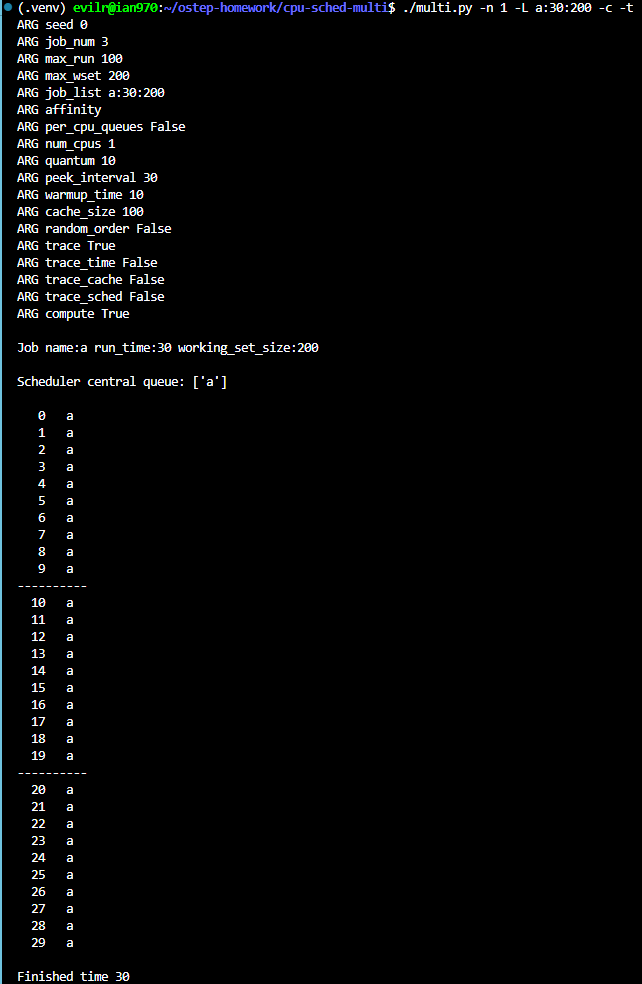

    It takes exactly **30** time units (ticks) to complete job 'a'.

    The job has a working-set size of 200, but the default cache size of the simulated CPU is only 100. Because the working set is larger than the cache capacity, the data can never fully reside in the cache, causing it to remain "cold". In this cold cache state, the job executes at the default slow rate, meaning only 1 unit of run-time is completed per clock tick. Since the job requires a total run-time of 30, it takes exactly 30 ticks to complete, which is confirmed by the `Finished time 30` output in the trace.

2. Now increase the cache size so as to make the job’s working set (size=200) fit into the cache (which, by default, is size=100); for example, run ./multi.py -n 1 -L a:30:200 -M 300. Can you predict how fast the job will run once it fits in cache? (hint: remember the key parameter of the warm rate, which is set by the -r flag) Check your answer by running with the solve flag (-c) enabled.

    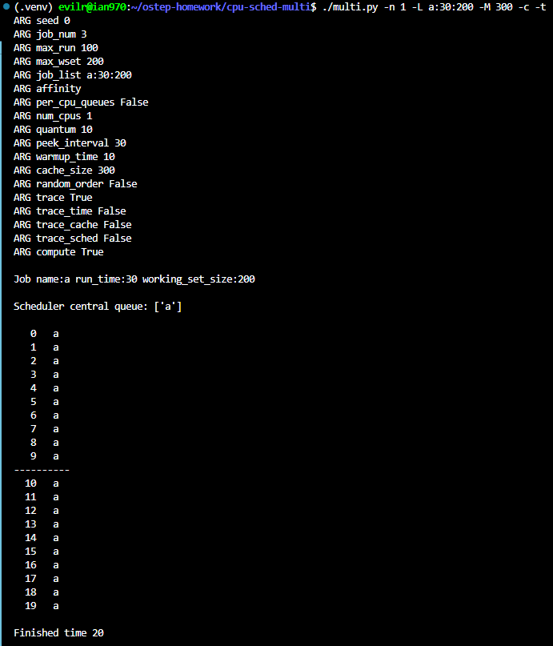

    The job will take exactly 20 ticks to complete.Explanation:

    By increasing the cache size to 300 (-M 300), the job's working set of 200 now completely fits into the cache. According to the default simulator parameters, it takes 10 time units to warm up the cache (-w 10). During this warmup phase, the job runs at the cold rate, completing 10 units of work in 10 ticks. This leaves 20 units of work remaining. After tick 9, the cache becomes warm. With a default warm rate of 2 (-r 2), the remaining 20 units of work are processed at a speed of 2 units per tick. This warm phase takes an additional 10 ticks (20 / 2 = 10). Therefore, the total time required is 10 (warmup) + 10 (warm execution) = 20 ticks.  

3. One cool thing about multi.py is that you can see more detail about what is going on with different tracing flags. Run the same simulation as above, but this time with time left tracing enabled (-T). This flag shows both the job that was scheduled on a CPU at each time step, as well as how much run-time that job has left after each tick has run. What do you notice about how that second column decreases?

    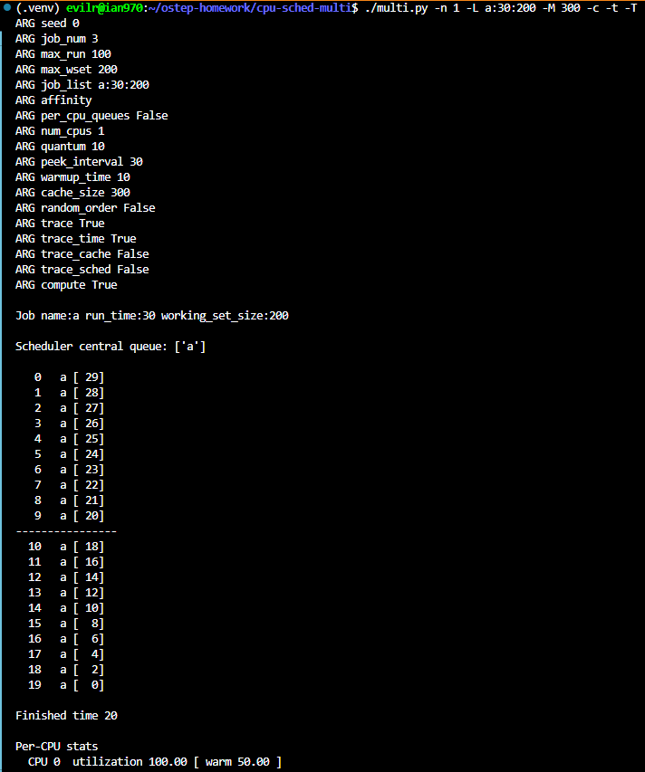

    I noticed that the second column (time left) decreases at two different rates. For the first 10 ticks (time 0 to 9), the value decreases by exactly 1 per tick (from 29 down to 20). Starting at tick 10, the value decreases by 2 per tick (from 18, 16, 14... down to 0).Explanation:

    This change reflects the cache warming process. The default warmup time is 10 time units (-w 10). During the first 10 ticks, the cache is cold, so the job executes at the baseline rate, reducing the remaining time by 1 unit per tick. At tick 10, the cache becomes warm. The job then executes at the default warm rate of 2 (-r 2), which causes the remaining time to decrease by 2 units per tick.  

4. Now add one more bit of tracing, to show the status of each CPU cache for each job, with the -C flag. For each job, each cache will either show a blank space (if the cache is cold for that job) or a ’w’ (if the cache is warm for that job). At what point does the cache become warm for job ’a’ in this simple example? What happens as you change the warmup time parameter (-w) to lower or higher values than the default?

    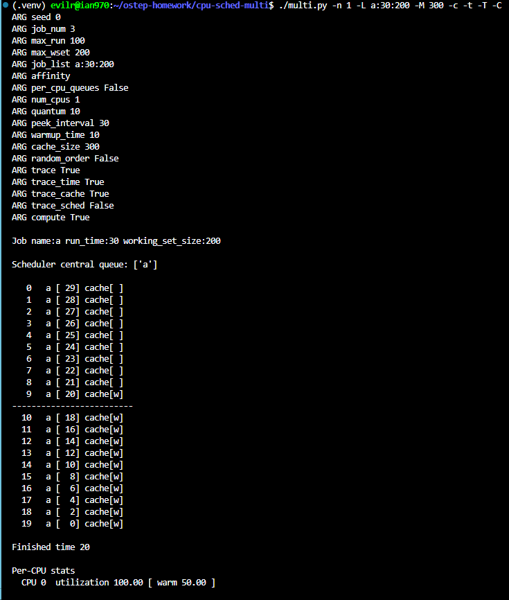
    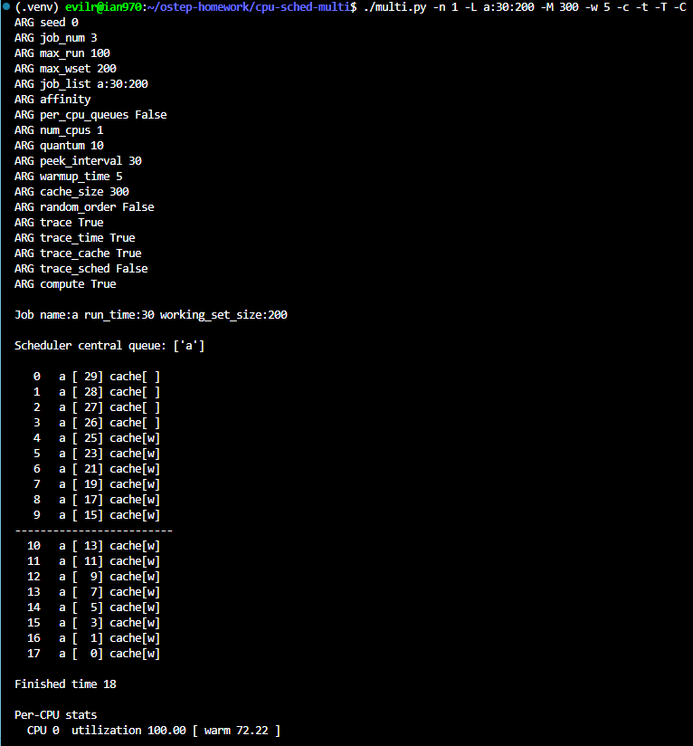
    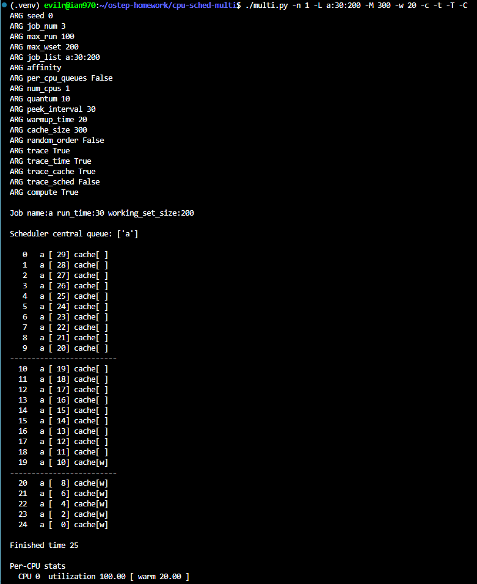

    In the default example with a warmup time of 10, the cache becomes warm at time tick 9 (which is after exactly 10 ticks of execution, since the clock starts at 0).Explanation of changing the -w parameter:

     - Lowering warmup time (e.g., -w 5): The cache warms up much faster, showing 'w' at time tick 4. Because the job spends less time in the slow "cold" state and enters the accelerated "warm" state sooner, the total execution time decreases (finishing in 18 ticks instead of 20).  
     - Increasing warmup time (e.g., -w 20): The cache takes much longer to warm up, showing 'w' at time tick 19. The job is forced to run at the slower "cold" rate for a longer duration, which increases the total execution time (finishing in 25 ticks instead of 20).  

5. At this point, you should have a good idea of how the simulator works for a single job running on a single CPU. But hey, isn’t this a multi-processor CPU scheduling chapter? Oh yeah! So let’s start working with multiple jobs. Specifically, let’s run the following three jobs on a two-CPU system (i.e., type ./multi.py -n 2 -L a:100:100,b:100:50,c:100:50) Can you predict how long this will take, given a round-robin centralized scheduler? Use -c to see if you were right, and then dive down into details with -t to see a step-by-step and then -C to see whether caches got warmed effectively for these jobs. What do you notice?

    ```powershell
    (.venv) evilr@ian970:~/ostep-homework/cpu-sched-multi$ ./multi.py -n 2 -L a:100:100,b:100:50,c:100:50 -c -t -C
    ARG seed 0
    ARG job_num 3
    ARG max_run 100
    ARG max_wset 200
    ARG job_list a:100:100,b:100:50,c:100:50
    ARG affinity 
    ARG per_cpu_queues False
    ARG num_cpus 2
    ARG quantum 10
    ARG peek_interval 30
    ARG warmup_time 10
    ARG cache_size 100
    ARG random_order False
    ARG trace True
    ARG trace_time False
    ARG trace_cache True
    ARG trace_sched False
    ARG compute True

    Job name:a run_time:100 working_set_size:100
    Job name:b run_time:100 working_set_size:50
    Job name:c run_time:100 working_set_size:50

    Scheduler central queue: ['a', 'b', 'c']

    0   a cache[   ]     b cache[   ]     
    1   a cache[   ]     b cache[   ]     
    2   a cache[   ]     b cache[   ]     
    3   a cache[   ]     b cache[   ]     
    4   a cache[   ]     b cache[   ]     
    5   a cache[   ]     b cache[   ]     
    6   a cache[   ]     b cache[   ]     
    7   a cache[   ]     b cache[   ]     
    8   a cache[   ]     b cache[   ]     
    9   a cache[w  ]     b cache[ w ]     
    ---------------------------------------
    10   c cache[w  ]     a cache[ w ]     
    11   c cache[w  ]     a cache[ w ]     
    12   c cache[w  ]     a cache[ w ]     
    13   c cache[w  ]     a cache[ w ]     
    14   c cache[w  ]     a cache[ w ]     
    15   c cache[w  ]     a cache[ w ]     
    16   c cache[w  ]     a cache[ w ]     
    17   c cache[w  ]     a cache[ w ]     
    18   c cache[w  ]     a cache[ w ]     
    19   c cache[  w]     a cache[w  ]     
    ---------------------------------------
    20   b cache[  w]     c cache[w  ]     
    21   b cache[  w]     c cache[w  ]     
    22   b cache[  w]     c cache[w  ]     
    23   b cache[  w]     c cache[w  ]     
    24   b cache[  w]     c cache[w  ]     
    25   b cache[  w]     c cache[w  ]     
    26   b cache[  w]     c cache[w  ]     
    27   b cache[  w]     c cache[w  ]     
    28   b cache[  w]     c cache[w  ]     
    29   b cache[ ww]     c cache[  w]     
    ---------------------------------------
    30   a cache[ ww]     b cache[  w]     
    31   a cache[ ww]     b cache[  w]     
    32   a cache[ ww]     b cache[  w]     
    33   a cache[ ww]     b cache[  w]     
    34   a cache[ ww]     b cache[  w]     
    35   a cache[ ww]     b cache[  w]     
    36   a cache[ ww]     b cache[  w]     
    37   a cache[ ww]     b cache[  w]     
    38   a cache[ ww]     b cache[  w]     
    39   a cache[w  ]     b cache[ ww]     
    ---------------------------------------
    40   c cache[w  ]     a cache[ ww]     
    41   c cache[w  ]     a cache[ ww]     
    42   c cache[w  ]     a cache[ ww]     
    43   c cache[w  ]     a cache[ ww]     
    44   c cache[w  ]     a cache[ ww]     
    45   c cache[w  ]     a cache[ ww]     
    46   c cache[w  ]     a cache[ ww]     
    47   c cache[w  ]     a cache[ ww]     
    48   c cache[w  ]     a cache[ ww]     
    49   c cache[  w]     a cache[w  ]     
    ---------------------------------------
    50   b cache[  w]     c cache[w  ]     
    51   b cache[  w]     c cache[w  ]     
    52   b cache[  w]     c cache[w  ]     
    53   b cache[  w]     c cache[w  ]     
    54   b cache[  w]     c cache[w  ]     
    55   b cache[  w]     c cache[w  ]     
    56   b cache[  w]     c cache[w  ]     
    57   b cache[  w]     c cache[w  ]     
    58   b cache[  w]     c cache[w  ]     
    59   b cache[ ww]     c cache[  w]     
    ---------------------------------------
    60   a cache[ ww]     b cache[  w]     
    61   a cache[ ww]     b cache[  w]     
    62   a cache[ ww]     b cache[  w]     
    63   a cache[ ww]     b cache[  w]     
    64   a cache[ ww]     b cache[  w]     
    65   a cache[ ww]     b cache[  w]     
    66   a cache[ ww]     b cache[  w]     
    67   a cache[ ww]     b cache[  w]     
    68   a cache[ ww]     b cache[  w]     
    69   a cache[w  ]     b cache[ ww]     
    ---------------------------------------
    70   c cache[w  ]     a cache[ ww]     
    71   c cache[w  ]     a cache[ ww]     
    72   c cache[w  ]     a cache[ ww]     
    73   c cache[w  ]     a cache[ ww]     
    74   c cache[w  ]     a cache[ ww]     
    75   c cache[w  ]     a cache[ ww]     
    76   c cache[w  ]     a cache[ ww]     
    77   c cache[w  ]     a cache[ ww]     
    78   c cache[w  ]     a cache[ ww]     
    79   c cache[  w]     a cache[w  ]     
    ---------------------------------------
    80   b cache[  w]     c cache[w  ]     
    81   b cache[  w]     c cache[w  ]     
    82   b cache[  w]     c cache[w  ]     
    83   b cache[  w]     c cache[w  ]     
    84   b cache[  w]     c cache[w  ]     
    85   b cache[  w]     c cache[w  ]     
    86   b cache[  w]     c cache[w  ]     
    87   b cache[  w]     c cache[w  ]     
    88   b cache[  w]     c cache[w  ]     
    89   b cache[ ww]     c cache[  w]     
    ---------------------------------------
    90   a cache[ ww]     b cache[  w]     
    91   a cache[ ww]     b cache[  w]     
    92   a cache[ ww]     b cache[  w]     
    93   a cache[ ww]     b cache[  w]     
    94   a cache[ ww]     b cache[  w]     
    95   a cache[ ww]     b cache[  w]     
    96   a cache[ ww]     b cache[  w]     
    97   a cache[ ww]     b cache[  w]     
    98   a cache[ ww]     b cache[  w]     
    99   a cache[w  ]     b cache[ ww]     
    ---------------------------------------
    100   c cache[w  ]     a cache[ ww]     
    101   c cache[w  ]     a cache[ ww]     
    102   c cache[w  ]     a cache[ ww]     
    103   c cache[w  ]     a cache[ ww]     
    104   c cache[w  ]     a cache[ ww]     
    105   c cache[w  ]     a cache[ ww]     
    106   c cache[w  ]     a cache[ ww]     
    107   c cache[w  ]     a cache[ ww]     
    108   c cache[w  ]     a cache[ ww]     
    109   c cache[  w]     a cache[w  ]     
    ---------------------------------------
    110   b cache[  w]     c cache[w  ]     
    111   b cache[  w]     c cache[w  ]     
    112   b cache[  w]     c cache[w  ]     
    113   b cache[  w]     c cache[w  ]     
    114   b cache[  w]     c cache[w  ]     
    115   b cache[  w]     c cache[w  ]     
    116   b cache[  w]     c cache[w  ]     
    117   b cache[  w]     c cache[w  ]     
    118   b cache[  w]     c cache[w  ]     
    119   b cache[ ww]     c cache[  w]     
    ---------------------------------------
    120   a cache[ ww]     b cache[  w]     
    121   a cache[ ww]     b cache[  w]     
    122   a cache[ ww]     b cache[  w]     
    123   a cache[ ww]     b cache[  w]     
    124   a cache[ ww]     b cache[  w]     
    125   a cache[ ww]     b cache[  w]     
    126   a cache[ ww]     b cache[  w]     
    127   a cache[ ww]     b cache[  w]     
    128   a cache[ ww]     b cache[  w]     
    129   a cache[w  ]     b cache[ ww]     
    ---------------------------------------
    130   c cache[w  ]     a cache[ ww]     
    131   c cache[w  ]     a cache[ ww]     
    132   c cache[w  ]     a cache[ ww]     
    133   c cache[w  ]     a cache[ ww]     
    134   c cache[w  ]     a cache[ ww]     
    135   c cache[w  ]     a cache[ ww]     
    136   c cache[w  ]     a cache[ ww]     
    137   c cache[w  ]     a cache[ ww]     
    138   c cache[w  ]     a cache[ ww]     
    139   c cache[  w]     a cache[w  ]     
    ---------------------------------------
    140   b cache[  w]     c cache[w  ]     
    141   b cache[  w]     c cache[w  ]     
    142   b cache[  w]     c cache[w  ]     
    143   b cache[  w]     c cache[w  ]     
    144   b cache[  w]     c cache[w  ]     
    145   b cache[  w]     c cache[w  ]     
    146   b cache[  w]     c cache[w  ]     
    147   b cache[  w]     c cache[w  ]     
    148   b cache[  w]     c cache[w  ]     
    149   b cache[ ww]     c cache[  w]     

    Finished time 150

    Per-CPU stats
    CPU 0  utilization 100.00 [ warm 0.00 ]
    CPU 1  utilization 100.00 [ warm 0.00 ]
    ```

    Given a round-robin centralized scheduler, the execution takes exactly 150 ticks.

    I noticed that the caches were not warmed effectively. Because the scheduler uses a central queue and a time slice (quantum) of 10 (-q 10), jobs are frequently context-switched and moved between the two CPUs. The warmup time is 10 ticks (-w 10), meaning a job just finishes warming up the cache when its time slice expires. When the job is scheduled again, it is often placed on the other CPU, where its cache is cold, forcing it to restart the 10-tick warmup process. This phenomenon is known as cache bouncing (or poor cache affinity).  As confirmed by the -C trace and the final statistics ([ warm 0.00 ]), none of the jobs ever get to run in a warm cache state. The total required runtime is 300 units (100 for 'a', 100 for 'b', 100 for 'c'). Since the 2 CPUs are always executing at the cold rate of 1 unit per tick, it takes exactly $300 / 2 = 150$ ticks to complete all jobs.

6. Now we’ll apply some explicit controls to study cache affinity, as described in the chapter. To do this, you’ll need the -A flag. This flag can be used to limit which CPUs the scheduler can place a particular job upon. In this case, let’s use it to place jobs ’b’ and ’c’ on CPU 1, while restricting ’a’ to CPU 0. This magic is accomplished by typing this ./multi.py -n 2 -L a:100:100,b:100:50, c:100:50 -A a:0,b:1,c:1 ; don’t forget to turn on various tracing options to see what is really happening! Can you predict how fast this version will run? Why does it do better? Will other combinations of ’a’, ’b’, and ’c’ onto the two processors run faster or slower?

    ```powershell
    (.venv) evilr@ian970:~/ostep-homework/cpu-sched-multi$ ./multi.py -n 2 -L a:100:100,b:100:50,c:100:50 -A a:0,b:1,c:1 -c -t -C
    ARG seed 0
    ARG job_num 3
    ARG max_run 100
    ARG max_wset 200
    ARG job_list a:100:100,b:100:50,c:100:50
    ARG affinity a:0,b:1,c:1
    ARG per_cpu_queues False
    ARG num_cpus 2
    ARG quantum 10
    ARG peek_interval 30
    ARG warmup_time 10
    ARG cache_size 100
    ARG random_order False
    ARG trace True
    ARG trace_time False
    ARG trace_cache True
    ARG trace_sched False
    ARG compute True

    Job name:a run_time:100 working_set_size:100
    Job name:b run_time:100 working_set_size:50
    Job name:c run_time:100 working_set_size:50

    Scheduler central queue: ['a', 'b', 'c']

    0   a cache[   ]     b cache[   ]     
    1   a cache[   ]     b cache[   ]     
    2   a cache[   ]     b cache[   ]     
    3   a cache[   ]     b cache[   ]     
    4   a cache[   ]     b cache[   ]     
    5   a cache[   ]     b cache[   ]     
    6   a cache[   ]     b cache[   ]     
    7   a cache[   ]     b cache[   ]     
    8   a cache[   ]     b cache[   ]     
    9   a cache[w  ]     b cache[ w ]     
    ---------------------------------------
    10   a cache[w  ]     c cache[ w ]     
    11   a cache[w  ]     c cache[ w ]     
    12   a cache[w  ]     c cache[ w ]     
    13   a cache[w  ]     c cache[ w ]     
    14   a cache[w  ]     c cache[ w ]     
    15   a cache[w  ]     c cache[ w ]     
    16   a cache[w  ]     c cache[ w ]     
    17   a cache[w  ]     c cache[ w ]     
    18   a cache[w  ]     c cache[ w ]     
    19   a cache[w  ]     c cache[ ww]     
    ---------------------------------------
    20   a cache[w  ]     b cache[ ww]     
    21   a cache[w  ]     b cache[ ww]     
    22   a cache[w  ]     b cache[ ww]     
    23   a cache[w  ]     b cache[ ww]     
    24   a cache[w  ]     b cache[ ww]     
    25   a cache[w  ]     b cache[ ww]     
    26   a cache[w  ]     b cache[ ww]     
    27   a cache[w  ]     b cache[ ww]     
    28   a cache[w  ]     b cache[ ww]     
    29   a cache[w  ]     b cache[ ww]     
    ---------------------------------------
    30   a cache[w  ]     c cache[ ww]     
    31   a cache[w  ]     c cache[ ww]     
    32   a cache[w  ]     c cache[ ww]     
    33   a cache[w  ]     c cache[ ww]     
    34   a cache[w  ]     c cache[ ww]     
    35   a cache[w  ]     c cache[ ww]     
    36   a cache[w  ]     c cache[ ww]     
    37   a cache[w  ]     c cache[ ww]     
    38   a cache[w  ]     c cache[ ww]     
    39   a cache[w  ]     c cache[ ww]     
    ---------------------------------------
    40   a cache[w  ]     b cache[ ww]     
    41   a cache[w  ]     b cache[ ww]     
    42   a cache[w  ]     b cache[ ww]     
    43   a cache[w  ]     b cache[ ww]     
    44   a cache[w  ]     b cache[ ww]     
    45   a cache[w  ]     b cache[ ww]     
    46   a cache[w  ]     b cache[ ww]     
    47   a cache[w  ]     b cache[ ww]     
    48   a cache[w  ]     b cache[ ww]     
    49   a cache[w  ]     b cache[ ww]     
    ---------------------------------------
    50   a cache[w  ]     c cache[ ww]     
    51   a cache[w  ]     c cache[ ww]     
    52   a cache[w  ]     c cache[ ww]     
    53   a cache[w  ]     c cache[ ww]     
    54   a cache[w  ]     c cache[ ww]     
    55   - cache[w  ]     c cache[ ww]     
    56   - cache[w  ]     c cache[ ww]     
    57   - cache[w  ]     c cache[ ww]     
    58   - cache[w  ]     c cache[ ww]     
    59   - cache[w  ]     c cache[ ww]     
    ---------------------------------------
    60   - cache[w  ]     b cache[ ww]     
    61   - cache[w  ]     b cache[ ww]     
    62   - cache[w  ]     b cache[ ww]     
    63   - cache[w  ]     b cache[ ww]     
    64   - cache[w  ]     b cache[ ww]     
    65   - cache[w  ]     b cache[ ww]     
    66   - cache[w  ]     b cache[ ww]     
    67   - cache[w  ]     b cache[ ww]     
    68   - cache[w  ]     b cache[ ww]     
    69   - cache[w  ]     b cache[ ww]     
    ---------------------------------------
    70   - cache[w  ]     c cache[ ww]     
    71   - cache[w  ]     c cache[ ww]     
    72   - cache[w  ]     c cache[ ww]     
    73   - cache[w  ]     c cache[ ww]     
    74   - cache[w  ]     c cache[ ww]     
    75   - cache[w  ]     c cache[ ww]     
    76   - cache[w  ]     c cache[ ww]     
    77   - cache[w  ]     c cache[ ww]     
    78   - cache[w  ]     c cache[ ww]     
    79   - cache[w  ]     c cache[ ww]     
    ---------------------------------------
    80   - cache[w  ]     b cache[ ww]     
    81   - cache[w  ]     b cache[ ww]     
    82   - cache[w  ]     b cache[ ww]     
    83   - cache[w  ]     b cache[ ww]     
    84   - cache[w  ]     b cache[ ww]     
    85   - cache[w  ]     b cache[ ww]     
    86   - cache[w  ]     b cache[ ww]     
    87   - cache[w  ]     b cache[ ww]     
    88   - cache[w  ]     b cache[ ww]     
    89   - cache[w  ]     b cache[ ww]     
    ---------------------------------------
    90   - cache[w  ]     c cache[ ww]     
    91   - cache[w  ]     c cache[ ww]     
    92   - cache[w  ]     c cache[ ww]     
    93   - cache[w  ]     c cache[ ww]     
    94   - cache[w  ]     c cache[ ww]     
    95   - cache[w  ]     c cache[ ww]     
    96   - cache[w  ]     c cache[ ww]     
    97   - cache[w  ]     c cache[ ww]     
    98   - cache[w  ]     c cache[ ww]     
    99   - cache[w  ]     c cache[ ww]     
    ---------------------------------------
    100   - cache[w  ]     b cache[ ww]     
    101   - cache[w  ]     b cache[ ww]     
    102   - cache[w  ]     b cache[ ww]     
    103   - cache[w  ]     b cache[ ww]     
    104   - cache[w  ]     b cache[ ww]     
    105   - cache[w  ]     c cache[ ww]     
    106   - cache[w  ]     c cache[ ww]     
    107   - cache[w  ]     c cache[ ww]     
    108   - cache[w  ]     c cache[ ww]     
    109   - cache[w  ]     c cache[ ww]     

    Finished time 110

    Per-CPU stats
    CPU 0  utilization 50.00 [ warm 40.91 ]
    CPU 1  utilization 100.00 [ warm 81.82 ]
    ```

    This version will run in exactly 110 ticks, which is much faster than the 150 ticks in the previous setup.

    Explanation (Why it does better):

    Using the -A flag establishes explicit cache affinity, limiting which CPU a job can be placed upon. This eliminates the cache bouncing issue we saw earlier. Job 'a' is pinned to CPU 0, allowing it to easily warm up its cache and finish in 55 ticks (10 cold ticks + 45 warm ticks).

    Furthermore, jobs 'b' and 'c' are pinned to CPU 1. Since they each have a working set size of 50, their combined working set is 100. This fits perfectly into the default CPU cache size of 100. Therefore, they do not evict each other's data during context switches. Both can maintain a "warm" cache state simultaneously ([ ww]), taking $55 + 55 = 110$ ticks to complete on CPU 1.  

    Explanation (Other combinations):

    Other combinations of 'a', 'b', and 'c' on the two processors will run slower. If we pair job 'a' (working set size 100) with either 'b' or 'c' (working set size 50) on the same CPU, their combined working set would be 150. This exceeds the cache capacity of 100. As a result, the jobs would constantly overwrite each other's data (a phenomenon known as cache thrashing), preventing the cache from ever truly warming up and forcing them to run at the slow cold rate.  

7. One interesting aspect of caching multiprocessors is the opportunity for better-than-expected speed up of jobs when using multiple CPUs (and their caches) as compared to running jobs on a single processor. Specifically, when you run on N CPUs, sometimes you can speed up by more than a factor of N, a situation entitled super-linear speedup. To experiment with this, use the job description here (-L a:100:100,b:100:100,c:100:100) with a small cache (-M 50) to create three jobs. Run this on systems with 1, 2, and 3 CPUs (-n 1, -n 2, -n 3). Now, do the same, but with a larger per-CPU cache of size 100. What do you notice about performance as the number of CPUs scales? Use -c to confirm your guesses, and other tracing flags to dive even deeper.

    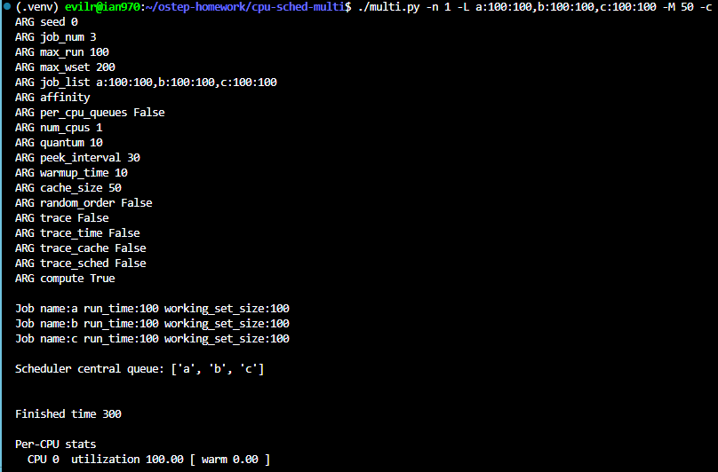
    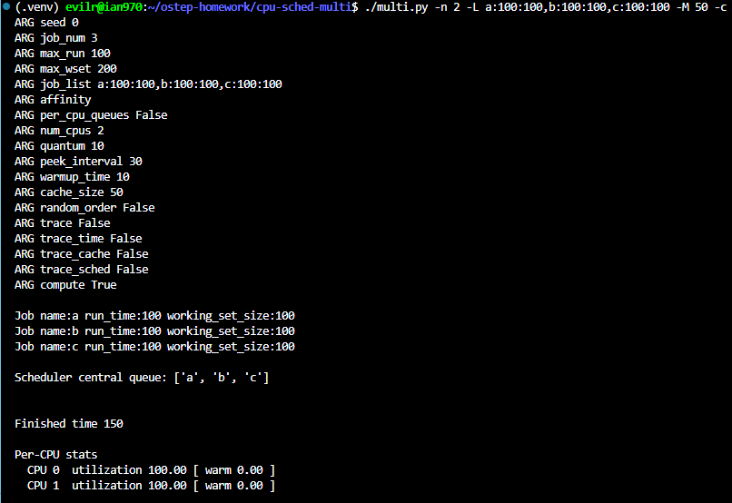
    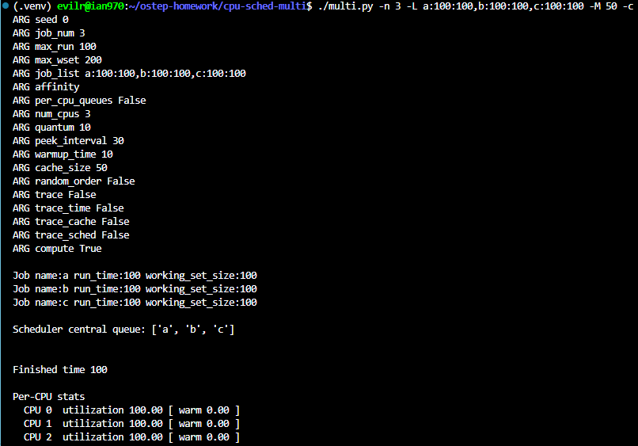
    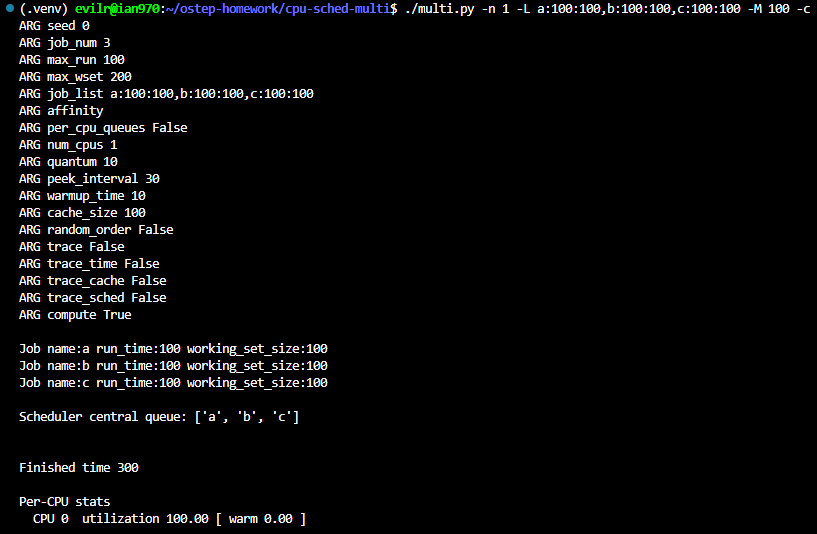
    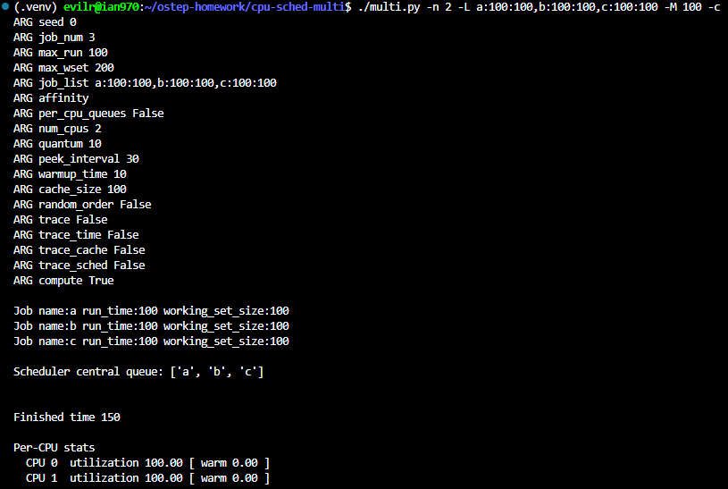
    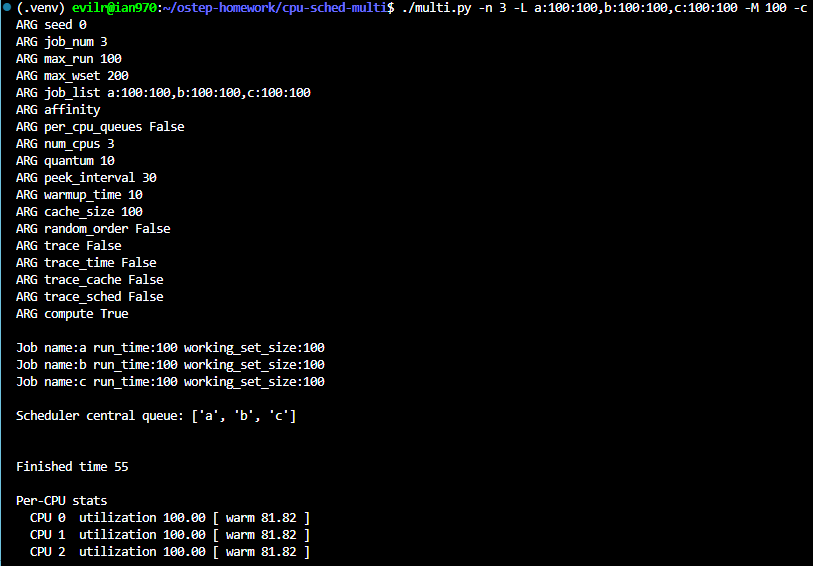

    As the number of CPUs scales, performance scales linearly with a small cache, but exhibits super-linear speedup with a larger cache.

    Explanation:

    - Small Cache (-M 50): The working set size of all jobs is 100. Since the working set is larger than the cache size (50), the cache remains cold regardless of the CPU count. Performance scales linearly: execution takes 300 ticks on 1 CPU, 150 ticks on 2 CPUs, and 100 ticks on 3 CPUs.  
    - Large Cache (-M 100): The per-CPU cache size is 100, which can fully hold a single job's working set. With 1 or 2 CPUs, there isn't enough total cache space for all 3 jobs, leading to cache thrashing and execution times of 300 and 150 ticks, respectively. However, with 3 CPUs, each of the 3 jobs is scheduled on its own CPU and fits perfectly into its local cache. All caches successfully warm up ([ warm 81.82 ]), allowing each job to complete in exactly 55 ticks (10 cold ticks + 45 warm ticks).

    Going from 1 CPU (300 ticks) to 3 CPUs (55 ticks) results in a ~5.45x speedup. This is a super-linear speedup because the performance improvement (5.45x) is significantly greater than the increase in hardware resources (3x).

8. One other aspect of the simulator worth studying is the per-CPU scheduling option, the -p flag. Run with two CPUs again, and this three job configuration (-L a:100:100,b:100:50,c:100:50). How does this option do, as opposed to the hand-controlled affinity limits you put in place above? How does performance change as you alter the ’peek interval’ (-P) to lower or higher values? How does this per-CPU approach work as the number of CPUs scales?

    
    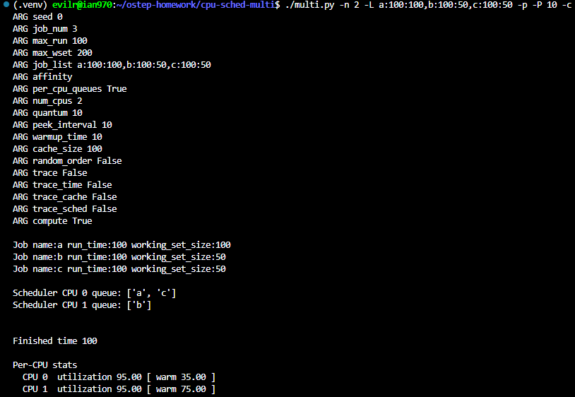
    
    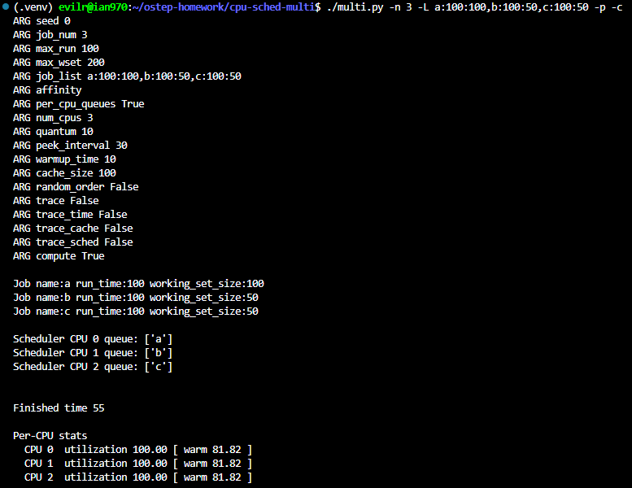

    1. **Performance vs. Manual Affinity:** The per-CPU scheduling option (`-p`) performs excellently, finishing in **100** ticks. This is even faster than the manual affinity setup (`-A`) which took 110 ticks. The scheduler initially placed jobs 'a' and 'c' in CPU 0's queue, and job 'b' in CPU 1's queue. Because CPU 1 finished job 'b' quickly, it became idle and successfully "stole" remaining work from CPU 0. This shows that `-p` provides a great balance of automatic cache affinity and dynamic load balancing.
    2. **Altering the Peek Interval (`-P`):**
        - When the peek interval is low (e.g., `-P 10`), performance remains optimal at 100 ticks because the idle CPU checks for and steals work frequently.
        - When the peek interval is high (e.g., `-P 100`), performance drops significantly to **130** ticks. CPU 1 finishes its assigned job 'b' at tick 55 but remains idle until tick 100 before it peeks into CPU 0's queue to steal work. This delayed load balancing wastes CPU resources.
    3. **Scaling the Number of CPUs:** When scaling to 3 CPUs (`-n 3`) with the `-p` option, the system performs flawlessly, finishing in **55** ticks. The scheduler perfectly distributes the 3 jobs into the 3 separate CPU queues initially. Each job completely owns its CPU and cache without any context switching or cache thrashing, resulting in a perfect super-linear speedup just like in Question 7.

9. Finally, feel free to just generate random workloads and see if you can predict their performance on different numbers of processors, cache sizes, and scheduling options. If you do this, you’ll soon be a multi-processor scheduling master, which is a pretty awesome thing to be. Good luck!

    I experimented with several random workloads using the -s (seed), -j, -R, and -W flags to generate jobs automatically without the -L flag.  Throughout my experiments, a few key principles consistently held true:

    1. Cache Affinity is Critical: Random workloads running on the default centralized scheduler often suffer from cache bouncing, leading to poor performance. Enabling per-CPU queues (-p) drastically improves overall execution time by naturally preserving cache affinity.  
    2. Cache Thrashing: When the sum of the working sets of jobs scheduled on a single CPU exceeds the cache size (-M), the cache is essentially rendered useless, and jobs run at the slow "cold" rate.  
    3. Job Stealing is a Balancing Act: When using -p, tuning the peek interval (-P) is important. If set too high, CPUs sit idle when they could be stealing work from overloaded queues; if set too low, aggressive stealing might disrupt cache affinity.  
