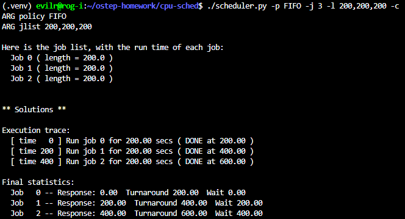
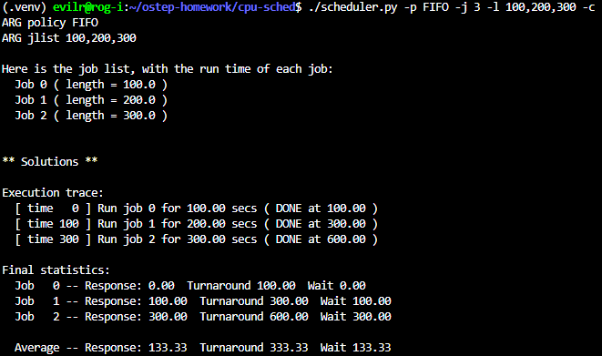
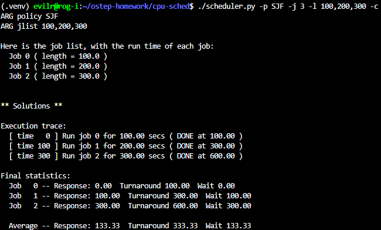
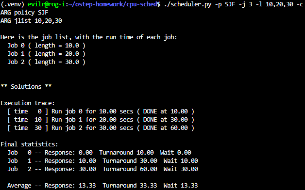
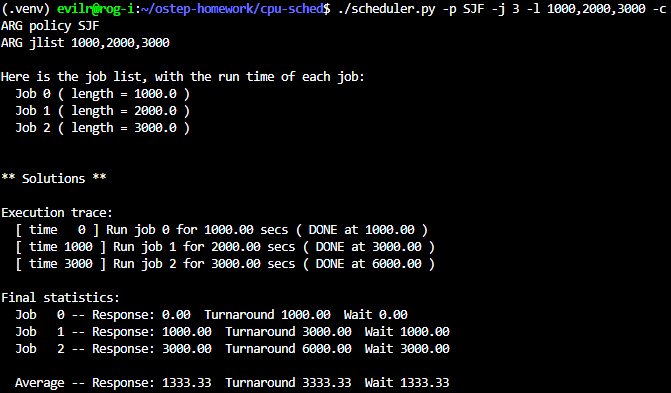

# Homework (Simulation)

This program, scheduler.py, allows you to see how different schedulers perform under scheduling metrics such as response time, turnaround
time, and total wait time. See the README for details.

## Questions

1. Compute the response time and turnaround time when running three jobs of length 200 with the SJF and FIFO schedulers.

  - FIFO:
    - avg. response time: (0 + 200 + 400) / 3 = 200
    - avg. turnaround time: (200 + 400 + 600) / 3 = 400
    - 
  - SJF: Same with FIFO.
    - 

2. Now do the same but with jobs of different lengths: 100, 200, and 300.

  - FIFO:
    - avg. response time: (0 + 100 + 300) / 3 = 133.33
    - avg. turnaround time: (100 + 300 + 600) / 3 = 333.33
    - 
  - SJF: Same with FIFO
    - 

3. Now do the same, but also with the RR scheduler and a time-slice of 1.

  - RR:
    - avg. response time: (0 + 1 + 2) / 3 = 1
    - avg. turnaround time: (298 + 499 + 600) / 3 = 465.67
```
      (.venv) evilr@rog-i:~/ostep-homework/cpu-sched$ ./scheduler.py -p SJF -j 3 -l 100,200,300 -c
      ARG policy SJF
      ARG jlist 100,200,300

      Here is the job list, with the run time of each job: 
        Job 0 ( length = 100.0 )
        Job 1 ( length = 200.0 )
        Job 2 ( length = 300.0 )


      ** Solutions **

      Execution trace:
        [ time   0 ] Run job 0 for 100.00 secs ( DONE at 100.00 )
        [ time 100 ] Run job 1 for 200.00 secs ( DONE at 300.00 )
        [ time 300 ] Run job 2 for 300.00 secs ( DONE at 600.00 )

      Final statistics:
        Job   0 -- Response: 0.00  Turnaround 100.00  Wait 0.00
        Job   1 -- Response: 100.00  Turnaround 300.00  Wait 100.00
        Job   2 -- Response: 300.00  Turnaround 600.00  Wait 300.00

        Average -- Response: 133.33  Turnaround 333.33  Wait 133.33

      (.venv) evilr@rog-i:~/ostep-homework/cpu-sched$ ./scheduler.py -p RR -j 3 -l 100,200,300 -c
      ARG policy RR
      ARG jlist 100,200,300

      Here is the job list, with the run time of each job: 
        Job 0 ( length = 100.0 )
        Job 1 ( length = 200.0 )
        Job 2 ( length = 300.0 )


      ** Solutions **

      Execution trace:
        [ time   0 ] Run job   0 for 1.00 secs
        [ time   1 ] Run job   1 for 1.00 secs
        [ time   2 ] Run job   2 for 1.00 secs
        .
        .
        .
        [ time 294 ] Run job   0 for 1.00 secs
        [ time 295 ] Run job   1 for 1.00 secs
        [ time 296 ] Run job   2 for 1.00 secs
        [ time 297 ] Run job   0 for 1.00 secs ( DONE at 298.00 )
        [ time 298 ] Run job   1 for 1.00 secs
        [ time 299 ] Run job   2 for 1.00 secs
        [ time 300 ] Run job   1 for 1.00 secs
        [ time 301 ] Run job   2 for 1.00 secs
        .
        .
        .
        [ time 496 ] Run job   1 for 1.00 secs
        [ time 497 ] Run job   2 for 1.00 secs
        [ time 498 ] Run job   1 for 1.00 secs ( DONE at 499.00 )
        [ time 499 ] Run job   2 for 1.00 secs
        [ time 500 ] Run job   2 for 1.00 secs
        .
        .
        .
        [ time 599 ] Run job   2 for 1.00 secs ( DONE at 600.00 )

      Final statistics:
        Job   0 -- Response: 0.00  Turnaround 298.00  Wait 198.00
        Job   1 -- Response: 1.00  Turnaround 499.00  Wait 299.00
        Job   2 -- Response: 2.00  Turnaround 600.00  Wait 300.00

        Average -- Response: 1.00  Turnaround 465.67  Wait 265.67
```

4. For what types of workloads does SJF deliver the same turnaround times as FIFO?

  - When jobs lengths are order by asc, FIFO will have same results as SJF.

5. For what types of workloads and quantum lengths does SJF deliver the same response times as RR?

  - When the quantum is greater than or equal to the maxmum of all job lengths and the job lengths are order by asc, then RR policy will get same results as SJF.

6. What happens to response time with SJF as job lengths increase? Can you use the simulator to demonstrate the trend?

  - As job lengths increase, the average response time will also increase because SJF is a non-preemptive policy. Except for the first job, whose response time remains 0, all subsequent jobs will experience longer response times due to waiting for the preceding jobs to finish.
  - 
  - 

7. What happens to response time with RR as quantum lengths increase? Can you write an equation that gives the worst-case response time, given N jobs?

  - As the quantum length q increases, the response time also increases.For N jobs arriving at the same time, the worst-case response time is experienced by the last job in the queue, which must wait for the preceding N-1 jobs to complete their first quantum. Therefore, the worst-case response time equation is (N-1)q
  - Optional: Furthermore, the average response time would be the sum of an arithmetic progression divided by N: [ 0 + q + 2q + ... + ( N -1 )q] / N = ( N - 1 )q / 2, which also clearly shows the linear relationship with q.
