# Homework (Simulation)

This homework uses disk.py to familiarize you with how a modern
hard drive works. It has a lot of different options, and unlike most of
the other simulations, has a graphical animator to show you exactly what
happens when the disk is in action. See the README for details.

1. Compute the seek, rotation, and transfer times for the following sets of requests: -a 0, -a 6, -a 30, -a 7,30,8, and finally -a 10,11,12,13.

    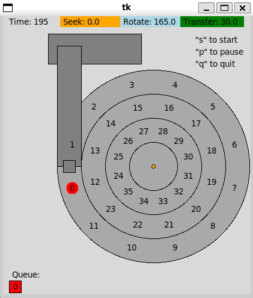
    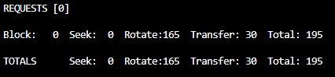
    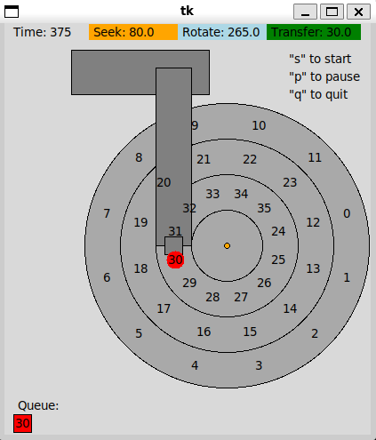
    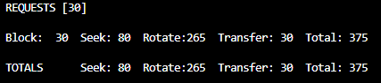
    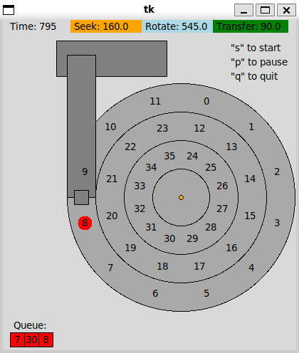
    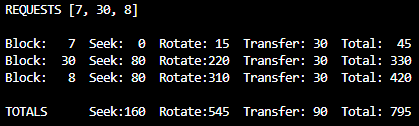
    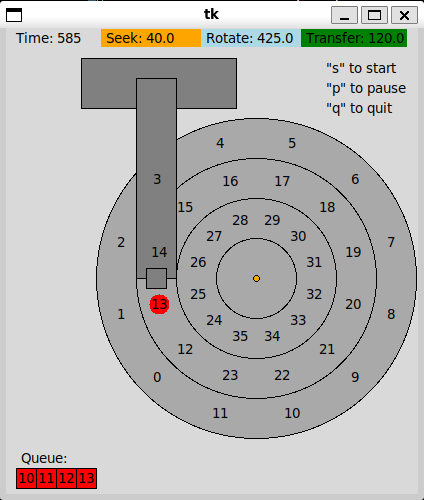
    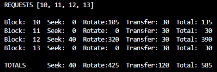

2. Do the same requests above, but change the seek rate to different values: -S 2, -S 4, -S 8, -S 10, -S 40, -S 0.1. How do the times change?

    Increasing the seek rate (`-S`) does not consistently decrease the overall access time. Instead, the changes occur in a non-linear, step-like fashion. Here is how the specific times change:

    * **Transfer Time:** Remains strictly constant. The transfer time relies entirely on the rotational speed (`-R`) and the size of the sector, so it is unaffected by how fast the disk arm moves.

    * **Seek Time:** Decreases proportionally as the seek rate increases. For example, changing from `-S 1` to `-S 2` will cut the seek time exactly in half.
    * **Rotational Time (Rotate):** In most cases, the rotational delay increases by the exact amount of time saved on the seek. Because the disk head arrives at the target track earlier, it simply spends more time idling and waiting for the target sector to spin into position.
    * **Total Time:** Generally remains unchanged for most scenarios due to this "time transfer" effect (Seek time $\rightarrow$ Rotational time). A substantial reduction in Total Time *only* occurs when the increased seek speed allows the disk head to reach the target track just in time to "catch" the sector during its current revolution, thereby saving the massive penalty of waiting for an entire extra rotation (approx. 360 time units). Conversely, an extremely slow seek rate (like `-S 0.1`) will cause the head to miss the sector, forcing it to wait for an extra revolution and drastically increasing the Total Time.

3. Do the same requests above, but change the rotation rate: -R 0.1, -R 0.5, -R 0.01. How do the times change?

    Decreasing the rotation rate (`-R`) fundamentally slows down the operations that rely on the spinning platter, significantly increasing the overall access time. Here is how each specific component changes:

    * **Seek Time:** Remains completely unchanged. The time it takes for the disk arm to move across the tracks depends solely on the physical distance and the seek rate (`-S`), which are completely independent of how fast the platter spins.
    * **Transfer Time:** Increases proportionally as the rotation rate decreases. Because the disk is spinning slower, it takes much longer for the physical sector to pass under the read/write head. For example, reducing the default rotation rate of 1 degree per time unit to `-R 0.1` (10 times slower) will increase the transfer time for a standard 30-degree sector from 30 time units to 300 time units.

    * **Rotational Time (Rotate):** Increases significantly. The slower angular velocity means it takes much longer for the target sector to arrive at the disk head. *(Note: In some specific cases, a much slower rotation might actually give the disk arm enough time to complete a long seek without "missing" the sector, but the absolute wait time is still heavily inflated due to the slow spin).*
    * **Total Time:** Increases substantially. Since both the rotational delay and the transfer time scale inversely with the rotation rate, slowing down the rotation severely penalizes the overall I/O performance.

4. FIFO is not always best, e.g., with the request stream -a 7,30,8, what order should the requests be processed in? Run the shortest seek-time first (SSTF) scheduler (-p SSTF) on this workload; how long should it take (seek, rotation, transfer) for each request to be served?

    > FIFO

    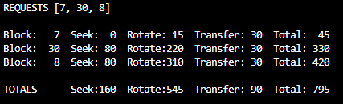

    > SSTF

    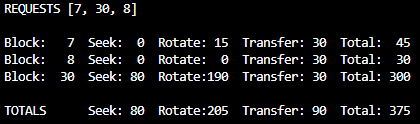

5. Now use the shortest access-time first (SATF) scheduler (-p SATF). Does it make any difference for -a 7,30,8 workload? Find a set of requests where SATF outperforms SSTF; more generally, when is SATF better than SSTF?

    > SATF

    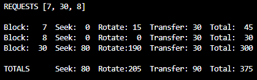

    * **Does it make any difference for the `-a 7,30,8` workload?**
    No, it does not make a difference. Both SSTF and SATF yield the exact same total time (375 time units) and process the requests in the same order (`7, 8, 30`). This happens because sectors 7 and 8 are not only on the current track (zero seek) but also have minimal rotational delay, making SSTF's choice coincidentally optimal.
    * **Find a set of requests where SATF outperforms SSTF:**
    A great example is the request stream **`-a 5,20`**.
    * With `-p SSTF`, the total time is significantly longer because the scheduler chooses Sector 5 first (since it is on the same track, Seek = 0). However, Sector 5 just passed the disk head, forcing a massive rotational delay (nearly a full revolution) before it can be read.
    * With `-p SATF`, the scheduler correctly calculates that seeking to the middle track to read Sector 20 first has a much shorter total access time (Seek + Rotate). By the time the disk head reaches the middle track, Sector 20 is perfectly positioned to be read, eliminating the wasted rotational waiting time.

    * **When is SATF better than SSTF?**
    More generally, SATF outperforms SSTF whenever the closest track (which SSTF strictly prefers) has a target sector with a severe rotational delay (e.g., it just spun past the head), while a slightly further track has a target sector with a minimal rotational delay. SSTF ignores rotational delay and makes a sub-optimal, greedy choice based purely on physical distance, whereas SATF makes the globally faster choice by evaluating the true access time (Seek + Rotate).

6. Here is a request stream to try: -a 10,11,12,13. What goes poorly when it runs? Try adding track skew to address this problem (-o skew). Given the default seek rate, what should the skew be to maximize performance? What about for different seek rates (e.g., -S 2, -S 4)? In general, could you write a formula to figure out the skew?

    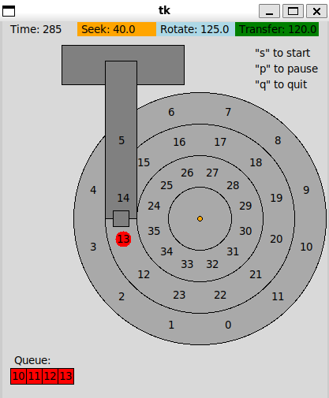

    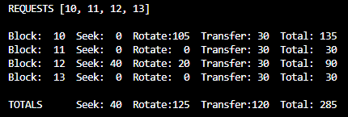

    * **What goes poorly when `-a 10,11,12,13` runs?**
    When the workload reads sequentially across tracks (from Sector 11 on Track 0 to Sector 12 on Track 1), a massive rotational penalty occurs. By default, the tracks are perfectly aligned. However, switching tracks takes 40 time units (Seek time). During this time, the disk continues to spin 40 degrees. Because a sector is only 30 degrees wide, Sector 12 has already spun past the disk head by the time the arm arrives at Track 1. The disk head must then wait for nearly a full revolution (320 time units) to read Sector 12.

    * **Given the default seek rate, what should the skew be to maximize performance?**
    The skew should be **2** blocks (`-o 2`). The seek takes 40 time units (40 degrees of rotation). Shifting the track by 1 block (30 degrees) is not enough. Shifting by 2 blocks (60 degrees) ensures that Sector 12 arrives slightly after the disk head settles on Track 1, minimizing the rotational delay to just 20 time units.

    * **What about for different seek rates (e.g., `-S 2`, `-S 4`)?**

    * For **`-S 2`**: The seek time is 20 time units (20 degrees). A skew of **1** block (30 degrees) is sufficient.

    * For **`-S 4`**: The seek time is 10 time units (10 degrees). A skew of **1** block (30 degrees) is also optimal here.

    * **In general, could you write a formula to figure out the skew?**
    Yes. The optimal skew (in blocks) can be calculated by dividing the track-to-track seek time by the time it takes for one sector to rotate under the head, rounding up to the nearest whole block.
    **Formula:** `Skew = ceiling( (Track_Width / Seek_Speed) / (360 / Sectors_Per_Track) )`
    *Note: In the default setup, this is `ceiling((40 / S) / 30)`.*

7. Specify a disk with different density per zone, e.g., -z 10,20,30, which specifies the angular difference between blocks on the outer, middle, and inner tracks. Run some random requests (e.g., -a -1 -A 5,-1,0, which specifies that random requests should be used via the -a -1 flag and that five requests ranging from 0 to the max be generated), and compute the seek, rotation, and transfer times. Use different random seeds. What is the bandwidth (in sectors per unit time) on the outer, middle, and inner tracks?

    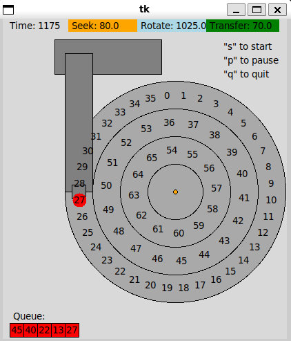

    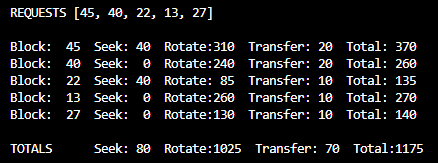

8. A scheduling window determines how many requests the disk can examine at once. Generate random workloads (e.g., -A 1000,-1,0, with different seeds) and see how long the SATF scheduler takes when the scheduling window is changed from 1 up to the number of requests. How big of a window is needed to maximize performance? Hint: use the -c flag and don’t turn on graphics (-G) to run these quickly. When the scheduling window is set to 1, does it matter which policy you are using?

    * ./disk.py -a -1 -A 1000,-1,0 -p SATF -w 1 -c
      * TOTALS      Seek:20960  Rotate:169165  Transfer:30000  Total:220125
    * ./disk.py -a -1 -A 1000,-1,0 -p SATF -w 10 -c
      * TOTALS      Seek:8080  Rotate:26555  Transfer:30000  Total:64635
    * ./disk.py -a -1 -A 1000,-1,0 -p SATF -w 100 -c
      * TOTALS      Seek:1440  Rotate:5835  Transfer:30000  Total:37275
    * ./disk.py -a -1 -A 1000,-1,0 -p SATF -w 1000 -c
      * TOTALS      Seek:1520  Rotate:3955  Transfer:30000  Total:35475

    * **How big of a window is needed to maximize performance?**
    To absolutely maximize performance, the scheduling window must be as large as the total number of pending requests (e.g., `-w 1000` for 1000 requests, or `-w -1` to examine the entire queue at once). As the window size increases, the SATF scheduler has a larger pool of options to compare. This broader visibility allows it to find the most optimal path globally, minimizing both seek and rotational delays. Consequently, the total execution time decreases significantly as the window grows.

    * **When the scheduling window is set to 1, does it matter which policy you are using?**
    No, it does not matter at all. When the window size is 1 (`-w 1`), the scheduler is restricted to examining only the single very next request in the queue. Because it cannot "see" any other requests to compare access times against, it is forced to process that single request immediately. Therefore, every scheduling policy (whether SATF, SSTF, etc.) effectively degrades into a strict FIFO (First-In, First-Out) policy.

9. Create a series of requests to starve a particular request, assuming an SATF policy. Given that sequence, how does it perform if you use a bounded SATF (BSATF) scheduling approach? In this approach, you specify the scheduling window (e.g., -w 4); the scheduler only moves onto the next window of requests when all requests in the current window have been serviced. Does this solve starvation? How does it perform, as compared to SATF? In general, how should a disk make this trade-off between performance and starvation avoidance?

    * ./disk.py -a 30,7,8,9,10,11 -p SATF -c
  
        ```bash
        REQUESTS [30, 7, 8, 9, 10, 11]
 
        Block:   7  Seek:  0  Rotate: 15  Transfer: 30  Total:  45
        Block:   8  Seek:  0  Rotate:  0  Transfer: 30  Total:  30
        Block:   9  Seek:  0  Rotate:  0  Transfer: 30  Total:  30
        Block:  10  Seek:  0  Rotate:  0  Transfer: 30  Total:  30
        Block:  11  Seek:  0  Rotate:  0  Transfer: 30  Total:  30
        Block:  30  Seek: 80  Rotate:100  Transfer: 30  Total: 210

        TOTALS      Seek: 80  Rotate:115  Transfer:180  Total: 375
        ```

    * ./disk.py -a 30,7,8,9,10,11 -p SATF -c

        ```bash
        REQUESTS [30, 7, 8, 9, 10, 11]

        Block:   7  Seek:  0  Rotate: 15  Transfer: 30  Total:  45
        Block:   8  Seek:  0  Rotate:  0  Transfer: 30  Total:  30
        Block:   9  Seek:  0  Rotate:  0  Transfer: 30  Total:  30
        Block:  30  Seek: 80  Rotate:160  Transfer: 30  Total: 270
        Block:  10  Seek: 80  Rotate: 10  Transfer: 30  Total: 120
        Block:  11  Seek:  0  Rotate:  0  Transfer: 30  Total:  30

        TOTALS      Seek:160  Rotate:185  Transfer:180  Total: 525
        ```

    * **Create a series of requests to starve a particular request, assuming an SATF policy:**
    A sequence that causes starvation is **`-a 30,7,8,9,10,11`**. Sector 30 is located on the inner track, while the others are on the outer track (where the disk head starts). Even though 30 is requested first, pure SATF will greedily process all the outer track requests (7, 8, 9, 10, 11) first because their access times are shorter. If a continuous stream of outer track requests keeps arriving, Sector 30 will be indefinitely delayed (starved).

    * **Does Bounded SATF (BSATF) solve starvation?**
    Yes, it does. By using a command like `-p BSATF -w 4`, the scheduler groups requests into windows of 4. The scheduler is strictly forbidden from advancing to the next window until every request in the current window has been serviced. In our example, Sector 30 is guaranteed to be processed within the first window, effectively putting a hard limit on its waiting time and preventing starvation.

    * **How does it perform, as compared to SATF?**
    BSATF performs worse than SATF in terms of overall throughput (Total Time). Because BSATF forces the disk to address requests in older windows before newer ones, the disk head is often forced to make long, inefficient seeks (e.g., jumping to the inner track to serve Sector 30, then seeking all the way back to the outer track to serve Sectors 10 and 11 in the next window).
    * **How should a disk make this trade-off between performance and starvation avoidance?**
    The disk must balance **Fairness (Latency)** against **Throughput (Performance)**.
    A pure SATF approach maximizes overall throughput but sacrifices fairness, risking infinite latency for distant requests. A BSATF approach guarantees bounded latency (fairness) but sacrifices peak throughput due to forced, inefficient seeks. The ideal trade-off depends on the specific system workload: real-time systems prefer bounded latency (BSATF), while bulk-processing databases might lean toward maximizing throughput (SATF with a very large window).

10. All the scheduling policies we have looked at thus far are greedy; they pick the next best option instead of looking for an optimal schedule. Can you find a set of requests in which greedy is not optimal?

    * **Can you find a set of requests in which greedy is not optimal?**
    Yes, a greedy policy like SATF can make sub-optimal decisions because it only considers the immediate lowest cost (local optimum) rather than the overall sequence (global optimum). A perfect counter-example is the request set **`-a 7,20`**.

    * **The Greedy SATF Choice:**
    From the initial position, Sector 7 requires a total time of 45 (Seek 0, Rotate 15), while Sector 20 requires a total time of 75 (Seek 40, Rotate 5). SATF greedily chooses Sector 7 first.
    After reading 7, the disk head must seek to Sector 20. The seek takes 40 time units, during which the disk spins past Sector 20's starting point. The disk head must now wait for almost a full revolution (Rotate 320).
    *SATF Total Time: 45 + (40 + 320 + 30) = **435**.*
    * **The Globally Optimal Choice:**
    If the scheduler skips the immediate low-cost option and chooses Sector 20 first, the seek time perfectly overlaps with the rotational delay. The disk head arrives at Track 1 just 5 time units before Sector 20 begins. After reading 20, the disk head seeks back to Sector 7.
    *Optimal Total Time: (40 + 5 + 30) + (40 + 260 + 30) = **405**.*
    * **Conclusion:**
    The globally optimal schedule (20, then 7) finishes in 405 time units, which is faster than the greedy SATF schedule (7, then 20) at 435 time units. The greedy algorithm fails because taking the immediate cheapest option (7) positions the disk head poorly for the next request, resulting in a massive rotational penalty.
