# Homework (Simulation)

This section introduces ffs.py, a simple FFS simulator you can use
to understand better how FFS-based file and directory allocation work.
See the README for details on how to run the simulator.

## Questions

1. Examine the file in.largefile, and then run the simulator with flag -f in.largefile and -L 4. The latter sets the large-file exception to 4 blocks. What will the resulting allocation look like? Run with -c to check.

    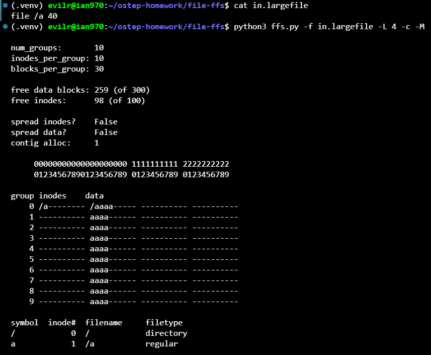

    The file in.largefile creates a single file /a with a size of 40 data blocks under the root directory.

    Because /a belongs to the root directory /, its inode (inode 1) is allocated in Group 0 alongside the root directory's inode.

    Due to the large-file exception set to -L 4, FFS allocates at most 4 contiguous data blocks in the current group before switching to the next cylinder group in a round-robin fashion. Since the file requires 40 blocks, it is evenly distributed across all 10 cylinder groups (Group 0 through Group 9), with exactly 4 data blocks allocated per group. Group 0 holds the root directory data block followed by 4 blocks of /a, while Groups 1 through 9 each allocate the first 4 blocks of their respective data regions to /a.

2. Now run with -L 30. What do you expect to see? Once again, turn on -c to see if you were right. You can also use -S to see exactly which blocks were allocated to the file /a.

    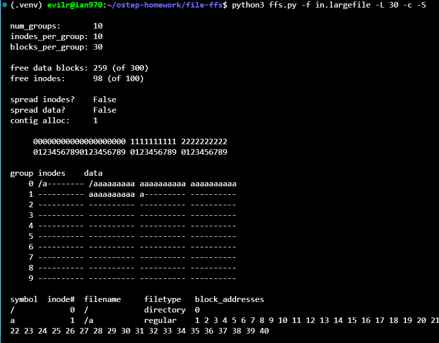

    With -L 30, the large-file threshold allows up to 30 blocks per group before spreading the file to another group.

    Because each group contains 30 data blocks and the root directory already occupies the first block (block 0) of Group 0, only 29 blocks remain available in Group 0. Therefore, file /a fills up all remaining 29 blocks in Group 0 (global data blocks 1 to 29).  

    The remaining 11 blocks ($40 - 29 = 11$) are spilled over to the next group, Group 1, occupying its first 11 blocks (global data blocks 30 to 40). As confirmed by -S, file /a is entirely contained within Groups 0 and 1 (blocks 1 through 40), leaving Groups 2 through 9 completely untouched

3. Now we will compute some statistics about the file. The first is something we call filespan, which is the max distance between any two data blocks of the file or between the inode and any data block. Calculate the filespan of /a. Run ffs.py -f in.largefile -L 4 -T -c to see what it is. Do the same with -L 100. What difference do you expect in filespan as the large-file exception parameter changes from low values to high values?

    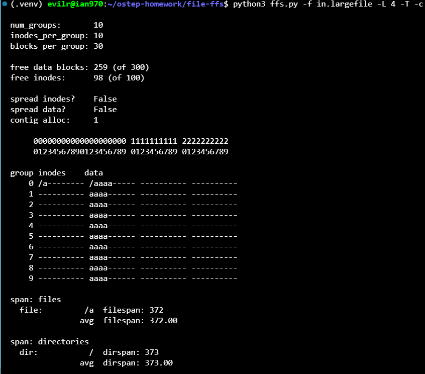

    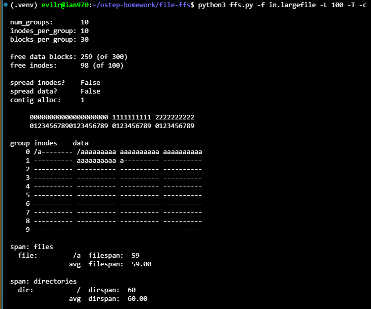

    In the simulator, the physical address is indexed linearly with each group taking up $10 \text{ inodes} + 30 \text{ data blocks} = 40$ addresses. The inode of `/a` is at physical address 1 (Group 0, inode index 1).

    * **With `-L 4`:**
    The file `/a` is spread across all 10 groups (Group 0 to Group 9). Its last data block is placed at data index 3 of Group 9, corresponding to physical address $9 \times 40 + 10 + 3 = 373$.

    > $$\text{filespan} = \max(\text{addresses}) - \min(\text{addresses}) = 373 - 1 = 372$$

    * **With `-L 100`:**
    The large threshold keeps the file mostly intact within the earliest possible groups (Group 0 and Group 1). Its last data block is placed at data index 10 of Group 1, corresponding to physical address $1 \times 40 + 10 + 10 = 60$.

    $$\text{filespan} = 60 - 1 = 59$$

    **Expected Trend:**
    As the large-file exception parameter (`-L`) increases from low values to high values, **filespan decreases significantly**. A larger `-L` preserves sequential locality by confining file blocks within the fewest number of cylinder groups possible, reducing seek distances across the disk. Conversely, a smaller `-L` forces the file to fragment across many cylinder groups, substantially increasing filespan.

4. Now let’s look at a new input file, in.manyfiles. How do you think the FFS policy will lay these files out across groups? (you can run with -v to see what files and directories are created, or just cat in.manyfiles). Run the simulator with -c to see if you were right.

    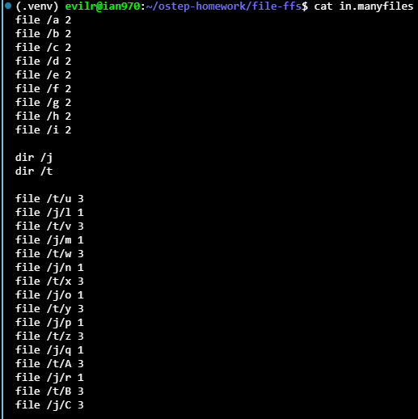

    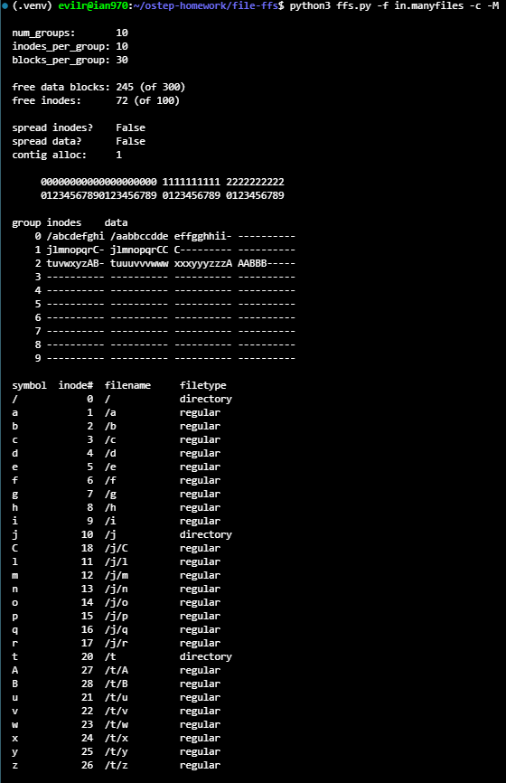

    The FFS placement policies dictate two main rules: (1) place directories in groups with the most free inodes to spread directories out, and (2) place regular files in the same group as their parent directory to exploit locality.

    1. **Group 0:** Initially, files `/a` through `/i` are created in the root directory `/`. Since the parent directory `/` resides in Group 0, all 9 files have their inodes (slots 1–9) and 2 data blocks each allocated in Group 0, completely filling Group 0's inode table.

    2. **Group 1:** When `dir /j` is created, FFS finds that Groups 1–9 all have 10 free inodes and picks the first one, Group 1. Consequently, all files subsequently created within `/j` (files `l, m, n, o, p, q, r, C`) are placed in Group 1 alongside `/j`.

    3. **Group 2:** When `dir /t` is created, Groups 2–9 have more free inodes (10) than Group 1 (which now has 9). Thus, FFS allocates `/t` into Group 2. Even though the commands for `/j` and `/t` interleave in the input trace, all files created inside `/t` (files `u, v, w, x, y, z, A, B`) are consistently directed to Group 2.

    In summary, FFS isolates files into groups strictly according to directory membership: Group 0 contains `/` and `/a`–`/i`, Group 1 contains `/j` and `/j/*`, and Group 2 contains `/t` and `/t/*`.

5. A metric to evaluate FFS is called dirspan. This metric calculates the spread of files within a particular directory, specifically the max distance between the inodes and data blocks of all files in the directory and the inode and data block of the directory itself. Run with in.manyfiles and the -T flag, and calculate the dirspan of the three directories. Run with -c to check. How good of a job does FFS do in minimizing dirspan?

    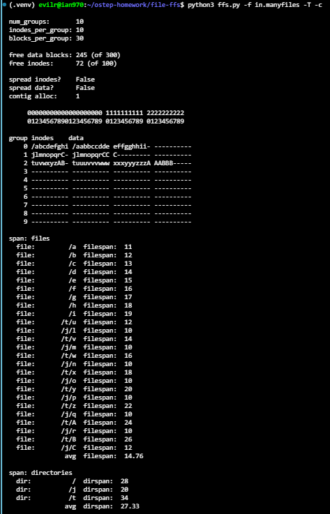

    Running `./ffs.py -f in.manyfiles -T -c` yields the following dirspan metrics:
    * `dir: /`  $\rightarrow$ **28**

    * `dir: /j` $\rightarrow$ **20**

    * `dir: /t` $\rightarrow$ **34**

    * Average dirspan $\rightarrow$ **27.33**

    **Evaluation:**
    FFS does an **exceptionally good job** at minimizing dirspan. Since each cylinder group in this configuration spans 40 total units ($10 \text{ inodes} + 30 \text{ data blocks}$), all three directories achieve a dirspan strictly under 40 ($28, 20, 34 < 40$).

    This demonstrates th at FFS successfully confines each directory along with all of its contained files completely inside a single cylinder group. As a result, operations that traverse files within the same directory (e.g., `ls -l` or compiling files within a source tree) require minimal seek distance and incur virtually no cross-group disk head travel.

6. Now change the size of the inode table per group to 5 (-i 5). How do you think this will change the layout of the files? Run with -c to see if you were right. How does it affect the dirspan?

    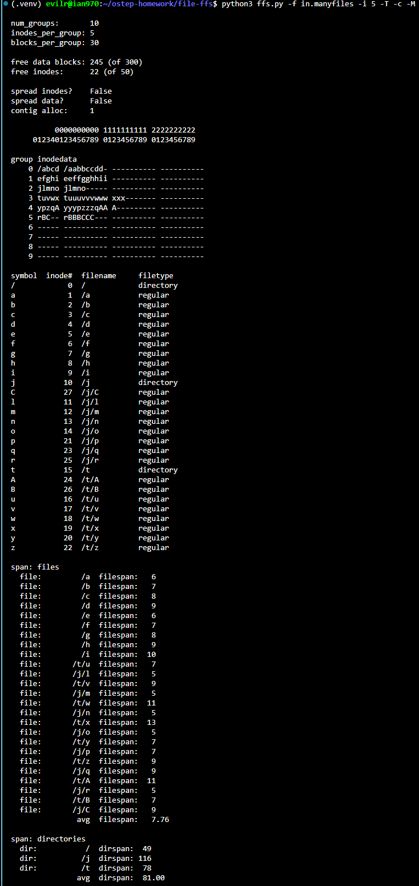

    Reducing the inode table per group to 5 (`-i 5`) constrains the capacity of each group to hold files belonging to the same directory:

    * **Layout Changes:**
    Group 0 can now only hold the root directory `/` and 4 regular files (`/a` through `/d`). The remaining files belonging to the root directory (`/e` through `/i`) exhaust Group 0's inodes and overflow into Group 1. Similarly, because directories `/j` and `/t` contain more files than can fit within a single group's inode table, their files spill over into neighboring groups, fragmenting directory contents across Groups 2, 3, 4, and 5.

    * **Impact on `dirspan`:**
    Because files in the same directory are no longer confined to a single group, **`dirspan` increases drastically**:

      * `dir: /` increases from 28 to **49**

      * `dir: /j` surges from 20 to **116**

      * `dir: /t` grows from 34 to **78**

      * The average `dirspan` jumps from 27.33 to **81.00** (nearly a three-fold increase).

    This demonstrates that insufficient inode capacity breaks directory colocation, severely degrading locality across cylinder groups.

7. Which group should FFS place inode of a new directory in? The default (simulator) policy looks for the group with the most free inodes. A different policy looks for a set of groups with the most free inodes. For example, if you run with -A 2, when allocating a new directory, the simulator will look at groups in pairs and pick the best pair for the allocation. Run ./ffs.py -f in.manyfiles -i 5 -A 2 -c to see how allocation changes with this strategy. How does it affect dirspan? Why might this policy be good?

    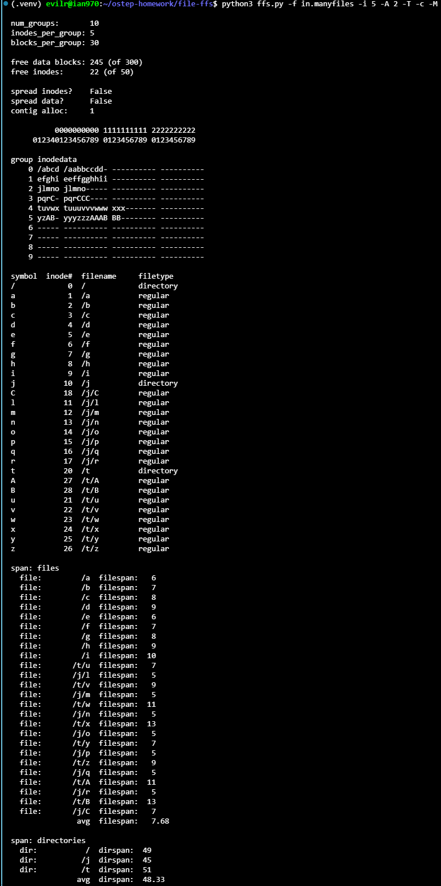

    * **Allocation Layout Changes:**
    Under the default policy (`-A 1`), directory `/j` was placed in Group 2 and `/t` in Group 3. When both directories overflowed their groups' small inode tables, their files interleaved haphazardly across Groups 2, 3, 4, and 5.
    With `-A 2`, FFS evaluates groups in adjacent pairs. Directory `/j` is allocated to the pair (Groups 2 & 3), and all `/j/*` files fit neatly within Groups 2 and 3. Directory `/t` is allocated to the pair (Groups 4 & 5), containing all `/t/*` files cleanly within Groups 4 and 5. The two directory hierarchies no longer interleave.

    * **Impact on `dirspan`:**
    Confining each directory and its overflow to an adjacent pair dramatically reduces the directory span:

        * `dir: /` remains **49**

        * `dir: /j` drops dramatically from 116 to **45**

        * `dir: /t` decreases from 78 to **51**

        * The average `dirspan` drops from 81.00 down to **48.33**.

    * **Why this policy is advantageous:**

        Directories tend to grow over time by accumulating new files. Evaluating pairs (or larger sets) of groups reserves expansion headroom for newly created directories. Even if a directory exhausts the inodes of its primary group, the adjacent group provides immediate spillover capacity, ensuring that related files remain in close physical proximity and preventing severe disk head seeks.

8. One last policy change we will explore relates to file fragmentation. Run ./ffs.py -f in.fragmented -v and see if you can predict how the files that remain are allocated. Run with -c to confirm your answer. What is interesting about the data layout of file /i? Why is it problematic?

    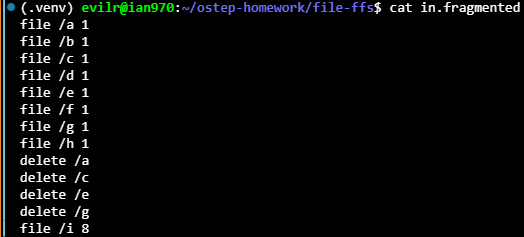

    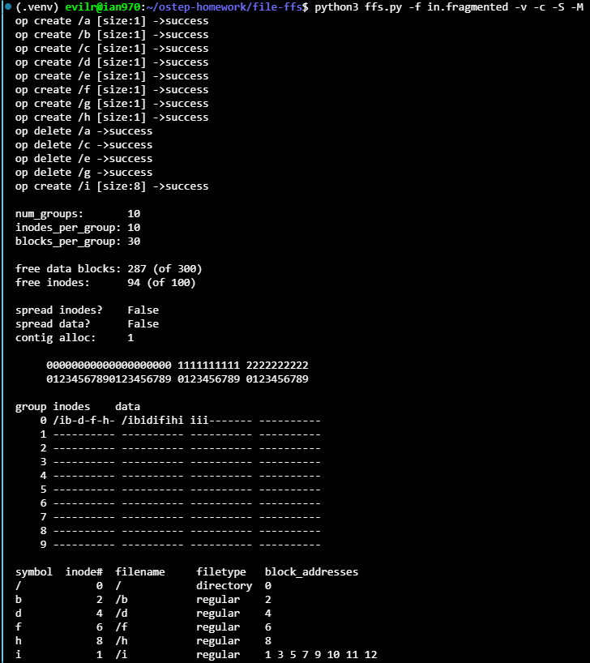

    * **Allocation Layout of Remaining Files:**
    Initially, 8 single-block files (`/a` through `/h`) were sequentially allocated into data blocks 1 through 8 of Group 0. Deleting `/a`, `/c`, `/e`, and `/g` frees blocks 1, 3, 5, and 7, creating alternating 1-block holes. The remaining files `/b`, `/d`, `/f`, and `/h` retain blocks 2, 4, 6, and 8.

    * **Data Layout of `/i`:**
    When the 8-block file `/i` is created, FFS fills the newly freed holes before allocating from the trailing unallocated region. Consequently, `/i` occupies blocks **1, 3, 5, 7, 9, 10, 11, and 12**.

    * **Why this is Problematic:**
    The data layout of `/i` is severely fragmented. Even though the blocks are within the same cylinder group, reading `/i` sequentially requires jumping over the blocks of `/b`, `/d`, `/f`, and `/h`. On mechanical hard drives, skipping blocks interrupts sequential streaming and incurs rotational delay penalty (or extra head movement), causing sequential I/O performance to plummet to levels comparable to random access.

9. A new policy, which we call contiguous allocation (-C), tries to ensure that each file is allocated contiguously. Specifically, with -C n, the file system tries to ensure that n contiguous blocks are free within a group before allocating a block. Run ./ffs.py -f in.fragmented -v -C 2 -c to see the difference. How does layout change as the parameter passed to -C increases? Finally, how does -C affect filespan and dirspan?

    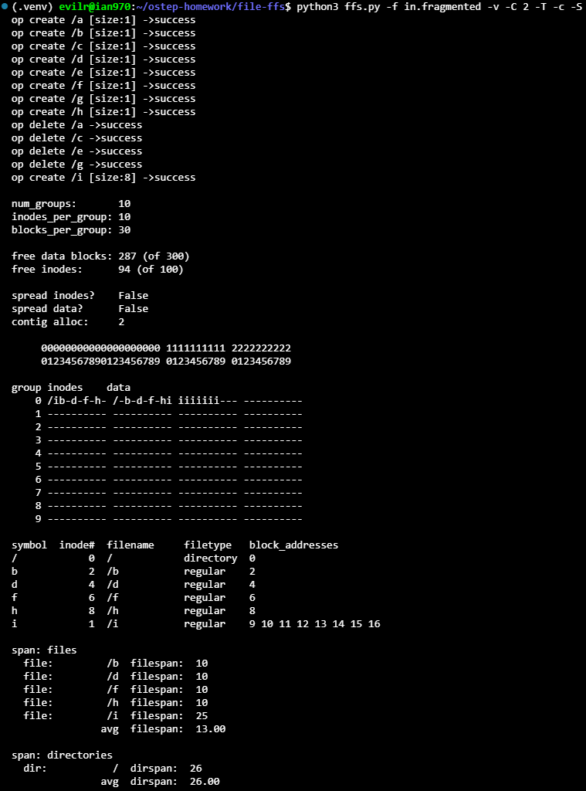

    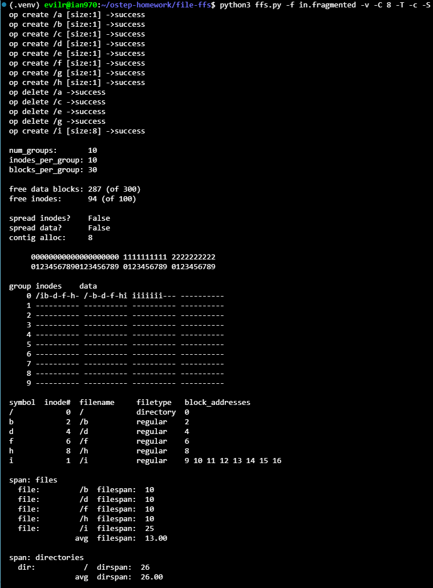

    * **Layout Difference with `-C 2`:**
    The freed holes at blocks 1, 3, 5, and 7 are isolated chunks of size 1. Because `-C 2` requires at least 2 contiguous free blocks before allocating, the allocator bypasses these individual single-block gaps entirely. Instead, file `/i` is allocated contiguously in blocks **9 through 16**.

    * **How Layout Changes as `-C` Increases:**
    As the contiguous constraint $n$ increases, the allocator becomes strictly selective, skipping any fragmented holes smaller than $n$. With `-C 8`, because blocks 9 to 29 contain 21 contiguous free blocks, `/i` is allocated in the exact same contiguous chunk (blocks 9–16). If existing free segments in the local group are smaller than $n$, the allocator is forced to skip them or look to adjacent groups that contain sufficiently large contiguous free extents.

    * **Impact on `filespan` and `dirspan`:**
      * **`filespan`:** File `/i`'s data blocks are now 100% contiguous (spanning just 7 blocks internally from block 9 to 16) rather than alternating across 12 blocks, eliminating seek and rotational overhead during sequential reads. The simulator's formal `filespan` (which includes its inode at address 1 up to data block 16 at address 26) is **25**.

      * **`dirspan`:** In this trace, all files remain within Group 0, keeping the directory span compact at **26**. However, in heavily utilized file systems, a high `-C` threshold may cause files to spill over to neighboring groups if the local group lacks sufficiently large contiguous holes, thereby trading a slightly larger `dirspan` for strictly contiguous file layouts and superior I/O throughput.
