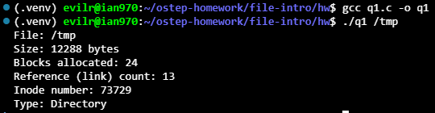
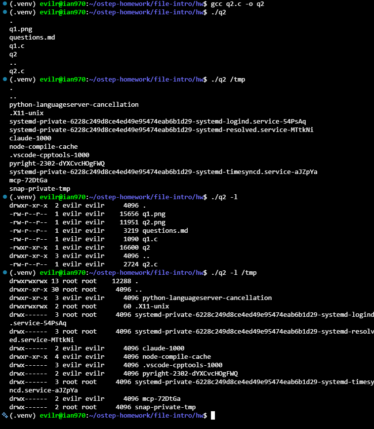
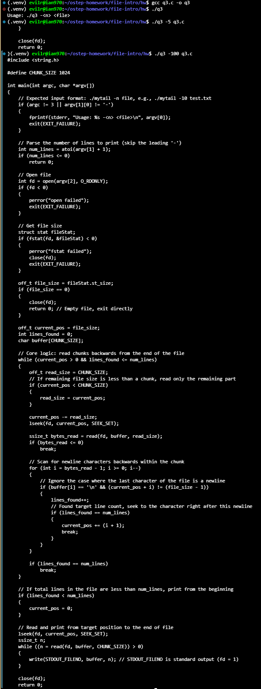
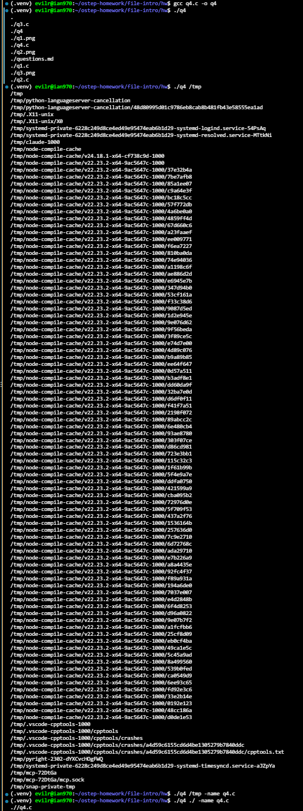

# Homework (Code)

In this homework, we’ll just familiarize ourselves with how the APIs described in the chapter work. To do so, you’ll just write a few different programs, mostly based on various UNIX utilities.

## Questions

1. Stat: Write your own version of the command line program stat, which simply calls the stat() system call on a given file or directory. Print out file size, number of blocks allocated, reference (link) count, and so forth. What is the link count of a directory, as the number of entries in the directory changes? Useful interfaces: stat(), naturally.

    [q1.c](./q1.c)

    

    The link count of a directory only increases when a new **subdirectory** is created within it; adding or removing standard files does not affect this number. Based on the output shown in q1.png, the `/tmp` directory has a reference (link) count of 13, which can be broken down as follows:

   * **Initial Links (2):** Every directory starts with a minimum link count of 2. One link comes from its name entry in the parent directory, and the second comes from the directory's own `.` (current directory) entry.
   * **Subdirectory Links (11):** Each subdirectory created inside `/tmp` adds 1 to the link count because it contains a `..` (parent directory) entry pointing back to `/tmp`.
   * **Current State:** A total link count of 13 means there are exactly 11 subdirectories currently inside the `/tmp` directory (13 - 2 = 11).

2. List Files: Write a program that lists files in the given directory. When called without any arguments, the program should just print the file names. When invoked with the -l flag, the program should print out information about each file, such as the owner, group, permissions, and other information obtained from the stat() system call. The program should take one additional argument, which is the directory to read, e.g., myls -l directory. If no directory is given, the program should just use the current working directory. Useful interfaces: stat(), opendir(), readdir(), getcwd().

    [q2.c](./q2.c)

    

    The output in q2.png confirms that your `q2` program correctly implements all requirements for the directory listing utility.

   * **Argument Parsing:** The program successfully handles zero arguments (defaulting to the current working directory), a specific directory path (`/tmp`), and the `-l` flag in combination with a target path.
   * **Metadata Extraction:** When invoked with `-l`, it accurately translates the `stat` struct into human-readable formats. It properly differentiates directories (`d`) from regular files (`-`), resolves UID/GID to actual usernames (`evilr`, `root`), and displays the correct link counts and file sizes.
   * **Path Resolution:** The execution of `./q2 -l /tmp` proves that your path combination logic successfully prepends the target directory before calling `stat()`, preventing the common trap of "file not found" errors when reading contents outside of the current working directory.

3. Tail: Write a program that prints out the last few lines of a file. The program should be efficient, in that it seeks to near the end of the file, reads in a block of data, and then goes backwards until it finds the requested number of lines; at this point, it should print out those lines from beginning to the end of the file. To invoke the program, one should type: q3 -n file, where n is the number of lines at the end of the file to print. Useful interfaces: stat(), lseek(), open(), read(), close().

    [q3](./q3.c)

    

    To ensure efficiency, this implementation of `tail` uses `lseek()` to jump to the end of the file and reads backward in chunks to locate the required newline characters before printing the final output.

    **Compilation and Testing**

    * **Compile:** `gcc q3.c -o q3`
    * **Test (last 5 lines):** `./q3 -5 q3.c`
    * **Test (exceeding total lines):** `./q3 -100 q3.c`

    **Core Mechanics**

    * **Chunk-based Backward Reading:** To prevent severe I/O bottlenecks caused by character-by-character reading, the program sets a `CHUNK_SIZE` of 1024 bytes. It uses `lseek()` to jump backward in 1024-byte increments and uses `read()` to pull entire blocks into memory.
    * **Newline Scanning:** Inside the `buffer` array, a `for` loop scans backward to locate `\n` characters, incrementing the `lines_found` counter.
    * **Single-pass Printing:** Once the requested number of lines is found, the program calculates the exact file offset (`current_pos`), uses `lseek()` to jump directly to that point, and continuously calls `read()` and `write(STDOUT_FILENO)` to efficiently dump the remaining content to the screen.

4. Recursive Search: Write a program that prints out the names of each file and directory in the file system tree, starting at a given point in the tree. For example, when run without arguments, the program should start with the current working directory and print its contents, as well as the contents of any sub-directories, etc., until the entire tree, root at the CWD, is printed. If given a single argument (of a directory name), use that as the root of the tree instead. Refine your recursive search with more fun options, similar to the powerful find command line tool. Useful interfaces: figure it out.

    [q4](./q4.c)

    

    **Compilation and Testing**

    * **Compile:** `gcc q4.c -o q4`
    * **Search current directory:** `./q4`
    * **Search specific directory:** `./q4 /tmp`
    * **Filter by name (the "fun" option):** `./q4 /tmp -name q4.c`

    **Core Mechanics**

    * **Recursive Traversal:** The `search_dir` function opens a directory, loops through its contents, and immediately calls itself whenever it encounters a new directory, effectively walking down the entire tree.
    * **Infinite Loop Prevention:** It explicitly ignores the `.` (current) and `..` (parent) directories. Without this check, the function would recursively call itself on the same directory until the call stack overflowed.
    * **Safe Symlink Handling:** The code uses `lstat()` instead of `stat()`. If a directory contains a symbolic link pointing back to its own parent directory, `stat()` would follow it and cause an infinite loop. `lstat()` reads the link itself, correctly preventing circular references during the search.
