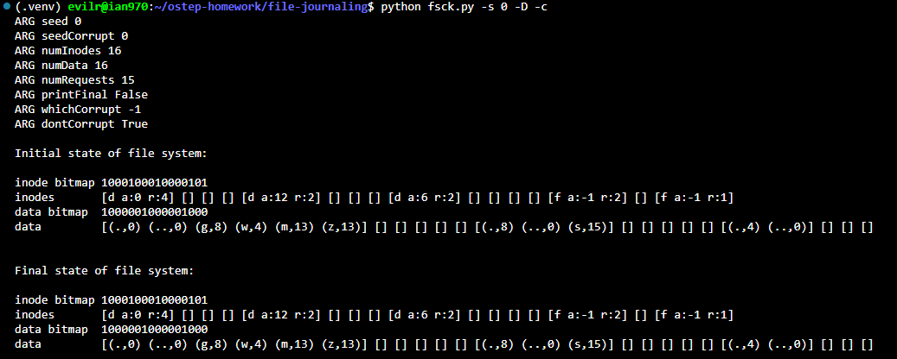
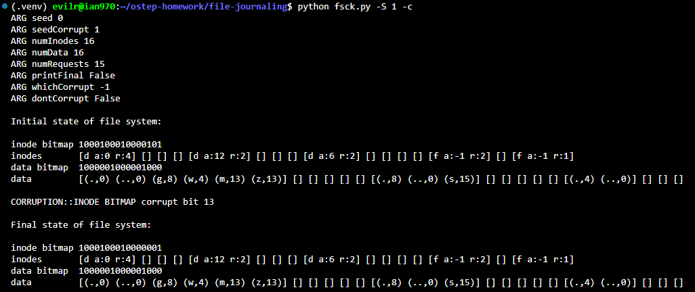
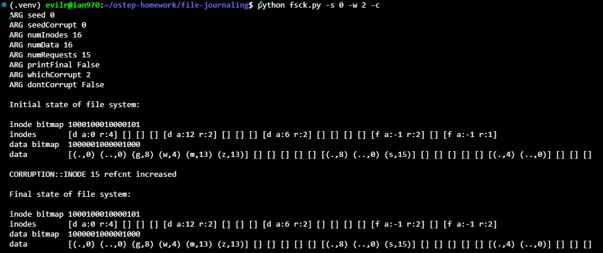
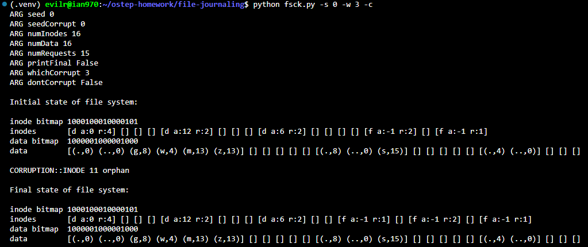
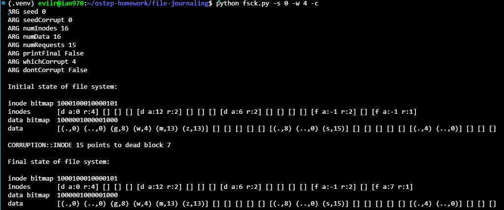
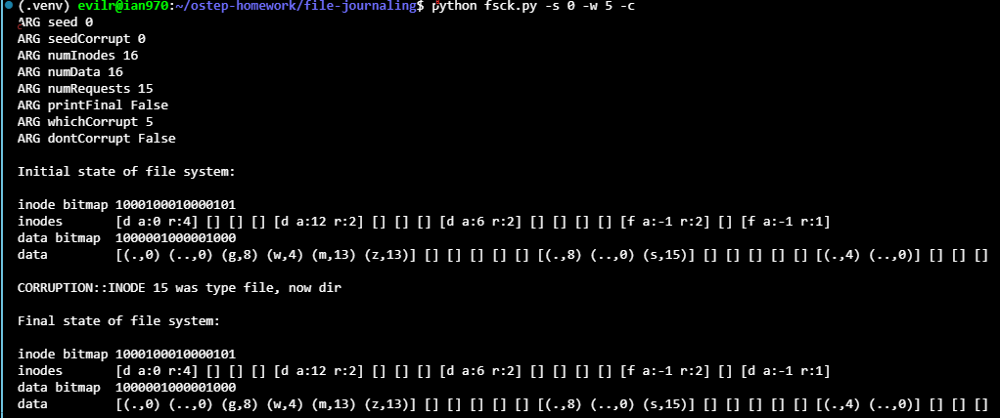
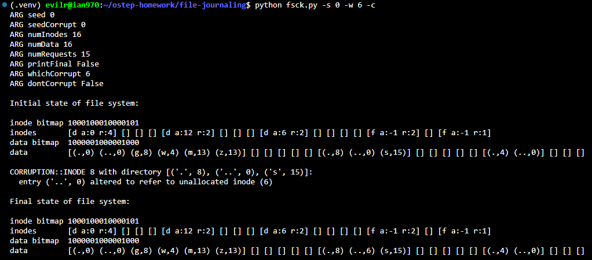

# Homework (Simulation)

This section introduces fsck.py, a simple simulator you can use to
better understand how file system corruptions can be detected (and potentially repaired). Please see the associated README for details on how
to run the simulator.

## Questions

1. First, run fsck.py -D; this flag turns off any corruption, and thus you can use it to generate a random file system, and see if you can determine which files and directories are in there. So, go ahead and do that! Use the -p flag to see if you were right. Try this for a few different randomly-generated file systems by setting the seed (-s) to different values, like 1, 2, and 3.

    

    By traversing the file system starting from root inode 0:

    * **Directories:**
    * `/`
    * `/g`
    * `/w`

    * **Files:**
    * `/m` (linked to inode 13)
    * `/z` (hard link to `/m`, sharing inode 13)
    * `/g/s` (inode 15)

2. Now, let’s introduce a corruption. Run fsck.py -S 1 to start. Can you see what inconsistency is introduced? How would you fix it in a real file system repair tool? Use -c to check if you were right.

    

    The corruption occurs in the **inode bitmap at bit 13**:

    * Inode 13 is currently in use: it has active references from the root directory (`/m` and `/z`), and its inode entry is allocated (`[f a:-1 r:2]`).

    * However, bit 13 of the inode bitmap was corrupted from `1` to `0`, incorrectly marking an allocated inode as free.

    * A file system consistency checker (`fsck`) resolves this by rescanning allocated inodes referenced in directories and marking bit 13 back to `1` in the inode bitmap.

3. Change the seed to -S 3 or -S 19; which inconsistency do you see? Use -c to check your answer. What is different in these two cases?

    

    The corruption involves an inconsistent **reference count on inode 15**:

    * Inode 15 is referenced only once across the entire directory structure (by `/g/s` in block 6).

    * Its link count (`refCnt`) was artificially incremented from `1` to `2`.

    * A file system checker (`fsck`) detects this inconsistency by counting all directory entries pointing to inode 15 and sets its `refCnt` back to `1`.

4. Change the seed to -S 5; which inconsistency do you see? How hard would it be to fix this problem in an automatic way? Use -c to check your answer. Then, introduce a similar inconsistency with -S 38; is this harder/possible to detect? Finally, use -S 642; is this
inconsistency detectable? If so, how would you fix the file system?

    

    The corruption introduces an **orphan inode at index 11**:

    * Inode 11 is populated as an allocated file (`[f a:-1 r:1]`), yet its corresponding bit in the `inode bitmap` remains marked as free (`0`).

    * Furthermore, no directory in the file system contains an entry pointing to inode 11.

    * A file system consistency checker (`fsck`) detects this unreferenced inode and either frees it by clearing the inode entry or links it to a dedicated recovery directory (such as `lost+found`) if it contains valid data.

5. Change the seed to -S 6 or -S 13; which inconsistency do you see? Use -c to check your answer. What is the difference across these two cases? What should the repair tool do when encountering such a situation?

    

    The corruption causes **inode 15 to reference an unallocated (dead) data block**:

    * Inode 15 has its address pointer modified from `-1` to `7` (`[f a:7 r:1]`).

    * However, bit 7 in the `data bitmap` is `0`, indicating that data block 7 is free, and the block itself contains no data (`[]`).

    * A file system consistency checker (`fsck`) identifies this discrepancy by reconciling block pointers in valid inodes against the `data bitmap`; depending on whether the block actually contains recoverable data, `fsck` would either mark bit 7 as allocated in the data bitmap or reset the inode's address back to `-1`.

6. Change the seed to -S 9; which inconsistency do you see? Use -c to check your answer. Which piece of information should a checkand-repair tool trust in this case?

    

    The corruption involves a **type confusion where inode 15 was switched from a regular file to a directory**:

    * Inode 15 is marked as a directory (`[d a:-1 r:1]`), but its data address is `-1`, meaning it lacks a data block to hold essential entries (`.` and `..`).

    * Its link count (`r:1`) contradicts the standard minimum count for a directory, which must be at least 2.

    * A file system consistency checker (`fsck`) checks directory formats and invariants; detecting that inode 15 points to no directory block and has a link count of 1, it determines that the inode type was corrupted and restores it to a regular file `f`.

7. Change the seed to -S 15; which inconsistency do you see? Use -c to check your answer. What can a repair tool do in this case? If no repair is possible, how much data is lost?

    

    The corruption involves a **directory entry pointing to an unallocated inode**:

    * Inside directory inode 8's data block (`data[6]`), the parent directory entry `(.., 0)` was altered to `(.., 6)`.

    * Bit 6 of the `inode bitmap` is `0`, and `inodes[6]` is unallocated (`[]`).

    * A file system consistency checker (`fsck`) validates all directory entries during pass 2/3 and checks parent-child invariants; finding that `..` references an unallocated inode instead of the legitimate parent (root inode 0), it restores `..` to point to inode 0.

8. Change the seed to -S 10; which inconsistency do you see? Use -c to check your answer. Is there redundancy in the file system structure here that can help a repair?

    

    The corruption alters a **directory entry name in inode 8's data block**:

    * In data block 6 (`/g`), the parent directory entry `('..', 0)` was modified to `('g', 0)`.

    * This violates the directory structure invariant, where every directory block must contain `.` pointing to itself and `..` pointing to its parent directory.

    * A file system consistency checker (`fsck`) scans directory formatting during its directory check pass, detects the missing `..` entry pointing to parent inode 0, and renames `g` back to `..`.

9. Change the seed to -S 16 and -S 20; which inconsistency do you see? Use -c to check your answer. How should the repair tool fix the problem?

    

    The corruption occurs in the **data bitmap at bit 12**:

    * Data block 12 is actively used by directory inode 4 (`/w`) to store its directory entries `[(.,4) (..,0)]`.

    * Bit 12 of the `data bitmap` was corrupted from `1` to `0`, falsely marking an in-use data block as free.

    * A file system consistency checker (`fsck`) scans all valid inodes, collects the set of pointed data blocks, finds that block 12 is referenced by inode 4, and repairs the inconsistency by setting bit 12 back to `1` in the data bitmap.
