# Homework (Simulation)

This section introduces lfs.py, a simple LFS simulator you can use
to understand better how an LFS-based file system works. Read the
README for details on how to run the simulator.

## Questions

1. Run ./lfs.py -n 3, perhaps varying the seed (-s). Can you figure out which commands were run to generate the final file system contents? Can you tell which order those commands were issued? Finally, can you determine the liveness of each block in the final file system state? Use -o to show which commands were run, and -c to show the liveness of the final file system state. How much harder does the task become for you as you increase the number of commands issued (i.e., change -n 3 to -n 5)?

    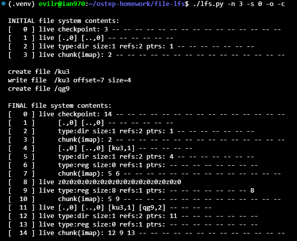

    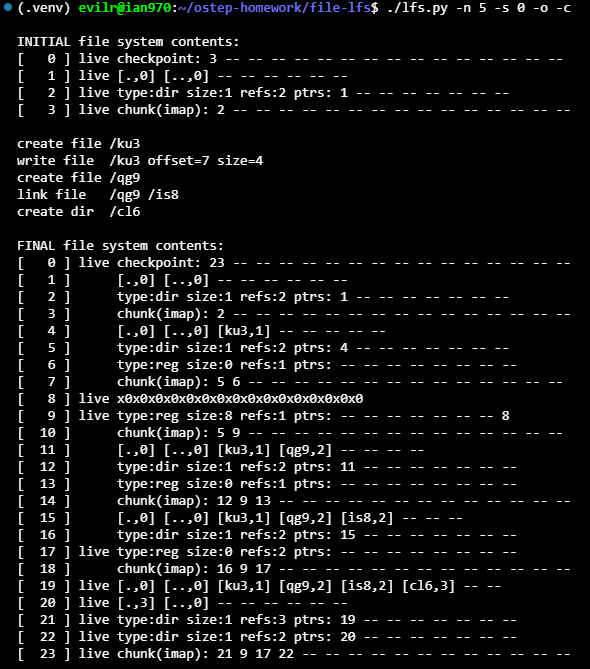

    Yes, it is possible to determine which commands were run, their ordering, and the liveness of each block by analyzing the log layout:
    1. **Determining Commands and Order**: Because LFS always appends updates sequentially to the log, operations appear chronologically. By inspecting the newly appended blocks:
       * A directory block update followed by a directory inode, a regular inode, and an imap chunk indicates a **file creation** (e.g., blocks 4–7 for `/ku3`).
       * A raw data block followed by an updated file inode and an imap chunk indicates a **file write** (e.g., blocks 8–10).
       * A directory entry pointing to an existing inode number accompanied by an updated inode with incremented reference count indicates a **hard link**.
       * A new directory data block containing `.` and `..` accompanied by a directory inode indicates a **directory creation**.

    2. **Determining Liveness**: Liveness is determined by starting from the latest Checkpoint Region (CR at block 0), traversing to the latest imap chunks, resolving the active inodes, and finally tracing their pointers to live data blocks. Any blocks superseded by newer writes in the log become dead (garbage).
    3. **Difficulty with Increased Operations**: Increasing the number of commands from 3 to 5 (or more) makes the reasoning significantly harder. Multiple updates overwrite previous versions of directory blocks and inodes rapidly, leaving behind multiple generations of dead metadata and data blocks, which requires much deeper manual pointer chasing to reconstruct the exact intermediate states.

2. If you find the above painful, you can help yourself a little bit by showing the set of updates caused by each specific command. To do so, run ./lfs.py -n 3 -i. Now see if it is easier to understand what each command must have been. Change the random seed to get different commands to interpret (e.g., -s 1, -s 2, -s 3, etc.).

    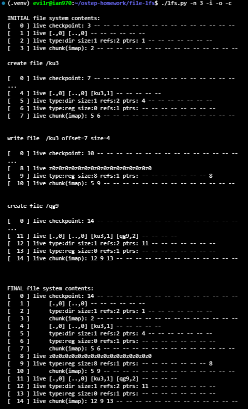

    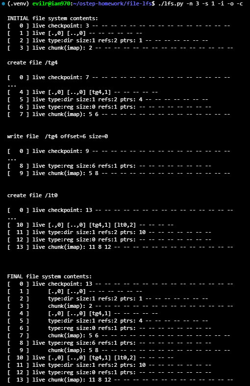

    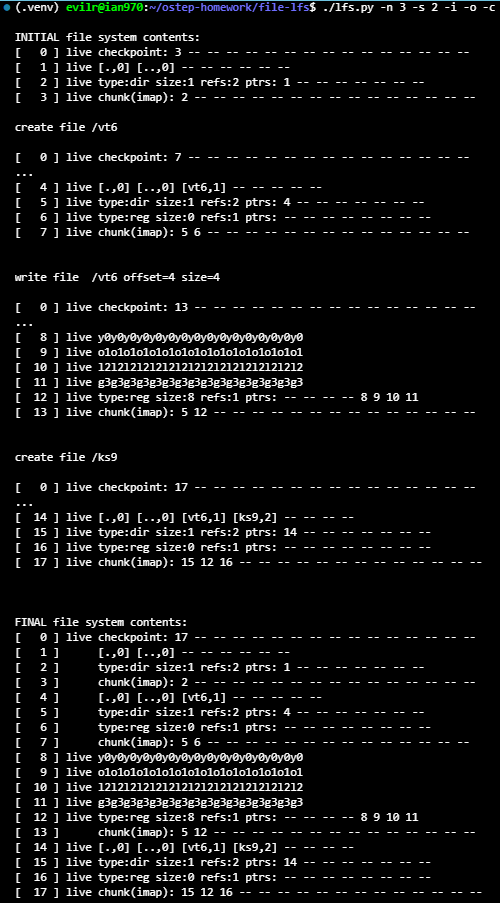

    Yes, using the `-i` flag makes it significantly easier to deduce what each command must have been.
    By isolating the updates caused by each individual command, the operations exhibit distinct on-disk footprints:

    * **File Creation (`c`)**: Appends exactly 4 blocks in sequence: an updated parent directory data block containing the new entry, an updated parent directory inode, an empty regular inode (`size:0`), and a new imap chunk pointing to the two modified inodes.
    * **File Write (`w`)**: Appends $N$ data block(s) corresponding to the write size, followed by the updated regular inode (with modified `size` and data block pointers), and a new imap chunk. If `size=0`, only the inode and imap chunk are written.
    * **Directory Creation (`d`)**: Appends an updated parent directory block, an updated parent directory inode, an initialized child directory data block (holding `.` and `..`), the child directory inode, and a new imap chunk.

    Because `-i` bounds each command's updates between intermediate checkpoints and removes the confusion of dead blocks being overwritten by subsequent commands, reasoning about the sequence of operations becomes straightforward.

3. To further test your ability to figure out what updates are made to disk by each command, run the following: ./lfs.py -o -F -s 100 (and perhaps a few other random seeds). This just shows a set of commands and does NOT show you the final state of the file system. Can you reason about what the final state of the file system must be?

    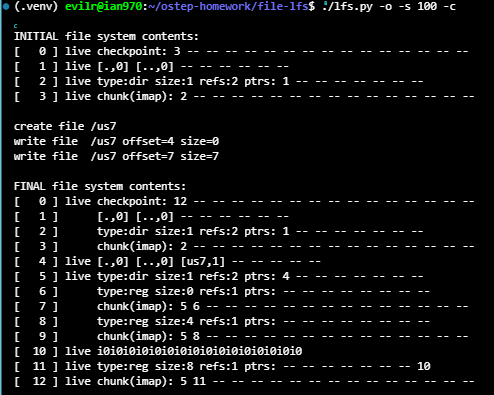

    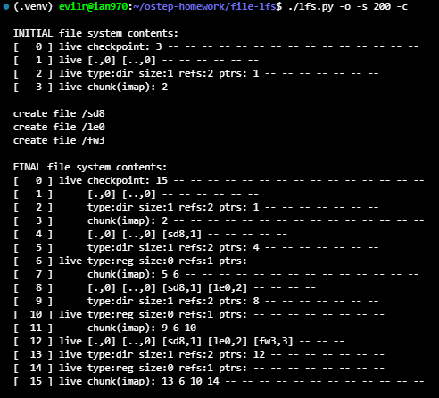

    Yes, it is entirely possible to deterministically trace and predict the exact final state of the file system from a given sequence of operations:
    1. **Tracking Write Patterns**:
       * Every file creation appends 4 sequential blocks: an updated directory data block, an updated directory inode, a new file inode (`size:0, refs:1`), and an updated imap chunk pointing to the updated directory inode and new file inode.
       * Every file write appends the allocated data blocks first, followed by the updated file inode (with updated `size` and pointer array), and the new imap chunk.

    2. **Handling Boundary Constraints (as in seed 100)**:
       * An inode has a fixed capacity of 8 direct pointers (offsets 0–7). When an operation requests a write beyond this boundary (e.g., `offset=7 size=7`), the simulator caps the write to the remaining available direct pointer slots (writing exactly 1 block at offset 7 instead of 7 blocks).

    3. **Liveness Propagation**:
       * By mentally walking the append log, we can maintain the latest active pointer for each structure. The latest Checkpoint Region points to the latest imap chunk, which in turn points to the most recent inodes, leaving intermediate directory entries and superseded inodes marked as dead.

4. Now see if you can determine which files and directories are live after a number of file and directory operations. Run tt ./lfs.py -n 20 -s 1 and then examine the final file system state. Can you figure out which pathnames are valid? Run tt ./lfs.py -n 20 -s 1 -c -v to see the results. Run with -o to see if your answers match up given the series of random commands. Use different random seeds to get more problems.

   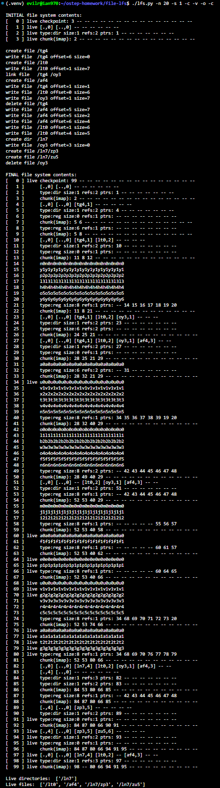

   Yes, it is possible to determine all valid pathnames by systematically traversing the directory hierarchy from the root inode using the final on-disk structures:
   1. **Root Directory Traversal**:
      * Locate the active imap chunk referenced by the latest Checkpoint Region (block 99).
      * Entry 0 of the imap chunk points to the root inode at block 98.
      * The root inode points to its active directory data block at block 97, which contains entries: `[.,0]`, `[..,0]`, `[ln7,4]`, `[lt0,2]`, and `[af4,3]` (deleted files `/tg4` and `/oy3` are cleared to `--`).

   2. **Subdirectory Traversal**:
      * Looking up inode 4 in the imap yields block 94 (inode for `/ln7`), which points to directory block 93.
      * Block 93 lists children `[zp3,5]` and `[zu5,6]`, producing active paths `/ln7/zp3` and `/ln7/zu5`.

   3. **Verification**:
      * Cross-referencing with `-v` confirms the live directory tree:
      * **Live directories**: `['/ln7']`
      * **Live files**: `['/lt0', '/af4', '/ln7/zp3', '/ln7/zu5']`

      * Tracking operations via `-o` confirms that creations, overwrites, and unlinks match the final reachable tree precisely.

5. Now let’s issue some specific commands. First, let’s create a file and write to it repeatedly. To do so, use the -L flag, which lets you specify specific commands to execute. Let’s create the file ”/foo” and write to it four times: -L c,/foo:w,/foo,0,1:w,/foo,1,1:w,/foo,2,1:w,/foo,3,1 -o. See if you can determine the liveness of the final file system state; use -c to check your answers.

   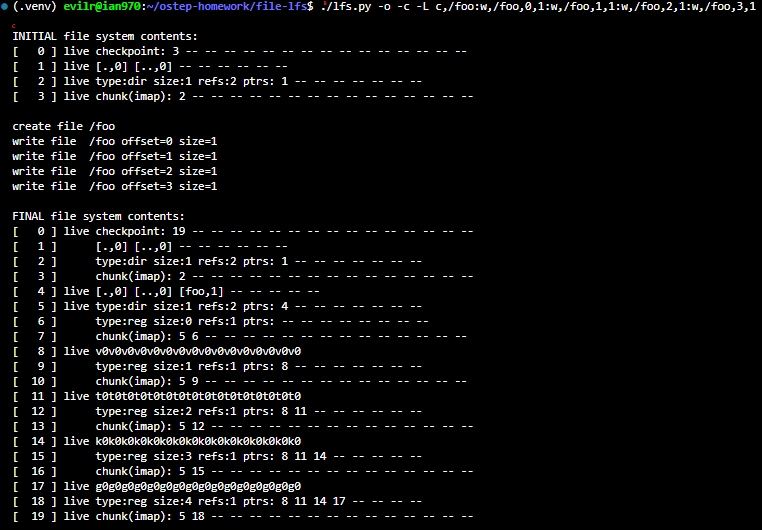

   By tracing the operations sequentially, the liveness of the final file system state is determined as follows:
   1. **Live Blocks**:
      * **Block 0**: The Checkpoint Region (updated to point to block 19).
      * **Block 4 & Block 5**: The root directory data block containing `[foo, 1]` and the root directory inode pointing to block 4 (neither was modified after creation).
      * **Blocks 8, 11, 14, 17**: The 4 newly written data blocks across the four sequential writes.
      * **Block 18**: The final version of `/foo`'s inode (`size:4`, pointing to data blocks 8, 11, 14, and 17).
      * **Block 19**: The final imap chunk mapping inode 0 to block 5 and inode 1 to block 18.

   2. **Dead Blocks (Garbage)**:
      * **Blocks 1, 2, 3**: The original empty root directory data, inode, and imap chunk superseded by `/foo`'s creation.
      * **Blocks 6, 7**: The initial empty inode and imap chunk for `/foo`.
      * **Blocks 9, 10, 12, 13, 15, 16**: Intermediate versions of `/foo`'s inode and corresponding imap chunks written during the incremental single-block writes.

      Writing each block individually results in substantial metadata overhead, where each 1-block write incurs 2 additional metadata block writes (inode and imap chunk), generating 6 dead metadata blocks across the 4 writes.

6. Now, let’s do the same thing, but with a single write operation instead of four. Run ./lfs.py -o -L c,/foo:w,/foo,0,4 to create file ”/foo” and write 4 blocks with a single write operation. © 2008–23, ARPACI-DUSSEAU THREE EASY PIECES 16 LOG-STRUCTURED FILE SYSTEMS Compute the liveness again, and check if you are right with -c. What is the main difference between writing a file all at once (as we do here) versus doing it one block at a time (as above)? What does this tell you about the importance of buffering updates in main memory as the real LFS does?

   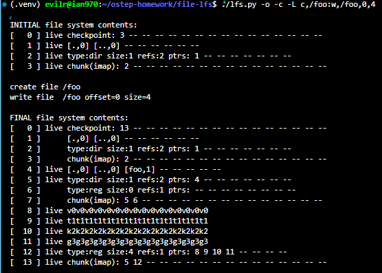

   1. **Liveness of the Final File System State**:
      * **Live Blocks**:
      * `[0]`: Checkpoint Region (pointing to block 13).
      * `[4], [5]`: Root directory data block containing `[foo,1]` and root directory inode.
      * `[8], [9], [10], [11]`: The 4 data blocks written by the single operation.
      * `[12]`: Inode for `/foo` (`size:4`, pointing to blocks 8, 9, 10, 11).
      * `[13]`: imap chunk mapping inode 0 to block 5 and inode 1 to block 12.

      * **Dead Blocks**: `[1], [2], [3]` (original root metadata) and `[6], [7]` (initial empty inode and imap from `/foo`'s creation).

   2. **Main Difference Between Batching vs. One Block at a Time**:
      * Writing one block at a time (Question 5) required 16 appended blocks (up to block 19) because each write operation generated its own separate inode and imap block, leaving behind 6 dead intermediate metadata blocks.
      * Writing all 4 blocks at once (Question 6) required only 10 appended blocks (up to block 13) because the 4 data blocks shared a single inode and a single imap chunk write, generating zero intermediate dead metadata.

   3. **Importance of Buffering Updates in Main Memory**:
      * In a real LFS, buffering writes in memory (using segment buffers) is critical. Batching amortizes metadata overhead: multiple file and directory writes are aggregated so that inodes and imap chunks are only committed to disk once per batch rather than per write.
      * This maximizes sequential write bandwidth, conserves disk space, and dramatically reduces log cleaning / garbage collection overhead.

7. Let’s do another specific example. First, run the following: ./lfs.py -L c,/foo:w,/foo,0,1. What does this set of commands do? Now, run ./lfs.py -L c,/foo:w,/foo,7,1. What does this set of commands do? How are the two different? What can you tell about the size field in the inode from these two sets of commands?

   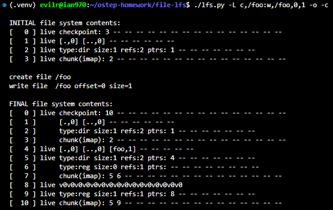

   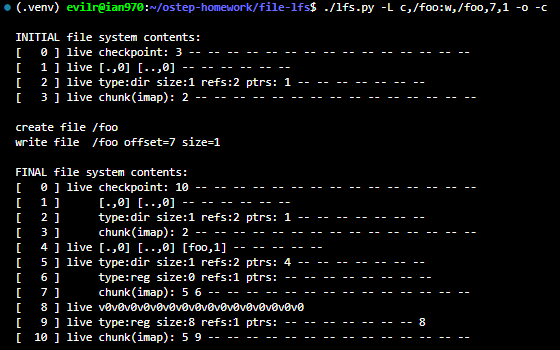

   1. **What Each Command Set Does**:
      * `c,/foo:w,/foo,0,1`: Creates file `/foo` and writes 1 data block at offset 0 (the beginning of the file).
      * `c,/foo:w,/foo,7,1`: Creates file `/foo` and writes 1 data block at offset 7 (creating a sparse file with empty blocks between offsets 0 and 6).

   2. **Differences Between the Two Runs**:
      * **Physical Block Count**: Both runs allocate and write exactly one single data block to disk (block 8).
      * **Pointer Array Layout**: In the first run, pointer slot 0 points to block 8 and slots 1–7 are unallocated (`--`). In the second run, pointer slots 0–6 remain unallocated (`--`), and slot 7 points to block 8.

   3. **Insight into the Inode `size` Field**:
      * The inode `size` field records the **logical file size** (the highest byte/block offset written + 1), not the number of physical blocks actually allocated.
      * When writing at offset 0, `size` is set to 1. When writing at offset 7, `size` is set to 8, despite the file having only 1 block of physical data allocated on disk. Unwritten intervening blocks are represented as sparse holes (`--`) that consume no physical storage.

8. Now let’s look explicitly at file creation versus directory creation. Run simulations ./lfs.py -L c,/foo and ./lfs.py -L d,/foo to create a file and then a directory. What is similar about these runs, and what is different?

   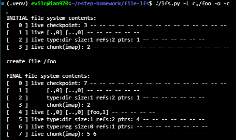

   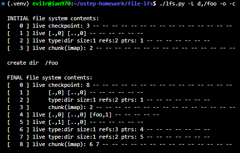

   1. **Similarities**:
      * Both operations update the parent directory by appending a modified parent directory data block containing the new entry `[foo, 1]` (block 4) and an updated parent directory inode.
      * Both allocate a new inode number (inode 1) and append an updated imap chunk reflecting the new locations of the parent inode and inode 1, culminating in a Checkpoint Region update.

   2. **Differences**:
      * **Number of Blocks Written**: File creation writes **4 blocks** (blocks 4–7), whereas directory creation writes **5 blocks** (blocks 4–8).
      * **Self Data Block**: Directory creation immediately allocates and writes an initial directory data block containing `.` and `..` entries (block 5), whereas an empty regular file allocates zero data blocks.
      * **Inode Attributes**:
        * The file inode is `type:reg size:0 refs:1` with no active block pointers.
        * The directory inode is `type:dir size:1 refs:2` and points directly to its initial directory block (block 5).

      * **Parent Directory Reference Count**:
        * Creating a regular file leaves the parent directory's reference count unchanged (`refs:2`).
        * Creating a directory increments the parent directory's reference count (`refs:3`) due to the child directory's `..` back-reference.

9. The LFS simulator supports hard links as well. Run the following to study how they work: ./lfs.py -L c,/foo:l,/foo,/bar:l,/foo,/goo -o -i. What blocks are written out when a hard link is created? How is this similar to just creating a new file, and how is it different? How does the reference count field change as links are created?

   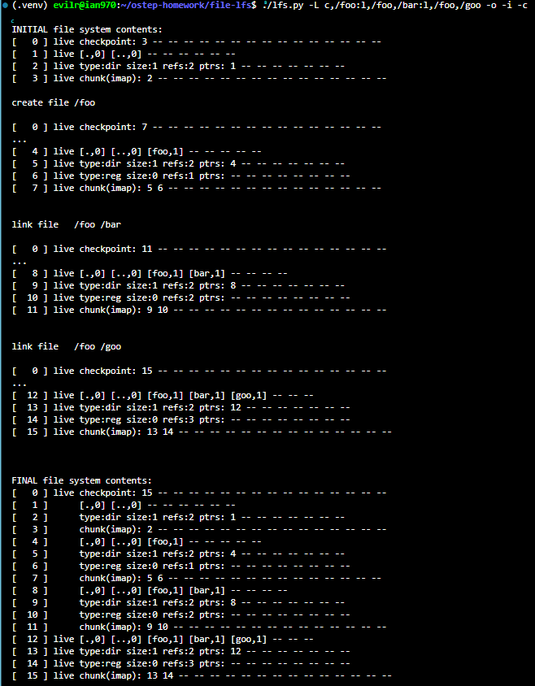

   1. **Blocks Written When a Hard Link is Created**:
      * Exactly **4 blocks** are appended to the log:
        * An updated directory data block containing the new directory entry mapping the new name to the source inode number (e.g., `[bar, 1]` at block 8).
        * An updated parent directory inode pointing to the new directory data block (block 9).
        * An updated version of the target file's inode reflecting the incremented reference count (block 10).
        * An updated imap chunk recording the new disk locations for the parent directory inode and the linked file inode (block 11).

   2. **Similarity and Difference Compared to Creating a New File**:
      * **Similarity**: Both operations write exactly 4 blocks in the same structural sequence (dir data $\to$ dir inode $\to$ file inode $\to$ imap chunk).
      * **Difference**: File creation allocates a brand new inode number and initializes a new inode with `refs:1`. A hard link does not allocate a new inode number; instead, it reuses the existing inode number in the directory entry and appends a modified version of the existing inode with an increased reference count.

   3. **How the Reference Count Changes**:
      * The `refs` field tracks the number of directory entries that point to the file.
      * Upon file creation (`/foo`), `refs` is initialized to **1** (block 6).
      * Linking `/bar` increments `refs` to **2** (block 10).
      * Linking `/goo` increments `refs` to **3** (block 14).

10. LFS makes many different policy decisions. We do not explore many of them here – perhaps something left for the future – but here is a simple one we do explore: the choice of inode number. First, run ./lfs.py -p c100 -n 10 -o -a s to show the usual behavior with the ”sequential” allocation policy, which tries to use free inode numbers nearest to zero. Then, change to a ”random” policy by running ./lfs.py -p c100 -n 10 -o -a r (the -p c100 flag ensures 100 percent of the random operations are file creations). What on-disk differences does a random policy versus a sequential policy result in? What does this say about the importance of choosing inode numbers in a real LFS?

   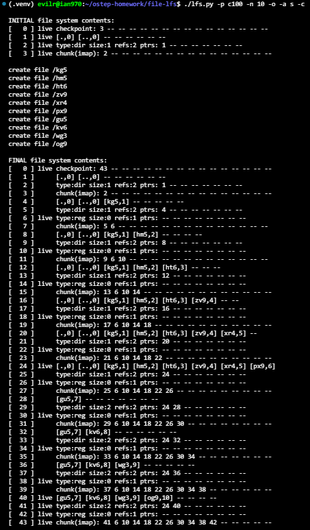

   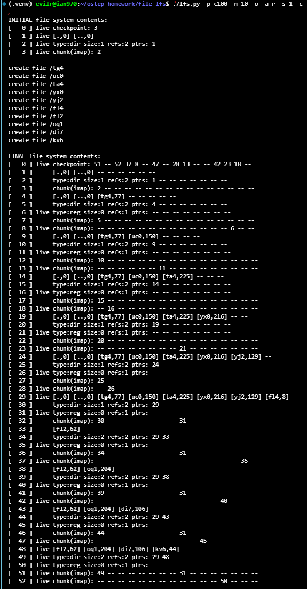

   **On-Disk Differences: Sequential vs. Random Policy**:

      * **Number of Imap Chunks Written**:
         * Under the **sequential policy (`-a s`)**, inodes are allocated consecutively (inodes 1 to 10), which all reside in the first imap chunk (Chunk 0). Each file creation only needs to write a single imap chunk containing both the parent directory inode (inode 0) and the new file inode, reaching block 43.
         * Under the **random policy (`-a r`)**, newly allocated inodes are scattered across different chunks (e.g., inode 77 in Chunk 4, inode 150 in Chunk 9). Because the parent directory inode (inode 0) is in Chunk 0 while the new file is in a different chunk, each file creation must append **two distinct imap chunks** (e.g., blocks 7 and 8), pushing total disk consumption to block 52.

      * **Checkpoint Region (CR) State**:
         * In the sequential run, only CR entry 0 is populated (`checkpoint: 43 -- -- ...`).
         * In the random run, nearly every CR entry is actively pointing to different imap chunks across disk (`checkpoint: 51 -- 52 37 8 -- 47 -- 28 13 ...`).

   **Importance of Choosing Inode Numbers in Real LFS**:

      * **Metadata Locality and Write Amplification**: Grouping related or concurrently created files within the same inode range allows multiple inode updates to share the same imap chunk, minimizing both disk I/O and CR modification overhead.
      * **Cache Efficiency**: Clustering inodes into compact chunks keeps the in-memory imap cache footprint small, avoiding frequent evictions and imap lookups across scattered disk locations.

11. One last thing we’ve been assuming is that the LFS simulator always updates the checkpoint region after each update. In the real LFS, that isn’t the case: it is updated periodically to avoid long seeks. Run ./lfs.py -N -i -o -s 1000 to see some operations and the intermediate and final states of the file system when the checkpoint region isn’t forced to disk. What would happen if the checkpoint region is never updated? What if it is updated periodically? Could you figure out how to recover the file system to the latest state by rolling forward in the log?

   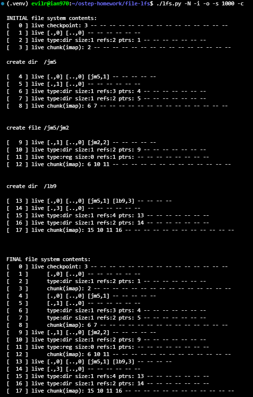

   1. **What Happens if the Checkpoint Region (CR) is Never Updated?**

      * The on-disk CR at block 0 remains perpetually fixed at its initial state (`checkpoint: 3 -- ...`), pointing exclusively to the initial imap chunk at block 3.
      * If the system crashes or is unmounted and then reloaded purely from disk metadata, the file system would lose all updates that were appended to the log, reverting entirely to an empty root directory.

   2. **What Happens if it is Updated Periodically?**

      * Updating the CR periodically (e.g., every 30 seconds or during a sync) amortizes disk seek costs by avoiding head movements between the active log tail and the fixed CR location at block 0.
      * In this scenario, any crash will lose only the un-checkpointed updates since the last periodic flush, rather than the entire history of the file system.

   3. **Recovering to the Latest State via Rolling Forward in the Log**:

      * Upon reboot after a crash, LFS reads the latest valid Checkpoint Region from disk to establish the base state and identify the last consistent log position.
      * It then initiates a **roll-forward** pass by sequentially scanning the log from that last checkpoint boundary toward the end of disk.
      * By inspecting each block (using segment summary information), LFS identifies newly written data blocks and inodes that were appended after the checkpoint.
      * It incorporates these newer inodes into the in-memory inode map and advances the file system state to the point of the crash, providing durability without having had to write the Checkpoint Region on every single operation.
