# Homework (Simulation)

This section introduces raid.py, a simple RAID simulator you can
use to shore up your knowledge of how RAID systems work. See the
README for details.

## Questions

1. Use the simulator to perform some basic RAID mapping tests. Run with different levels (0, 1, 4, 5) and see if you can figure out the mappings of a set of requests. For RAID-5, see if you can figure out the difference between left-symmetric and left-asymmetric layouts. Use some different random seeds to generate different problems than above.

    RAID 0 (Striping)

    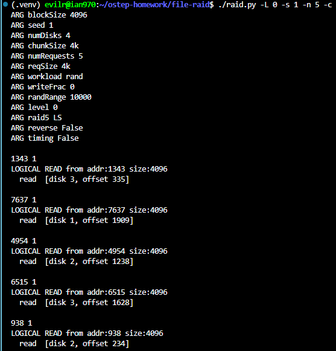

    ---

    * $\text{disk} = \text{bnum} \pmod N$（$N = 4$）
    * $\text{offset} = \lfloor \text{bnum} / N \rfloor$

    1. **addr: 1343**
       * $\text{disk} = 1343 \pmod 4 = 3$
       * $\text{offset} = \lfloor 1343 / 4 \rfloor = 335$
    2. **addr: 7637**
       * $\text{disk} = 7637 \pmod 4 = 1$
       * $\text{offset} = \lfloor 7637 / 4 \rfloor = 1909$
    3. **addr: 4954**
       * $\text{disk} = 4954 \pmod 4 = 2$
       * $\text{offset} = \lfloor 4954 / 4 \rfloor = 1238$
    4. **addr: 6515**
       * $\text{disk} = 6515 \pmod 4 = 3$
       * $\text{offset} = \lfloor 6515 / 4 \rfloor = 1628$
    5. **addr: 938**
    * $\text{disk} = 938 \pmod 4 = 2$
    * $\text{offset} = \lfloor 938 / 4 \rfloor = 234$

    ---

    RAID 1 (Mirroring)

    

    2 Mirror：Pair 0 (Disk 0, 1) and Pair 1 (Disk 2, 3)。

    * $\text{chunk\_group} = \text{bnum} \pmod E$
    * $\text{disk1} = 2 \times \text{chunk\_group}$, $\text{disk2} = \text{disk1} + 1$
    * $\text{offset} = \lfloor \text{bnum} / E \rfloor$

    * **read loadbalance ruld**：when $\text{offset} \pmod 2 == 0$ read `disk1` or `disk2`。

    1. **addr: 1343**
       * $\text{chunk\_group} = 1343 \pmod 2 = 1 \implies \text{disks} = (2, 3)$
       * $\text{offset} = \lfloor 1343 / 2 \rfloor = 671$
       * $671 \pmod 2 = 1 \implies$ read **Disk 3, offset 671**
    2. **addr: 7637**
       * $\text{chunk\_group} = 7637 \pmod 2 = 1 \implies \text{disks} = (2, 3)$
       * $\text{offset} = \lfloor 7637 / 2 \rfloor = 3818$
       * $3818 \pmod 2 = 0 \implies$ read **Disk 2, offset 3818**
    3. **addr: 4954**
       * $\text{chunk\_group} = 4954 \pmod 2 = 0 \implies \text{disks} = (0, 1)$
       * $\text{offset} = \lfloor 4954 / 2 \rfloor = 2477$
       * $2477 \pmod 2 = 1 \implies$ read **Disk 1, offset 2477**
    4. **addr: 6515**
       * $\text{chunk\_group} = 6515 \pmod 2 = 1 \implies \text{disks} = (2, 3)$
       * $\text{offset} = \lfloor 6515 / 2 \rfloor = 3257$
       * $3257 \pmod 2 = 1 \implies$ read **Disk 3, offset 3257**
    5. **addr: 938**
       * $\text{chunk\_group} = 938 \pmod 2 = 0 \implies \text{disks} = (0, 1)$
       * $\text{offset} = \lfloor 938 / 2 \rfloor = 469$
       * $469 \pmod 2 = 1 \implies$ read **Disk 1, offset 469**

    RAID 4 (Parity Disk)

    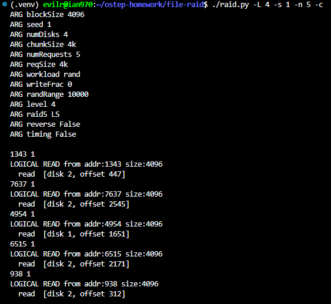

    ---

    * $\text{disk} = \text{bnum} \pmod 3$
    * $\text{offset} = \lfloor \text{bnum} / 3 \rfloor$
    1. **addr: 1343**
       * $\text{disk} = 1343 \pmod 3 = 2$
       * $\text{offset} = \lfloor 1343 / 3 \rfloor = 447$
    2. **addr: 7637**
       * $\text{disk} = 7637 \pmod 3 = 2$
       * $\text{offset} = \lfloor 7637 / 3 \rfloor = 2545$
    3. **addr: 4954**
       * $\text{disk} = 4954 \pmod 3 = 1$
       * $\text{offset} = \lfloor 4954 / 3 \rfloor = 1651$
    4. **addr: 6515**
       * $\text{disk} = 6515 \pmod 3 = 2$
       * $\text{offset} = \lfloor 6515 / 3 \rfloor = 2171$
    5. **addr: 938**
       * $\text{disk} = 938 \pmod 3 = 2$
       * $\text{offset} = \lfloor 938 / 3 \rfloor = 312$

    ---

    RAID 5 Left-Symmetric

    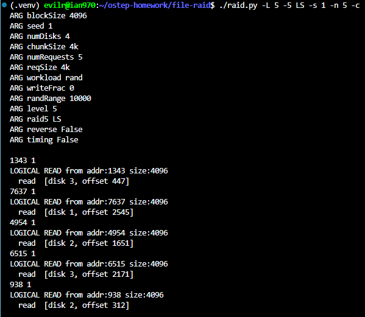

    ---

    RAID 5 Left-Asymmetric

    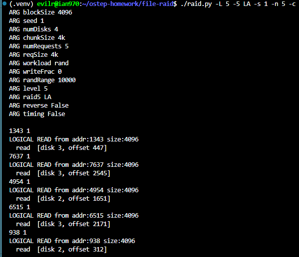

    * **addr: 1343**
    * $ddsk = \lfloor 1343 / 3 \rfloor = 447$
    * $disk_{base} = 1343 \pmod 3 = 2$
    * $col = 447 \pmod 4 = 3$
    * $pdisk = 3 - 3 = 0$
    * **LS**: $disk_{LS} = (2 - 3) \pmod 4 = 3$ $\rightarrow$ map to **[disk 3, offset 447]**
    * **LA**: $disk_{base} (2) \ge pdisk (0)$，故 $disk_{LA} = 2 + 1 = 3$ $\rightarrow$ map to **[disk 3, offset 447]**

    * **addr: 7637**
      * $ddsk = \lfloor 7637 / 3 \rfloor = 2545$
      * $disk_{base} = 7637 \pmod 3 = 2$
      * $col = 2545 \pmod 4 = 1$
      * $pdisk = 3 - 1 = 2$
      * **LS**: $disk_{LS} = (2 - 1) \pmod 4 = 1$ $\rightarrow$ map to **[disk 1, offset 2545]**
      * **LA**: $disk_{base} (2) \ge pdisk (2)$，故 $disk_{LA} = 2 + 1 = 3$ $\rightarrow$ map to **[disk 3, offset 2545]**

    * **addr: 4954**
      * $ddsk = \lfloor 4954 / 3 \rfloor = 1651$
      * $disk_{base} = 4954 \pmod 3 = 1$
      * $col = 1651 \pmod 4 = 3$
      * $pdisk = 3 - 3 = 0$
      * **LS**: $disk_{LS} = (1 - 3) \pmod 4 = 2$ $\rightarrow$ map to **[disk 2, offset 1651]**
      * **LA**: $disk_{base} (1) \ge pdisk (0)$，故 $disk_{LA} = 1 + 1 = 2$ $\rightarrow$ map to **[disk 2, offset 1651]**

    * **addr: 6515**
      * $ddsk = \lfloor 6515 / 3 \rfloor = 2171$
      * $disk_{base} = 6515 \pmod 3 = 2$
      * $col = 2171 \pmod 4 = 3$
      * $pdisk = 3 - 3 = 0$
      * **LS**: $disk_{LS} = (2 - 3) \pmod 4 = 3$ $\rightarrow$ map to **[disk 3, offset 2171]**
      * **LA**: $disk_{base} (2) \ge pdisk (0)$，故 $disk_{LA} = 2 + 1 = 3$ $\rightarrow$ map to **[disk 3, offset 2171]**

    * **addr: 938**
      * $ddsk = \lfloor 938 / 3 \rfloor = 312$
      * $disk_{base} = 938 \pmod 3 = 2$
      * $col = 312 \pmod 4 = 0$
      * $pdisk = 3 - 0 = 3$
      * **LS**: $disk_{LS} = (2 - 0) \pmod 4 = 2$ $\rightarrow$ map to **[disk 2, offset 312]**
      * **LA**: $disk_{base} (2) < pdisk (3)$，不變 $\rightarrow$ map to **[disk 2, offset 312]**

2. Do the same as the first problem, but this time vary the chunk size with -C. How does chunk size change the mappings?

    RAID 0, Chunk size = 8k

    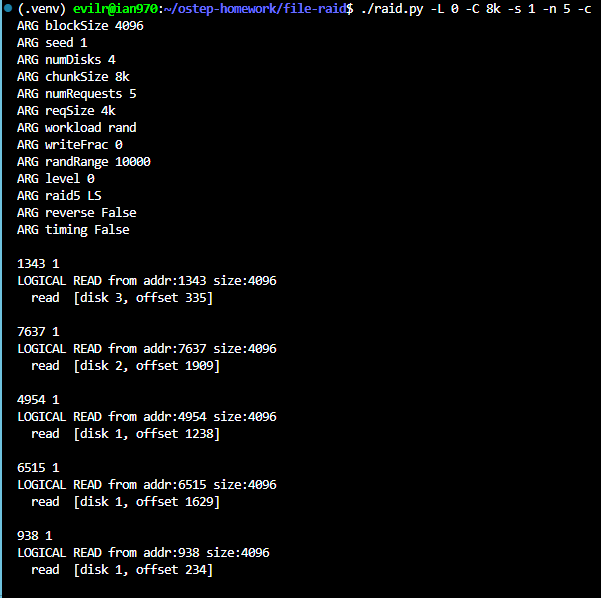

    RAID 4, Chunk size = 16k

    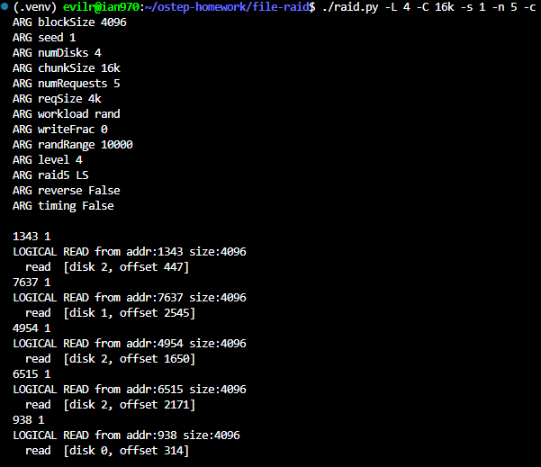

3. Do the same as above, but use the -r flag to reverse the nature of each problem.

    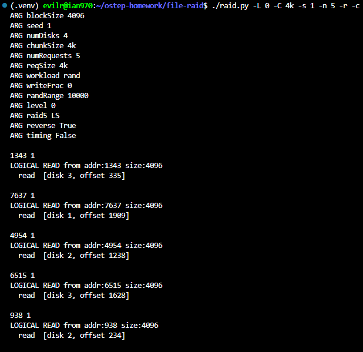

4. Now use the reverse flag but increase the size of each request with the -S flag. Try specifying sizes of 8k, 12k, and 16k, while varying the RAID level. What happens to the underlying I/O pattern when the size of the request increases? Make sure to try this with the sequential workload too (-W sequential); for what request sizes are RAID-4 and RAID-5 much more I/O efficient?

    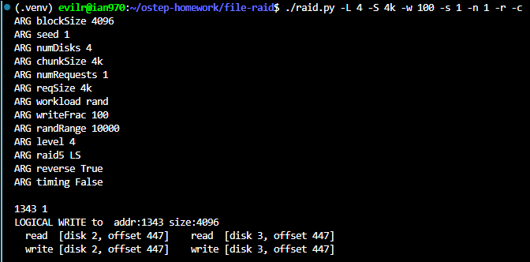

    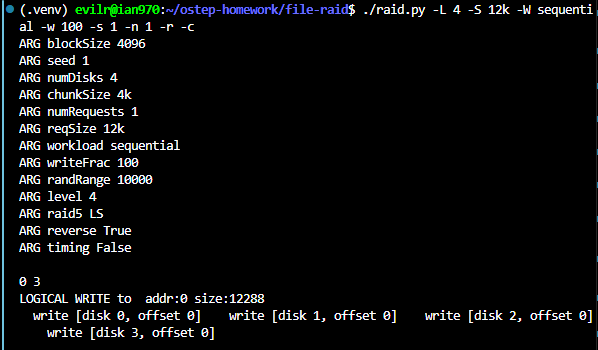

    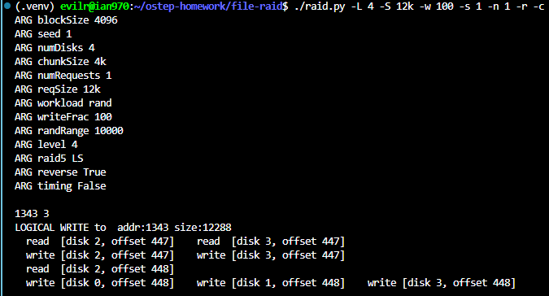

    **What happens to the underlying I/O pattern when the size of the request increases?**

    * As the request size (`-S`) increases, the underlying I/O pattern transitions from a high-overhead "read-modify-write" (subtractive parity) model to a highly efficient "full-stripe write" (additive parity) model.

    * For small requests like `4k` or `8k` (partial-stripe writes), RAID-4 and RAID-5 must first read the old data and old parity blocks before they can calculate and write the new parity. This results in a heavy I/O penalty due to the extra `read` operations.

    * When the request size reaches `12k` in a 4-disk array, it fills the entire stripe. Consequently, the `read` operations completely disappear because the RAID system can directly calculate the new parity from the new data and immediately issue `write` operations to all disks.

    **For what request sizes are RAID-4 and RAID-5 much more I/O efficient (especially with `-W sequential`)?**

    * RAID-4 and RAID-5 achieve maximum I/O efficiency when the request size is a multiple of the full stripe's data capacity.
    * The general formula for this optimal size is: **(N - 1) × Chunk Size** (where N is the total number of disks).

    * In this 4-disk setup with the default 4KB chunk size, the most efficient request size is **12k** (or multiples like 24k, 36k).

    * When combined with a sequential workload (`-W sequential`), issuing 12k writes ensures that the RAID system performs continuous, parallel writes across the array without ever suffering the penalty of reading old parity data.

    ---

5. Use the timing mode of the simulator (-t) to estimate the performance of 100 random reads to the RAID, while varying the RAID levels, using 4 disks.

    RAID 0 (Striping)

    ./raid.py -n 100 -W rand -L 0 -t -c

    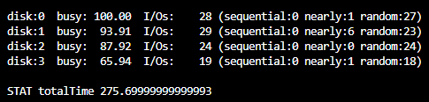

    ---

    RAID 1 (Mirroring)

    ./raid.py -n 100 -W rand -L 1 -t -c

    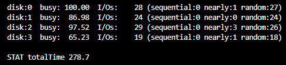

    ---

    RAID 4 (Dedicated Parity)

    ./raid.py -n 100 -W rand -L 4 -t -c

    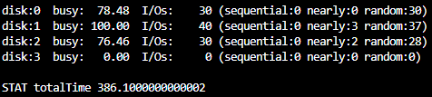

    RAID 5 (Distributed Parity)

    ---

    ./raid.py -n 100 -W rand -L 5 -t -c

    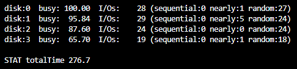

   ### Performance Baseline

    Based on the simulator's hardware model, a standard random read takes **$10.1$ ms** ($10$ ms seek + $0.1$ ms transfer). If all 100 random reads were routed to a single disk, the execution would take approximately **$1010$ ms**. By distributing the workload, RAID arrays achieve significant parallel speedups.

   ### Workload Distribution & Bottlenecks

    In a concurrent system, the overall completion time is strictly bound by the busiest disk (the bottleneck).

    * **RAID 0, 1, and 5 (~275 - 278 ms):** These levels successfully distribute the 100 read requests across all 4 available disks. Each disk processes roughly 25 I/Os. Looking at your output, the most heavily loaded disks handle 28 to 29 requests, keeping the total time comfortably under $300$ ms.
    * **RAID 4 (~386 ms):** The total time spikes significantly. Because Disk 3 acts as a dedicated parity disk, it does not participate in standard data reads and sits completely idle at 0 I/Os. The 100 requests are forced to distribute across only 3 data disks. Disk 1 becomes the bottleneck by absorbing 40 I/Os, which pushes the completion time much higher.

   ### Architectural Conclusion

    For random read workloads, **RAID 0, 1, and 5** provide superior I/O scaling because they utilize the full aggregate bandwidth of the hardware. **RAID 4** exhibits an inherent architectural inefficiency for read-heavy workloads: the dedicated parity disk contributes nothing to read performance, effectively wasting **$25\%$** of the system's potential read throughput and overburdening the remaining data disks.

    Shall we move on to Question 6 to see how this performance scales when we increase the total number of disks?

6. Do the same as above, but increase the number of disks. How does the performance of each RAID level scale as the number of disks increases?

    RAID 0 (8 Disks)

    ./raid.py -n 100 -W rand -L 0 -D 8 -t -c

        disk:0  busy:  67.86  I/Os:    12 (sequential:0 nearly:3 random:9)
        disk:1  busy:  63.58  I/Os:    12 (sequential:0 nearly:3 random:9)
        disk:2  busy:  75.46  I/Os:    13 (sequential:0 nearly:3 random:10)
        disk:3  busy:  33.35  I/Os:     6 (sequential:0 nearly:1 random:5)
        disk:4  busy:  95.65  I/Os:    16 (sequential:0 nearly:2 random:14)
        disk:5  busy: 100.00  I/Os:    17 (sequential:0 nearly:3 random:14)
        disk:6  busy:  70.03  I/Os:    11 (sequential:0 nearly:1 random:10)
        disk:7  busy:  77.44  I/Os:    13 (sequential:0 nearly:1 random:12)

        STAT totalTime 156.49999999999994

    ---

    RAID 1 (8 Disks)

    ./raid.py -n 100 -W rand -L 1 -D 8 -t -c

        disk:0  busy:  67.76  I/Os:    12 (sequential:0 nearly:1 random:11)
        disk:1  busy:  92.07  I/Os:    16 (sequential:0 nearly:1 random:15)
        disk:2  busy:  64.36  I/Os:    12 (sequential:0 nearly:2 random:10)
        disk:3  busy: 100.00  I/Os:    17 (sequential:0 nearly:1 random:16)
        disk:4  busy:  77.47  I/Os:    13 (sequential:0 nearly:1 random:12)
        disk:5  busy:  66.21  I/Os:    11 (sequential:0 nearly:0 random:11)
        disk:6  busy:  32.12  I/Os:     6 (sequential:0 nearly:1 random:5)
        disk:7  busy:  72.23  I/Os:    13 (sequential:0 nearly:1 random:12)

        STAT totalTime 167.79999999999995

    ---

    RAID 4 (8 Disks)

    ./raid.py -n 100 -W rand -L 4 -D 8 -t -c

        disk:0  busy:  94.00  I/Os:    17 (sequential:0 nearly:2 random:15)
        disk:1  busy:  66.61  I/Os:    12 (sequential:0 nearly:2 random:10)
        disk:2  busy: 100.00  I/Os:    18 (sequential:0 nearly:3 random:15)
        disk:3  busy:  72.36  I/Os:    13 (sequential:0 nearly:2 random:11)
        disk:4  busy:  76.73  I/Os:    13 (sequential:0 nearly:1 random:12)
        disk:5  busy:  78.30  I/Os:    13 (sequential:0 nearly:1 random:12)
        disk:6  busy:  83.70  I/Os:    14 (sequential:0 nearly:1 random:13)
        disk:7  busy:   0.00  I/Os:     0 (sequential:0 nearly:0 random:0)

        STAT totalTime 164.99999999999994

    ---

    RAID 5 (8 Disks)

    ./raid.py -n 100 -W rand -L 5 -D 8 -t -c

        disk:0  busy:  68.35  I/Os:    12 (sequential:0 nearly:3 random:9)
        disk:1  busy:  63.49  I/Os:    12 (sequential:0 nearly:3 random:9)
        disk:2  busy:  76.04  I/Os:    13 (sequential:0 nearly:3 random:10)
        disk:3  busy:  33.04  I/Os:     6 (sequential:0 nearly:1 random:5)
        disk:4  busy:  95.15  I/Os:    16 (sequential:0 nearly:2 random:14)
        disk:5  busy: 100.00  I/Os:    17 (sequential:0 nearly:3 random:14)
        disk:6  busy:  69.86  I/Os:    11 (sequential:0 nearly:1 random:10)
        disk:7  busy:  76.42  I/Os:    13 (sequential:0 nearly:1 random:12)

        STAT totalTime 158.59999999999997

   ### **General Scaling Behavior**

    * **Near-Linear Scalability:** As the number of disks doubles from 4 to 8, the total completion time for 100 random reads is approximately cut in half across all RAID levels. This demonstrates that random read performance scales linearly with the number of available data disks.
    * **Reduced Individual Load:** In the 4-disk setup, the bottleneck disks handled nearly 30 to 40 I/Os. In the 8-disk setup, the maximum load on the busiest disk drops to approximately 17 to 18 I/Os, explaining the significant drop in total execution time.

   ### **Performance by RAID Level**

    * **RAID 0, 1, and 5 (~156 - 168 ms):** These levels successfully utilize all 8 disks to service the random read requests. Because every drive participates in reading data, they achieve the highest aggregate throughput and the lowest overall completion times.
    * **RAID 4 (~165 ms):** While RAID 4 sees a massive performance improvement compared to its 4-disk counterpart (dropping from ~386 ms down to ~165 ms), it still suffers from an architectural limitation. The dedicated parity drive (`disk:7`) handles 0 I/Os during a read-only workload. Because the requests are distributed across 7 data disks instead of 8, RAID 4 will perpetually leave a portion of its potential read bandwidth unutilized.

    ---

7. Do the same as above, but use all writes (-w 100) instead of reads. How does the performance of each RAID level scale now? Can you do a rough estimate of the time it will take to complete the workload of 100 random writes?

    RAID 1

    ./raid.py -n 100 -W rand -w 100 -L 1 -D 4 -t -c

        disk:0  busy: 100.00  I/Os:    52 (sequential:0 nearly:3 random:49)
        disk:1  busy: 100.00  I/Os:    52 (sequential:0 nearly:3 random:49)
        disk:2  busy:  92.90  I/Os:    48 (sequential:0 nearly:2 random:46)
        disk:3  busy:  92.90  I/Os:    48 (sequential:0 nearly:2 random:46)

        STAT totalTime 509.80000000000047

    ---

    RAID 4

    ./raid.py -n 100 -W rand -w 100 -L 4 -D 4 -t -c

        disk:0  busy:  30.84  I/Os:    60 (sequential:0 nearly:30 random:30)
        disk:1  busy:  39.30  I/Os:    80 (sequential:0 nearly:43 random:37)
        disk:2  busy:  30.05  I/Os:    60 (sequential:0 nearly:32 random:28)
        disk:3  busy: 100.00  I/Os:   200 (sequential:0 nearly:107 random:93)

        STAT totalTime 982.5000000000013

    ---

    RAID 5

    ./raid.py -n 100 -W rand -w 100 -L 5 -D 4 -t -c

        disk:0  busy:  99.32  I/Os:   100 (sequential:0 nearly:53 random:47)
        disk:1  busy:  96.02  I/Os:   100 (sequential:0 nearly:55 random:45)
        disk:2  busy:  99.62  I/Os:   100 (sequential:0 nearly:52 random:48)
        disk:3  busy: 100.00  I/Os:   100 (sequential:0 nearly:53 random:47)

        STAT totalTime 497.40000000000043

    ---

    ./raid.py -n 100 -W rand -w 100 -L 4 -D 8 -t -c

        disk:0  busy:  16.54  I/Os:    34 (sequential:0 nearly:19 random:15)
        disk:1  busy:  11.72  I/Os:    24 (sequential:0 nearly:14 random:10)
        disk:2  busy:  17.59  I/Os:    36 (sequential:0 nearly:21 random:15)
        disk:3  busy:  12.73  I/Os:    26 (sequential:0 nearly:15 random:11)
        disk:4  busy:  13.50  I/Os:    26 (sequential:0 nearly:14 random:12)
        disk:5  busy:  13.78  I/Os:    26 (sequential:0 nearly:14 random:12)
        disk:6  busy:  14.73  I/Os:    28 (sequential:0 nearly:15 random:13)
        disk:7  busy: 100.00  I/Os:   200 (sequential:0 nearly:113 random:87)

        STAT totalTime 937.8000000000014

    ---

    ./raid.py -n 100 -W rand -w 100 -L 5 -D 8 -t -c

        disk:0  busy:  87.90  I/Os:    56 (sequential:0 nearly:33 random:23)
        disk:1  busy:  58.95  I/Os:    40 (sequential:0 nearly:26 random:14)
        disk:2  busy:  63.05  I/Os:    40 (sequential:0 nearly:23 random:17)
        disk:3  busy:  72.91  I/Os:    42 (sequential:0 nearly:21 random:21)
        disk:4  busy:  99.66  I/Os:    64 (sequential:0 nearly:37 random:27)
        disk:5  busy:  85.60  I/Os:    54 (sequential:0 nearly:33 random:21)
        disk:6  busy:  69.44  I/Os:    44 (sequential:0 nearly:26 random:18)
        disk:7  busy: 100.00  I/Os:    60 (sequential:1 nearly:31 random:28)

        STAT totalTime 290.9

   ### **Rough Estimates vs. Actual Performance (4-Disk Setup)**

    When estimating performance, we assume a pure random I/O takes roughly 10 ms. However, the simulator's disk scheduling naturally converts some random requests into "nearly sequential" ones (which take much less time), resulting in actual times being faster than the raw worst-case estimates.

    * **RAID 1 (Mirroring):** 100 logical writes result in 200 physical writes. Distributed across 4 disks, each disk handles about 50 I/Os. The time is relatively fast (~509 ms).

    * **RAID 5 (Distributed Parity):** Small writes require a "read-modify-write" sequence (subtractive parity), resulting in 4 physical I/Os per logical write (2 reads + 2 writes). 100 logical writes generate 400 total physical I/Os. Distributed evenly across 4 disks, every disk handles exactly 100 I/Os. The total time is ~497 ms.

    * **RAID 4 (Dedicated Parity):** Also requires 4 physical I/Os per write. However, every single parity update must go to the dedicated parity disk (Disk 3). As shown in your data, Disk 3 takes the brunt of 200 I/Os, becoming a massive bottleneck and pushing the total time up to ~982 ms.

   ### **Scaling Behavior (4 Disks vs. 8 Disks)**

    When we increase the number of disks from 4 to 8, the scaling behavior of random writes drastically differs by RAID level:

    * **RAID 5 Scales Well:** By distributing the parity blocks across all available drives, RAID 5 avoids a single point of congestion. When moving from 4 to 8 disks, the 400 total I/Os are spread across 8 drives instead of 4 (dropping from ~100 I/Os per disk to roughly ~50 I/Os per disk). The execution time scales beautifully, dropping from ~497 ms to ~290 ms.

    * **RAID 4 Fails to Scale (The Small Write Problem):** Doubling the data disks does absolutely nothing to help the parity bottleneck. Your 8-disk RAID 4 data clearly shows that Disk 7 (the new parity disk) is still forced to handle 200 I/Os. Because this single drive is completely saturated at 100% utilization, the overall performance barely improves (dropping only slightly from ~982 ms to ~937 ms). The extra data disks sit mostly idle.

8. Run the timing mode one last time, but this time with a sequential workload (-W sequential). How does the performance vary with RAID level, and when doing reads versus writes? How about when varying the size of each request? What size should you write to a RAID when using RAID-4 or RAID-5?

    RAID 0

    ./raid.py -n 100 -W seq -L 0 -t -c

        disk:0  busy: 100.00  I/Os:    25 (sequential:24 nearly:0 random:1)
        disk:1  busy: 100.00  I/Os:    25 (sequential:24 nearly:0 random:1)
        disk:2  busy: 100.00  I/Os:    25 (sequential:24 nearly:0 random:1)
        disk:3  busy: 100.00  I/Os:    25 (sequential:24 nearly:0 random:1)

        STAT totalTime 12.499999999999991

    ---

    RAID 1

    ./raid.py -n 100 -W seq -L 1 -t -c

        disk:0  busy: 100.00  I/Os:    25 (sequential:0 nearly:24 random:1)
        disk:1  busy: 100.00  I/Os:    25 (sequential:0 nearly:24 random:1)
        disk:2  busy: 100.00  I/Os:    25 (sequential:0 nearly:24 random:1)
        disk:3  busy: 100.00  I/Os:    25 (sequential:0 nearly:24 random:1)

        STAT totalTime 14.899999999999983

    ---

    RAID 5

    ./raid.py -n 100 -W seq -L 5 -t -c

        disk:0  busy: 100.00  I/Os:    25 (sequential:16 nearly:8 random:1)
        disk:1  busy: 100.00  I/Os:    25 (sequential:16 nearly:8 random:1)
        disk:2  busy: 100.00  I/Os:    25 (sequential:16 nearly:8 random:1)
        disk:3  busy: 100.00  I/Os:    25 (sequential:16 nearly:8 random:1)

        STAT totalTime 13.299999999999988

    ---

    RAID 5 (4k)

    ./raid.py -n 100 -W seq -w 100 -L 5 -S 4k -t -c

        disk:0  busy:  99.25  I/Os:    98 (sequential:32 nearly:65 random:1)
        disk:1  busy:  99.25  I/Os:    98 (sequential:32 nearly:65 random:1)
        disk:2  busy: 100.00  I/Os:   100 (sequential:33 nearly:66 random:1)
        disk:3  busy: 100.00  I/Os:   104 (sequential:33 nearly:70 random:1)

        STAT totalTime 13.399999999999988

    ---

    RAID 5 (12k)

    ./raid.py -n 100 -W seq -w 100 -L 5 -S 12k -t -c

        disk:0  busy: 100.00  I/Os:   100 (sequential:99 nearly:0 random:1)
        disk:1  busy: 100.00  I/Os:   100 (sequential:99 nearly:0 random:1)
        disk:2  busy: 100.00  I/Os:   100 (sequential:99 nearly:0 random:1)
        disk:3  busy: 100.00  I/Os:   100 (sequential:99 nearly:0 random:1)

        STAT totalTime 20.000000000000036

   ### **1. Performance: Reads vs. Writes in Sequential Workloads**

    * **Massive Performance Leap:** When switching from random to sequential workloads, the execution time drops drastically across all RAID levels (from hundreds of milliseconds down to roughly 12–20 ms).
    * **The Hardware Reality:** This happens because sequential operations almost entirely eliminate the expensive 10 ms seek time penalty. The disk heads only seek once at the beginning, and the rest of the time is spent on highly efficient 0.1 ms block transfers.

    * **Reads vs. Writes:** In a sequential workload, writes perform nearly as fast as reads. Because the disk head moves continuously in one direction, even the read-modify-write overhead (subtractive parity) in RAID 5 is heavily mitigated by the sequential spatial locality.

   ### **2. Varying Request Size: The 4k vs. 12k Phenomenon**

    * **RAID 5 at `-S 4k`:** The simulator shows a mix of `sequential: 32` and `nearly: 65` operations. Because the request size is smaller than the full stripe, the RAID controller is still forced to perform interleaving read and write operations to calculate parity, preventing a perfectly pure sequential stream.
    * **RAID 5 at `-S 12k`:** The output transforms beautifully to `sequential: 99` and `nearly: 0`. By issuing a request size that matches the data capacity of a full stripe, the RAID system enters **Additive Parity** mode. It skips reading old data entirely and streams pure, uninterrupted writes to the disks.

    * *Note on Total Time:* While 12k took slightly longer in absolute time (20.0 ms) than 4k (13.4 ms), remember that the 12k workload wrote **three times the amount of data** (100 requests of 12k vs. 100 requests of 4k). The overall *throughput* (bytes per millisecond) of the 12k configuration is vastly superior.

   ### **3. The Golden Rule for RAID-4 and RAID-5 Write Sizes**

    To maximize I/O efficiency and achieve perfect full-stripe writes, the optimal request size for a RAID-4 or RAID-5 array is exactly the data capacity of a single stripe.

    The formula is:
    $(N - 1) \times \text{Chunk Size}$
    *(where $N$ is the total number of disks in the array)*

    For a 4-disk array with a 4KB chunk size, the optimal write size is exactly **12KB** (or multiples thereof).
