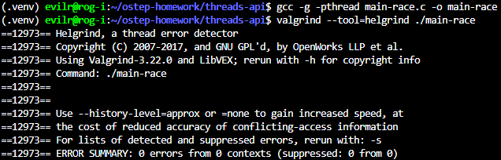
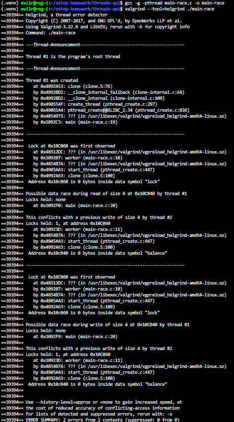
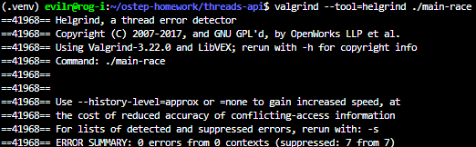
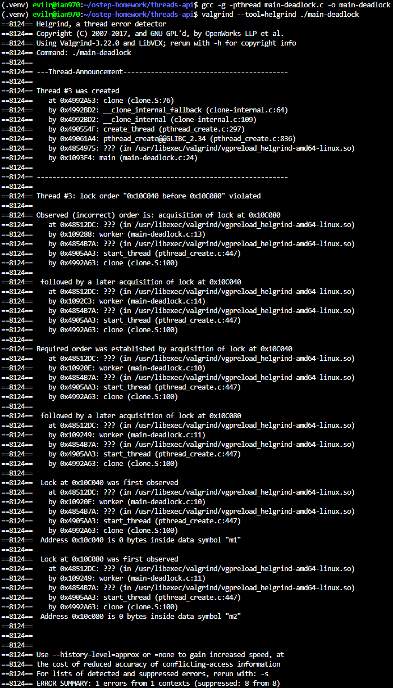
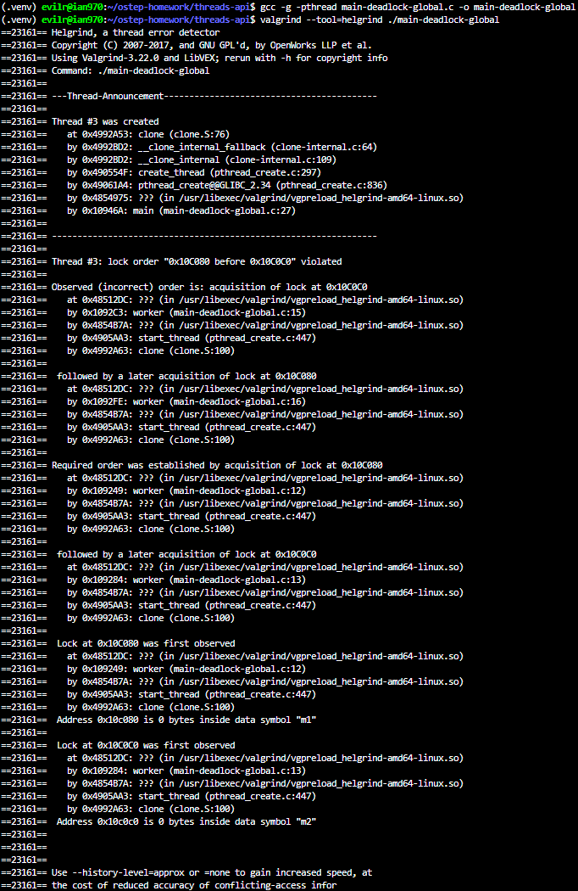
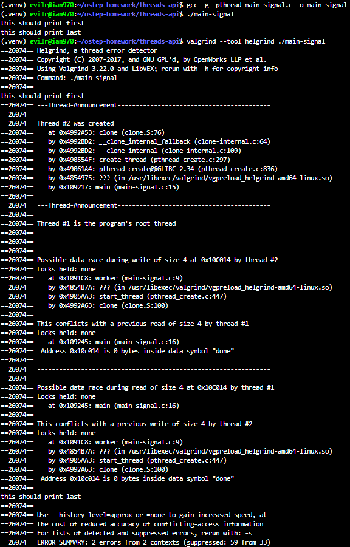
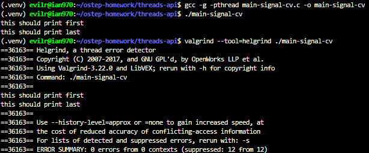

# Homework (Code)

In this section, we’ll write some simple multi-threaded programs and
use a specific tool, called helgrind, to find problems in these programs.
Read the README in the homework download for details on how to
build the programs and run helgrind.

## Questions

1. First build main-race.c. Examine the code so you can see the (hopefully obvious) data race in the code. Now run helgrind (by typing valgrind --tool=helgrind main-race) to see how it reports the race. Does it point to the right lines of code? What other information does it give to you?

    ``` c
        #include <stdio.h>

        #include "common_threads.h"

        int balance = 0;

        void* worker(void* arg) {
            balance++; // unprotected access 
            return NULL;
        }

        int main(int argc, char *argv[]) {
            pthread_t p;
            Pthread_create(&p, NULL, worker, NULL);
            balance++; // unprotected access
            Pthread_join(p, NULL);
            return 0;
        }
    ```

    > 
    > 
    >
    > Does it point to the right lines of code?

    ``` text
        Yes, it does. Because the program was compiled with the -g flag (which includes debugging symbols), helgrind accurately points to the exact file and line numbers where the data race occurs. It explicitly identifies main-race.c:15 (the balance++ inside the main function) and main-race.c:8 (the balance++ inside the worker function).
    ```
    >
    > What other information does it give to you?

    ``` text
        helgrind provides several crucial pieces of debugging information:
            - The involved threads: It shows that the conflict is occurring between thread #1 (the main program thread) and thread #2 (the created worker thread).
            - The type of conflicting operations: It details exactly what actions caused the race, such as a "read" in thread #1 conflicting with a "previous write" in thread #2.
            - Lock status: It repeatedly reports Locks held: none, confirming that the shared resource was accessed without any synchronization mechanism protecting it.
            - Data size and identity: It specifies the size of the accessed data (size 4, which corresponds to a 4-byte integer) and cleverly resolves the memory address to the exact variable name in the code (Address 0x10C014 is 0 bytes inside data symbol "balance").
    ```

2. What happens when you remove one of the offending lines of code? Now add a lock around one of the updates to the shared variable, and then around both. What does helgrind report in each of these cases?

    > Removing one of the offending lines:

    ``` c
    #include <stdio.h>

    #include "common_threads.h"

    int balance = 0;

    void *worker(void *arg)
    {
        balance++; // unprotected access
        return NULL;
    }

    int main(int argc, char *argv[])
    {
        pthread_t p;
        Pthread_create(&p, NULL, worker, NULL);
        // balance++; // unprotected access
        Pthread_join(p, NULL);
        return 0;
    }

    ```

    > 

    ```text
    When I remove the balance++; line from either the main function or the worker function, helgrind reports 0 errors. This is because the shared variable balance is now only accessed by a single thread throughout the program's execution, eliminating the possibility of a concurrent access and, therefore, the data race.
    ```

    > Adding a lock around only one of the updates:

    ```c
    #include <stdio.h>
    #include "common_threads.h"

    int balance = 0;

    pthread_mutex_t lock = PTHREAD_MUTEX_INITIALIZER;

    void *worker(void *arg)
    {
        Pthread_mutex_lock(&lock);
        balance++; // protected access
        Pthread_mutex_unlock(&lock);
        return NULL;
    }

    int main(int argc, char *argv[])
    {
        pthread_t p;
        Pthread_create(&p, NULL, worker, NULL);
        balance++; // unprotected access
        Pthread_join(p, NULL);
        return 0;
    }

    ```

    > 

    ```text
    If I add a mutex lock around the update in the worker thread but leave the update in the main thread unprotected (or vice versa), helgrind still reports a possible data race. This demonstrates that locks are cooperative; they only provide mutual exclusion if all threads accessing the shared resource adhere to the locking mechanism. The unprotected thread can still modify the variable while the other thread holds the lock.
    ```

    > Adding a lock around both updates:

    ```c
    #include <stdio.h>
    #include "common_threads.h"

    int balance = 0;

    pthread_mutex_t lock = PTHREAD_MUTEX_INITIALIZER;

    void *worker(void *arg)
    {
        Pthread_mutex_lock(&lock);
        balance++; // protected access
        Pthread_mutex_unlock(&lock);
        return NULL;
    }

    int main(int argc, char *argv[])
    {
        pthread_t p;
        Pthread_create(&p, NULL, worker, NULL);

        Pthread_mutex_lock(&lock);
        balance++; // protected access
        Pthread_mutex_unlock(&lock);

        Pthread_join(p, NULL);
        return 0;
    }

    ```

    > 

    ```text
    When I correctly implement the lock around the updates in both the main and worker threads, helgrind reports 0 errors. By doing this, mutual exclusion is properly enforced. The lock ensures that only one thread can enter the critical section and modify balance at any given time, completely resolving the data race problem.
    ```

3. Now let’s look at main-deadlock.c. Examine the code. This code has a problem known as deadlock (which we discuss in much more depth in a forthcoming chapter). Can you see what problem it might have?

    > Can you see what problem it might have?

    ```text
    Yes, the problem in main-deadlock.c is a classic deadlock caused by a circular wait condition due to an inconsistent lock acquisition order.

    Here is the step-by-step breakdown of why it happens:

        - Thread 1 (arg == 0) acquires lock m1 first, and then attempts to acquire lock m2.

        - Thread 2 (arg == 1) acquires lock m2 first, and then attempts to acquire lock m1.

    If the operating system's scheduler interrupts the threads at a specific time (a context switch), the following sequence can occur:

        1. Thread 1 runs and successfully acquires lock m1.

        2. A context switch occurs. Thread 2 runs and successfully acquires lock m2.

        3. Thread 1 resumes and tries to acquire lock m2. Since Thread 2 holds it, Thread 1 blocks (goes to sleep) and waits.

        4. Thread 2 resumes and tries to acquire lock m1. Since Thread 1 holds it, Thread 2 also blocks and waits.

    As a result, Thread 1 is holding m1 and waiting for m2, while Thread 2 is holding m2 and waiting for m1. Both threads are stuck waiting indefinitely for a resource held by the other, causing the program to freeze.
    ```

4. Now run helgrind on this code. What does helgrind report?

    > 
    > What does helgrind report?

    ```text
    Based on the output, helgrind reports a "lock order violated" error.

    Even if the program completes successfully without freezing during a specific run, helgrind analyzes the lock acquisition graph and detects inconsistent locking sequences between threads. Specifically, the report details that:

        1. A required lock order was established when one thread acquired m1 (address 0x10C040 at line 10) followed by m2 (address 0x10C080 at line 11).

        2. Another thread violated this established order by acquiring m2 first (at line 13) followed by m1 (at line 14).

    helgrind identifies this inconsistent ordering (m1 before m2 vs. m2 before m1) as a critical violation because it is the exact condition that creates a circular wait, warning the developer of a potential deadlock even if it didn't strictly occur in that execution instance.
    ```

5. Now run helgrind on main-deadlock-global.c. Examine the code; does it have the same problem that main-deadlock.c has? Should helgrind be reporting the same error? What does this tell you about tools like helgrind?

    > 
    > Does it have the same problem that main-deadlock.c has?

    ```text
    No, it does not. The addition of the global mutex g entirely prevents the deadlock. Because every thread must acquire the global lock g before attempting to acquire m1 or m2, it effectively serializes the lock acquisition process. It is impossible for one thread to hold m1 while another holds m2, completely eliminating the circular wait condition.
    ```

    > Should helgrind be reporting the same error?

    ```text
    Logically, it shouldn't, because the code is entirely deadlock-free. However, if you run it, helgrind still reports the same "lock order violated" error.
    ```

    > What does this tell you about tools like helgrind?

    ```text
    This demonstrates that dynamic analysis tools like helgrind can produce false positives. helgrind relies on strict heuristics—specifically, tracking the lock acquisition graph—to identify potential deadlocks. It detects that m1 is acquired before m2 in one thread, and m2 before m1 in another, which violates its lock order graph. However, the tool is not semantically smart enough to understand that the overarching global lock g safely protects this internal inversion. Tools are great for finding bugs, but the programmer must still use their own judgment to verify if a reported issue is genuinely a bug in the context of the program's overall logic.
    ```

6. Let’s next look at main-signal.c. This code uses a variable (done) to signal that the child is done and that the parent can now continue. Why is this code inefficient? (what does the parent end up spending its time doing, particularly if the child thread takes a long time to complete?)

    > Why is this code inefficient?

    ```text
    This code is highly inefficient because it utilizes a technique known as spin-waiting or busy-waiting.

    Instead of going to sleep and yielding the processor when it needs to wait, the parent thread enters a tight while (done == 0); loop. During this time, the parent thread actively consumes CPU cycles just to repeatedly check the value of the done variable. If the child thread takes a long time to complete its task, the parent thread will waste a significant amount of CPU processing power doing absolutely no productive work. In an ideal scenario, the waiting thread should be put to sleep by the operating system so that the CPU can be allocated to other threads that actually have work to do.
    ```

7. Now run helgrind on this program. What does it report? Is the code correct?

    > 
    > What does it report?

    ```text
    helgrind reports two possible data race errors on the shared variable done. It explicitly points out that the read operation in thread #1 (while (done == 0) at line 16) conflicts with the write operation in thread #2 (done = 1 at line 9), and vice versa. It correctly identifies that a shared memory location is being accessed concurrently by multiple threads without any locks held.
    ```

    > Is the code correct?

    ```text
    No, the code is technically incorrect, despite the fact that it might happen to print the statements in the desired order during a simple test run. Because the shared variable done is accessed and modified concurrently without synchronization primitives (like a mutex), it constitutes a data race. In a real-world scenario, modern compiler optimizations might cache the value of done in a register for the while loop. If this happens, the parent thread will never see the update made by the child thread, resulting in an infinite loop. Therefore, relying on unprotected shared variables for thread signaling is fundamentally unsafe.
    ```

8. Now look at a slightly modified version of the code, which is found in main-signal-cv.c. This version uses a condition variable to do the signaling (and associated lock). Why is this code preferred to the previous version? Is it correctness, or performance, or both?

    > Why is this code preferred to the previous version? Is it correctness, or performance, or both?

    ```text
    This code is heavily preferred because it improves upon the previous version in both correctness and performance.

        - Correctness: In the previous version, the shared variable done was accessed and modified concurrently without any synchronization, leading to a data race and potential compiler-optimization bugs (like infinite loops). In this version, every read and write to s->done is strictly protected by a mutex lock (s->lock), ensuring mutual exclusion and eliminating the data race.

        - Performance: The previous version used a highly inefficient spin-waiting loop (while(done == 0);) that wasted CPU cycles just checking a variable. This modified version uses condition variables (Pthread_cond_wait). If the parent thread finds that the child is not done yet, it goes to sleep and yields the CPU entirely. The operating system will only wake up the parent thread when the child explicitly signals it using Pthread_cond_signal. This entirely eliminates wasted CPU cycles, making it vastly more efficient.
    ```

9. Once again run helgrind on main-signal-cv. Does it report any errors?

    > 
    >
    > Does it report any errors?

    ```text
    No, it does not. Running helgrind on the main-signal-cv program results in a clean output with "0 errors from 0 contexts". This confirms that the implementation using a condition variable paired with a mutex perfectly synchronizes the parent and child threads. The shared state (s->done) is securely protected, and the signaling mechanism (Pthread_cond_wait and Pthread_cond_signal) functions correctly without introducing any data races, deadlocks, or unsafe compiler optimizations.
    ```
