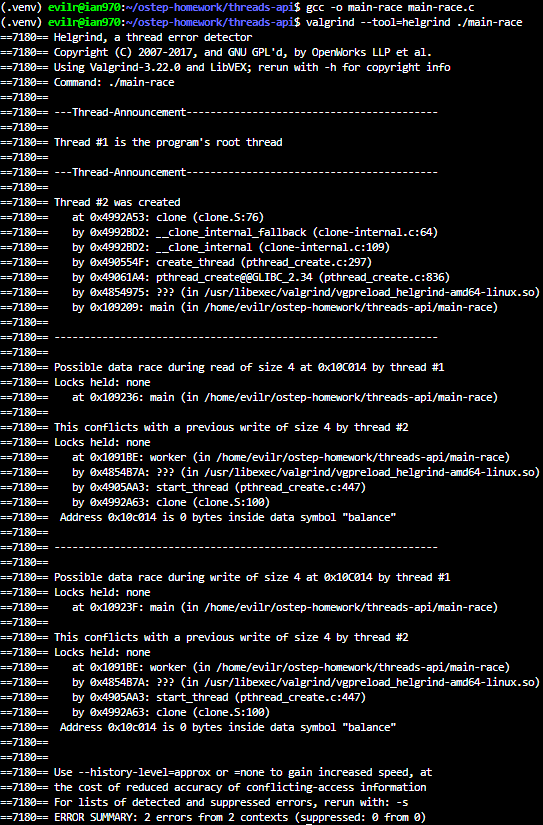
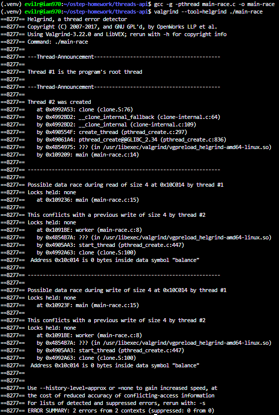

# Homework (Code)

In this section, we’ll write some simple multi-threaded programs and
use a specific tool, called helgrind, to find problems in these programs.
Read the README in the homework download for details on how to
build the programs and run helgrind.

## Questions

1. First build main-race.c. Examine the code so you can see the (hopefully obvious) data race in the code. Now run helgrind (by typing valgrind --tool=helgrind main-race) to see how it reports the race. Does it point to the right lines of code? What other information does it give to you?

    > 
    > 
    >
    > Does it point to the right lines of code?

        Yes, it does. Because the program was compiled with the -g flag (which includes debugging symbols), helgrind accurately points to the exact file and line numbers where the data race occurs. It explicitly identifies main-race.c:15 (the balance++ inside the main function) and main-race.c:8 (the balance++ inside the worker function).
    >
    > What other information does it give to you?

        helgrind provides several crucial pieces of debugging information:
            - The involved threads: It shows that the conflict is occurring between thread #1 (the main program thread) and thread #2 (the created worker thread).
            - The type of conflicting operations: It details exactly what actions caused the race, such as a "read" in thread #1 conflicting with a "previous write" in thread #2.
            - Lock status: It repeatedly reports Locks held: none, confirming that the shared resource was accessed without any synchronization mechanism protecting it.
            - Data size and identity: It specifies the size of the accessed data (size 4, which corresponds to a 4-byte integer) and cleverly resolves the memory address to the exact variable name in the code (Address 0x10C014 is 0 bytes inside data symbol "balance").

2. What happens when you remove one of the offending lines of code? Now add a lock around one of the updates to the shared variable, and then around both. What does helgrind report in each of these cases?
3. Now let’s look at main-deadlock.c. Examine the code. This code has a problem known as deadlock (which we discuss in much more depth in a forthcoming chapter). Can you see what problem it might have?
4. Now run helgrind on this code. What does helgrind report?
5. Now run helgrind on main-deadlock-global.c. Examine the code; does it have the same problem that main-deadlock.c has? Should helgrind be reporting the same error? What does this tell you about tools like helgrind?
6. Let’s next look at main-signal.c. This code uses a variable (done) to signal that the child is done and that the parent can now continue. Why is this code inefficient? (what does the parent end up spending its time doing, particularly if the child thread takes a long time to complete?)
7. Now run helgrind on this program. What does it report? Is the code correct?
8. Now look at a slightly modified version of the code, which is found in main-signal-cv.c. This version uses a condition variable to do the signaling (and associated lock). Why is this code preferred to the previous version? Is it correctness, or performance, or both?
9. Once again run helgrind on main-signal-cv. Does it report any errors?
