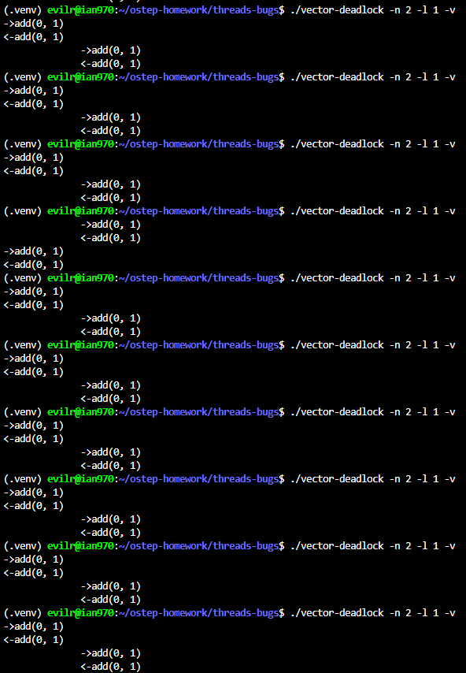
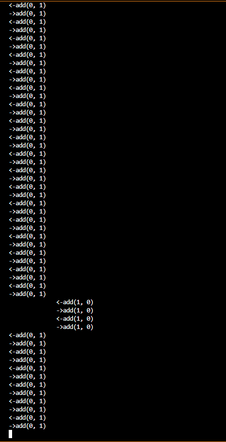
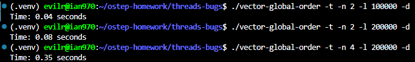
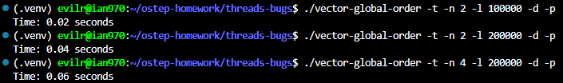

# Homework (Code)

This homework lets you explore some real code that deadlocks (or avoids deadlock). The different versions of code correspond to different approaches to avoiding deadlock in a simplified vector_add() routine. See the README for details on these programs and their common substrate.

## Questions

1. First let’s make sure you understand how the programs generally work, and some of the key options. Study the code in vector-deadlock.c, as well as in main-common.c and related files. Now, run ./vector-deadlock -n 2 -l 1 -v, which instantiates two threads (-n 2), each of which does one vector add (-l 1), and does so in verbose mode (-v). Make sure you understand the output. How does the output change from run to run?

    > 

    ```text
    How does the output change from run to run?
    When running ./vector-deadlock -n 2 -l 1 -v multiple times, the execution order of the threads changes.

    In most runs, Thread 0 executes and completes its entire vector addition before Thread 1 starts (printing ->add(0, 1) and <-add(0, 1) without indentation, followed by the indented prints of Thread 1). However, in some runs, Thread 1 gets scheduled first and completes its task before Thread 0 even begins.

    This output variation perfectly demonstrates the non-deterministic nature of the OS thread scheduler. Because the vector addition task is extremely short, context switches rarely happen mid-execution. Instead, the non-determinism is shown by which thread the OS chooses to run first. Since both threads acquire the locks in the exact same order (without the -d flag), no deadlock occurs, but the overall execution order remains unpredictable.
    ```

2. Now add the -d flag, and change the number of loops (-l) from 1 to higher numbers. What happens? Does the code (always) deadlock?

    

    **What happens?**
    When executing the program with the `-d` flag and a high number of loops, the program eventually hangs and fails to terminate. As observed in the terminal output, the execution simply stops abruptly without completing all iterations.

    **Does the code (always) deadlock?**
    Yes, under these specific parameters, the code is practically guaranteed to deadlock.

    **Explanation:**

    - **Flipped Argument Order:** Adding the `-d` flag sets the `cause_deadlock` variable to `1`. This triggers a condition in the thread creation loop where odd-numbered threads (like Thread 1) have their `vector_add_order` set to `1`. Consequently, Thread 0 calls `vector_add(0, 1)` while Thread 1 calls `vector_add(1, 0)`.

    - **Circular Wait:** Because `vector_add` acquires locks based on the order of the provided arguments, Thread 0 attempts to lock `v0` then `v1`, while Thread 1 attempts to lock `v1` then `v0`.

    - **Context Switch & Delay:** The `-d` flag also introduces an artificial delay right after the first lock is acquired. Combined with a high number of loops (`-l`), this maximizes the probability of a context switch happening at the exact moment Thread 0 holds the lock for `v0` and Thread 1 holds the lock for `v1`. Both threads then block indefinitely waiting for the other's lock, fulfilling the necessary conditions for a deadlock.

3. How does changing the number of threads (-n) change the outcome of the program? Are there any values of -n that ensure no deadlock occurs?

    Increasing the number of threads (`-n`) introduces the possibility of deadlocks when combined with the `-d` flag. The code in `main-common.c` flips the vector addition order specifically for threads with an odd ID (`i % 2 == 1`) when the deadlock flag is enabled. Therefore, if `-n` is 2 or greater, the program creates a mix of threads attempting to acquire locks in opposite directions, establishing the circular wait condition.

    To ensure no deadlock occurs regardless of the `-d` flag, you can set **`-n 1`**. With only a single thread executing, there is no concurrent contention for resources, making a circular wait impossible.

4. Now examine the code in vector-global-order.c. First, make sure you understand what the code is trying to do; do you understand why the code avoids deadlock? Also, why is there a special case in this vector_add() routine when the source and destination vectors are the same?

    ```c
        if (v_dst < v_src) {
        Pthread_mutex_lock(&v_dst->lock);
        Pthread_mutex_lock(&v_src->lock);
        } else if (v_dst > v_src) {
        Pthread_mutex_lock(&v_src->lock);
        Pthread_mutex_lock(&v_dst->lock);
        } else {
        // ...
    ```

    **How does `vector-global-order.c` avoid deadlock?**
    `vector-global-order.c` avoids deadlock by establishing a strict, global order for lock acquisition based on the memory addresses of the vector pointers `[cite: 3]`.

    Instead of acquiring locks based on the arbitrary order of the provided arguments (`v_dst` and `v_src`), the code compares their pointer values using `if (v_dst < v_src)`. By guaranteeing that the vector with the lower memory address is always locked first, it ensures that all threads will request the locks in the exact same sequence, regardless of how the arguments were passed to the function. This effectively eliminates the "Circular Wait" condition required for a deadlock to occur.

5. Now run the code with the following flags: -t -n 2 -l 100000 -d. How long does the code take to complete? How does the total time change when you increase the number of loops, or the number of threads?

    

    Based on the execution results:

    - Running with the baseline flags (`./vector-global-order -t -n 2 -l 100000 -d`) takes approximately **0.04 seconds**.
    - **Increasing the loops:** When doubling the number of loops to 200,000 (`-l 200000`), the execution time roughly doubles (to **0.08 seconds**). The time increases linearly because the amount of computational work per thread has linearly increased.
    - **Increasing the threads:** When increasing the number of threads to 4 (`-n 4 -l 200000`), the execution time spikes significantly (to **0.35 seconds**). The time increases non-linearly because adding more threads exponentially increases lock contention. All threads are fighting for the exact same locks (vector 0 and vector 1), causing significant overhead from blocking, context switching, and kernel scheduling.

6. What happens if you turn on the parallelism flag (-p)? How much would you expect performance to change when each thread is working on adding different vectors (which is what -p enables) versus working on the same ones?

    

    ```c
    // main.common.c
    if (enable_parallelism == 0) {
        args[i].vector_0 = 0;
        args[i].vector_1 = 1;
    } else {
        args[i].vector_0 = i * 2;
        args[i].vector_1 = i * 2 + 1;
    }
    ```

    Turning on the parallelism flag (`-p`) changes the argument assignment logic so that each thread operates on a completely independent pair of vectors (e.g., Thread 0 uses vectors 0 and 1, while Thread 1 uses vectors 2 and 3).

    I would expect a dramatic improvement in performance. Since the threads are no longer fighting for the same mutex locks, lock contention drops to absolute zero. The operating system does not need to block threads or perform excessive context switches. The performance should scale near-linearly with the number of available CPU cores, meaning multiple threads will finish the task in roughly the same amount of time it takes a single thread to run, rather than slowing each other down.

7. Now let’s study vector-try-wait.c. First make sure you understand the code. Is the first call to pthread_mutex_trylock() really needed? Now run the code. How fast does it run compared to the global order approach? How does the number of retries, as counted by the code, change as the number of threads increases?

    ```c
    top:
        if (pthread_mutex_trylock(&v_dst->lock) != 0) {
        goto top;
        }
        if (pthread_mutex_trylock(&v_src->lock) != 0) {
        retry++;
        Pthread_mutex_unlock(&v_dst->lock);
        goto top;
        }

    ```

    **How does `vector-try-wait.c` avoid deadlock?**
    `vector-try-wait.c` avoids deadlock by breaking the "Hold and Wait" condition. Instead of using a blocking lock, it uses `pthread_mutex_trylock()` `[cite: 6]`. If a thread successfully acquires the first lock (`v_dst`) but fails to acquire the second lock (`v_src`), it does not wait. Instead, it immediately releases the first lock and jumps back to the beginning to retry the entire process `[cite: 6]`. Because a thread never holds onto one lock while waiting for another, a deadlock cannot occur.

    **What is the potential issue with this approach?**
    The main problem with this approach is the risk of **Livelock** and poor CPU utilization. If two threads perfectly synchronize their attempts, they might repeatedly acquire their first lock, fail to get the second, release the first lock, and loop again simultaneously `[cite: 6]`. While the threads are not technically blocked (as in a deadlock), they are stuck in an endless cycle of yielding and retrying without making any actual progress, severely wasting CPU cycles in the process.

8. Now let’s look at vector-avoid-hold-and-wait.c. What is the main problem with this approach? How does its performance compare to the other versions, when running both with -p and without it?

    ```c
    // use this to make lock acquisition ATOMIC
    pthread_mutex_t global = PTHREAD_MUTEX_INITIALIZER; 

    void vector_add(vector_t *v_dst, vector_t *v_src) {
        // put GLOBAL lock around all lock acquisition...
        Pthread_mutex_lock(&global);
        Pthread_mutex_lock(&v_dst->lock);
        Pthread_mutex_lock(&v_src->lock);
        Pthread_mutex_unlock(&global);
        // ... 

    ```

    **How does `vector-avoid-hold-and-wait.c` avoid deadlock?**
    This approach avoids deadlock by using a single global mutex (`global`) to protect the entire lock acquisition phase. By wrapping the locking of `v_dst` and `v_src` inside this global lock, it ensures that acquiring multiple locks becomes an atomic operation. No two threads can be in the process of acquiring vector locks at the same time, which completely prevents the interleaving that leads to "Hold and Wait" and "Circular Wait" conditions.

    **What is the performance implication of this approach?**
    The major drawback is a severe reduction in concurrency and performance. Because every thread must acquire the same global lock before acquiring its specific vector locks, it creates a massive bottleneck. Even if multiple threads are trying to operate on entirely independent pairs of vectors (e.g., Thread 0 operates on Vectors A and B, while Thread 1 operates on Vectors C and D), they are still forced to wait in line for the global lock. This serialization defeats the primary purpose of multi-threading.

9. Finally, let’s look at vector-nolock.c. This version doesn’t use locks at all; does it provide the exact same semantics as the other versions? Why or why not?

    ```c
    // taken from <https://en.wikipedia.org/wiki/Fetch-and-add>
    int fetch_and_add(int *variable, int value) {
        asm volatile("lock; xaddl %%eax, %2;"
            :"=a" (value)
            :"a" (value), "m" (*variable)  
            :"memory");
        return value;
    }

    void vector_add(vector_t *v_dst, vector_t*v_src) {
        int i;
        for (i = 0; i < VECTOR_SIZE; i++) {
        fetch_and_add(&v_dst->values[i], v_src->values[i]);
        }
    }

    ```

    **How does `vector-nolock.c` avoid deadlock?**
    `vector-nolock.c` avoids deadlock completely by eliminating the use of software locks (mutexes). Since threads do not acquire or wait for any locks, the necessary conditions for a deadlock (such as "Hold and Wait" and "Circular Wait") simply cannot exist.

    Instead of locking the entire vector, it utilizes a hardware-level atomic instruction (specifically, an x86 assembly `lock xaddl` instruction via the `fetch_and_add` function) to perform the addition. This guarantees that the read-modify-write cycle for each individual integer addition is performed atomically by the CPU. This lock-free approach not only eliminates deadlocks but also avoids the performance overhead associated with thread blocking and context switching.

10. Now compare its performance to the other versions, both when threads are working on the same two vectors (no -p) and when each thread is working on separate vectors (-p). How does this no-lock version perform?

    Contrary to the initial intuition that a lock-free approach is always faster, the `vector-nolock.c` version actually performs **worse** than the mutex-based `vector-global-order` in both scenarios.

    - **With `-p` (Working on separate vectors):** The `vector-nolock` version (0.16s) is slower than the global-order version (0.06s). This happens because of the **granularity** of the operations. In the mutex version, a thread acquires the lock once, performs 100 normal memory additions (`VECTOR_SIZE`), and releases the lock. In the no-lock version, the thread must execute a heavy hardware atomic instruction (`lock xaddl`) 100 times per vector addition. The overhead of executing 100 atomic bus-locking instructions far outweighs the cost of acquiring an uncontended mutex once.

    - **Without `-p` (Working on the same vectors):** The performance of `vector-nolock` degrades severely (1.60s compared to global-order's 0.35s). Because 4 threads are continuously executing atomic writes to the exact same memory addresses in a tight loop, it causes a massive **cache invalidation storm (cache line bouncing)**. Each core constantly invalidates the cache lines of the other cores, forcing them to repeatedly fetch data from the slower L3 cache or main memory. The mutex version avoids this hardware-level bottleneck by allowing one thread to monopolize the cache for the entire duration of the vector addition while the others sleep.
