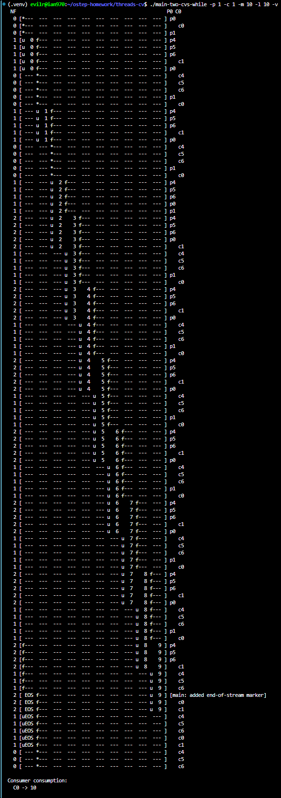
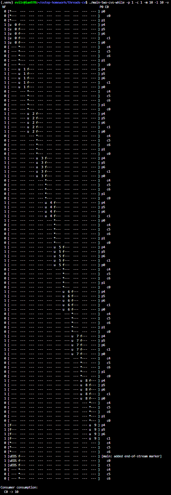
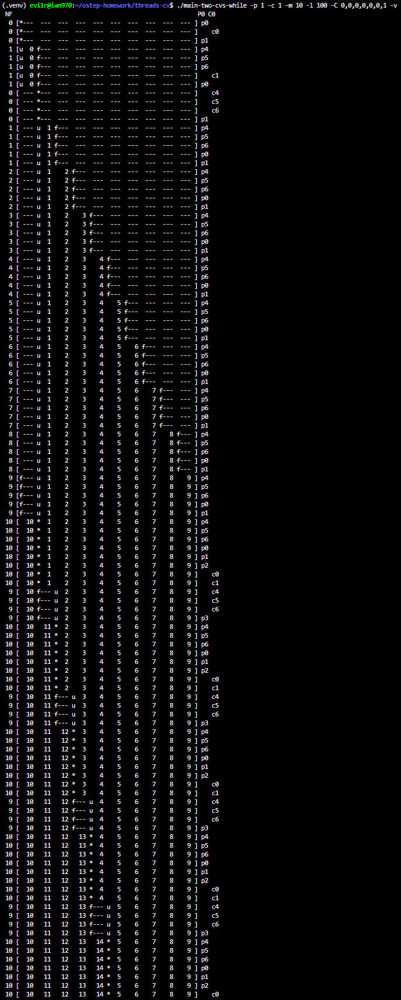
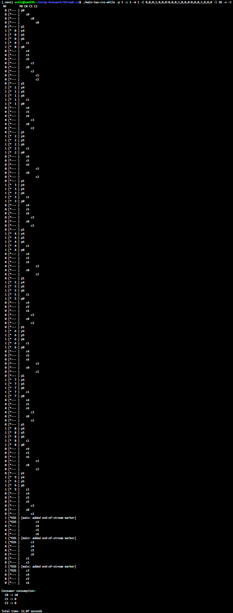
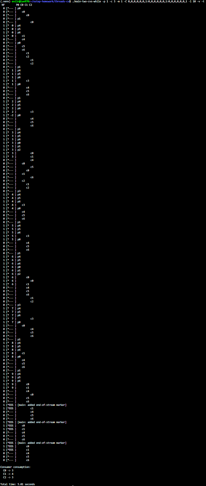

# Homework (Code)

This homework lets you explore some real code that uses locks and condition variables to implement various forms of the producer/consumer queue discussed in the chapter. You’ll look at the real code, run it in various configurations, and use it to learn about what works and what doesn’t, as well as other intricacies. Read the README for details.

## Questions

1. Our first question focuses on main-two-cvs-while.c (the working solution). First, study the code. Do you think you have an understanding of what should happen when you run the program?

    Yes, I have a clear understanding of the program's execution.

    The code (`main-two-cvs-while.c`) implements a correct and thread-safe Producer/Consumer queue. It works successfully because:

    a. **Mutex Protection:** It uses a mutex (`m`) to protect the shared buffer from concurrent modifications during `do_fill` and `do_get` operations.

    b. **Two Condition Variables:** It effectively utilizes two condition variables (`empty` and `fill`) to ensure that producers only signal consumers, and consumers only signal producers.

    c. **While Loops for Condition Checking:** Most importantly, it correctly uses `while` loops to check the buffer's state (`while (num_full == max)` and `while (num_full == 0)`). This ensures that threads re-verify the conditions after being awakened, preventing race conditions (following Mesa semantics).

    d. **Graceful Termination:** The main thread safely terminates the consumers by inserting an `END_OF_STREAM` (-1) marker into the buffer after all producers have finished executing.

2. Run with one producer and one consumer, and have the producer produce a few values. Start with a buffer (size 1), and then increase it. How does the behavior of the code change with larger buffers? (or does it?) What would you predict num_full to be with different buffer sizes (e.g., -m 10) and different numbers of produced items (e.g., -l 100), when you change the consumer sleep string from default (no sleep) to -C 0,0,0,0,0,0,1?

    
    
    
    a. **Behavior with larger buffers:**

    With a buffer size of 1 (-m 1), the producer and consumer must strictly alternate their execution. The producer blocks after producing a single item, and the consumer blocks after consuming it. As the buffer size increases (e.g., -m 10), this strict alternation relaxes. The producer can insert multiple items in a burst before locking, which reduces the frequency of thread context switching and improves concurrency.

    b. **Predicting num_full:**

    With -m 10, -l 100, and a consumer sleep string of -C 0,0,0,0,0,0,1, I predict that num_full will almost always be at or near its maximum value of 10. According to the code, the c6 sleep slot executes right after Mutex_unlock(&m). This sleep string forces the consumer to sleep for 1 second after every consumption. Because the producer has no artificial delay and runs at full speed, it will instantly fill the buffer to its maximum capacity and block. The buffer will remain nearly full for the vast majority of the program's execution.  

3. If possible, run the code on different systems (e.g., a Mac and Linux). Do you see different behavior across these systems?

    - Yes, the behavior can be different across systems.
The execution trace of a multithreaded program depends heavily on the underlying OS scheduler. Because different operating systems (like Linux vs. macOS) and different hardware setups (single-core vs. multi-core) handle thread scheduling and mutex lock acquisition differently, the order in which threads execute will vary. For example, on one system, threads might alternate perfectly without ever blocking, while on another system, a fast producer might acquire the lock multiple times in a row, forcing it to hit the while (num_full == max) condition and block.  

4. Let’s look at some timings. How long do you think the following execution, with one producer, three consumers, a single-entry shared buffer, and each consumer pausing at point c3 for a second, will take? ./main-two-cvs-while -p 1 -c 3 -m 1 -C 0,0,0,1,0,0,0:0,0,0,1,0,0,0:0,0,0,1,0,0,0 -l 10 -v -t

    

    I predict the execution will take about 11 to 13 seconds. The key to this timing lies in the location of c3. In main-two-cvs-while.c, c3 executes immediately after Cond_wait(&fill, &m) returns. When a thread wakes up and returns from Cond_wait, it has re-acquired the mutex lock. Therefore, sleeping for 1 second at c3 means the consumer is sleeping while holding the lock. This completely stalls the system, preventing the producer from generating new items and other consumers from acting.

    Because there are 3 consumers and only 1 producer, the buffer is frequently empty, forcing consumers into Cond_wait. Every time the producer generates one of the 10 items (-l 10), it wakes up a sleeping consumer, which then holds the lock and sleeps for 1 second. Additionally, the main thread inserts 3 END_OF_STREAM markers at the end, triggering a few more wake-ups and 1-second delays. Thus, 10 items plus the EOS markers will result in roughly 11 to 13 seconds of total execution time.  

5. Now change the size of the shared buffer to 3 (-m 3). Will this make any difference in the total time?

    No, changing the buffer size to 3 will not make a significant difference in the total execution time.

    Although the buffer has more space, the sleep delay at c3 occurs while the consumer is holding the mutex lock. When the producer generates a single item and signals a consumer, the awakened consumer re-acquires the lock before returning from Cond_wait and then sleeps for 1 second. Because the lock is held by the sleeping consumer, the producer is entirely blocked from entering its critical section to fill the remaining buffer slots. The execution remains strictly serialized by the mutex, so the total time will still be roughly 11 to 13 seconds.

6. Now change the location of the sleep to c6 (this models a consumer taking something off the queue and then doing something with it), again using a single-entry buffer. What time do you predict in this case? ./main-two-cvs-while -p 1 -c 3 -m 1 -C 0,0,0,0,0,0,1:0,0,0,0,0,0,1:0,0,0,0,0,0,1 -l 10 -v -t

    

   - I predict the total time will be around 4 to 5 seconds. The crucial difference here is the location of the sleep. In the code, c6 is located after Mutex_unlock(&m). This means the consumer sleeps without holding the lock, which successfully models a thread doing independent computation on the consumed data. Because the lock is free while a consumer is sleeping, the producer can immediately acquire it to insert the next item, and another consumer can acquire it to consume that item. The three consumers can effectively overlap their 1-second sleep times concurrently. With 10 generated items and 3 END_OF_STREAM markers (13 items in total) processed by 3 consumers in parallel, the execution will take roughly 4 to 5 seconds ($13 \div 3 \approx 4.33$).

7. Finally, change the buffer size to 3 again (-m 3). What time do you predict now?

    - I predict the time will still be around 4 to 5 seconds, almost identical to the previous case. Changing the buffer size to 3 (-m 3) does not change the overall execution time because the system's bottleneck is the consumer processing time. The producer runs without any artificial delay and can instantly fill the buffer. However, each consumer still takes exactly 1 second to process an item outside the critical section (c6). Even though the producer can now burst-produce 3 items at a time, the total time is strictly bound by the 3 consumers processing the 13 total items (10 values + 3 EOS markers) concurrently. Therefore, the math remains the same: 13 items processed by 3 parallel consumers takes approximately 4.33 seconds.

8. Now let’s look at main-one-cv-while.c. Can you configure a sleep string, assuming a single producer, one consumer, and a buffer of size 1, to cause a problem with this code?

    - No, it is not possible to cause a problem in this specific configuration. This is effectively a trick question. The file main-one-cv-while.c uses a single condition variable (cv) for both the empty and fill conditions. While this design is generally flawed, it works perfectly fine when there is exactly one producer and one consumer. In this 1-to-1 setup, when the producer calls Cond_signal(&cv), the only thread that could possibly be waiting is the consumer. Conversely, when the consumer calls Cond_signal(&cv), the only waiting thread can be the producer. Since a thread cannot accidentally wake up another thread of its own kind (because there aren't any), signals are never "lost" or sent to the wrong target, meaning no sleep string can force a deadlock.

9. Now change the number of consumers to two. Can you construct sleep strings for the producer and the consumers so as to cause a problem in the code?

    - Yes, we can construct a sleep string to cause a deadlock by delaying the producer. Command: ./main-one-cv-while -p 1 -c 2 -m 1 -P 1,0,0,0,0,0,0 -l 10 Because main-one-cv-while.c uses only a single condition variable (cv) for both empty and full conditions, a signal might wake up the wrong type of thread. By setting the producer to sleep at p0 for 1 second (-P 1,0,0,0,0,0,0), we guarantee that both consumers execute first, find the buffer empty, and enter Cond_wait(&cv). The wait queue for cv now contains [C0, C1]. When the producer finally runs, it fills the buffer, calls Cond_signal(&cv) (which wakes up C0), and then loops and puts itself to sleep because the buffer is full. The wait queue is now [C1, Producer]. When C0 consumes the item, it calls Cond_signal(&cv) hoping to wake up the producer. However, because C1 is next in the queue, C0 accidentally wakes up C1 instead! C0 then loops and goes to sleep. C1 wakes up, finds the buffer empty (since C0 took the item), and goes to sleep. Now, all three threads are permanently sleeping, resulting in a deadlock.
10. Now examine main-two-cvs-if.c. Can you cause a problem to happen in this code? Again consider the case where there is only one consumer, and then the case where there is more than one.

    a. **Case with One Consumer:**

    In the case of one producer and one consumer, we cannot easily cause a problem. When the producer fills the buffer and signals the sleeping consumer, there are no other consumers in the system. Even though the consumer uses if and does not re-check the condition after waking up from Cond_wait, the item is guaranteed to still be there because no other thread exists to consume it.  

    b. **Case with More Than One Consumer:**

    Yes, we can easily cause a crash when there are two consumers. Because main-two-cvs-if.c uses if (num_full == 0) instead of a while loop, it

    fails to adhere to Mesa semantics.
    We can force an issue by delaying the second consumer using a sleep string: ./main-two-cvs-if -p 1 -c 2 -m 1 -C 0,0,0,0,0,0,0:1,0,0,0,0,0,0 -l 10.

    In this scenario, C0 runs, finds the buffer empty, and sleeps. The producer fills the buffer, signals C0, and goes to sleep. C0 is awakened and tries to re-acquire the lock. However, C1 finishes its 1-second delay, enters the critical section first, and "steals" the newly produced item, leaving the buffer empty again. When C0 finally acquires the lock, it resumes immediately after Cond_wait. Because it used an if statement, it does not re-check the num_full condition and blindly calls do_get(). This causes the program to instantly crash with an assertion failure: "error: tried to get an empty buffer"

11. Finally, examine main-two-cvs-while-extra-unlock.c. What problem arises when you release the lock before doing a put or a get? Can you reliably cause such a problem to happen, given the sleep strings? What bad thing can happen?

    a. **The Problem:**

    Releasing the lock before calling do_fill() or do_get() completely removes the mutual exclusion protection from the critical section. These functions modify shared state variables (buffer, fill_ptr, use_ptr, and num_full). Without the lock, multiple threads can execute these functions concurrently, directly causing a Race Condition.  

    b. **Reliable Triggering via Sleep Strings:**

    No, we cannot reliably trigger this issue using only sleep strings.
    To force a collision, we would need to pause a thread exactly after Mutex_unlock(&m) but before (or inside) do_fill() or do_get(). However, the sleep macros (p4 and c4) are located after these functions have already completed. Because there are no macro insertion points inside the unprotected window, we cannot manually force a context switch there. We must rely entirely on the non-deterministic OS scheduler to randomly preempt a thread during that tiny fraction of a second.  

    c. **What Bad Things Happen:**

    When the OS scheduler eventually interleaves the threads in this unprotected section, serious data corruption occurs. For example, two producers might simultaneously write to the exact same fill_ptr index, overwriting data and advancing the pointer incorrectly. Concurrent modifications to num_full will corrupt the buffer's logical state. Ultimately, this leads to an assertion failure (e.g., "error: tried to fill a non-empty buffer" or "error: tried to get an empty buffer"), causing the program to instantly crash.
