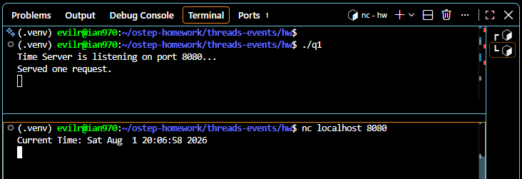
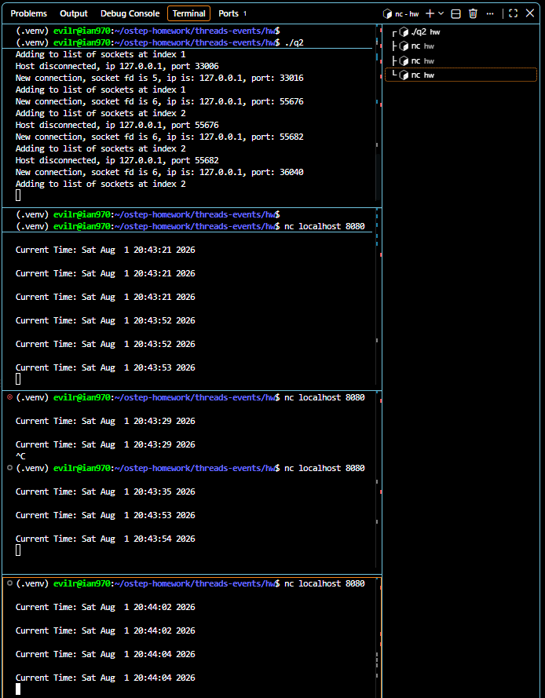
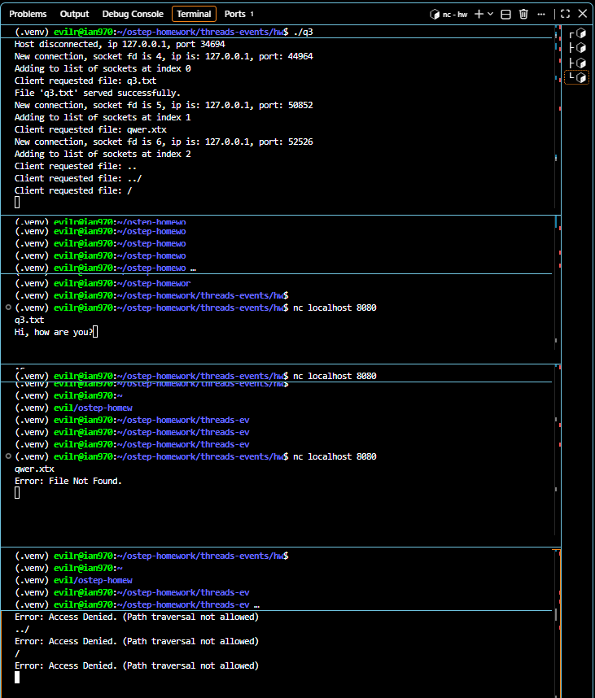
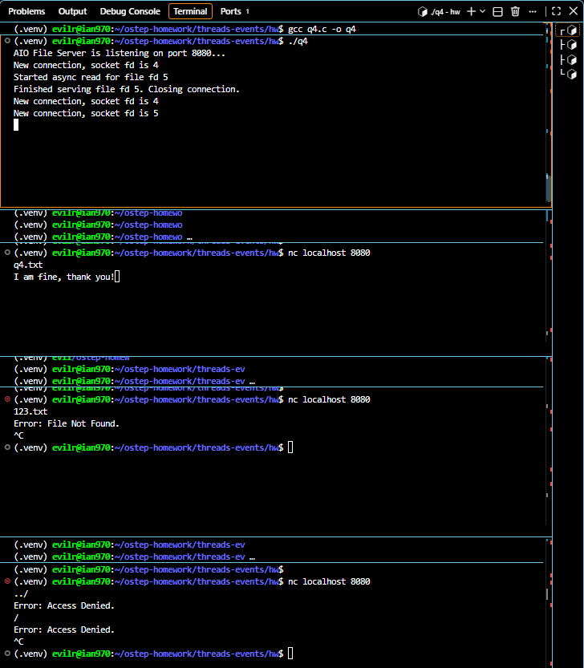
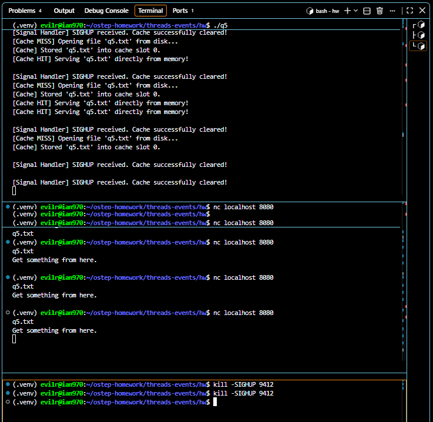

# Homework (Code)

In this (short) homework, you’ll gain some experience with eventbased code and some of its key concepts. Good luck!

## Questions

1. First, write a simple server that can accept and serve TCP connections. You’ll have to poke around the Internet a bit if you don’t already know how to do this. Build this to serve exactly one request at a time; have each request be very simple, e.g., to get the current time of day.

    

2. Now, add the select() interface. Build a main program that can accept multiple connections, and an event loop that checks which file descriptors have data on them, and then read and process those requests. Make sure to carefully test that you are using select() correctly.

    

3. Next, let’s make the requests a little more interesting, to mimic a simple web or file server. Each request should be to read the contents of a file (named in the request), and the server should respond by reading the file into a buffer, and then returning the contents to the client. Use the standard open(), read(), close() system calls to implement this feature. Be a little careful here: if you leave this running for a long time, someone may figure out how to use it to read all the files on your computer!

    

4. Now, instead of using standard I/O system calls, use the asynchronous I/O interfaces as described in the chapter. How hard was it to incorporate asynchronous interfaces into your program?

    

    - To answer the question 'How hard was it?': Incorporating asynchronous interfaces significantly increased the implementation complexity. A simple, sequential while(read(...) > 0) loop that previously took only a few lines had to be completely dismantled. It was transformed into a state machine spanning multiple event loop cycles. We had to introduce explicit states (such as IDLE and READING) and manually track execution context like the file_offset. This essentially forces the programmer to perform 'manual stack management,' causing the code complexity to skyrocket.

5. For fun, add some signal handling to your code. One common use of signals is to poke a server to reload some kind of configuration file, or take some other kind of administrative action. Perhaps one natural way to play around with this is to add a user-level file cache to your server, which stores recently accessed files. Implement a signal handler that clears the cache when the signal is sent to the server process.

    

6. Finally, we have the hard part: how can you tell if the effort to build an asynchronous, event-based approach are worth it? Can you create an experiment to show the benefits? How much implementation complexity did your approach add?

    > To demonstrate the benefits, I created a workload with one massive file (1GB) and one tiny file (10 bytes). I initiated a request for the massive file, and while it was transferring, I requested the tiny file from a second client.
    > In the synchronous (blocking `read`) server, the second client was completely blocked and experienced huge latency until the 1GB transfer finished. However, in the AIO event-based server, the tiny file was served instantly, proving that the event loop remains highly responsive and avoids Head-of-line blocking even during heavy I/O tasks.
    > **Implementation Complexity:**
    > The performance benefits come at an extreme cost to code readability and maintainability:
    > 1. **Manual Stack Management:** We can no longer rely on the thread's call stack to store local state (like `file_offset` or `fd`). We had to manually pack these into a custom `struct client_context` array.
    > 2. **State Machine Conversion:** Linear, easy-to-read code (`open` -> `while(read)` -> `send`) was fractured across multiple polling phases with explicit states (`STATE_IDLE`, `STATE_READING`).
    > 3. **Edge Cases:** Handling interrupted system calls (like `EINTR` from Signals) and AIO polling adds significant cognitive load and debugging difficulty compared to simple blocking error codes.
