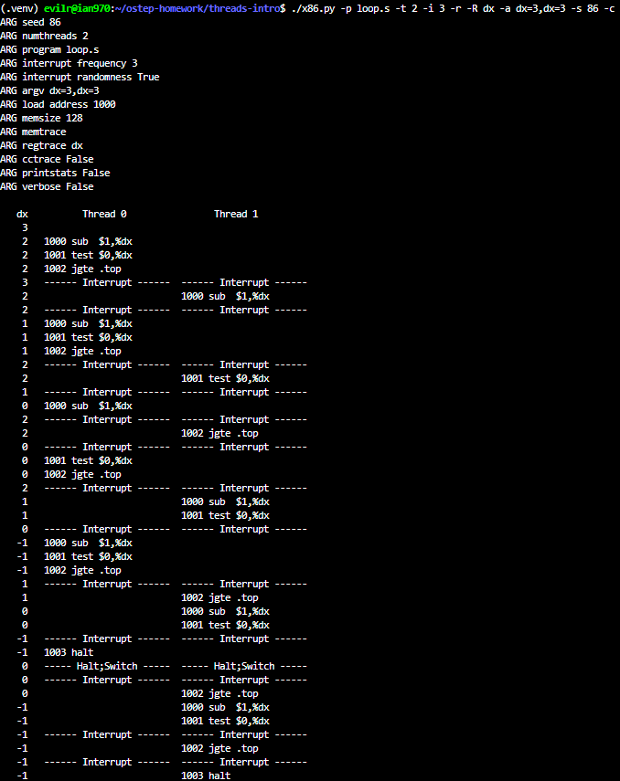
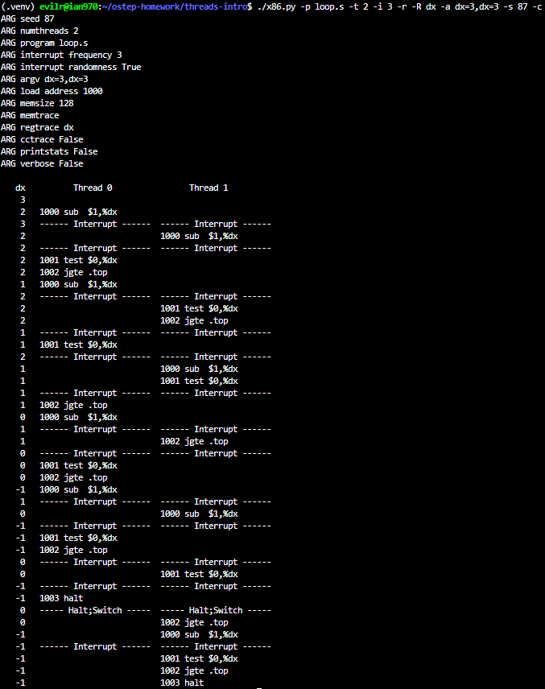
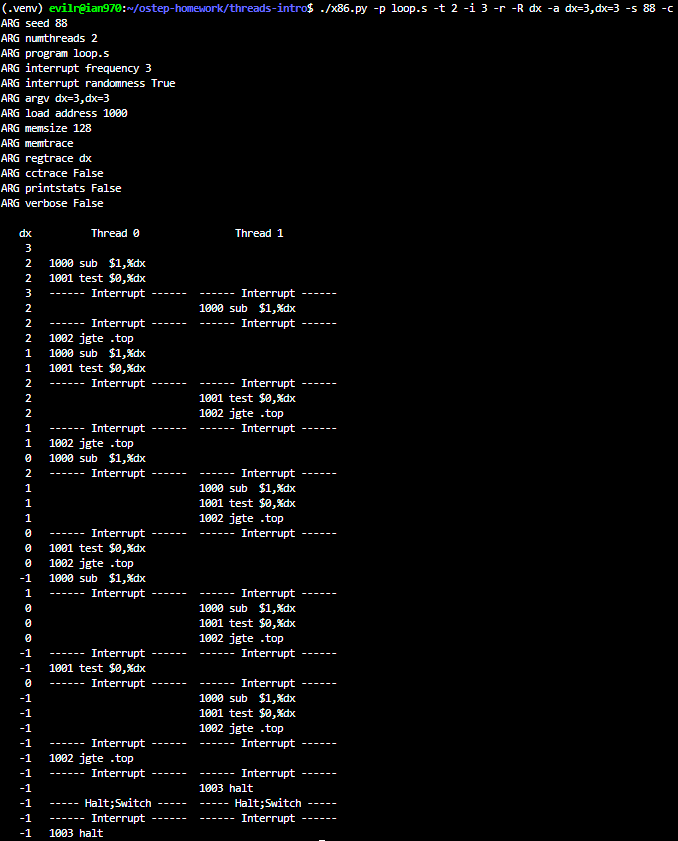
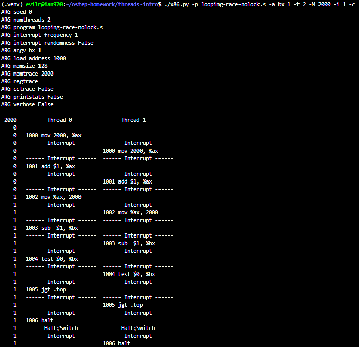
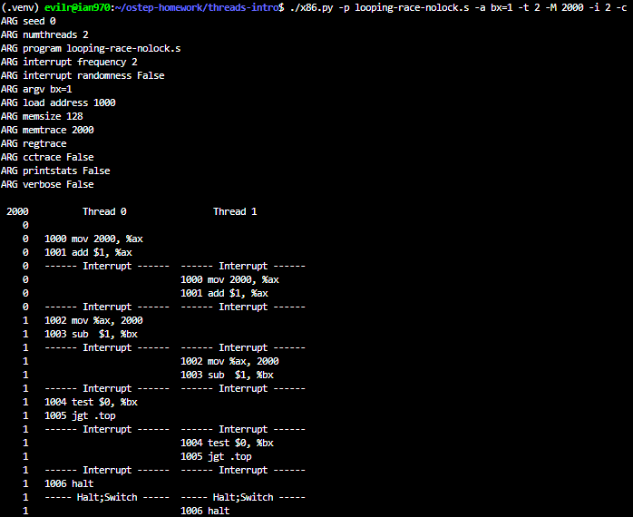
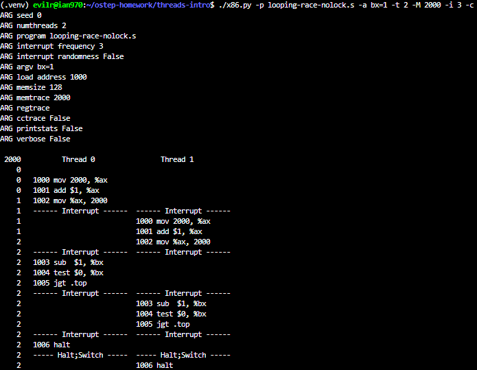
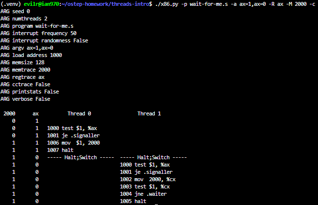
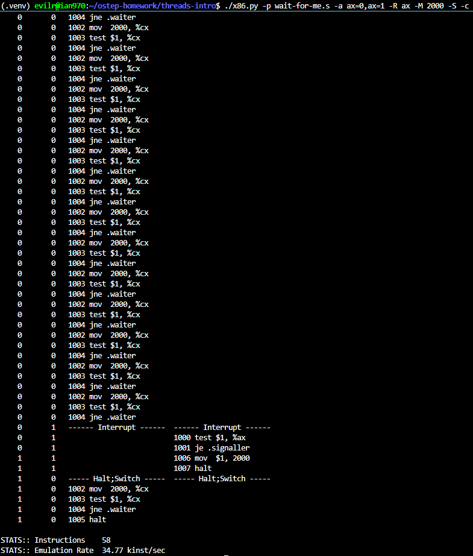
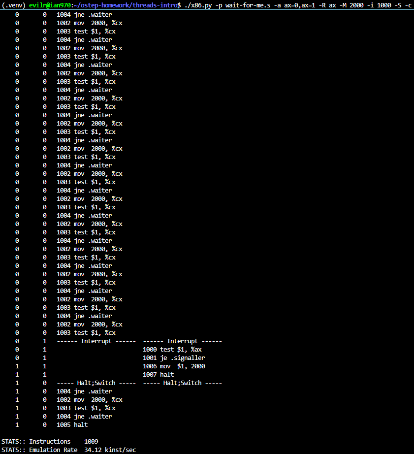
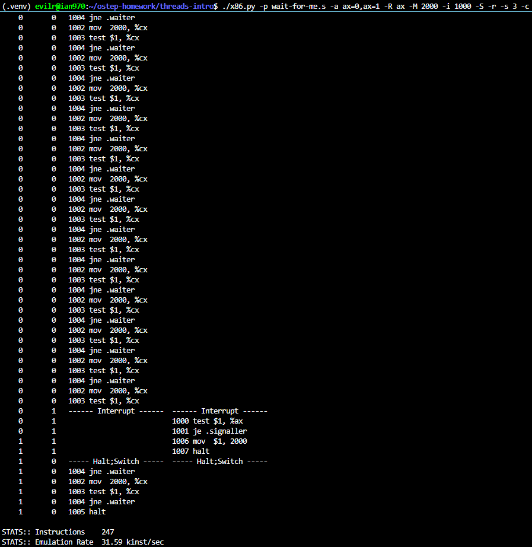

# Homework (Simulation)

This program, x86.py, allows you to see how different thread interleavings either cause or avoid race conditions. See the README for details on how the program works, then answer the questions below.

## Questions

1. Let’s examine a simple program, “loop.s”. First, just read and understand it. Then, run it with these arguments (./x86.py -t 1 -p loop.s -i 100 -R dx) This specifies a single thread, an interrupt every 100 instructions, and tracing of register %dx. What will %dx be during the run? Use the -c flag to check your answers; the answers, on the left, show the value of the register (or memory value) after the instruction on the right has run.

    > 

    ```text
    Since no initial value is provided, %dx defaults to 0. The first instruction (sub $1, %dx) decrements %dx to -1. The test and jgte instructions check if %dx is greater than or equal to 0. Since -1 is not, the loop condition fails, and the program halts immediately. Therefore, %dx will just be -1 during the run.
    ```

2. Same code, different flags: (./x86.py -p loop.s -t 2 -i 100 -a dx=3,dx=3 -R dx) This specifies two threads, and initializes each %dx to 3. What values will %dx see? Run with -c to check. Does the presence of multiple threads affect your calculations? Is there a race in this code?

    > 

    ```text
    > What values will %dx see?

        - For each thread, the %dx register will start at 3 and sequentially see the values 2, 1, 0, and finally -1 before the thread halts.

    > Does the presence of multiple threads affect your calculations?

        - No, the presence of multiple threads does not affect the calculations at all. Because the interrupt interval (-i 100) is much larger than the total instructions needed for each thread, Thread 0 will finish its execution completely before Thread 1 even starts.

    > Is there a race in this code?

        - No, there is no race condition here. A race condition occurs when multiple threads concurrently access and modify shared data. In this program, the threads are only modifying the %dx register. Since CPU registers are saved and restored during context switches, they act as private, per-thread state. Therefore, the threads are completely independent and do not interfere with each other.

    ```

3. Run this: ./x86.py -p loop.s -t 2 -i 3 -r -R dx -a dx=3,dx=3 This makes the interrupt interval small/random; use different seeds (-s) to see different interleavings. Does the interrupt frequency change anything?

    > 
    > 
    > 
    > 

    ```text
    > Does the interrupt frequency change anything?

        - It changes the interleaving (the order of execution), but it does not change the final outcome or the correctness of the program.

        - By setting a small and random interrupt interval (-i 3 -r), the CPU context-switches frequently between Thread 0 and Thread 1, making the execution trace look chaotic. However, because the %dx register is a private, per-thread state, the OS (simulator) saves and restores its value during every context switch.

        - Since there is no shared memory being accessed, these aggressive and random interrupts do not cause any data corruption or race conditions. Each thread will still independently and correctly count down its own %dx from 3 to -1.
    ```

4. Now, a different program, looping-race-nolock.s, which accesses a shared variable located at address 2000; we’ll call this variable value. Run it with a single thread to confirm your understanding: ./x86.py -p looping-race-nolock.s -t 1 -M 2000 What is value (i.e., at memory address 2000) throughout the run? Use -c to check.

    > 

    ```text
    > What is value (i.e., at memory address 2000) throughout the run?

        - The value at memory address 2000 starts at 0 and ends at 1.

        - Because we did not specify an initial value for the loop counter %bx (using the -a flag), %bx defaults to 0.
        During the first and only iteration:

           1. The thread loads the value at address 2000 (which is 0) into %ax.
           2. It increments %ax by 1 (so %ax becomes 1).
           3. It stores %ax back into address 2000, making the value at 2000 equal to 1.

        - Right after the critical section, the sub $1, %bx instruction changes %bx to -1. Since -1 is not greater than 0, the jgt (Jump if Greater Than) condition fails, and the program halts. Therefore, the critical section is executed exactly once, and the shared variable remains at 1.
    ```

5. Run with multiple iterations/threads: ./x86.py -p looping-race-nolock.s -t 2 -a bx=3 -M 2000 Why does each thread loop three times? What is final value of value?

    > 

    ```text
    > Why does each thread loop three times?

        - The -a bx=3 flag initializes the %bx register to 3, which acts as the loop counter. At the end of each iteration, the sub $1, %bx instruction decrements the counter, and jgt .top checks if it is strictly greater than 0. The values evaluated will be 2, 1, and 0. When %bx reaches 0, the jump condition fails and the loop halts. Therefore, each thread executes the loop exactly three times.

    > What is the final value of value?

        - The final value of the shared variable at memory address 2000 is 6.
        - Since we did not specify an interrupt interval (-i), the simulator uses the default interval (50 instructions). A thread requires fewer than 20 instructions to complete all three loops. Consequently, Thread 0 executes completely without being interrupted, incrementing the value from 0 to 3. Afterward, a context switch occurs, and Thread 1 runs completely, incrementing the value from 3 to 6. No harmful interleaving occurs in this specific run.
    ```

6. Run with random interrupt intervals: ./x86.py -p looping-race-nolock.s -t 2 -M 2000 -i 4 -r -s 0 with different seeds (-s 1, -s 2, etc.) Can you tell by looking at the thread interleaving what the final value of value will be? Does the timing of the interrupt matter? Where can it safely occur? Where not? In other words, where is the critical section exactly?

    > 
    > 
    > 

    ```text
    > Can you tell by looking at the thread interleaving what the final value will be?

        - Yes. By tracing the sequence of instructions (specifically when mov 2000, %ax and mov %ax, 2000 occur for each thread), we can determine if a thread is reading a "stale" (outdated) value from memory before the other thread has a chance to write its updated value back. If this happens, an update is lost, and the final value will be lower than expected.

    > Does the timing of the interrupt matter?

        - Yes, the timing of the interrupt matters completely. It determines whether a race condition actually corrupts the data or not.

    > Where can it safely occur? Where not?

        - Safe: It is safe for an interrupt to occur before the shared value is loaded into the register, or after the updated value has been safely written back to memory. (e.g., during the loop control instructions like sub, test, or jgt).

        - Not Safe: It is unsafe for an interrupt to occur between the loading of the shared variable and the storing of the updated variable.

    > Where is the critical section exactly?

        - The critical section consists of the three instructions that Read, Modify, and Write the shared variable:

        mov 2000, %ax       # Load shared variable
        add $1, %ax         # Modify the value
        mov %ax, 2000       # Store updated value back

        These three instructions must be executed atomically (as a single, indivisible unit) to prevent data corruption.
    ```

7. Now examine fixed interrupt intervals: ./x86.py -p looping-race-nolock.s -a bx=1 -t 2 -M 2000 -i 1 What will the final value of the shared variable value be? What about when you change -i 2, -i 3, etc.? For which interrupt intervals does the program give the “correct” answer?

    > 
    > 
    > 

    ```text
    > What will the final value of the shared variable value be (with -i 1)?

        - With -i 1, the final value will be 1 (which is incorrect, as it should be 2). Because the context switch happens after every single instruction, both threads read the initial value (0) before either has a chance to write the updated value (1) back to memory.

    > What about when you change -i 2, -i 3, etc.?

        - With -i 2, the final value is still 1. A thread is interrupted right after it modifies its register but before it stores the result back to memory. Thus, the update is still lost.

        - With -i 3, the final value is 2 (which is correct!). The critical section (load, add, store) takes exactly 3 instructions. With -i 3, Thread 0 is able to finish the entire critical section atomically before the context switch occurs. Therefore, Thread 1 reads the safely updated value.

    > For which interrupt intervals does the program give the “correct” answer?

        - For this specific case where each thread only loops once (-a bx=1), the program gives the correct answer for any interrupt interval -i >= 3. As long as the interval allows the thread to execute the 3 critical section instructions consecutively without interruption, no data will be overwritten.
    ```

8. Run the same for more loops (e.g., set -a bx=100). What interrupt intervals (-i) lead to a correct outcome? Which intervals are surprising?

    ```text
    > What interrupt intervals (-i) lead to a correct outcome?

        - There are two categories of intervals that lead to the correct outcome (a final value of 200):

        - Large Intervals: Any interval greater than or equal to the total number of instructions per thread (i.e., -i >= 601). This allows each thread to complete all 100 iterations without any context switch.

        - Multiples of 3: Any interval that is a multiple of 3 (e.g., -i 3, -i 6, -i 9, -i 12, etc.).

    > Which intervals are surprising?

        - The intervals that are multiples of 3 are surprising because they cause frequent context switches, yet still produce the correct result.

        - Why this happens: A single loop iteration consists of exactly 6 instructions. The first 3 instructions form the critical section (read, modify, write the shared variable), and the last 3 instructions handle loop control (using the private register %bx).
        
        - Because the critical section is exactly 3 instructions long, an interrupt interval that is a multiple of 3 will always trigger the context switch either exactly after the critical section is completed or exactly at the end of the loop. The interrupt perfectly aligns with the logical boundaries of the code, meaning it will never slice through the middle of the critical section. Thus, no race conditions occur!
    ```

9. One last program: wait-for-me.s. Run: ./x86.py -p wait-for-me.s -a ax=1,ax=0 -R ax -M 2000 This sets the %ax register to 1 for thread 0, and 0 for thread 1, and watches %ax and memory location 2000. How should the code behave? How is the value at location 2000 being used by the threads? What will its final value be?

    > 

    ```text
    > How should the code behave?
        
        - Thread 0 (initialized with %ax=1) acts as a "waiter" and will enter a spin-loop, continuously checking the value at memory location 2000. It will keep spinning until an interrupt occurs and the CPU switches to Thread 1. Thread 1 (initialized with %ax=0) acts as a "signaler". It sets the value at memory location 2000 to 1 and then halts. When Thread 0 eventually resumes, it sees the updated value (1), breaks out of its spin-loop, and halts.

    > How is the value at location 2000 being used by the threads?

        - It is used as a synchronization flag to indicate that a specific condition has been met (signaled).
    
    > What will its final value be?

        - The final value at memory location 2000 will be 1.
    ```

10. Now switch the inputs: ./x86.py -p wait-for-me.s -a ax=0,ax=1 -R ax -M 2000 How do the threads behave? What is thread 0 doing? How would changing the interrupt interval (e.g., -i 1000, or perhaps to use random intervals) change the trace outcome? Is the program efficiently using the CPU?

    > 
    > 
    > 

    ```text
    > How do the threads behave? What is thread 0 doing?

        - With the inputs swapped (-a ax=0,ax=1), Thread 0 acts as the waiter and Thread 1 acts as the signaler. Because the OS schedules Thread 0 to run first, it checks the shared memory at address 2000 (the condition flag) and sees that it is 0. Consequently, Thread 0 gets trapped in a spin-loop, repeatedly executing the same read-and-test instructions (busy-waiting) until a hardware interrupt forcefully triggers a context switch.

    > How would changing the interrupt interval change the trace outcome?

        - Changing the interrupt interval drastically impacts the trace and highlights the flaw in this execution order. For example, if the interval is set to -i 1000, Thread 0 is forced to execute 1,000 completely useless instructions (spinning in the loop) before the CPU is handed over to Thread 1. Thread 1 then takes only a few instructions to set the flag to 1 and halt. If we used random intervals (-r), the amount of wasted CPU cycles would be unpredictable, depending entirely on when the random interrupt occurs.
    > Is the program efficiently using the CPU?

        - No, it is highly inefficient. Thread 0 is consuming CPU cycles doing no useful work (spin-waiting) just to wait for an interrupt that allows Thread 1 to execute.
    ```
