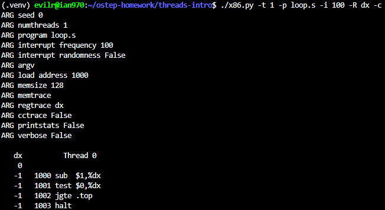
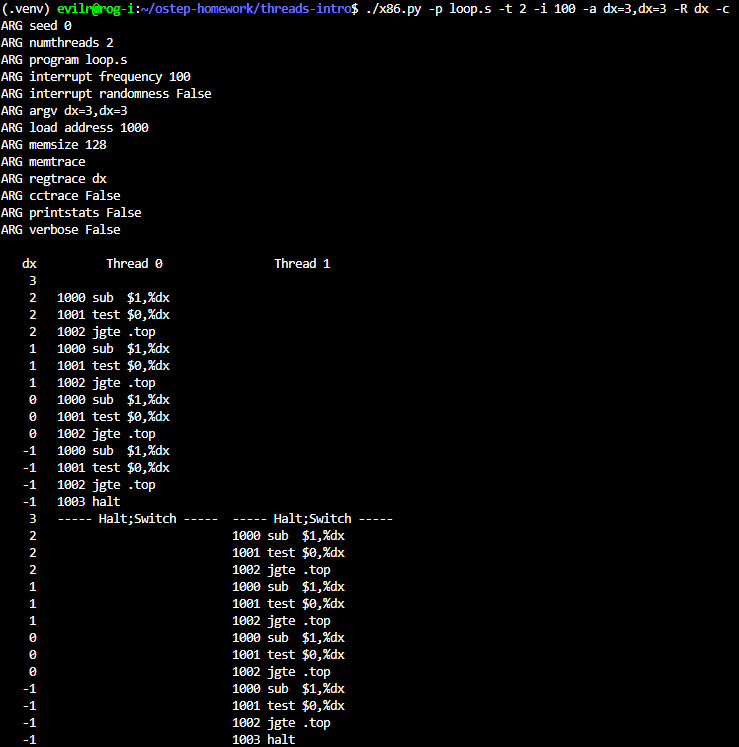
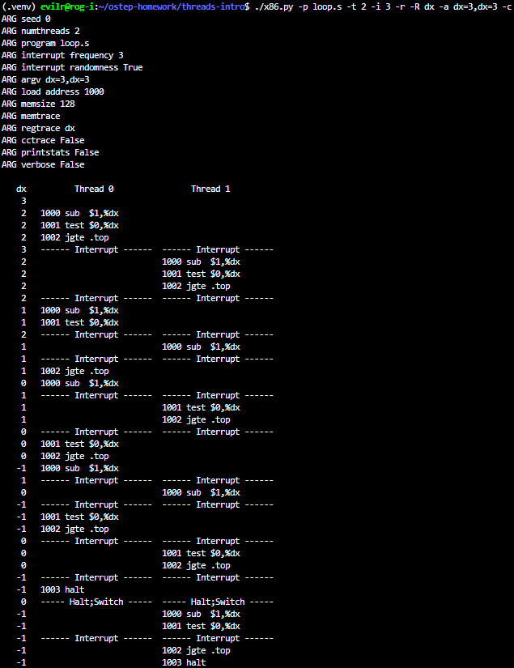
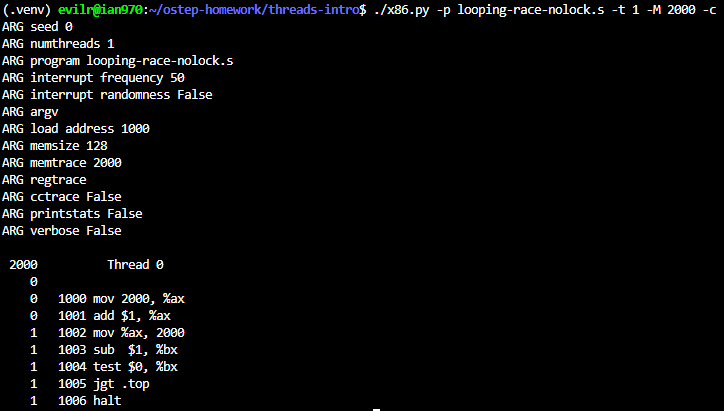
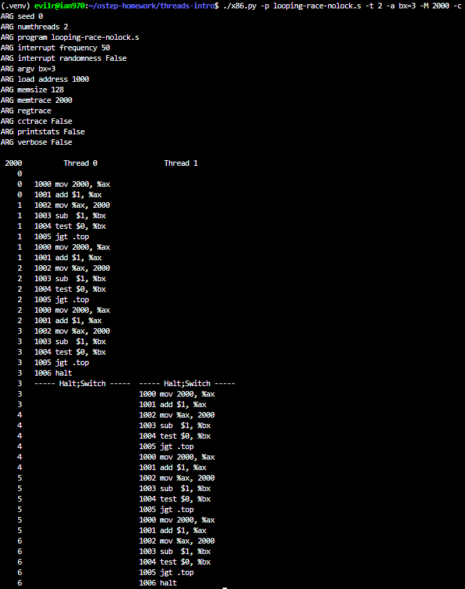
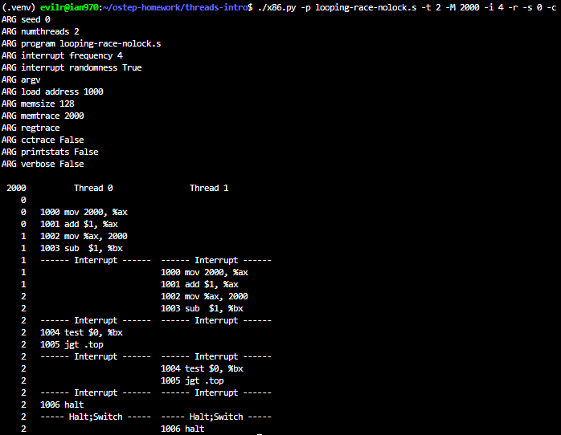
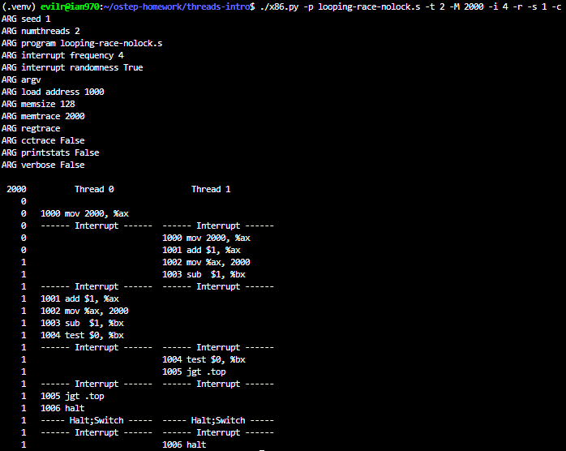
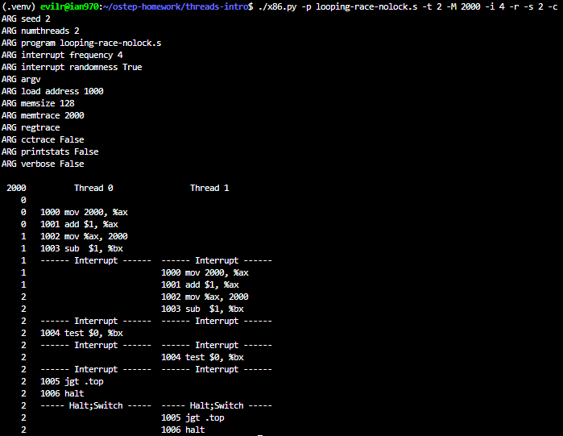

# Homework (Simulation)

This program, x86.py, allows you to see how different thread interleavings either cause or avoid race conditions. See the README for details on how the program works, then answer the questions below.

## Questions

1. Let’s examine a simple program, “loop.s”. First, just read and understand it. Then, run it with these arguments (./x86.py -t 1 -p loop.s -i 100 -R dx) This specifies a single thread, an interrupt every 100 instructions, and tracing of register %dx. What will %dx be during the run? Use the -c flag to check your answers; the answers, on the left, show the value of the register (or memory value) after the instruction on the right has run.

    > 
    > Since no initial value is provided, %dx defaults to 0. The first instruction (sub $1, %dx) decrements %dx to -1. The test and jgte instructions check if %dx is greater than or equal to 0. Since -1 is not, the loop condition fails, and the program halts immediately. Therefore, %dx will just be -1 during the run.

2. Same code, different flags: (./x86.py -p loop.s -t 2 -i 100 -a dx=3,dx=3 -R dx) This specifies two threads, and initializes each %dx to 3. What values will %dx see? Run with -c to check. Does the presence of multiple threads affect your calculations? Is there a race in this code?

    > 
    > What values will %dx see?

        For each thread, the %dx register will start at 3 and sequentially see the values 2, 1, 0, and finally -1 before the thread halts.
    >
    > Does the presence of multiple threads affect your calculations?

        No, the presence of multiple threads does not affect the calculations at all. Because the interrupt interval (-i 100) is much larger than the total instructions needed for each thread, Thread 0 will finish its execution completely before Thread 1 even starts.
    >
    > Is there a race in this code?

        No, there is no race condition here. A race condition occurs when multiple threads concurrently access and modify shared data. In this program, the threads are only modifying the %dx register. Since CPU registers are saved and restored during context switches, they act as private, per-thread state. Therefore, the threads are completely independent and do not interfere with each other.

3. Run this: ./x86.py -p loop.s -t 2 -i 3 -r -R dx -a dx=3,dx=3 This makes the interrupt interval small/random; use different seeds (-s) to see different interleavings. Does the interrupt frequency change anything?

    > 
    > Does the interrupt frequency change anything?

        It changes the interleaving (the order of execution), but it does not change the final outcome or the correctness of the program.

        By setting a small and random interrupt interval (-i 3 -r), the CPU context-switches frequently between Thread 0 and Thread 1, making the execution trace look chaotic. However, because the %dx register is a private, per-thread state, the OS (simulator) saves and restores its value during every context switch.

        Since there is no shared memory being accessed, these aggressive and random interrupts do not cause any data corruption or race conditions. Each thread will still independently and correctly count down its own %dx from 3 to -1.

4. Now, a different program, looping-race-nolock.s, which accesses a shared variable located at address 2000; we’ll call this variable value. Run it with a single thread to confirm your understanding: ./x86.py -p looping-race-nolock.s -t 1 -M 2000 What is value (i.e., at memory address 2000) throughout the run? Use -c to check.

    > 
    > What is value (i.e., at memory address 2000) throughout the run?

        The value at memory address 2000 starts at 0 and ends at 1.

        Because we did not specify an initial value for the loop counter %bx (using the -a flag), %bx defaults to 0.
        During the first and only iteration:

           1. The thread loads the value at address 2000 (which is 0) into %ax.
           2. It increments %ax by 1 (so %ax becomes 1).
           3. It stores %ax back into address 2000, making the value at 2000 equal to 1.

        Right after the critical section, the sub $1, %bx instruction changes %bx to -1. Since -1 is not greater than 0, the jgt (Jump if Greater Than) condition fails, and the program halts. Therefore, the critical section is executed exactly once, and the shared variable remains at 1.

5. Run with multiple iterations/threads: ./x86.py -p looping-race-nolock.s -t 2 -a bx=3 -M 2000 Why does each thread loop three times? What is final value of value?

    > 
    > Why does each thread loop three times?

        The -a bx=3 flag initializes the %bx register to 3, which acts as the loop counter. At the end of each iteration, the sub $1, %bx instruction decrements the counter, and jgt .top checks if it is strictly greater than 0. The values evaluated will be 2, 1, and 0. When %bx reaches 0, the jump condition fails and the loop halts. Therefore, each thread executes the loop exactly three times.
    >
    > What is the final value of value?

        The final value of the shared variable at memory address 2000 is 6.
        Since we did not specify an interrupt interval (-i), the simulator uses the default interval (50 instructions). A thread requires fewer than 20 instructions to complete all three loops. Consequently, Thread 0 executes completely without being interrupted, incrementing the value from 0 to 3. Afterward, a context switch occurs, and Thread 1 runs completely, incrementing the value from 3 to 6. No harmful interleaving occurs in this specific run.

6. Run with random interrupt intervals: ./x86.py -p looping-race-nolock.s -t 2 -M 2000 -i 4 -r -s 0 with different seeds (-s 1, -s 2, etc.) Can you tell by looking at the thread interleaving what the final value of value will be? Does the timing of the interrupt matter? Where can it safely occur? Where not? In other words, where is the critical section exactly?

    > 
    > 
    > 

7. Now examine fixed interrupt intervals: ./x86.py -p looping-race-nolock.s -a bx=1 -t 2 -M 2000 -i 1 What will the final value of the shared variable value be? What about when you change -i 2, -i 3, etc.? For which interrupt intervals does the program give the “correct” answer?

    >

8. Run the same for more loops (e.g., set -a bx=100). What interrupt intervals (-i) lead to a correct outcome? Which intervals are surprising?

    >

9. One last program: wait-for-me.s. Run: ./x86.py -p wait-for-me.s -a ax=1,ax=0 -R ax -M 2000 This sets the %ax register to 1 for thread 0, and 0 for thread 1, and watches %ax and memory location 2000. How should the code behave? How is the value at location 2000 being used by the threads? What will its final value be?

    >

10. Now switch the inputs: ./x86.py -p wait-for-me.s -a ax=0,ax=1 -R ax -M 2000 How do the threads behave? What is thread 0 doing? How would changing the interrupt interval (e.g., -i 1000, or perhaps to use random intervals) change the trace outcome? Is the program efficiently using the CPU?
