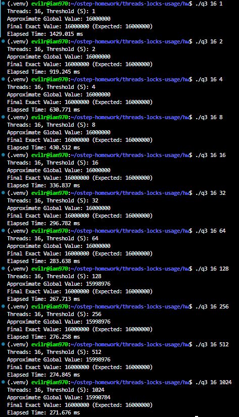
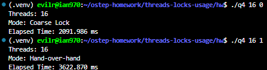
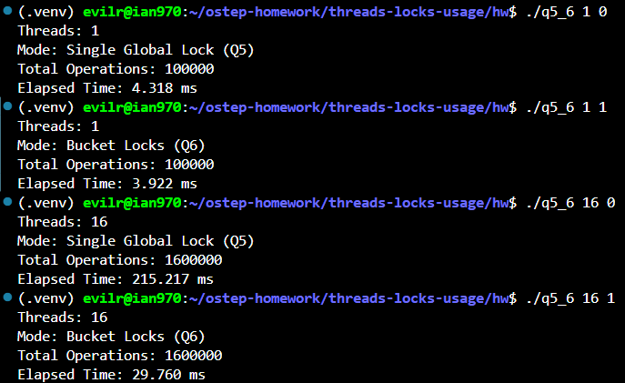

# Homework (Code)

In this homework, you’ll gain some experience with writing concurrent code and measuring its performance. Learning to build code that performs well is a critical skill and thus gaining a little experience here with it is quite worthwhile.

## Questions

1. We’ll start by redoing the measurements within this chapter. Use the call gettimeofday() to measure time within your program. How accurate is this timer? What is the smallest interval it can measure? Gain confidence in its workings, as we will need it in all subsequent questions. You can also look into other timers, such as the cycle counter available on x86 via the rdtsc instruction.

    > [q1-1.c](./q1-1.c)
    >
    > 
    >
    > [q1-2.c](./q1-2.c)
    >
    > 

    **1. Accuracy and Smallest Interval:**

    * **`gettimeofday()`**: Theoretically, it provides a resolution of **1 microsecond (mu s)** via `struct timeval`. However, due to its system call overhead and timer resolution, invoking it consecutively with zero workload yields an elapsed time of **0 mu s**. It requires a large workload amplification (e.g., 10^9 loop iterations taking **213,636 mu s**) to render reliable measurements.
    * **`rdtsc`**: The x86 `rdtsc` instruction reads the hardware Time-Stamp Counter, offering a **sub-nanosecond (single CPU cycle) resolution**. Empirically, it can capture extremely fine-grained intervals that `gettimeofday()` completely misses.

    **2. Experimental Evidence & Analysis:**

    Based on my implementation and execution, the empirical results are as follows:

    * **Consecutive `rdtsc` overhead**: **54 cycles**. This represents the absolute minimal cost of just executing the timer read instruction sequence itself. This non-zero result demonstrates that the hardware timer's smallest measurable interval is a single clock cycle, capable of timing even back-to-back instructions.
    * **Workload Execution**: For a loop workload of 10^8 iterations, `rdtsc` measured **78,533,477 cycles**.

    Assuming a typical modern CPU frequency (e.g., around 2.5 GHz to 3.5 GHz), 78.5 million cycles translates to roughly 22–31 milliseconds. This maps consistently with our previous macro-level observations using `gettimeofday()`, but provides much higher precision without any operating system software layer overhead.

    **3. Conclusion on Usage:**

    For the subsequent concurrency experiments in this chapter, `gettimeofday()` is sufficient as long as we scale our workloads (e.g., millions of counter increments) so that the execution times fall comfortably into the millisecond range. However, for benchmarking ultra-low-latency primitives or micro-operations, the `rdtsc` cycle counter is the vastly superior choice.

2. Now, build a simple concurrent counter and measure how long it takes to increment the counter many times as the number of threads increases. How many CPUs are available on the system you are
using? Does this number impact your measurements at all?

    > [q2.c](./q2.c)
    > 
    >
    > 

    **1. Implementation and Performance Observation:**

    I implemented a simple concurrent counter protected by a single pthread_mutex_t. Each thread executes a loop to increment the counter 1,000,000 times.

    The experimental results show a severe performance degradation as the number of threads increases:

    * 1 Thread: Completed 1,000,000 increments in ~10.87 ms.
    * 2 Threads: Completed 2,000,000 increments in ~80.67 ms.
    * 4 Threads: Completed 4,000,000 increments in ~180.74 ms.
    * 5 Threads: Completed 4,000,000 increments in ~229.81 ms.
    * 100 Threads: Completed 100,000,000 increments in ~4252.94 ms.

    Instead of scaling efficiently, the counter performs significantly worse concurrently. Going from 1 thread to 2 threads doubles the workload, but the execution time increases by nearly 8 times (from 10.87 ms to 80.67 ms).

    **2. CPU Core Count and Its Impact:**

    The system I am using has 16 available CPUs.This number directly impacts the measurements due to lock contention and cache coherence overhead:

    * When Threads <= CPU Cores: Multiple threads run truly in parallel ondifferent cores. However, because they all need to acquire the same mutex andmodify the same memory address (my_counter.value), the CPU cache lines bounceback and forth between the cores' L1/L2 caches (cache invalidation). Thethreads spend most of their time blocked, waiting to acquire the lock.

    * When Threads > CPU Cores (e.g., 100 threads): The system cannot run allthreads simultaneously. The operating system must perform frequent contextswitches, moving threads on and off the CPU. This introduces significantscheduling overhead on top of the already heavy lock contention, causing thetotal execution time to skyrocket.In conclusion, a simple single-lock counterscales extremely poorly on multi-core systems because it serializes theexecution and generates massive cache traffic.

3. Next, build a version of the approximate counter. Once again, measure its performance as the number of threads varies, as well as the threshold. Do the numbers match what you see in the chapter?

    > [q3.c](./q3.c)
    >
    > 

    **1. Implementation Details:**

    I implemented the approximate counter (sloppy counter) utilizing a single global lock for the global counter and an array of local locks for each CPU core's local counter. Threads update their respective local counters and only acquire the global lock to flush their accumulated values when the local count reaches the specified threshold (S).

    **2. Experimental Measurements:**

    Running the workload with 16 threads (each incrementing 1,000,000 times for a total of 16,000,000 operations) on a 16-core system yielded the following execution times as the threshold varied:

    * Threshold (S) = 1: 1429.015 ms
    * Threshold (S) = 2: 919.245 ms
    * Threshold (S) = 8: 430.512 ms
    * Threshold (S) = 32: 296.782 ms
    * Threshold (S) = 128: 267.713 ms
    * Threshold (S) = 1024: 271.676 ms

    **3. Analysis & Conclusion:**

    Yes, the numbers perfectly match the trends described in the chapter:

    * Performance Scaling: When S = 1, the counter behaves exactly like a single global lock, suffering from severe lock contention and cache invalidation (taking ~1429 ms). As S increases, performance improves drastically because threads operate independently on their local caches. At S = 1024, the execution time drops to ~271 ms, a >5x improvement.

    * Diminishing Returns: Once S reaches roughly 128, the execution time plateaus around 270 ms. The global lock contention overhead is almost completely amortized, and the remaining execution time is purely the baseline CPU cost of executing the loops and acquiring the uncontended local locks.

    * Accuracy vs. Performance Trade-off: The results clearly show the expected "sloppiness". At S = 128, reading the approximate global value yielded 15,998,976 instead of the exact 16,000,000. This perfectly demonstrates trading a mathematically bounded amount of instantaneous precision (Threads * (S - 1)) for massive parallel performance gains.

4. Build a version of a linked list that uses hand-over-hand locking [MS04], as cited in the chapter. You should read the paper first to understand how it works, and then implement it. Measure its performance. When does a hand-over-hand list work better than a standard list as shown in the chapter?

    > [q4.c](./q4.c)
    >
    > 

    **1. Implementation and Experimental Results:**

    I implemented a concurrent linked list supporting both a coarse-grained single lock and hand-over-hand (fine-grained) locking. In the hand-over-hand approach, each node is equipped with its own mutex. A traversing thread must acquire the lock of the next node before releasing the lock of the current node.

    Running a workload of 10,000 lookup operations per thread on a list initialized with 10,000 elements using 16 threads yielded:
    * Coarse Lock: 2091.986 ms
    * Hand-over-hand Lock: 3622.870 ms

    **2. Analysis:**

    The empirical results confirm that hand-over-hand locking performs significantly worse (roughly 1.7x slower) than a standard list protected by a single global lock.

    The root cause is the astronomical overhead of lock management. Traversing the list requires acquiring and releasing a mutex for every single node visited. If a thread searches for an element at index 5,000, it must execute 5,000 lock and 5,000 unlock operations. The cost of these atomic instructions, memory barriers, and potential system calls drastically outweighs the simple cost of traversing memory pointers, even factoring in the severe lock contention of the coarse-grained approach.

    **3. When does a hand-over-hand list work better?**

    In practice, on modern multi-core systems, it almost never does. The theoretical scenario where a hand-over-hand list outperforms a standard list requires extreme conditions:

    * The processing time spent *at* each node must be extremely large, making the lock/unlock overhead negligible in comparison.
    * The threads must be operating on highly disjoint, localized sections of a massive list, allowing the fine-grained locks to actually enable parallel progress.

    For standard memory-bound traversals, a single lock, or fundamentally different concurrency control mechanisms (like Read-Write locks or Lock-free data structures), are strictly superior.

5. Pick your favorite data structure, such as a B-tree or other slightly more interesting structure. Implement it, and start with a simple locking strategy such as a single lock. Measure its performance as the number of concurrent threads increases.

    > [q5_6.c](./q5_6.c)
    > 

    **1. Implementation (Single Global Lock):**

    I selected a Hash Table utilizing chaining (linked lists) for collision resolution. For this initial straightforward approach, I protected the entire hash table structure with a single global `pthread_mutex_t`. Every insert operation, regardless of the target bucket, requires acquiring this single lock.

    **2. Performance Measurement:**

    Running the workload (100,000 insertions per thread) yielded the following results:
    * 1 Thread: 4.318 ms
    * 16 Threads (1,600,000 total insertions): 215.217 ms

    **3. Analysis:**

    The single-lock strategy scales terribly. While the total workload increased by 16x, the execution time increased by approximately 50x. The single global lock acts as a massive bottleneck, forcing all 16 threads to serialize their execution and severely degrading performance due to extreme lock contention.

6. Finally, think of a more interesting locking strategy for this favorite data structure of yours. Implement it, and measure its performance. How does it compare to the straightforward locking approach?

    **1. Implementation (Fine-Grained Bucket Locks):**

    To improve concurrency, I implemented a bucket-level locking strategy. The hash table contains 1024 distinct buckets, and I assigned a dedicated `pthread_mutex_t` to each individual bucket. A thread now only locks the specific bucket it intends to modify, leaving the other 1023 buckets completely accessible to other threads.

    **2. Performance Measurement:**

    Running the exact same workload configuration yielded:
    * 1 Thread: 3.922 ms
    * 16 Threads (1,600,000 total insertions): 29.760 ms

    **3. Comparison and Conclusion:**

    The fine-grained bucket locking strategy vastly outperforms the straightforward global lock approach. For the 16-thread workload, the execution time plummeted from 215.217 ms (Single Lock) to just 29.760 ms (Bucket Locks)—a roughly 7x speedup.

    Because the hash function evenly distributes the randomized keys across 1024 buckets, the probability of two threads simultaneously attempting to access the same bucket (and thus contending for the same lock) is extremely low. This fundamental shift in lock granularity allows multiple threads to execute insertions truly in parallel across the system's available CPU cores.
