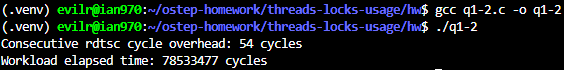
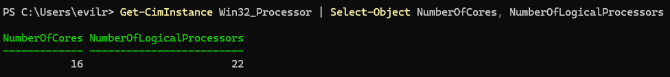
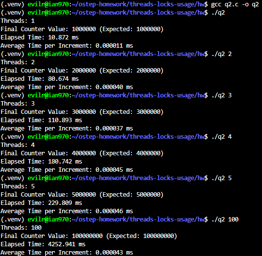

# Homework (Code)

In this homework, you’ll gain some experience with writing concurrent code and measuring its performance. Learning to build code that performs well is a critical skill and thus gaining a little experience here with it is quite worthwhile.

## Questions

1. We’ll start by redoing the measurements within this chapter. Use the call gettimeofday() to measure time within your program. How accurate is this timer? What is the smallest interval it can measure? Gain confidence in its workings, as we will need it in all subsequent questions. You can also look into other timers, such as the cycle counter available on x86 via the rdtsc instruction.

    > [q1-1.c](./q1-1.c)
    > 
    >
    > [q1-2.c](./q1-2.c)
    > 

    ```text
    **1. Accuracy and Smallest Interval:**

    * **`gettimeofday()`**: Theoretically, it provides a resolution of **1 microsecond (mu s)** via `struct timeval`. However, due to its system call overhead and timer resolution, invoking it consecutively with zero workload yields an elapsed time of **0 mu s**. It requires a large workload amplification (e.g., 10^9 loop iterations taking **213,636 mu s**) to render reliable measurements.
    * **`rdtsc`**: The x86 `rdtsc` instruction reads the hardware Time-Stamp Counter, offering a **sub-nanosecond (single CPU cycle) resolution**. Empirically, it can capture extremely fine-grained intervals that `gettimeofday()` completely misses.

    **2. Experimental Evidence & Analysis:**
    Based on my implementation and execution, the empirical results are as follows:

    * **Consecutive `rdtsc` overhead**: **54 cycles**. This represents the absolute minimal cost of just executing the timer read instruction sequence itself. This non-zero result demonstrates that the hardware timer's smallest measurable interval is a single clock cycle, capable of timing even back-to-back instructions.
    * **Workload Execution**: For a loop workload of 10^8 iterations, `rdtsc` measured **78,533,477 cycles**.

    Assuming a typical modern CPU frequency (e.g., around 2.5 GHz to 3.5 GHz), 78.5 million cycles translates to roughly 22–31 milliseconds. This maps consistently with our previous macro-level observations using `gettimeofday()`, but provides much higher precision without any operating system software layer overhead.

    **3. Conclusion on Usage:**
    For the subsequent concurrency experiments in this chapter, `gettimeofday()` is sufficient as long as we scale our workloads (e.g., millions of counter increments) so that the execution times fall comfortably into the millisecond range. However, for benchmarking ultra-low-latency primitives or micro-operations, the `rdtsc` cycle counter is the vastly superior choice.

    ```

2. Now, build a simple concurrent counter and measure how long it takes to increment the counter many times as the number of threads increases. How many CPUs are available on the system you are
using? Does this number impact your measurements at all?

    > [q2.c](./q2.c)
    > 
    >
    > 

    ```text
    1. Implementation and Performance Observation:
    I implemented a simple concurrent counter protected by a single pthread_mutex_t. Each thread executes a loop to increment the counter 1,000,000 times.

    The experimental results show a severe performance degradation as the number of threads increases:

        - 1 Thread: Completed 1,000,000 increments in ~10.87 ms.
        - 2 Threads: Completed 2,000,000 increments in ~80.67 ms.
        - 4 Threads: Completed 4,000,000 increments in ~180.74 ms.
        - 5 Threads: Completed 4,000,000 increments in ~229.81 ms.
        - 100 Threads: Completed 100,000,000 increments in ~4252.94 ms.

    Instead of scaling efficiently, the counter performs significantly worse concurrently. Going from 1 thread to 2 threads doubles the workload, but the execution time increases by nearly 8 times (from 10.87 ms to 80.67 ms).

    2. CPU Core Count and Its Impact:The system I am using has 16 available CPUs.This number directly impacts the measurements due to lock contention and cache coherence overhead:
    
        When Threads <= CPU Cores: Multiple threads run truly in parallel on different cores. However, because they all need to acquire the same mutex and modify the same memory address (my_counter.value), the CPU cache lines bounce back and forth between the cores' L1/L2 caches (cache invalidation). The threads spend most of their time blocked, waiting to acquire the lock.
        
        When Threads > CPU Cores (e.g., 100 threads): The system cannot run all threads simultaneously. The operating system must perform frequent context switches, moving threads on and off the CPU. This introduces significant scheduling overhead on top of the already heavy lock contention, causing the total execution time to skyrocket.In conclusion, a simple single-lock counter scales extremely poorly on multi-core systems because it serializes the execution and generates massive cache traffic.
    ```

3. Next, build a version of the approximate counter. Once again, measure its performance as the number of threads varies, as well as the threshold. Do the numbers match what you see in the chapter?
4. Build a version of a linked list that uses hand-over-hand locking [MS04], as cited in the chapter. You should read the paper first to understand how it works, and then implement it. Measure its performance. When does a hand-over-hand list work better than a
standard list as shown in the chapter?
5. Pick your favorite data structure, such as a B-tree or other slightly more interesting structure. Implement it, and start with a simple locking strategy such as a single lock. Measure its performance as the number of concurrent threads increases.
6. Finally, think of a more interesting locking strategy for this favorite data structure of yours. Implement it, and measure its performance. How does it compare to the straightforward locking approach?
