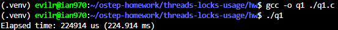

# Homework (Code)

In this homework, you’ll gain some experience with writing concurrent code and measuring its performance. Learning to build code that performs well is a critical skill and thus gaining a little experience here with it is quite worthwhile.

## Questions

1. We’ll start by redoing the measurements within this chapter. Use the call gettimeofday() to measure time within your program. How accurate is this timer? What is the smallest interval it can measure? Gain confidence in its workings, as we will need it in all subsequent questions. You can also look into other timers, such as the cycle counter available on x86 via the rdtsc instruction.

    ```c
    #include <sys/time.h>
    #include <stdio.h>

    int main()
    {
        struct timeval start, end;
        gettimeofday(&start, NULL);

        // Your code to be timed goes here
        for (volatile long long i = 0; i < 1000000000; i++)
            ; // Example workload

        gettimeofday(&end, NULL);

        long long start_usec = start.tv_sec * 1000000 + start.tv_usec;
        long long end_usec = end.tv_sec * 1000000 + end.tv_usec;
        long long elapsed_usec = end_usec - start_usec;

        printf("Elapsed time: %lld us (%.3f ms)\n", elapsed_usec, elapsed_usec / 1000.0);

        return 0;

    }

    ```

    > 

    ```text
    1. Accuracy and Smallest Interval:Theoretically, gettimeofday() has a resolution of 1 microsecond (mu s) because it populates a struct timeval which contains tv_sec (seconds) and tv_usec (microseconds). However, its actual precision is bounded by the operating system's clock interrupt frequency and system call overhead.
    
    2. Experimental Evidence:In my experiment, invoking gettimeofday() twice consecutively with no workload in between yielded a difference of 0 mu s. This proves that a single short operation takes less than 1 microsecond, which is below the timer's measurable resolution.To gain confidence and measure time properly, I used a "workload amplification" method by running a heavy loop (1,000,000,000 iterations) with a volatile loop counter to prevent compiler optimization. This workload took 224914 mu s (approx. 224.9 ms) to execute, demonstrating that the timer works reliably for scaling macro-intervals.3. Alternative Timers (rdtsc):For sub-microsecond or nanosecond-level accuracy, we can look into the x86 rdtsc (Read Time-Stamp Counter) instruction, which measures elapsed CPU cycles (sub-nanosecond resolution). While rdtsc provides much higher precision, it can be tricky on modern multi-core systems due to core synchronization issues and frequency scaling (DVFS), making clock_gettime(CLOCK_MONOTONIC) a more robust alternative in modern Linux environments.
    ```

2. Now, build a simple concurrent counter and measure how long it takes to increment the counter many times as the number of threads increases. How many CPUs are available on the system you are
using? Does this number impact your measurements at all?

3. Next, build a version of the approximate counter. Once again, measure its performance as the number of threads varies, as well as the threshold. Do the numbers match what you see in the chapter?
4. Build a version of a linked list that uses hand-over-hand locking [MS04], as cited in the chapter. You should read the paper first to understand how it works, and then implement it. Measure its performance. When does a hand-over-hand list work better than a
standard list as shown in the chapter?
5. Pick your favorite data structure, such as a B-tree or other slightly more interesting structure. Implement it, and start with a simple locking strategy such as a single lock. Measure its performance as the number of concurrent threads increases.
6. Finally, think of a more interesting locking strategy for this favorite data structure of yours. Implement it, and measure its performance. How does it compare to the straightforward locking approach?
