# Homework (Simulation)

This program, x86.py, allows you to see how different thread interleavings either cause or avoid race conditions. See the README for details on how the program works and answer the questions below.

## Questions

1. Examine flag.s. This code “implements” locking with a single memory flag. Can you understand the assembly?

    ```text
    Yes, the assembly code in flag.s attempts to implement a simple spin lock using a single shared memory variable named flag. Here is the breakdown of how it works:

        1. Acquire the Lock: In the .acquire section, a thread loads the value of the flag variable into the %ax register (mov flag, %ax) and checks if it is 0 (test $0, %ax). If the value is not 0 (meaning another thread holds the lock), it jumps back to .acquire (jne .acquire) and keeps spinning. If it is 0, it proceeds to claim the lock by setting flag to 1 (mov $1, flag).

        2. Critical Section: Once the lock is acquired, the thread enters the critical section where it safely increments the shared count variable.

        3. Release the Lock: After the critical section, the thread releases the lock by resetting flag back to 0 (mov $0, flag), allowing other spinning threads to acquire it.

        4. Loop: Finally, it decrements the loop counter in register %bx and repeats the process if the counter is greater than zero.

    The Flaw: The code logic is easy to understand, but it contains a critical flaw. The process of testing the lock (test) and setting the lock (mov) involves separate, non-atomic instructions. If a context switch occurs right after a thread tests the flag but before it sets it to 1, multiple threads can simultaneously observe the flag as 0, enter the critical section at the same time, and violate mutual exclusion.
    ```

2. When you run with the defaults, does flag.s work? Use the -M and -R flags to trace variables and registers (and turn on -c to see their values). Can you predict what value will end up in flag?

    > 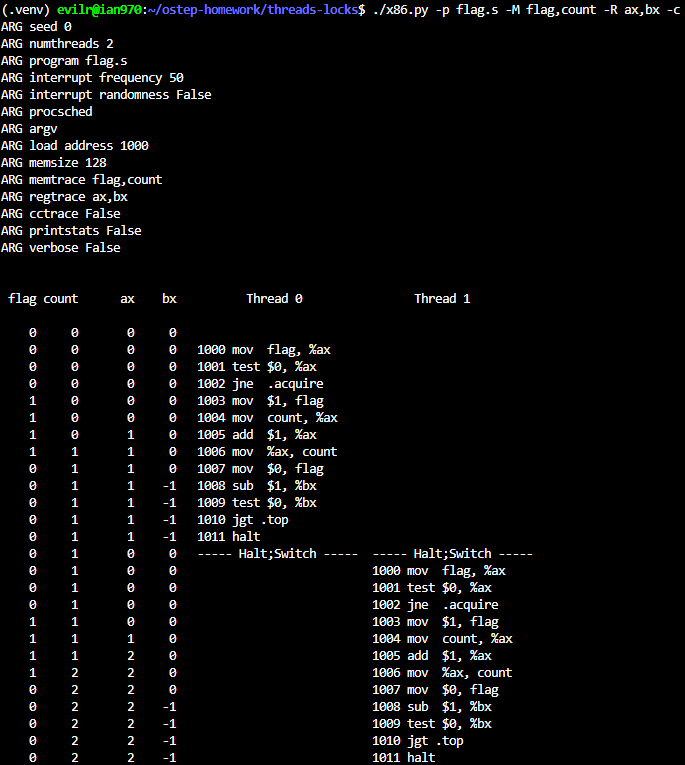

    ```text
    Yes, when running with the default settings, flag.s appears to work correctly.

    By default, the simulator runs two threads (-t 2) with an interrupt frequency of 50 instructions (-i 50). Because a single loop iteration in flag.s (from acquiring the lock, updating the counter, releasing the lock, and checking the loop condition) only takes about 12 instructions, Thread 0 completes its entire execution and halts long before a context switch is triggered. After Thread 0 halts, the simulator switches to Thread 1, which also completes its execution without interruption.

    The final value that ends up in flag is 0, and the shared count variable correctly ends up at 2. This happens because each thread successfully executes the release instruction (mov $0, flag) at the end of its run. The code works here purely by chance due to the long time slice, completely masking the non-atomic flaw in the lock implementation.
    ```

3. Change the value of the register %bx with the -a flag (e.g., -a bx=2,bx=2 if you are running just two threads). What does the code do? How does it change your answer for the question above?

    > 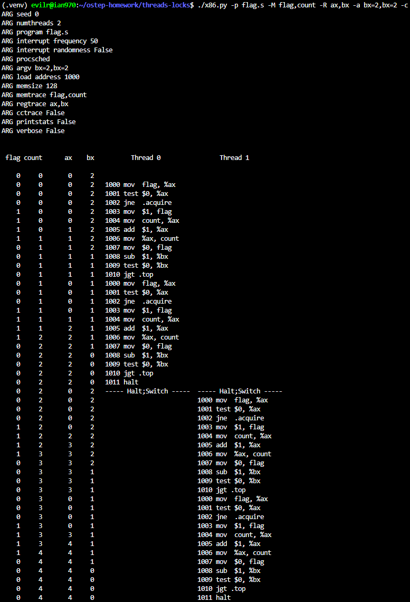

    ```text
    Changing the value of the %bx register using -a bx=2,bx=2 sets the initial loop counter to 2 for both threads. This means the code will force each thread to execute the loop (acquire lock, enter critical section, increment count, release lock) twice before halting.

    However, this does not change the answer to the previous question; the code still appears to work perfectly. Because executing the loop twice only takes about 24 instructions, Thread 0 still finishes its entire execution and halts long before the default interrupt timer (-i 50) forces a context switch. Consequently, the threads run sequentially rather than concurrently, safely incrementing count to a final correct value of 4. The race condition remains hidden.
    ```

4. Set bx to a high value for each thread, and then use the -i flag to generate different interrupt frequencies; what values lead to a bad outcomes? Which lead to good outcomes?

    > 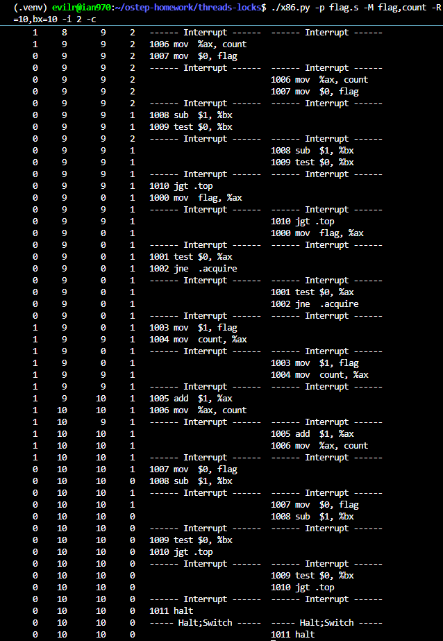
    > 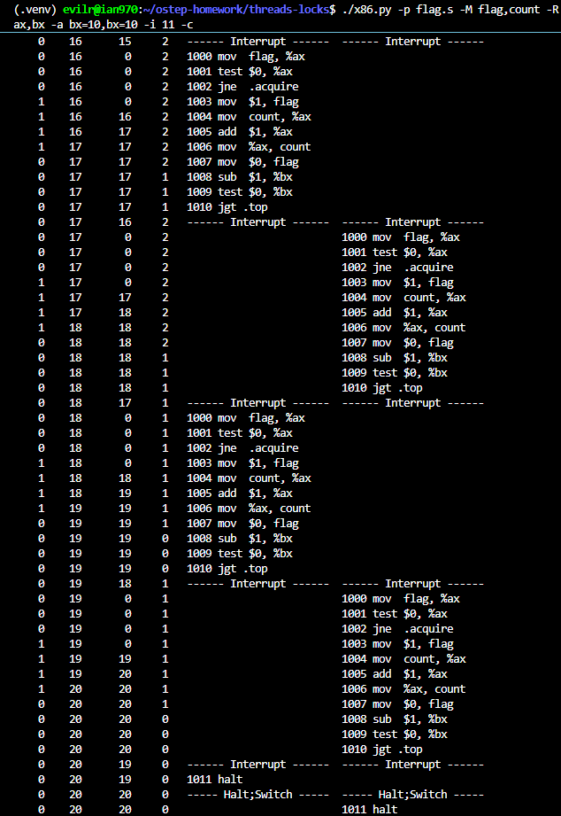

    ```text
    Setting %bx to a higher value (e.g., -a bx=10,bx=10) forces the threads to iterate through the critical section multiple times.

        - Bad Outcomes: Lower interrupt frequencies, such as -i 2, lead to bad outcomes. With -i 2, the context switch occurs frequently enough that it breaks the atomicity of the test-and-set logic. Thread 0 tests the flag, finds it 0, and gets interrupted before setting it. Thread 1 runs, also finds the flag is 0, and enters the critical section. Both threads read the same counter value, increment it, and write it back, resulting in lost updates. The final count ends up being 10 instead of the expected 20. Any -i value that causes a context switch between the test and the instruction that sets the flag (or within the critical section itself) will cause a race condition.

        - Good Outcomes: An interrupt frequency of -i 11 (or sufficient multiples that avoid interrupting the critical section) leads to a good outcome. A single loop iteration takes exactly 11 instructions to jump back to the top. By setting -i 11, the context switch happens exactly at the end of the loop, after the thread has safely released the lock (mov $0, flag). This ensures that when the next thread wakes up, the lock is free, and mutual exclusion is maintained purely by the synchronized timing of the interrupts, resulting in the correct final count of 20.
    ```

5. Now let’s look at the program test-and-set.s. First, try to understand the code, which uses the xchg instruction to build a simple locking primitive. How is the lock acquire written? How about lock release?

    ```text
    - Lock Acquire: The acquire sequence starts by loading the value 1 into the %ax register (mov $1, %ax). Next, the xchg %ax, mutex instruction atomically swaps the value in %ax (which is 1) with the value stored in the mutex memory variable. The thread then tests the value that was brought back into %ax (test $0, %ax). If %ax is 0, it means the lock was previously free, and the current thread has successfully acquired it by setting mutex to 1. If %ax is 1, it means another thread currently holds the lock, so the current thread will loop back (jne .acquire) to spin and try again. Because xchg happens as a single, indivisible hardware step, it completely eliminates the race condition seen in flag.s.

   - Lock Release: Releasing the lock is straightforward. The thread simply writes 0 back into the mutex variable (mov $0, mutex), indicating that the lock is now free for other spinning threads to grab.
    ```

6. Now run the code, changing the value of the interrupt interval (-i) again, and making sure to loop for a number of times. Does the code always work as expected? Does it sometimes lead to an inefficient use of the CPU? How could you quantify that?

    > 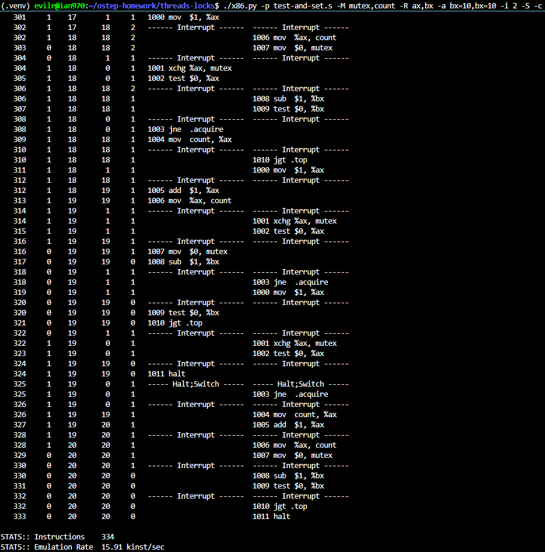
    > 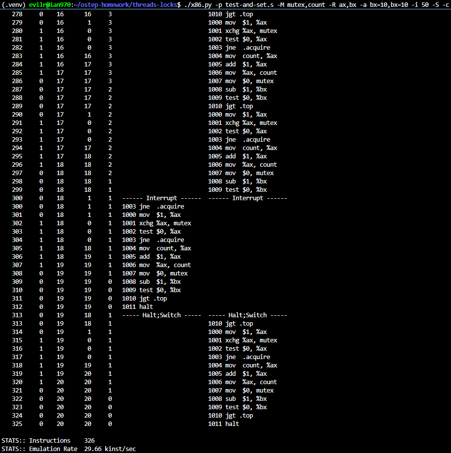

    ```text
    - Does the code always work as expected? Yes, it always works correctly. Even with an extremely high interrupt frequency (like -i 2), the shared count variable accurately reaches the target value (e.g., 20). This is because the xchg instruction guarantees atomic evaluation and modification of the lock, preventing the race condition.

   - Does it sometimes lead to an inefficient use of the CPU? Yes, it suffers from a significant efficiency problem known as "spin-waiting." If Thread 0 holds the lock and a context switch occurs, Thread 1 will run and repeatedly check the lock status. Thread 1 gets stuck in the .acquire loop, actively consuming its entire CPU time slice doing nothing productive until the OS eventually switches back to Thread 0.

   - How could you quantify that? You can quantify this inefficiency by using the -S flag to track the total number of instructions executed. As seen in the experimental results, running the same workload with -i 50 took exactly 326 instructions, while running it with -i 2 took 334 instructions. The additional instructions in the -i 2 run are purely wasted CPU cycles spent spinning. In a larger workload, the amount of wasted instructions would be substantially higher.
    ```

7. Use the -P flag to generate specific tests of the locking code. For example, run a schedule that grabs the lock in the first thread, but then tries to acquire it in the second. Does the right thing happen? What else should you test?

    > 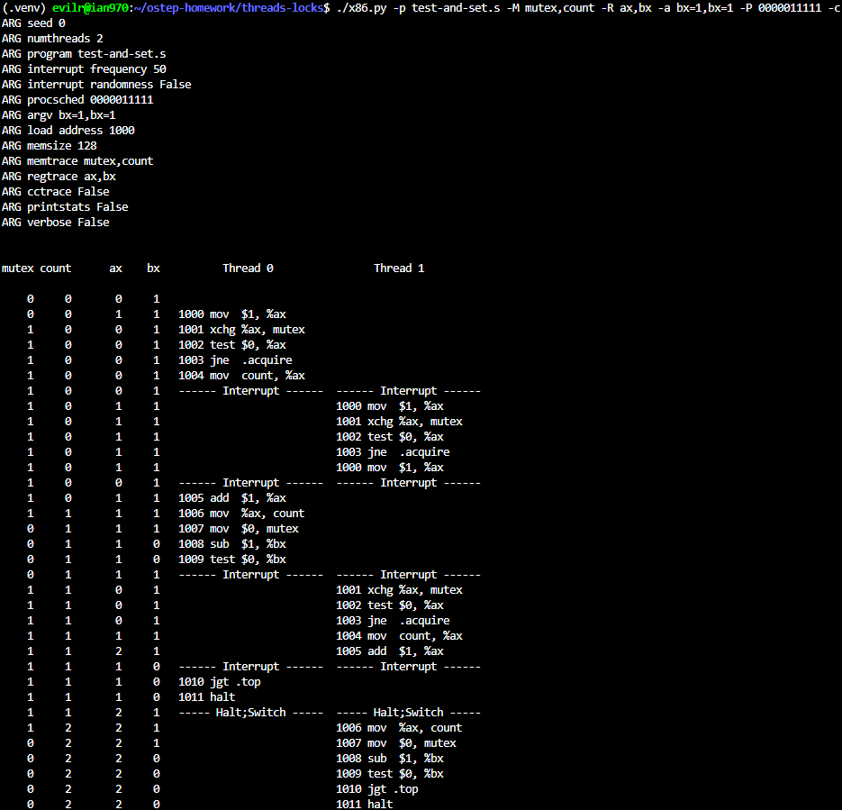
    > 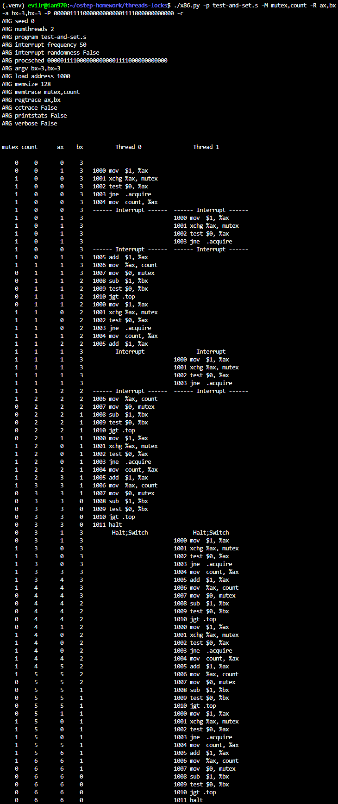

    ```text
    Yes, the right thing happens. When using the -P flag (e.g., -P 0000011111), we can force a specific schedule where Thread 0 acquires the lock and enters the critical section, and then a context switch forces Thread 1 to run. As expected, Thread 1 cannot acquire the lock and correctly spins (executing xchg and test) until its time slice ends, preserving mutual exclusion.

    What else should you test? We should test for fairness and starvation. Because this simple spin lock does not guarantee any specific order of acquisition, a thread can be starved. We can test this by creating a schedule where Thread 1 only ever gets scheduled while Thread 0 is inside the critical section. For example, if Thread 0 acquires the lock, then Thread 1 spins, and then Thread 0 gets enough uninterrupted CPU time to release the lock, loop back, and re-acquire the lock before Thread 1 is scheduled again, Thread 1 will starve. A schedule string like -P 0000011110000000000001111000000000000 perfectly demonstrates this starvation scenario.
    ```

8. Now let’s look at the code in peterson.s, which implements Peterson’s algorithm (mentioned in a sidebar in the text). Study the code and see if you can make sense of it.

    ```text
    Yes, the code in peterson.s successfully implements Peterson's algorithm using standard load and store instructions without relying on special hardware atomic instructions like xchg.

    Here is how the assembly logic works:

        1. Initialization: The code sets up register %bx as the current thread's ID (self) and %cx as the other thread's ID (1 - self).

        2. Acquire (Expressing Intent & Yielding): A thread indicates its desire to enter the critical section by setting its own flag to 1 (mov $1, 0(%fx,%bx,4)). Crucially, it immediately yields priority to the other thread by setting the turn variable to the other thread's ID (mov %cx, turn).

        3. Spin-Waiting (The Condition): The thread enters a spin loop (.spin1 and .spin2). It checks two conditions:

            - Is the other thread's flag set to 1? (Does the other thread want to enter?)

            - Is turn equal to the other thread's ID? (Is it the other thread's turn?)
            If both conditions are true, the thread spins. If the other thread doesn't want to enter (flag is 0), or if it's actually the current thread's turn, it breaks out of the loop and enters the critical section.

        4. Release: After the critical section, the thread simply clears its own flag (mov $0, 0(%fx,%bx,4)), allowing the other thread to proceed.
    ```

9. Now run the code with different values of -i. What kinds of different behavior do you see? Make sure to set the thread IDs appropriately (using -a bx=0,bx=1 for example) as the code assumes it.

    > 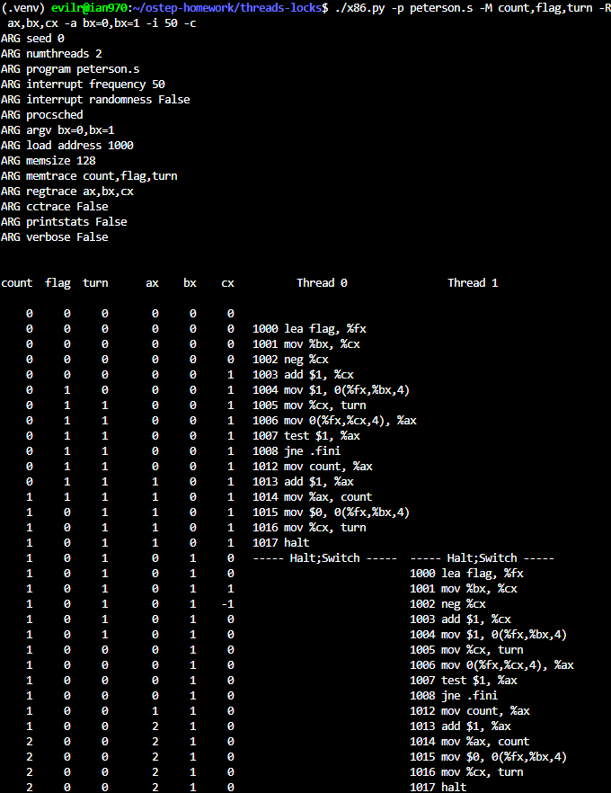
    > 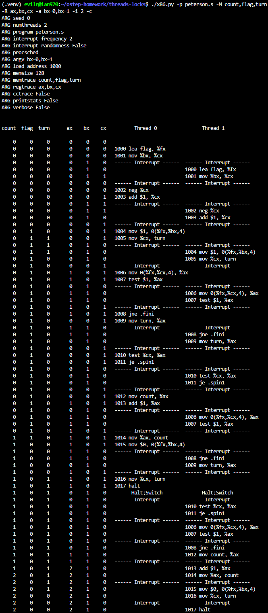

    ```text
    When running peterson.s with -a bx=0,bx=1, the code executes correctly, and the final count is always 2. This happens because the code does not contain a loop; each thread executes the critical section exactly once and then halts. The -a bx=0,bx=1 argument correctly initializes the thread IDs for Peterson's algorithm to work.

    When changing the -i flag (interrupt frequency), we observe different interleaving behaviors:

        - With a high value like -i 50, Thread 0 typically acquires the lock, increments the count, releases it, and halts before Thread 1 even begins executing.

        - With a low value like -i 2 (frequent context switching), the threads constantly interrupt each other. We can see them actively modifying and checking the flag array and turn variable. One thread will be forced to spin in the .spin1 and .spin2 loops while the other is in the critical section.
        Despite the chaotic interleaving at -i 2, Peterson's algorithm holds strong: mutual exclusion is perfectly maintained, and the final count is always accurately computed as 2 without any race conditions.
    ````

10. Can you control the scheduling (with the -P flag) to “prove” that the code works? What are the different cases you should show hold? Think about mutual exclusion and deadlock avoidance.

    > 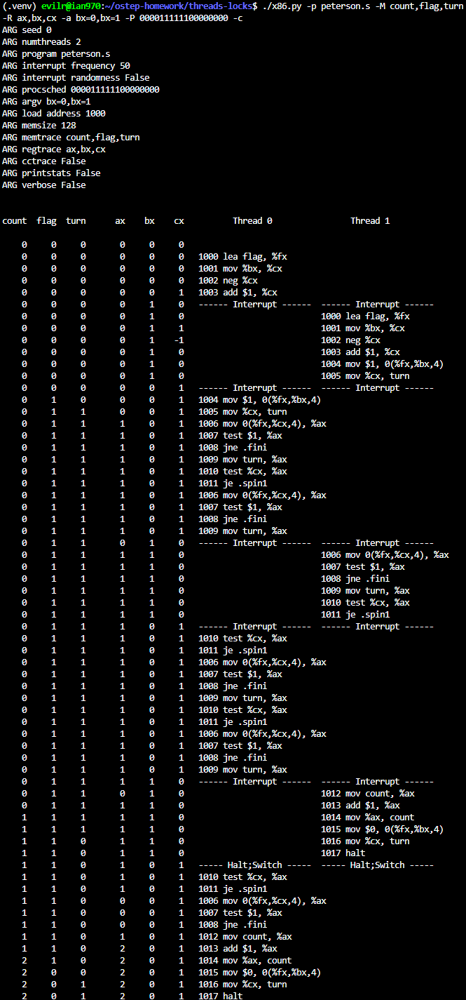

    ```text
    Yes, we can use the -P flag to control the scheduling and prove that Peterson's algorithm works under edge cases. A specific schedule to test is one where both threads indicate their intent to enter simultaneously (e.g., -P 000011111100000000).

        - Deadlock Avoidance: The trace proves that deadlock is avoided. Even when both threads set their respective flags to 1, they do not block each other indefinitely. The turn variable resolves the tie. Because Thread 0 wrote to turn last (setting it to 1), Thread 1's condition fails at .spin2, allowing Thread 1 to break out of the loop and proceed.

        - Mutual Exclusion: The trace proves mutual exclusion holds. While Thread 1 proceeds into the critical section, Thread 0 successfully evaluates both conditions in the spin loop (Thread 1's flag is 1, and turn is 1), forcing Thread 0 to jump back and spin (je .spin1). They are never in the critical section at the same time. Once Thread 1 finishes and clears its flag, Thread 0 is safely allowed in.
    ```

11. Now study the code for the ticket lock in ticket.s. Does it match the code in the chapter? Then run with the following flags: -a bx=1000,bx=1000 (causing each thread to loop through the critical section 1000 times). Watch what happens; do the threads spend much time spin-waiting for the lock?

    > 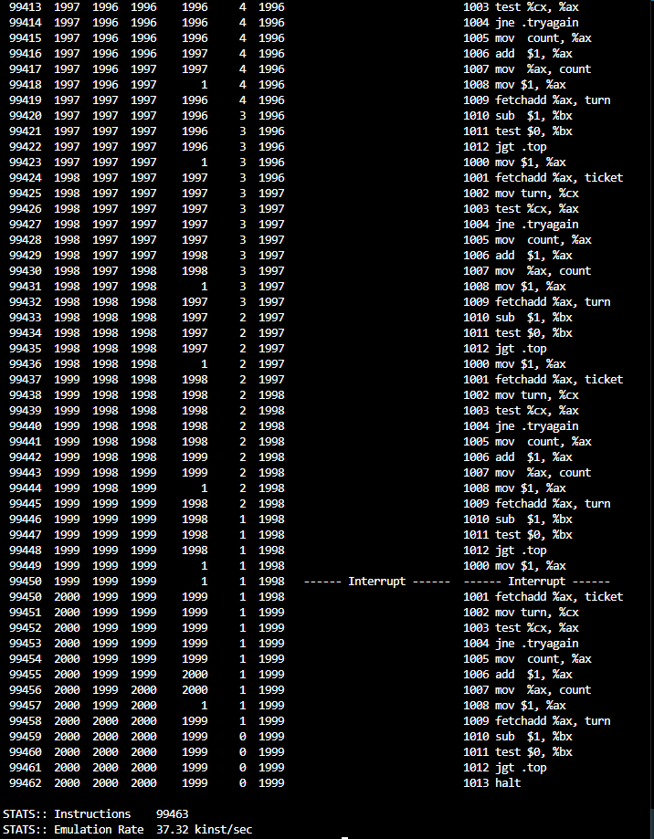

    ```text
    Yes, the code in ticket.s perfectly matches the ticket lock algorithm described in the chapter, utilizing the atomic fetchadd instruction to implement the "ticket" and "turn" concept.

    When running the simulation with -a bx=1000,bx=1000 (2000 total critical section entries), the final count correctly reaches 2000. However, the STATS:: Instructions reveals a massive 99,463 instructions were executed. Since 2000 iterations only require roughly 24,000 useful instructions to complete, this proves that the threads spend a vast majority of their time (over 70,000 instructions) spin-waiting. When one thread is in the critical section, the other thread wastes its entire time slice endlessly checking if turn matches its ticket, leading to highly inefficient CPU usage.
    ```

12. How does the code behave as you add more threads?

    ```text
    ./x86.py -p ticket.s -M ticket,turn,count -a bx=1000,bx=1000,bx=1000 -t 3 -c -S
    ```

    > 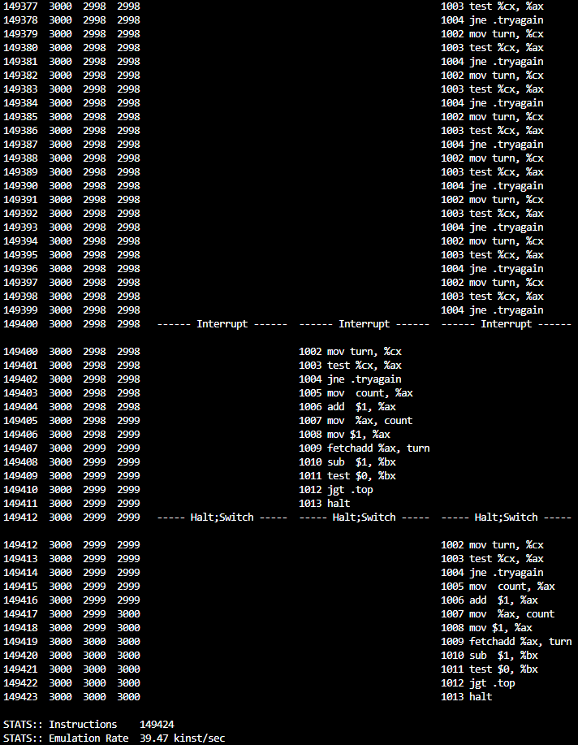

    ```text
    ./x86.py -p ticket.s -M ticket,turn,count -a bx=1000,bx=1000,bx=1000,bx=1000,bx=1000 -t 5 -c -S
    ```

    > 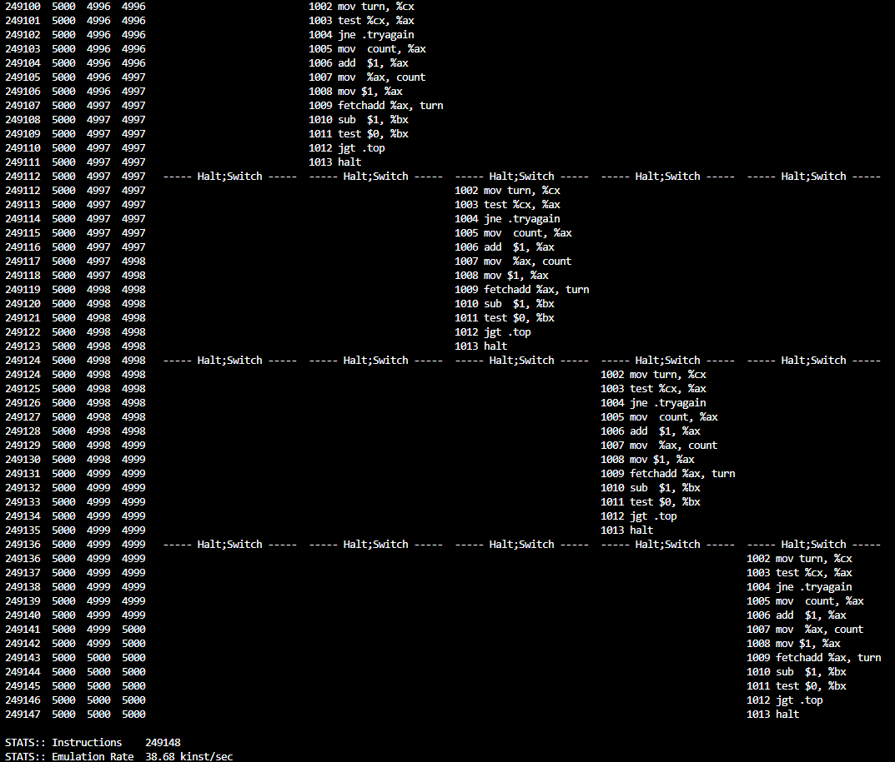

    ```text
    As you add more threads, the code behaves significantly worse in terms of CPU efficiency. The total number of instructions executed scales up drastically: with 3 threads it took 149,424 instructions, and with 5 threads it reached 249,148 instructions. This happens because spin-waiting scales with the number of waiting threads. When one thread holds the lock, the other $N-1$ threads must actively spin during their respective time slices. Therefore, the more threads there are, the more CPU cycles are wasted constantly checking the turn variable while making no actual progress.
    ```

13. Now examine yield.s, in which a yield instruction enables one thread to yield control of the CPU (realistically, this would be an OS primitive, but for the simplicity, we assume an instruction does the task). Find a scenario where test-and-set.s wastes cycles spinning, but yield.s does not. How many instructions are saved? In what scenarios do these savings arise?

    ```text
    ./x86.py -p test-and-set.s -M mutex,count -a bx=100,bx=100 -c -S
    ```

    > 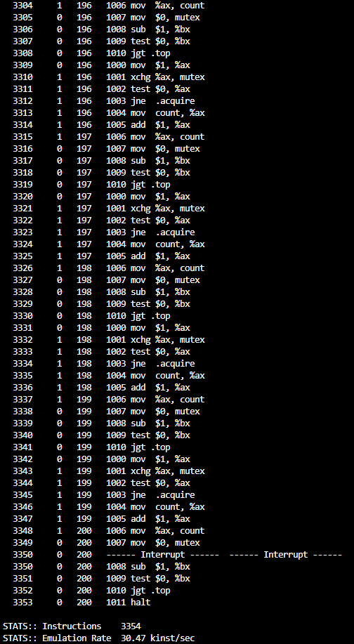

    ```text
    ./x86.py -p yield.s -M mutex,count -a bx=100,bx=100 -c -S
    ```

    > 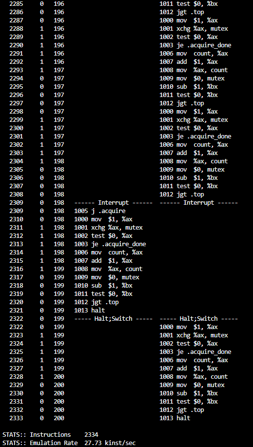

14. Finally, examine test-and-test-and-set.s. What does this lock do? What kind of savings does it introduce as compared to test-and-set.s?

    ```text
    The lock in test-and-test-and-set.s implements a two-phase spin-waiting strategy. Instead of immediately executing the atomic instruction, it first uses a standard memory read (mov mutex, %ax) and test (test $0, %ax) to check the status of the lock. It spins in this initial read loop as long as the lock is held. It only attempts the atomic exchange (xchg %ax, mutex) when the simple read indicates the lock might be free (i.e., the value is 0). If the xchg still fails, it falls back to the simple read loop.

    Savings compared to test-and-set.s:
    While both algorithms execute a similar number of total instructions in this software simulator, test-and-test-and-set.s introduces massive performance savings on real multiprocessor hardware. In test-and-set.s, spinning threads continuously execute the atomic xchg instruction. Atomic operations are highly expensive at the hardware level because they require exclusive access, which locks the memory bus or generates heavy cache coherence traffic (constantly invalidating the cache lines of other processors).

    test-and-test-and-set.s solves this by spinning on a standard read instead. A normal read can be served repeatedly and quickly from the processor's local cache without generating any bus traffic. The expensive atomic operation is only triggered when there is a realistic chance of acquiring the lock, significantly reducing contention on the hardware memory interconnect.
    ```
