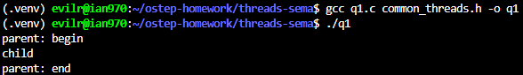
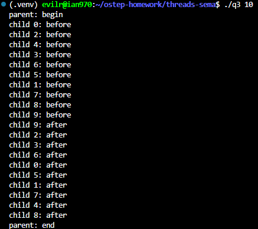
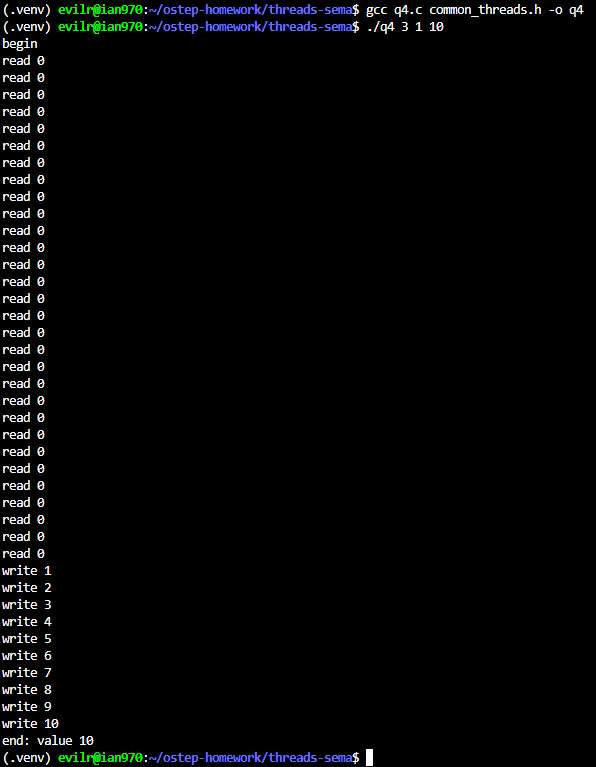
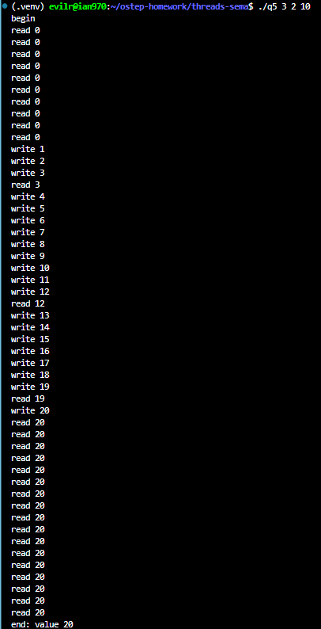
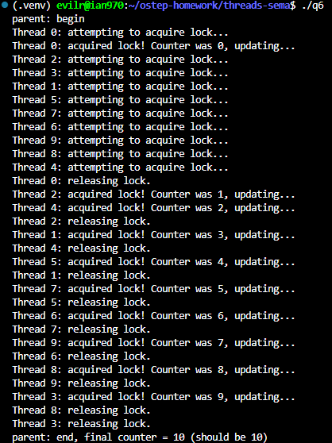

# Homework (Code)

In this homework, we’ll use semaphores to solve some well-known concurrency problems. Many of these are taken from Downey’s excellent “Little Book of Semaphores”3, which does a good job of pulling together a number of classic problems as well as introducing a few new variants; interested readers should check out the Little Book for more fun. Each of the following questions provides a code skeleton; your job is to fill in the code to make it work given semaphores. On Linux, you will be using native semaphores; on a Mac (where there is no semaphore support), you’ll have to first build an implementation (using locks and condition variables, as described in the chapter). Good luck!

## Questions

1. The first problem is just to implement and test a solution to the fork/join problem, as described in the text. Even though this solution is described in the text, the act of typing it in on your own is worthwhile; even Bach would rewrite Vivaldi, allowing one soon-to-be master to learn from an existing one. See fork-join.c for details. Add the call sleep(1) to the child to ensure it is working.

    - q1.c

        ```c
        #include <stdio.h>
        #include <unistd.h>
        #include <pthread.h>
        #include "common_threads.h"

        sem_t s;

        void *child(void *arg)
        {
            printf("child\n");

            sleep(1); // Simulate some work in the child thread

            // use semaphore here
            Sem_post(&s);
            return NULL;
        }

        int main(int argc, char *argv[])
        {
            pthread_t p;
            printf("parent: begin\n");

            // init semaphore here
            Sem_init(&s, 0);

            Pthread_create(&p, NULL, child, NULL);

            // use semaphore here
            Sem_wait(&s);

            printf("parent: end\n");
            return 0;
        }

        ```

    - results:

        

2. Let’s now generalize this a bit by investigating the rendezvous problem. The problem is as follows: you have two threads, each of which are about to enter the rendezvous point in the code. Neither should exit this part of the code before the other enters it. Consider using two semaphores for this task, and see rendezvous.c for details.

    - q2.c

    ```c
    #include <stdio.h>
    #include <unistd.h>
    #include "common_threads.h"

    // If done correctly, each child should print their "before" message
    // before either prints their "after" message. Test by adding sleep(1)
    // calls in various locations.

    sem_t s1, s2;

    void *child_1(void *arg)
    {
        printf("child 1: before\n");

        sleep(1); // test by adding sleep(1)

        // what goes here?
        Sem_post(&s1); // Signal child 2 that child 1 has printed "before".

        sleep(1); // test by adding sleep(1)

        Sem_wait(&s2); // Wait for child 2 to print "before".

        printf("child 1: after\n");
        return NULL;
    }

    void *child_2(void *arg)
    {
        sleep(1); // test by adding sleep(1)

        printf("child 2: before\n");

        Sem_post(&s2); // Signal child 1 that child 2 has printed "before".
        Sem_wait(&s1); // Wait for child 1 to print "before".

        printf("child 2: after\n");

        sleep(1); // test by adding sleep(1)

        return NULL;
    }

    int main(int argc, char *argv[])
    {
        pthread_t p1, p2;
        printf("parent: begin\n");

        // init semaphores here
        Sem_init(&s1, 0);
        Sem_init(&s2, 0);

        Pthread_create(&p1, NULL, child_1, NULL);
        Pthread_create(&p2, NULL, child_2, NULL);

        Pthread_join(p1, NULL);
        Pthread_join(p2, NULL);

        printf("parent: end\n");
        return 0;
    }

    ```

3. Now go one step further by implementing a general solution to barrier synchronization. Assume there are two points in a sequential piece of code, called P1 and P2. Putting a barrier between P1 and P2 guarantees that all threads will execute P1 before any one thread executes P2. Your task: write the code to implement a barrier() function that can be used in this manner. It is safe to assume you know N (the total number of threads in the running program) and that all N threads will try to enter the barrier. Again, you should likely use two semaphores to achieve the solution, and some other integers to count things. See barrier.c for details.

    - q3.c

    ```c
    #include <assert.h>
    #include <stdio.h>
    #include <stdlib.h>
    #include <unistd.h>

    #include "common_threads.h"

    // If done correctly, each child should print their "before" message
    // before either prints their "after" message. Test by adding sleep(1)
    // calls in various locations.

    // You likely need two semaphores to do this correctly, and some
    // other integers to track things.

    typedef struct __barrier_t
    {
        sem_t mutex;     // Mutex lock to protect the counter
        sem_t turnstile; // Turnstile to block threads
        int count;       // Track how many threads have arrived
        int num_threads; // Total number of threads
    } barrier_t;

    // the single barrier we are using for this program
    barrier_t b;

    void barrier_init(barrier_t *b, int num_threads)
    {
        // Initialize mutex to 1 so the first thread can acquire the lock
        Sem_init(&b->mutex, 1);
        Sem_init(&b->turnstile, 0);
        b->count = 0;
        b->num_threads = num_threads;
    }

    void barrier(barrier_t *b)
    {
        Sem_wait(&b->mutex);
        b->count++;
        if (b->count == b->num_threads)
        {
            Sem_post(&b->turnstile); // Last arriving thread opens the turnstile
        }
        Sem_post(&b->mutex);

        Sem_wait(&b->turnstile); // Wait for turnstile to open
        Sem_post(&b->turnstile); // Cascade wake-up (Turnstile): help the next thread through
    }

    //
    // XXX: don't change below here (just run it!)
    //
    typedef struct __tinfo_t
    {
        int thread_id;
    } tinfo_t;

    void *child(void *arg)
    {
        tinfo_t *t = (tinfo_t *)arg;
        printf("child %d: before\n", t->thread_id);
        barrier(&b);
        printf("child %d: after\n", t->thread_id);
        return NULL;
    }

    // run with a single argument indicating the number of
    // threads you wish to create (1 or more)
    int main(int argc, char *argv[])
    {
        assert(argc == 2);
        int num_threads = atoi(argv[1]);
        assert(num_threads > 0);

        pthread_t p[num_threads];
        tinfo_t t[num_threads];

        printf("parent: begin\n");
        barrier_init(&b, num_threads);

        int i;
        for (i = 0; i < num_threads; i++)
        {
            t[i].thread_id = i;
            Pthread_create(&p[i], NULL, child, &t[i]);
        }

        for (i = 0; i < num_threads; i++)
            Pthread_join(p[i], NULL);

        printf("parent: end\n");
        return 0;
    }

    ```

    - result

        

    To successfully implement barrier synchronization using semaphores to fit the barrier.c structure, two main concurrency issues must be addressed:  

    - **Protecting the Counter (Mutex)**: A semaphore named mutex must be initialized to 1 to act as a mutual exclusion lock. This prevents race conditions when multiple threads attempt to read and increment the count variable at the exact same time. If initialized to 0, all threads would instantly deadlock upon their first Sem_wait(&b->mutex).
    - **Cascading Wake-up (The Turnstile Pattern)**: We use a second semaphore, turnstile, initialized to 0, to force arriving threads to wait. When the final thread arrives (b->count == b->num_threads), it signals the turnstile semaphore. Because a single Sem_post only wakes up one waiting thread, we implement a "turnstile" pattern: every thread that successfully passes Sem_wait(&b->turnstile) immediately calls Sem_post(&b->turnstile). This creates a chain reaction, effectively waking up all N threads one by one so they can all proceed past the barrier.

4. Now let’s solve the reader-writer problem, also as described in the text. In this first take, don’t worry about starvation. See the code in reader-writer.c for details. Add sleep() calls to your code to demonstrate it works as you expect. Can you show the existence of the starvation problem?

    - q4.c

    ```c
    #include <stdio.h>
    #include <stdlib.h>
    #include <unistd.h>
    #include "common_threads.h"

    //
    // Your code goes in the structure and functions below
    //

    typedef struct __rwlock_t
    {
        sem_t lock;      // protects readers
        sem_t writelock; // protects writers
        int readers;     // number of active readers
    } rwlock_t;

    void rwlock_init(rwlock_t *rw)
    {
        Sem_init(&rw->lock, 1);      // Initialize to 1 to allow one thread to access the readers count
        Sem_init(&rw->writelock, 1); // Initialize to 1 to allow one thread to access the writers
        rw->readers = 0;             // Initialize the number of active readers to 0
    }

    void rwlock_acquire_readlock(rwlock_t *rw)
    {
        Sem_wait(&rw->lock); // Ready to modify the readers count, so acquire the lock

        rw->readers++;
        if (rw->readers == 1)         // If this is the first reader, it needs to acquire the writelock to block writers
            Sem_wait(&rw->writelock); // Block writers if this is the first reader

        Sem_post(&rw->lock); // Done modifying the readers count, so release the lock
    }

    void rwlock_release_readlock(rwlock_t *rw)
    {
        Sem_wait(&rw->lock); // Ready to modify the readers count, so acquire the lock

        rw->readers--;
        if (rw->readers == 0)         // If this is the last reader, it needs to release the writelock to allow writers
            Sem_post(&rw->writelock); // Allow writers if this is the last reader

        Sem_post(&rw->lock); // Done modifying the readers count, so release the lock
    }

    void rwlock_acquire_writelock(rwlock_t *rw)
    {
        Sem_wait(&rw->writelock); // Writers need to acquire the writelock to block both readers and other writers
    }

    void rwlock_release_writelock(rwlock_t *rw)
    {
        Sem_post(&rw->writelock); // Writers release the writelock to allow other readers and writers
    }

    //
    // Don't change the code below (just use it!)
    //

    int loops;
    int value = 0;

    rwlock_t lock;

    void *reader(void *arg)
    {
        int i;
        for (i = 0; i < loops; i++)
        {
            rwlock_acquire_readlock(&lock);

            printf("read %d\n", value);

            // Let the reader hold the lock to let the other readers have time to reach to increase the number of active readers.
            sleep(1);

            rwlock_release_readlock(&lock);
        }
        return NULL;
    }

    void *writer(void *arg)
    {
        int i;
        for (i = 0; i < loops; i++)
        {
            rwlock_acquire_writelock(&lock);
            value++;
            printf("write %d\n", value);
            rwlock_release_writelock(&lock);
        }
        return NULL;
    }

    int main(int argc, char *argv[])
    {
        assert(argc == 4);
        int num_readers = atoi(argv[1]);
        int num_writers = atoi(argv[2]);
        loops = atoi(argv[3]);

        pthread_t pr[num_readers], pw[num_writers];

        rwlock_init(&lock);

        printf("begin\n");

        int i;
        for (i = 0; i < num_readers; i++)
            Pthread_create(&pr[i], NULL, reader, NULL);
        for (i = 0; i < num_writers; i++)
            Pthread_create(&pw[i], NULL, writer, NULL);

        for (i = 0; i < num_readers; i++)
            Pthread_join(pr[i], NULL);
        for (i = 0; i < num_writers; i++)
            Pthread_join(pw[i], NULL);

        printf("end: value %d\n", value);

        return 0;
    }


    ```

    - results

        

    - Can you show the existence of the starvation problem?

        ```text
        Yes, this implementation exhibits writer starvation because it uses a reader-preference approach.

        Here is why starvation occurs:

        The writelock is acquired by the first reader (when readers == 1) and is only released by the last reader leaving (when readers == 0).

        If there is a continuous, overlapping stream of incoming readers, the readers count will remain strictly greater than 0.

        As a result, the writelock is never released, causing any waiting writers to be indefinitely blocked (starved) until every single reader has exited.

        How to demonstrate it:
        By adding a sleep(1) inside the reader's critical section (between acquiring and releasing the read lock), we artificially prolong the reading process. When running the program with multiple readers (e.g., 3 readers, 1 writer, 10 loops), the sleep(1) guarantees that readers will overlap. The output will show all 30 read operations executing back-to-back, while the writer is completely starved and forced to wait until all reading is done before it can perform its first write.
        ```

5. Let’s look at the reader-writer problem again, but this time, worry about starvation. How can you ensure that all readers and writers eventually make progress? See reader-writer-nostarve.c for details.

    - q5.c

    ```c
    typedef struct __rwlock_t {
    sem_t mutex;     // Mutex lock to protect the reader counter
    sem_t writelock; // Semaphore to allow writers exclusive access
    sem_t turnstile; // Semaphore to enforce queuing and prevent starvation
    int readers;     // Track how many readers are currently reading
    } rwlock_t;

    void rwlock_init(rwlock_t *rw) {
        Sem_init(&rw->mutex, 1);
        Sem_init(&rw->writelock, 1);
        Sem_init(&rw->turnstile, 1); // Initialize to 1 to allow the first thread through
        rw->readers = 0;
    }

    void rwlock_acquire_readlock(rwlock_t *rw) {
        Sem_wait(&rw->turnstile); // Wait in line at the turnstile
        
        Sem_wait(&rw->mutex);
        rw->readers++;
        if (rw->readers == 1) {
            Sem_wait(&rw->writelock); // The first reader acquires the write lock
        }
        Sem_post(&rw->mutex);
        
        Sem_post(&rw->turnstile); // Immediately release the turnstile for the next thread
    }

    void rwlock_release_readlock(rwlock_t *rw) {
        Sem_wait(&rw->mutex);
        rw->readers--;
        if (rw->readers == 0) {
            Sem_post(&rw->writelock); // The last reader releases the write lock
        }
        Sem_post(&rw->mutex);
    }

    void rwlock_acquire_writelock(rwlock_t *rw) {
        Sem_wait(&rw->turnstile); // Writer waits at the turnstile and HOLDS it
        Sem_wait(&rw->writelock); // Writer waits for active readers to finish
    }

    void rwlock_release_writelock(rwlock_t *rw) {
        Sem_post(&rw->writelock); // Writer releases the write lock
        Sem_post(&rw->turnstile); // Writer finally releases the turnstile
    }


    ```

    - results

        

        The Starvation Problem
        In a basic reader-writer lock, writers can suffer from starvation. If readers continuously arrive, the readers count remains greater than zero. Because the first reader holds the writelock and the last reader releases it, a continuous stream of readers will hold the writelock indefinitely, causing waiting writers to be blocked forever.

        The "Turnstile" Solution To prevent writer starvation, we introduce a new semaphore called a turnstile, initialized to 1. This acts as a queueing gate that all threads (both readers and writers) must pass through before entering their respective critical sections.

        - Reader Behavior: When a reader arrives, it acquires the turnstile and then immediately releases it (Sem_post(&rw->turnstile)). This allows subsequent threads to pass through the turnstile and proceed.
        - Writer Behavior: When a writer wants to write, it acquires the turnstile but does not immediately release it.
        - Preventing Starvation: Because the waiting writer holds the turnstile, any newly arriving readers are blocked at the turnstile gate and cannot increment the readers count. The readers that are already actively reading will eventually finish their work, decrement the readers count to 0, and release the writelock. The writer can then acquire the writelock, perform its operations, and finally release both the writelock and the turnstile, allowing the blocked readers to proceed. This effectively guarantees that writers will eventually make progress.

6. Use semaphores to build a no-starve mutex, in which any thread that tries to acquire the mutex will eventually obtain it. See the code in mutex-nostarve.c for more information.

    - q6.c

    ```c
    #include <stdio.h>
    #include <stdlib.h>
    #include <unistd.h>
    #include <pthread.h>
    #include "common_threads.h"

    // The Two-Room Algorithm Structure
    typedef struct __ns_mutex_t {
        int room1;       // Number of threads waiting in Room 1
        int room2;       // Number of threads waiting in Room 2
        sem_t mutex;     // Mutex to protect the room counters
        sem_t t1;        // Turnstile 1 (Gate to Room 1)
        sem_t t2;        // Turnstile 2 (Gate to Room 2)
    } ns_mutex_t;

    void ns_mutex_init(ns_mutex_t *m) {
        m->room1 = 0;
        m->room2 = 0;
        Sem_init(&m->mutex, 1);
        Sem_init(&m->t1, 1);    // Open initially to allow threads into Room 1
        Sem_init(&m->t2, 0);    // Closed initially
    }

    void ns_mutex_acquire(ns_mutex_t *m) {
        // 1. Register arrival in Room 1
        Sem_wait(&m->mutex);
        m->room1++;
        Sem_post(&m->mutex);

        // 2. Wait at Turnstile 1
        Sem_wait(&m->t1);

        // 3. Transition from Room 1 to Room 2
        Sem_wait(&m->mutex);
        m->room1--;
        m->room2++;
        
        if (m->room1 == 0) {
            // Last thread in Room 1 closes t1 and opens t2 for the batch
            Sem_post(&m->t2);
        } else {
            // Otherwise, let the next thread into Room 1
            Sem_post(&m->t1);
        }
        Sem_post(&m->mutex);

        // 4. Wait at Turnstile 2 to enter the Critical Section
        Sem_wait(&m->t2);
        m->room2--;
    }

    void ns_mutex_release(ns_mutex_t *m) {
        // 5. Release logic
        if (m->room2 == 0) {
            // If the current batch in Room 2 is finished, open t1 for the next batch
            Sem_post(&m->t1);
        } else {
            // Otherwise, let the next thread in the current batch enter the critical section
            Sem_post(&m->t2);
        }
    }

    // Global variables for testing
    ns_mutex_t m;
    int counter = 0;

    void *worker(void *arg) {
        int thread_id = (int)(long)arg;
        
        ns_mutex_acquire(&m);
        
        // Critical Section
        counter++;
        printf("Thread %d: acquired lock! Counter was %d\n", thread_id, counter - 1);
        usleep(1000); // Simulate work
        
        ns_mutex_release(&m);
        return NULL;
    }

    int main(int argc, char *argv[]) {
        printf("parent: begin\n");
        
        int num_threads = 10;
        pthread_t threads[num_threads];
        
        ns_mutex_init(&m);
        
        for (long i = 0; i < num_threads; i++) {
            Pthread_create(&threads[i], NULL, worker, (void *)i);
        }
        
        for (int i = 0; i < num_threads; i++) {
            Pthread_join(threads[i], NULL);
        }
        
        printf("parent: end, final counter = %d\n", counter);
        return 0;
    }

    ```

   - 

    **The Starvation Problem**
    In standard semaphore implementations, the operating system does not always guarantee a strict First-In-First-Out (FIFO) order when waking up sleeping threads. Under heavy contention, a newly arriving thread might bypass the queue and acquire the lock before a thread that has been waiting for a long time, potentially causing the waiting thread to starve indefinitely.

    **The "Two-Room" (Morris's) Algorithm**
    To mathematically guarantee that no thread starves, we can implement a batching system using two "rooms" and two turnstiles (`t1` and `t2`).

    - **Registration (Room 1):** When threads arrive, they safely increment the `room1` counter using a standard `mutex` and wait at the first turnstile, `t1`.
    - **The Transition:** Once a thread passes through `t1`, it decrements `room1` and increments `room2`. The critical logic happens here: if `room1` drops to `0`, it means the current thread is the last one of its batch. It then temporarily closes `t1` (preventing new arrivals from entering) and opens `t2` to allow the current batch to proceed.
    - **Execution and Release (Room 2):** Threads waiting in `room2` pass through `t2` one by one to enter the critical section. Upon leaving (in `ns_mutex_release`), a thread checks if `room2` is empty. If there are still threads in the batch, it signals `t2` for the next one to execute. If `room2` is empty (the batch is fully finished), it signals `t1` to open the gates and let the next batch of waiting threads enter.

    By forcing threads to move through these distinct phases as a batch, older threads are completely processed before newer threads are allowed into the second room, strictly preventing starvation.

7. Liked these problems? See Downey’s free text for more just like them. And don’t forget, have fun! But, you always do when you write code, no?
