# Homework (Code)

In this homework, you will gain some familiarity with memory allocation. First, you’ll write some buggy programs (fun!). Then, you’ll use
some tools to help you find the bugs you inserted. Then, you will realize
how awesome these tools are and use them in the future, thus making
yourself more happy and productive. The tools are the debugger (e.g.,
gdb) and a memory-bug detector called valgrind [SN05].

## Questions

1. First, write a simple program called null.c that creates a pointer
to an integer, sets it to NULL, and then tries to dereference it. Compile this into an executable called null. What happens when you
run this program?

    - [null.c](./null.c)
    - 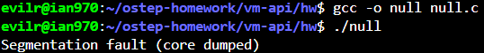
    - As demonstrated in the screenshot, executing the program results in a Segmentation fault (core dumped). This occurs because the pointer p is initialized to NULL (which typically represents memory address 0). When the program attempts to dereference the pointer (*p) to read its value, it tries to access an invalid memory region. Since address 0 is protected by the operating system and restricted from user-space access, the OS intervenes and forcefully terminates the program.

2. Next, compile this program with symbol information included (with
the -g flag). Doing so let’s put more information into the executable, enabling the debugger to access more useful information
about variable names and the like. Run the program under the
debugger by typing gdb ./null and then, once gdb is running,
typing run. What does gdb show you?

    - 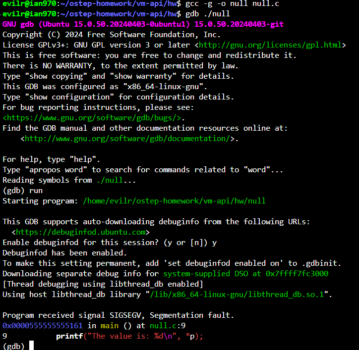
    - As demonstrated in the screenshot, running the program under gdb provides highly useful debugging information. When the program crashes, gdb intercepts the SIGSEGV (Segmentation fault) signal. Because the program was compiled with the -g flag (which includes symbol information), gdb is able to pinpoint the exact location of the crash. It explicitly shows that the error occurred in the main() function at line 9 of null.c `(printf("The value is: %d\n", *p);)`. This illustrates how a debugger helps developers instantly locate the specific line of code responsible for a memory violation.

3. Finally, use the valgrind tool on this program. We’ll use memcheck
that is a part of valgrind to analyze what happens. Run this by
typing in the following: valgrind --leak-check=yes ./null.
What happens when you run this? Can you interpret the output
from the tool?

    - 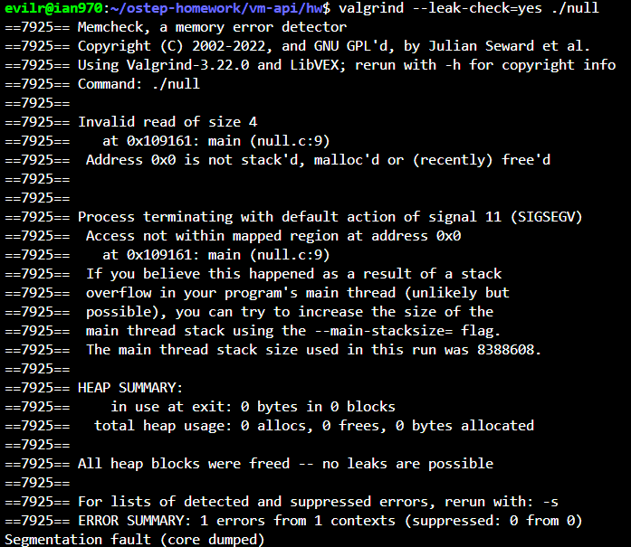
    - As demonstrated in the screenshot, running the program with valgrind provides a detailed memory analysis. Valgrind reports an Invalid read of size 4 at line 9 of null.c, which indicates the program attempted to read a 4-byte integer from an invalid memory location. Crucially, Valgrind specifies that Address 0x0 is not stack'd, malloc'd or (recently) free'd. This confirms that the program tried to access the exact memory address 0x0 (the NULL pointer), which is not legally allocated to the process. Consequently, the OS terminates the process with signal 11 (SIGSEGV). Additionally, the Heap Summary shows no memory leaks, confirming the crash is strictly due to an illegal memory access, not un-freed memory.

4. Write a simple program that allocates memory using malloc() but
forgets to free it before exiting. What happens when this program
runs? Can you use gdb to find any problems with it? How about
valgrind (again with the --leak-check=yes flag)?

    - [leak.c](./leak.c)
    - Looks like nothing will happen if the process exit, because os will recycle all the malloc memories. But if this is a long runging work like web server, the server will finnaly crash because not enought memories.
    - 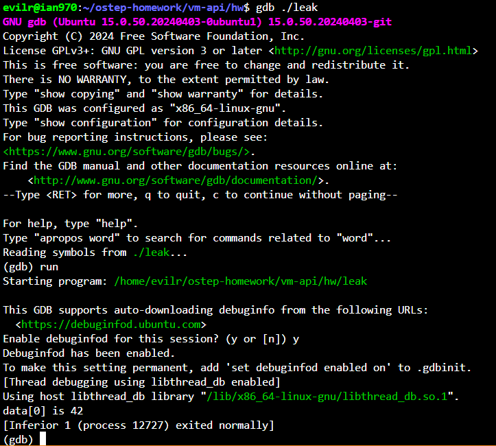
    - 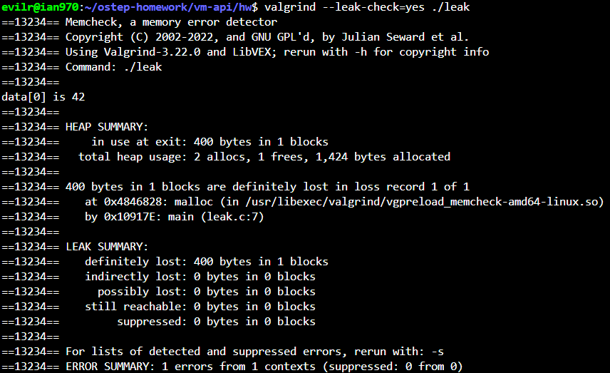
    - As demonstrated in the screenshot, when the program runs normally, it appears to execute perfectly and exit without any errors. This is because modern operating systems automatically reclaim all memory allocated to a process when it terminates. However, if this memory leak occurred in a long-running process (such as a web server), the continuously un-freed memory would eventually exhaust the system's resources and cause a crash. When running the program under gdb, the debugger cannot find the problem. It simply reports that the process 'exited normally' because no illegal memory operations (like a segmentation fault) occurred during runtime. gdb is not designed to track memory allocations over time. On the other hand, valgrind (with the --leak-check=yes flag) successfully detects the bug. The output clearly reports in the LEAK SUMMARY that 400 bytes in 1 blocks are definitely lost (100 integers * 4 bytes/int = 400 bytes). Furthermore, Valgrind pinpoints the exact location of the leaked memory's origin: line 7 in leak.c, where malloc was called but never subsequently freed.

5. Write a program that creates an array of integers called data of size
100 using malloc; then, set data[100] to zero. What happens
when you run this program? What happens when you run this
program using valgrind? Is the program correct?

    - [bounds.c](./bounds.c)
    - 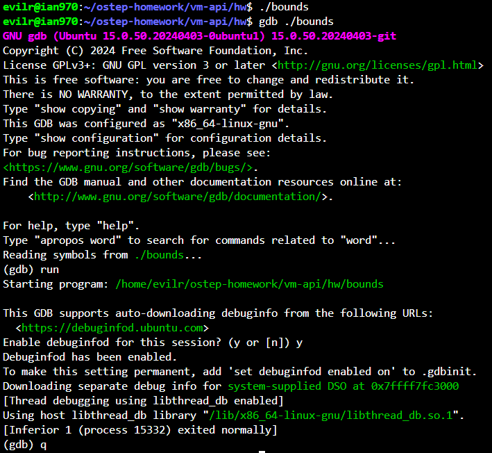
    - 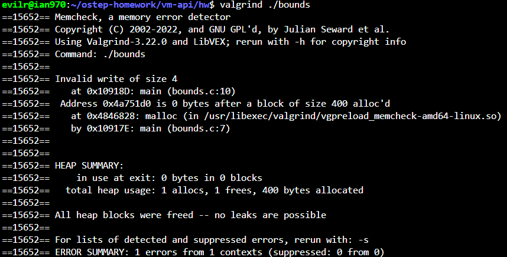
    - Is the program correct?  Absolutely not, it can run, but that doesn't mean it is correct.
    - As demonstrated in the screenshot, running the program normally (and even under gdb) appears to work perfectly without any crashes. It silently executes and exits normally. However, the fact that it runs does not mean it is written correctly. When running the program with valgrind, the tool immediately detects a severe memory bug: an Invalid write of size 4 at line 10. The output explicitly explains that the program is trying to write to an address 0 bytes after a block of size 400 alloc'd. Because arrays in C are zero-indexed, an array of size 100 has valid indices from 0 to 99. Accessing data[100] attempts to write to the 101st element, which strictly falls outside the allocated memory boundary, causing a heap buffer overflow. Therefore, the program is fundamentally incorrect and relies on undefined behavior, even if the operating system does not immediately crash the process.

6. Create a program that allocates an array of integers (as above), frees
them, and then tries to print the value of one of the elements of
the array. Does the program run? What happens when you use
valgrind on it?

    - 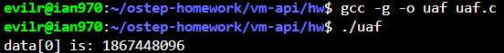
    - 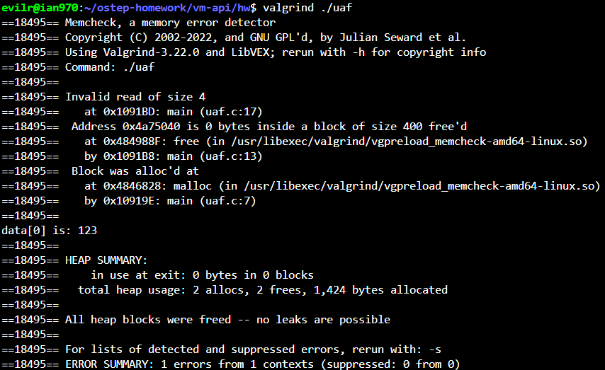

7. Now pass a funny value to free (e.g., a pointer in the middle of the
array you allocated above). What happens? Do you need tools to
find this type of problem?

    - 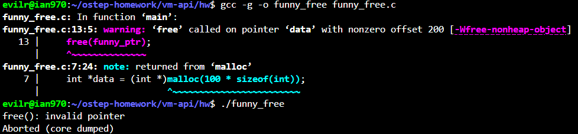
    - 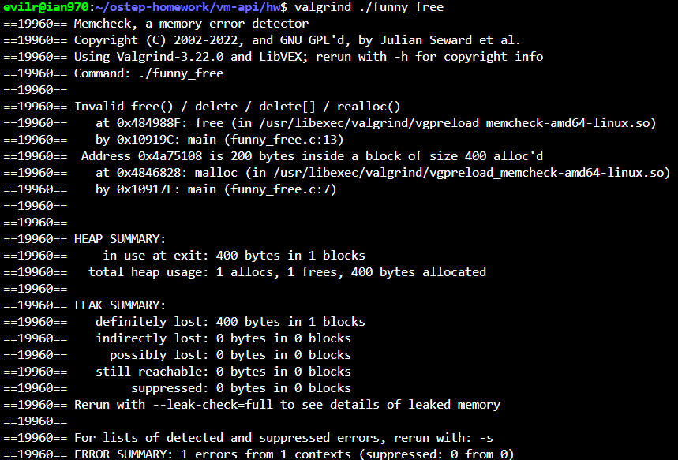
    - Do you need tools to find this type of problem? Half and half. The compiler will complain, but we need tools to find the exact line.

8. Try out some of the other interfaces to memory allocation. For example, create a simple vector-like data structure and related routines that use realloc() to manage the vector. Use an array to
store the vectors elements; when a user adds an entry to the vector, use realloc() to allocate more space for it. How well does
such a vector perform? How does it compare to a linked list? Use
valgrind to help you find bugs.

    - [vector](./vector.c)
    - 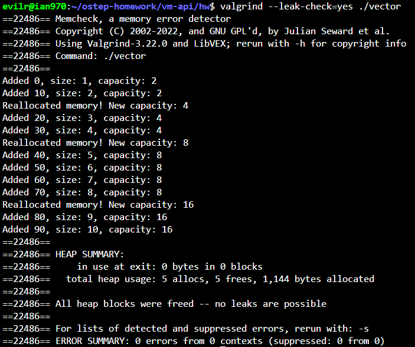

9. Spend more time and read about using gdb and valgrind. Knowing your tools is critical; spend the time and learn how to become
an expert debugger in the UNIX and C environment.

### 🛠️ GDB & Valgrind Advanced Cheat Sheet

#### **1. GDB (GNU Debugger) - Advanced Commands**

*Note: Compile your C program with the `-g` flag (e.g., `gcc -g -o app app.c`) before using GDB.*

| Command                    | Feature                | When to Use / Description                                                                                                                                        |
| :------------------------- | :--------------------- | :--------------------------------------------------------------------------------------------------------------------------------------------------------------- |
| **`layout src`**           | **Visual Source Mode** | Splits the terminal window to display your C source code alongside the GDB prompt. Highlights the currently executing line. (Press `Ctrl+X` then `A` to toggle). |
| **`watch [var]`**          | **Data Watchpoint**    | Pauses program execution immediately when the value of the specified variable (or memory address) is modified. Excellent for finding rogue memory overwrites.    |
| **`bt`** / **`backtrace`** | **Call Stack Trace**   | Prints the entire sequence of function calls that led to the current point. Essential for tracing the origin of a `Segmentation fault` or `Abort` crash.         |
| **`info locals`**          | **Local Variables**    | Displays the values of all local variables in the current stack frame.                                                                                           |

---

#### **2. Valgrind - Advanced Tools & Flags**

*Note: Run Valgrind by prepending it to your executable (e.g., `valgrind [options] ./app`).*

| Command / Flag            | Feature                 | When to Use / Description                                                                                                                                 |
| :------------------------ | :---------------------- | :-------------------------------------------------------------------------------------------------------------------------------------------------------- |
| **`--leak-check=yes`**    | **Memory Leak Check**   | (Memcheck tool) Provides a detailed summary of memory that was `malloc`'d but never `free`'d before the program exited.                                   |
| **`--track-origins=yes`** | **Track Uninitialized** | (Memcheck tool) When Valgrind warns about an "Uninitialised value," this flag tells you exactly which line of code *created* that uninitialized variable. |
| **`--tool=helgrind`**     | **Concurrency Checker** | Detects synchronization errors in multi-threaded programs (e.g., POSIX pthreads). Use this to find **Data Races** and **Deadlocks**.                      |
| **`--tool=massif`**       | **Memory Profiler**     | Measures heap memory usage over the lifetime of the program. Helps identify memory bottlenecks and optimize memory footprints.                            |
