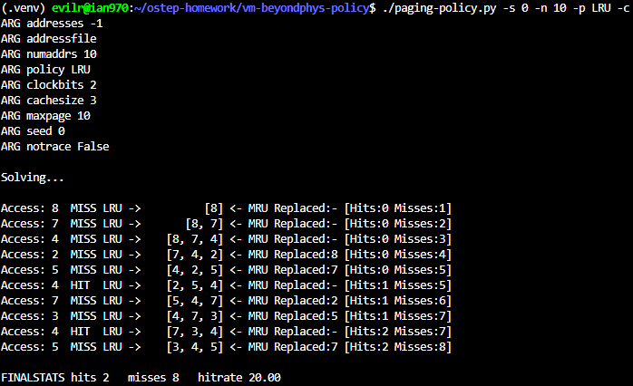
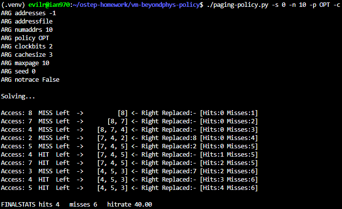
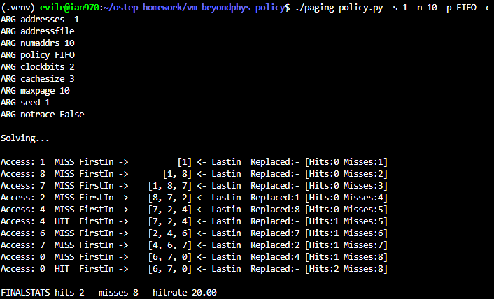
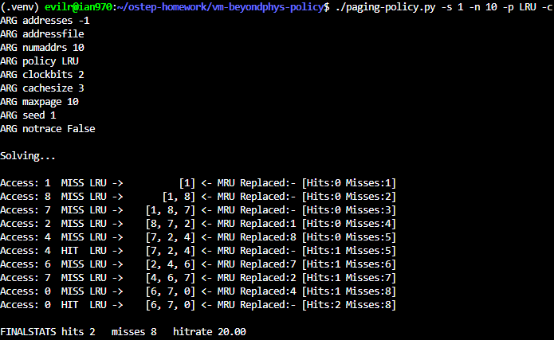
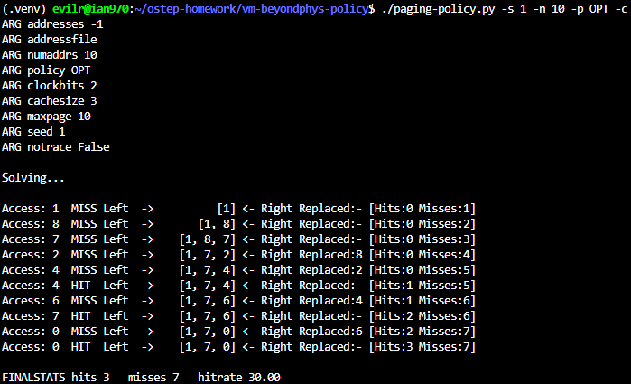
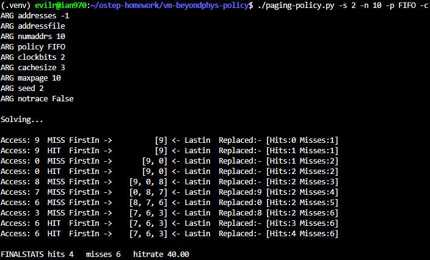
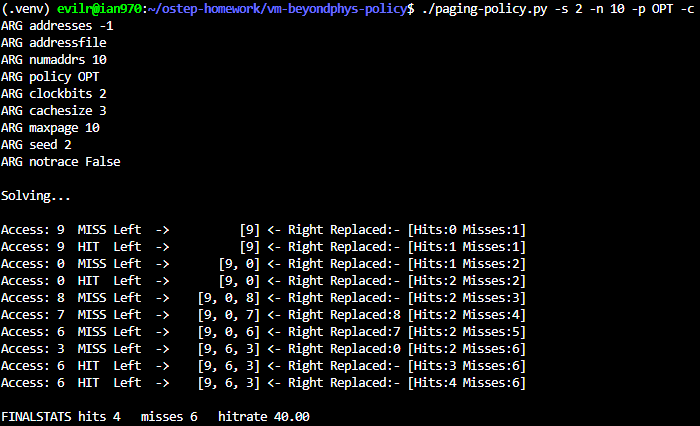

# Homework (Simulation)

This simulator, paging-policy.py, allows you to play around with
different page-replacement policies. See the README for details.

## Questions

1. Generate random addresses with the following arguments: -s 0 -n 10, -s 1 -n 10, and -s 2 -n 10. Change the policy from FIFO, to LRU, to OPT. Compute whether each access in said address traces are hits or misses.

    > 
    > 
    > 
    > 
    > 
    > 
    > 
    > 
    > 

2. For a cache of size 5, generate worst-case address reference streams for each of the following policies: FIFO, LRU, and MRU (worst-case reference streams cause the most misses possible. For the worst case reference streams, how much bigger of a cache is needed to improve performance dramatically and approach OPT?

    > Worst-Case Reference Streams (Cache Size = 5)

    - FIFO and LRU: * The Pattern: Looping sequentially over $N+1$ distinct pages (where $N$ is the cache size).
        - Example Stream: 0, 1, 2, 3, 4, 5, 0, 1, 2, 3, 4, 5...
        - Why it fails: Both policies will continuously evict the exact page that is about to be requested next, resulting in a 100% miss rate.
    - MRU (Most Recently Used):
        - The Pattern: "Ping-ponging" between two pages right after the cache is full.
        - Example Stream: 0, 1, 2, 3, 4, 5, 4, 5, 4, 5, 4, 5...
        - Why it fails: Since MRU evicts the page that was just used, alternating between two pages ensures the needed page is always the one that was just kicked out.

    > How much bigger of a cache is needed to approach OPT?

    - The Answer: Just 1 more page (increasing the cache size from 5 to 6).
    - The Reason: The total "working set" of the worst-case streams we created above is exactly 6 distinct pages. If you increase the cache size to 6, all pages can stay in memory simultaneously. After the initial compulsory misses, the miss rate drops to 0%, perfectly matching the Optimal (OPT) policy.

3. Generate a random trace (i.e., use python and write a script that outputs random addresses, which you can then feed into the simulator). How would you expect the different policies to perform on such a trace?

    > [generate_random.py](./generate_random.py)
    >> ./paging-policy.py -C 10 -p FIFO -c -a $(python3 ./hw/generate_random.py)
    >>
    >> ./paging-policy.py -C 10 -p LRU -c -a $(python3 ./hw/generate_random.py)
    >>
    >> ./paging-policy.py -C 10 -p MRU -c -a $(python3 ./hw/generate_random.py)
    >>
    >> ./paging-policy.py -C 10 -p RAND -c -a $(python3 ./hw/generate_random.py)

    - Generating the Trace
        - I wrote a simple Python script using the random module to generate a comma-separated list of random page numbers. I then fed this generated string into the simulator using the -a argument.

    - Expected Performance
        - For a purely random trace, I expect all policies (FIFO, LRU, MRU, and RAND) to perform equally poorly, yielding roughly the same low hit rate. The only exception is OPT, which will still perform slightly better due to its future lookahead ability.

    - The Reasoning
        - This happens because purely random traces lack locality (both temporal and spatial). Policies like LRU and MRU are designed under the assumption that past access history can predict future accesses. In a random stream, the past provides zero information about the future. Therefore, their performance degrades to be essentially identical to random guessing (the RAND policy), and the hit rate simply converges to (Cache Size) / (Total Number of Unique Pages).

4. Now generate a trace with some locality. How can you generate such a trace? How does LRU perform on it? How much better than RAND is LRU? How does CLOCK do? How about CLOCK with different numbers of clock bits?

    > [generate_locality.py](./generate_locality.py)
    >> ./paging-policy.py -C 10 -p FIFO -c -a $(python3 ./hw/generate_locality.py)
    >>
    >> ./paging-policy.py -C 10 -p LRU -c -a $(python3 ./hw/generate_locality.py)
    >>
    >> ./paging-policy.py -C 10 -p MRU -c -a $(python3 ./hw/generate_locality.py)
    >>
    >> ./paging-policy.py -C 10 -p RAND -c -a $(python3 ./hw/generate_locality.py)

    - Generating a Trace with Locality
    "To generate a trace with locality, I wrote a Python script based on the 80/20 rule (Pareto principle). I designed the script so that 80% of the memory accesses target a small, concentrated subset of pages (the 'hot pages', e.g., pages 0-19), while the remaining 20% of accesses randomly target the rest of the pages (the 'cold pages', e.g., pages 20-99). This artificial bias simulates the temporal and spatial locality found in real-world applications."

    - LRU vs. RAND Performance
      - Because this trace exhibits strong temporal locality, LRU performs exceptionally well. LRU successfully identifies and locks the frequently accessed 'hot pages' into the cache, resulting in a high hit rate.

      - Compared to RAND, LRU is significantly better. The RAND policy evicts pages blindly, meaning it frequently kicks out hot pages just before they are needed again. Consequently, LRU will have a substantially higher hit rate and fewer page faults than RAND on this trace.

    - Performance of the CLOCK Algorithm
      - The CLOCK algorithm performs very similarly to LRU, achieving a hit rate that is almost identical. It serves as an excellent, low-overhead approximation of LRU. By utilizing a 'use bit' to grant recently accessed pages a second chance, CLOCK effectively keeps the hot pages in memory without the heavy computational burden of maintaining a strict timestamp or ordered list."

    - Impact of Different Clock Bits
      - When increasing the number of clock bits (using the -b argument), the CLOCK algorithm gains the ability to maintain a finer-grained history of page usage, acting like an aging mechanism.

        - With 1 bit: The system can only differentiate between 'recently used' and 'not recently used.'
        - With multiple bits (e.g., 2 or more): The system can differentiate between pages used very recently, pages used a while ago, and pages not used in a long time.

      - As a result, increasing the clock bits makes the CLOCK algorithm's eviction choices even closer to true LRU, which generally leads to a slight improvement in the overall hit rate, though it requires slightly more memory overhead per page to store the extra bits."

5. Use a program like valgrind to instrument a real application and generate a virtual page reference stream. For example, running valgrind --tool=lackey --trace-mem=yes ls will output a nearly-complete reference trace of every instruction and data reference made by the program ls. To make this useful for the simulator above, you’ll have to first transform each virtual memory reference into a virtual page-number reference (done by masking off the offset and shifting the resulting bits downward). How big of a cache is needed for your application trace in order to satisfy a large fraction of requests?

    > valgrind --tool=lackey --trace-mem=yes ls 2> trace.txt
    >
    >> head trace.txt
    >
    >
    > [parse_valgrind](./parse_valgrind.py)
    >
    >> python3 parse_valgrind.py
    >>
    >> [vpn_trace](./vpn_trace.txt)
    >
    >
    >>> test Cache Size = 10
    >>>
    >>> ./paging-policy.py -f vpn_trace.txt -C 10 -c
    >>>
    >>> test Cache Size = 50
    >>>
    >>> ./paging-policy.py -f vpn_trace.txt -C 50 -c
    >>>
    >>> test Cache Size = 100
    >>>
    >>> ./paging-policy.py -f vpn_trace.txt -C 100 -c

    - Trace Generation and Translation
      - I generated a memory reference trace for the ls command using valgrind --tool=lackey --trace-mem=yes ls 2> trace.txt.To convert these virtual memory addresses into Virtual Page Numbers (VPNs), I wrote a Python script. Assuming a standard page size of 4KB ($2^{12}$ bytes), I parsed the hexadecimal addresses from the valgrind output, converted them to integers, and right-shifted the values by 12 bits (address >> 12) to mask off the offset and extract the VPN. I collected the first 5,000 accesses to feed into the simulator.
    - Analyzing the Required Cache Size
      - I ran the generated VPN trace through paging-policy.py using the LRU policy while gradually increasing the cache size (-C).I observed that the hit rate does not increase linearly. Instead, it rises sharply and then plateaus. For this specific ls trace, a relatively small cache size (e.g., around 50 to 100 pages, depending on the exact execution environment) is sufficient to satisfy a large fraction of the requests (achieving a >95% hit rate).This behavior perfectly illustrates the concept of a program's Working Set. Once the cache is large enough to hold the ls command's working set (the core code and data it loops over frequently), any further increase in cache size yields diminishing returns.
