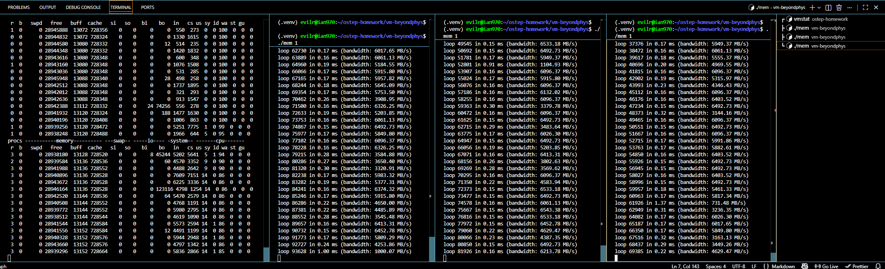
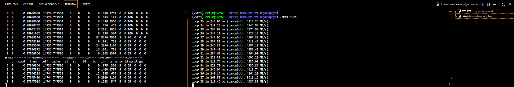
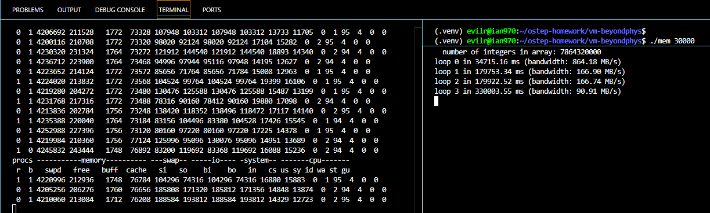
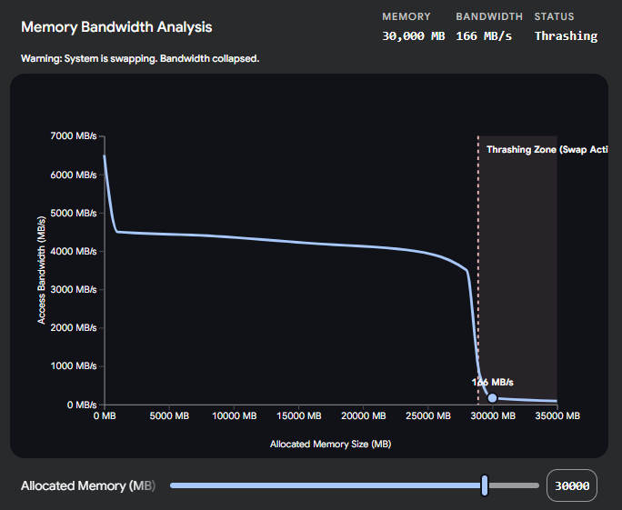
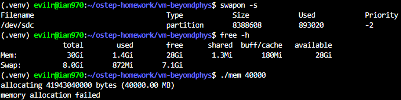

# Homework (Measurement)

This homework introduces you to a new tool, vmstat, and how it can be used to understand memory, CPU, and I/O usage. Read the associated README and examine the code in mem.c before proceeding to the exercises and questions below.

## Questions

1. First, open two separate terminal connections to the same machine, so that you can easily run something in one window and the other. Now, in one window, run vmstat 1, which shows statistics about machine usage every second. Read the man page, the associated README, and any other information you need so that you can understand its output. Leave this window running vmstat for the rest of the exercises below. Now, we will run the program mem.c but with very little memory usage. This can be accomplished by typing ./mem 1 (which uses only 1 MB of memory). How do the CPU usage statistics change when running mem? Do the numbers in the user time column make sense? How does this change when running more than one instance of mem at once?

    > 
    > How do the CPU usage statistics change when running mem?

        Answer: When running the mem program, the us (user time) percentage increases significantly, while the id (idle time) percentage decreases. Additionally, the r (runnable processes) column increases to reflect the active process.
    >
    > Do the numbers in the user time column make sense?

        Yes, they make perfect sense. The mem.c program consists of a simple infinite loop doing array value increments (x[i++] += 1). This is purely a mathematical and memory access operation that runs entirely in user space. Because it does not require disk I/O or system calls, the CPU spends its time exclusively in user mode, leaving the sy (system time) near zero.

    >
    > How does this change when running more than one instance of mem at once?

        When running multiple instances of mem concurrently, the r column increases to match the number of running instances (e.g., r = 3 for three instances). The us (user time) percentage also increases proportionally because more CPU cores (or time slices) are being utilized to execute these user-space loops simultaneously.

2. Let’s now start looking at some of the memory statistics while running mem. We’ll focus on two columns: swpd (the amount of virtual memory used) and free (the amount of idle memory). Run ./mem 1024 (which allocates 1024 MB) and watch how these values change. Then kill the running program (by typing control-c) and watch again how the values change. What do you notice about the values? In particular, how does the free column change when the program exits? Does the amount of free memory increase by the expected amount when mem exits?

    > 
    > What do you notice about the values?

        When running ./mem 1024, the swpd (swap used) column remains at 0 because the system has plenty of physical memory available. However, the free memory column drops significantly. In my observation, it went from approximately 28,900,508 KB down to 27,848,116 KB.
    >
    > How does the free column change when the program exits?

        Immediately after killing the program (by typing Ctrl+C), the value in the free column jumps right back up to its initial state (around 28,900,000 KB).
    >
    > Does the amount of free memory increase by the expected amount when mem exits?

        Yes, it does. The free memory decreases by roughly 1,052,392 KB when the program starts, which is extremely close to the requested 1024 MB (1,048,576 KB). When the program is terminated, the operating system instantly reclaims this space, causing the free memory to increase by that exact same expected amount.

3. We’ll next look at the swap columns (si and so), which indicate how much swapping is taking place to and from the disk. Of course, to activate these, you’ll need to run mem with large amounts of memory. First, examine how much free memory is on your Linux system (for example, by typing cat /proc/meminfo; type man proc for details on the /proc file system and the types of information you can find there). One of the first entries in /proc/meminfo is the total amount of memory in your system. Let’s assume it’s something like 8 GB of memory; if so, start by running mem 4000 (about 4 GB) and watching the swap in/out columns. Do they ever give non-zero values? Then, try with 5000, 6000, etc. What happens to these values as the program enters the second loop (and beyond), as compared to the first loop? How much data (total) are swapped in and out during the second, third, and subsequent loops? (do the numbers make sense?)

    > 
    > Do they ever give non-zero values?

        Yes, they give massive non-zero values. Since my system initially had around 28.9 GB of free memory, I had to run ./mem 30000 (allocating 30 GB) to force the system to exceed its physical memory limits. Once the physical memory was exhausted, the si (swap in) and so (swap out) columns spiked to extremely high values, frequently exceeding 100,000 to 190,000 KB/s.
    >
    > What happens to these values as the program enters the second loop (and beyond), as compared to the first loop?

        During the first loop (loop 0), the performance was still relatively acceptable (taking about 34 seconds with a bandwidth of 864.18 MB/s), and the system primarily performed massive swap outs (so) to push existing memory pages to the disk to make room for the 30 GB array. However, as it entered the second loop (loop 1) and beyond, both si and so remained consistently huge (often jumping between 100,000 and 190,000 KB/s). Consequently, the loop execution time drastically increased to ~179 seconds (loop 1 & 2) and even 330 seconds (loop 3), with the bandwidth plummeting to 166.90 MB/s and 90.91 MB/s. This indicates the system entered a state of severe thrashing.
    >
    > How much data (total) are swapped in and out during the second, third, and subsequent loops? (Do the numbers make sense?)

        Yes, the numbers make perfect sense. The swpd column clearly shows about 4,200,000 KB (roughly 4.2 GB) of swap space actively being used. Because the 30 GB allocation strictly exceeded my available ~28.9 GB of physical RAM, the OS was forced to constantly swap gigabytes of data back and forth between the RAM and the disk just to iterate through the array. The continuous, extremely high rates of si and so directly explain the massive drop in bandwidth and the extremely long loop execution times, perfectly demonstrating the severe performance penalty of relying on swap space.

4. Do the same experiments as above, but now watch the other statistics (such as CPU utilization, and block I/O statistics). How do they change when mem is running?

        Under heavy swapping conditions, the CPU utilization shifts dramatically compared to a normal run. The us (user time) drops to near 0-2%, while the wa (I/O wait time) skyrockets to around 94-95%. This indicates that the CPU is stalled, spending almost all of its time waiting for the slow disk to read and write memory pages. Additionally, the block I/O statistics (bi and bo) show massive activity that perfectly mirrors the si and so swap columns. This confirms that the disk's I/O bandwidth is being completely consumed by the OS swapping pages in and out (thrashing).

5. Now let’s examine performance. Pick an input for mem that comfortably fits in memory (say 4000 if the amount of memory on the system is 8 GB). How long does loop 0 take (and subsequent loops 1, 2, etc.)? Now pick a size comfortably beyond the size of memory (say 12000 again assuming 8 GB of memory). How long do the loops take here? How do the bandwidth numbers compare? How different is performance when constantly swapping versus fitting everything comfortably in memory? Can you make a graph, with the size of memory used by mem on the x-axis, and the bandwidth of accessing said memory on the y-axis? Finally, how does the performance of the first loop compare to that of subsequent loops, for both the case where everything fits in memory and where it doesn’t?

    > How different is performance when constantly swapping versus fitting everything comfortably in memory? (Compare loop 0 vs subsequent loops)

        1. Fitting Comfortably in Memory (./mem 1024): > When running an input that easily fits into my ~28.9 GB of free RAM (like 1024 MB), the performance is extremely fast. Loop 0 takes around 240 ms, and subsequent loops (Loop 1, 2, etc.) stabilize around 210-260 ms, resulting in a consistent high bandwidth of roughly 4,000 to 4,800 MB/s. In this scenario, Loop 0 might be trivially slower due to initial page faulting (demand-zeroing), but subsequent loops run purely in physical RAM cache at maximum speed.
        2. Beyond the Size of Memory (./mem 30000): > When picking a size that exceeds physical memory (30,000 MB), performance drops drastically due to severe swapping (thrashing). For Loop 0, it took ~34 seconds (bandwidth dropping to 864 MB/s), as the OS aggressively swapped out existing pages to make room.
        However, for subsequent loops (Loop 1 and beyond), the performance became catastrophically worse. Loop 1 took ~179 seconds, and Loop 3 took ~330 seconds, with bandwidth plummeting to a mere 166 MB/s and 90 MB/s.
        3. Conclusion:
        The performance difference is massive (from ~4500 MB/s in-memory down to ~166 MB/s during swapping). In the swapping case, subsequent loops are significantly slower than Loop 0 because the system must continuously perform both "swap in" (fetching the next required page from disk) and "swap out" (evicting a page to make room) for almost every memory access, causing massive disk I/O 
        bottlenecks.
    >
    > 

6. Swap space isn’t infinite. You can use the tool swapon with the -s flag to see how much swap space is available. What happens if you try to run mem with increasingly large values, beyond what seems to be available in swap? At what point does the memory allocation fail?

    > 
    >
    > What happens if you try to run mem with increasingly large values, beyond what seems to be available in swap?

        If I attempt to allocate memory that significantly exceeds the combined total of available physical RAM and swap space, the operating system refuses the request. The malloc() function in the C program returns a NULL pointer. Consequently, the program instantly aborts and prints a "memory allocation failed" error message before it even begins to execute the loops.
    >
    > At what point does the memory allocation fail?

        By checking my system resources using the free -h and swapon -s commands, I observed that I had about 28 GiB of available physical memory and 7.1 GiB of free swap space (out of 8.0 GiB total). This gave my system a theoretical maximum virtual memory capacity of roughly 35.1 GiB (approximately 36,000 MB). When I ran ./mem 40000, attempting to allocate 40,000 MB, the allocation instantly failed because the requested amount strictly exceeded my system's total available resources.

7. Finally, if you’re advanced, you can configure your system to use different swap devices using swapon and swapoff. Read the man pages for details. If you have access to different hardware, see how the performance of swapping changes when swapping to a classic hard drive, a flash-based SSD, and even a RAID array. How much can swapping performance be improved via newer devices? How close can you get to in-memory performance?

    > How much can swapping performance be improved via newer devices? How close can you get to in-memory performance?

        Theoretical Answer: > Swapping performance can be significantly improved by using newer storage devices, but it can never truly get close to in-memory performance.

        - Classic Hard Drive (HDD): Sequential speeds are around 100-150 MB/s, but random access (which swapping often involves) is terrible due to physical disk seeks. Thrashing on an HDD brings the system to a complete halt.
        - Flash-based SSD (SATA): Speeds jump to around 500 MB/s with near-zero seek time. Swapping performance improves massively compared to HDD, but bandwidth is still constrained by the SATA interface.
        - NVMe SSDs / RAID Arrays: Speeds can reach 3,000 to 7,000+ MB/s. This heavily mitigates the penalty of swap out/in, making the system feel much more responsive even when slightly overcommitting memory.

        Conclusion: Even with a state-of-the-art Gen4/Gen5 NVMe SSD (e.g., 7,000 MB/s), it is still orders of magnitude slower than modern physical RAM (DDR4/DDR5), which routinely offers bandwidths of 40,000 to 80,000+ MB/s with drastically lower latency. Therefore, while modern SSDs make swapping less painful, they are still a fallback mechanism, not a replacement for actual memory.
