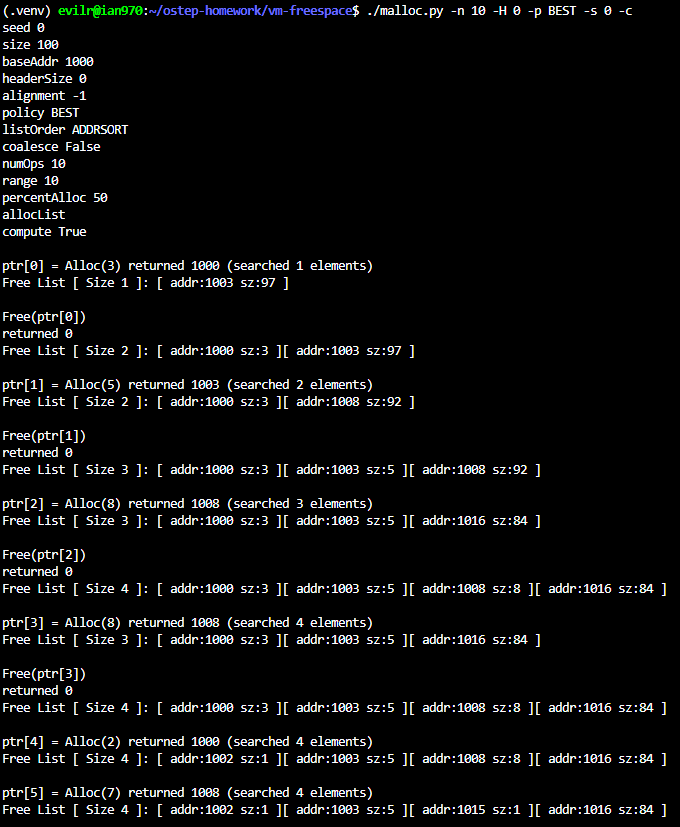
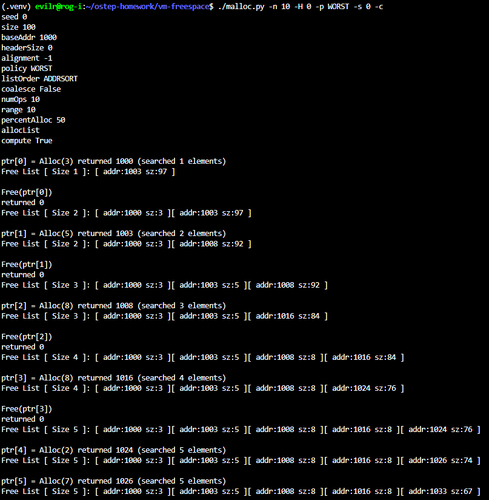
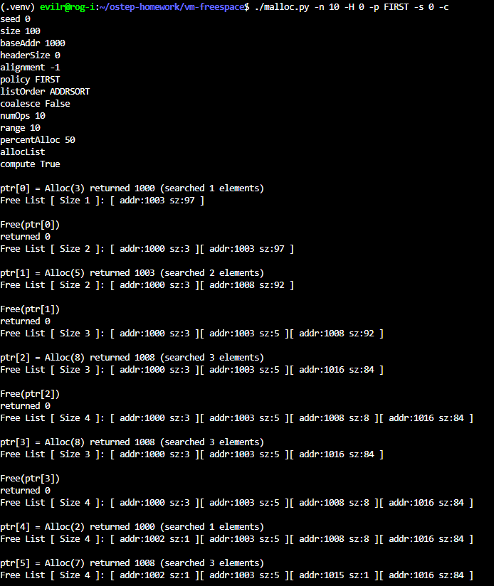
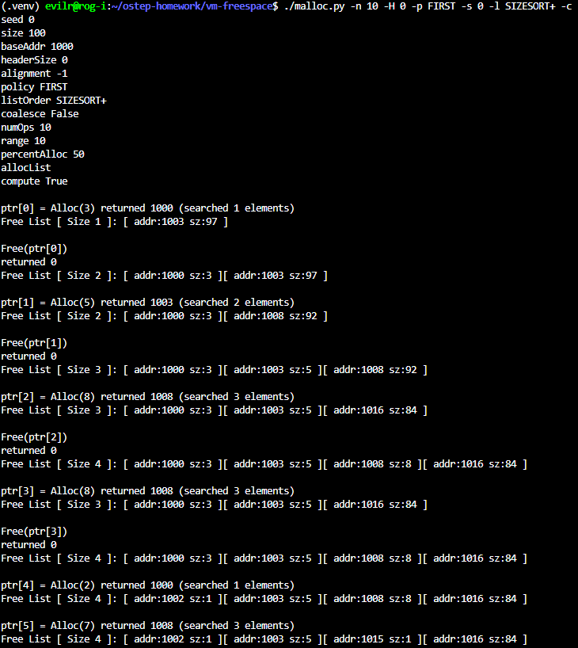
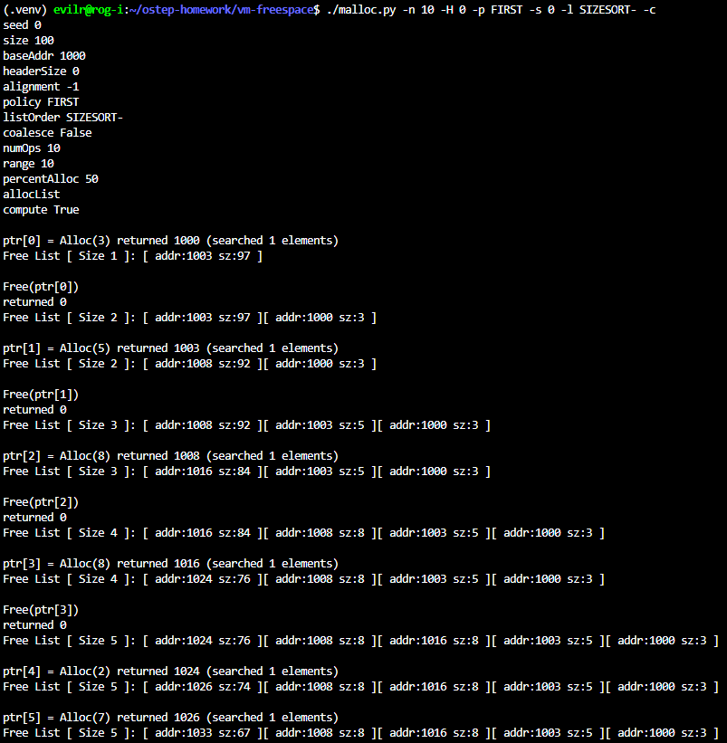
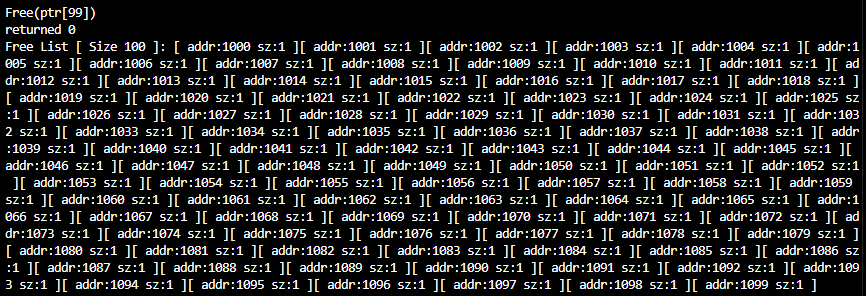

# Homework (Simulation)

The program, malloc.py, lets you explore the behavior of a simple
free-space allocator as described in the chapter. See the README for
details of its basic operation.

## Questions

1. First run with the flags -n 10 -H 0 -p BEST -s 0 to generate a few random allocations and frees. Can you predict what alloc()/free() will return? Can you guess the state of the free list after each request? What do you notice about the free list over time?

    - 
    - Can you guess the state of the free list after each request?
      - Yes, by tracing the Best-Fit policy with coalescing disabled, I can predict the state of the free list. For example, after the final request, the free list ends up being: [(1002, 1), (1003, 5), (1015, 1), (1016, 84)]
    - What do you notice about the free list over time?
      - Over time, the free list becomes highly fragmented. Because the Best-Fit policy always chooses the tightest fit, it leaves behind many tiny, unusable memory chunks (like the 1-byte blocks). This is a clear example of external fragmentation.

2. How are the results different when using a WORST fit policy to
search the free list (-p WORST)? What changes?

    - 
    - What changes?
      - Under the WORST fit policy, the allocator searches for the largest free chunk rather than the tightest fit. As a result, the state of the free list changes significantly. For example, instead of leaving 1-byte fragments, the list becomes [(1000,3), (1003,5), (1008,8), (1016,8), (1033,67)]. What changes is that while the remaining chunks are larger and potentially more useful, the single largest block (originally 100 bytes) is rapidly depleted down to 67 bytes. This reduces the system's ability to handle large memory requests later on.

3. What about when using FIRST fit (-p FIRST)? What speeds up
when you use first fit?

    - 
    - When using the FIRST fit policy, the search time for a free block speeds up significantly. This is because First-Fit stops scanning the free list as soon as it finds the first block that is large enough to satisfy the request. Unlike Best-Fit or Worst-Fit, which must traverse the entire list to find the optimal or largest block, First-Fit benefits from an early exit, making the allocation process much faster on average.

4. For the above questions, how the list is kept ordered can affect the
time it takes to find a free location for some of the policies. Use
the different free list orderings (-l ADDRSORT, -l SIZESORT+,
-l SIZESORT-) to see how the policies and the list orderings interact.

    - The interaction between the FIRST fit policy and the free list ordering is very predictable. If the list is ordered by size from smallest to largest (-l SIZESORT+), FIRST fit will naturally find the smallest adequate block first, making its behavior identical to the BEST fit policy. Conversely, if the list is ordered by size from largest to smallest (-l SIZESORT-), FIRST fit will encounter the largest blocks first, resulting in the exact same behavior as the WORST fit policy.
    - 
    - 

5. Coalescing of a free list can be quite important. Increase the number of random allocations (say to -n 1000). What happens to larger allocation requests over time? Run with and without coalescing (i.e., without and with the -C flag). What differences in outcome do you see? How big is the free list over time in each case? Does the ordering of the list matter in this case?

    - What happens to larger allocation requests over time?
      - Without coalescing, every allocation that splits a larger block increases the total number of free blocks by 1. For instance, if out of 500 allocations, 300 require splitting a larger block, the memory will eventually fragment into $300 + 1 = 301$ distinct small blocks. Over time, without coalescing, the free list grows extremely large and becomes filled with tiny, unusable fragments, causing larger allocation requests to fail.
    - Run with and without coalescing (i.e., without and with the -C flag). What differences in outcome do you see? How big is the free list over time in each case? Does the ordering of the list matter in this case?
      - With coalescing enabled (-C), the outcome changes dramatically. Instead of accumulating hundreds of tiny fragments, the free list remains much smaller because adjacent free chunks are constantly merged back into larger, contiguous blocks. The ordering of the list matters immensely in this case. Using ADDRSORT (ordered by address) makes coalescing highly efficient. Because physically adjacent memory blocks are also adjacent nodes in the free list, the allocator can easily check neighbors and merge them in constant time. If we used SIZESORT, the allocator would have to scan the entire list to find physical neighbors, making the coalescing process extremely slow.
      - Extra Observation:
        I noticed that running the simulation with ./malloc.py -n 1000 -H 0 -p FIRST -s 0 -l SIZESORT- -c -C eventually leads to an allocation failure, despite coalescing (-C) being enabled. This happens because FIRST combined with SIZESORT- acts exactly like WORST fit, which rapidly breaks down large chunks. More importantly, the coalesce function typically relies on physical neighbors being adjacent in the free list. Since the list is sorted by size (SIZESORT-) instead of address, physically adjacent chunks are separated in the list. The allocator fails to recognize and merge them, causing severe fragmentation and eventual allocation failure even with -C turned on.

6. What happens when you change the percent allocated fraction -P
to higher than 50? What happens to allocations as it nears 100?
What about as the percent nears 0?

    - As -P nears 100: The simulation almost exclusively allocates memory. The heap space is rapidly consumed, and the free list shrinks quickly. Very soon, the allocator runs out of space, resulting in numerous failed allocations (returning -1). As -P nears 0: The simulation predominantly attempts to free memory. However, since you cannot free memory that hasn't been allocated, the allocator spends most of its time doing nothing. The free list remains largely intact, mostly staying as a single large, unfragmented block for the duration of the simulation."

7. What kind of specific requests can you make to generate a highlyfragmented free space? Use the -A flag to create fragmented free
lists, and see how different policies and options change the organization of the free list.

    - FRAG_SCRIPT=$(python3 -c "print(','.join(['+1']*100 + ['-'+str(i) for i in range(100)]))")
    - python3 malloc.py -H 0 -p BEST -A $FRAG_SCRIPT -c
    - 
