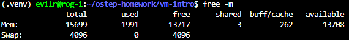
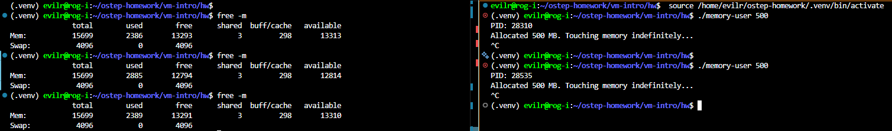
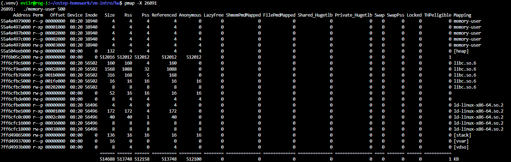
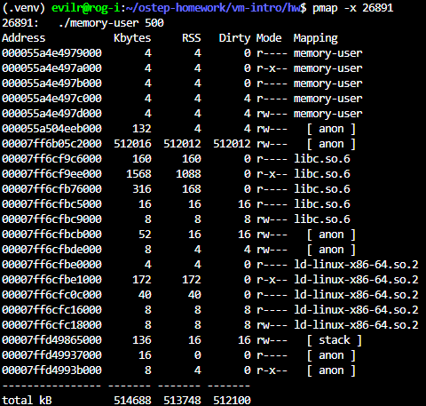
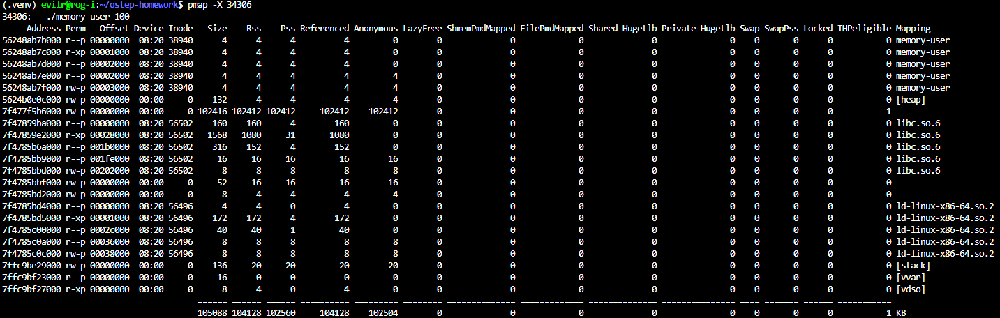
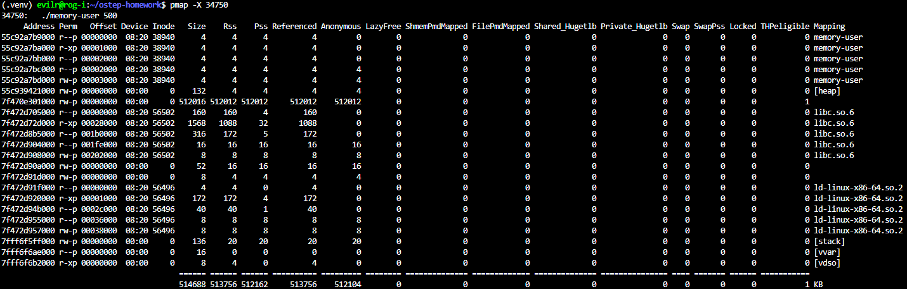

# Homework (Code)

In this homework, we’ll just learn about a few useful tools to examine
virtual memory usage on Linux-based systems. This will only be a brief
hint at what is possible; you’ll have to dive deeper on your own to truly
become an expert (as always!).

## Questions

1. The first Linux tool you should check out is the very simple tool
free. First, type man free and read its entire manual page; it’s
short, don’t worry!

    - man free

2. Now, run free, perhaps using some of the arguments that might
be useful (e.g., -m, to display memory totals in megabytes). How
much memory is in your system? How much is free? Do these
numbers match your intuition?

    - 

3. Next, create a little program that uses a certain amount of memory,
called memory-user.c. This program should take one commandline argument: the number of megabytes of memory it will use.
When run, it should allocate an array, and constantly stream through
the array, touching each entry. The program should do this indefinitely, or, perhaps, for a certain amount of time also specified at the
command line.

    - [memory-user.c](./memory-user.c)

4. Now, while running your memory-user program, also (in a different terminal window, but on the same machine) run the free
tool. How do the memory usage totals change when your program
is running? How about when you kill the memory-user program?
Do the numbers match your expectations? Try this for different
amounts of memory usage. What happens when you use really
large amounts of memory?

    - 

5. Let’s try one more tool, known as pmap. Spend some time, and read
the pmap manual page in detail.

    - man pmap

6. To use pmap, you have to know the process ID of the process you’re
interested in. Thus, first run ps auxw to see a list of all processes;
then, pick an interesting one, such as a browser. You can also use
your memory-user program in this case (indeed, you can even
have that program call getpid() and print out its PID for your
convenience).

    - [memory-user.c](./memory-user.c)

7. Now run pmap on some of these processes, using various flags (like
-X) to reveal many details about the process. What do you see?
How many different entities make up a modern address space, as
opposed to our simple conception of code/stack/heap?

    - 
    - 
    - Q7 Observation Summary:

        Based on the pmap output of the memory-user process, here is a summary of the findings regarding the composition of a modern address space:

            - The Core Observation: The output reveals that a modern address space is far more complex than the traditional, simplified model of just "Code, Heap, and Stack." Instead of just three segments, the address space consists of dozens of distinct memory mappings.

            - Key Entities Identified:
            Beyond the basic conception, the modern address space is made up of several different entities:

                1. Executable Segments: The program itself (memory-user) is split into multiple mappings based on permissions (e.g., r-x- for executable Code/Text, and rw-- for Data/BSS).

                2. Shared Libraries: Dynamically linked libraries, such as libc.so.6 (the C standard library) and ld-linux-x86-64.so.2 (the dynamic linker), are mapped directly into the address space.

                3. Anonymous Mappings ([ anon ]): These are independent blocks of memory requested directly from the OS (typically via mmap). Notably, large malloc requests are placed here rather than in the traditional heap.

                4. The Traditional Heap & Stack: The [ heap ] and [ stack ] are still present, though the heap may remain surprisingly small if large allocations are handled via anonymous mappings.

                5. Kernel Virtual Areas ([ vdso ], [ vvar ]): These are special, small memory regions injected by the operating system kernel into user space to speed up certain system calls (like reading the system clock) without requiring a full context switch.

        Conclusion: A modern address space is a highly fragmented and dynamic environment composed of the executable code, various shared libraries, specialized kernel interfaces, and multiple distinct memory allocation regions, all managed with fine-grained access permissions.

8. Finally, let’s run pmap on your memory-user program, with different amounts of used memory. What do you see here? Does the
output from pmap match your expectations?

    - 
    - 
    - Q8 Observation Summary

        Based on the pmap outputs for running ./memory-user 100 and ./memory-user 500, here is a summary of the observations:

        What I saw (The Observations):

            Proportional Memory Allocation: The most obvious difference between the two outputs is a single, large anonymous memory region (listed just below the [heap]). For the 100 MB run, its size is 102,416 KB (~100 MB). For the 500 MB run, it scales exactly to 512,016 KB (~500 MB).
            Static Segments: Other memory entities—such as the program's code/data segments, shared libraries (libc.so), and the [stack]—remained identical in size across both runs.
            The Heap Remained Small: Surprisingly, the traditional [heap] segment did not grow at all, staying at a constant 132 KB in both cases.

        Does it match expectations?

            Yes, absolutely. The operating system allocated the precise amount of virtual memory requested via the command-line argument.
            Furthermore, it perfectly demonstrates how modern memory allocation works under the hood. When requesting massive amounts of memory, the C standard library (malloc) does not expand the traditional heap. Instead, it uses the mmap() system call to request a large, independent anonymous memory mapping directly from the OS.
