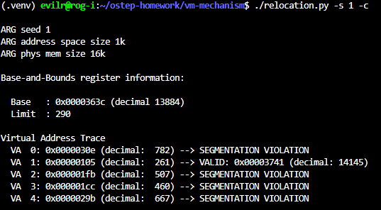
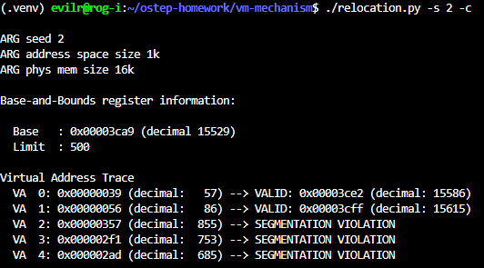
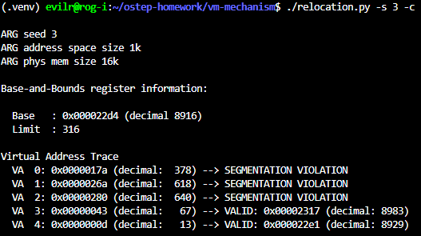
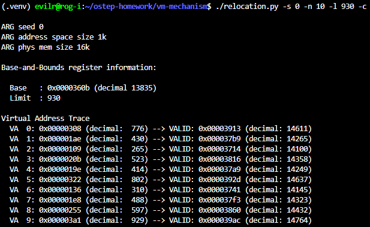
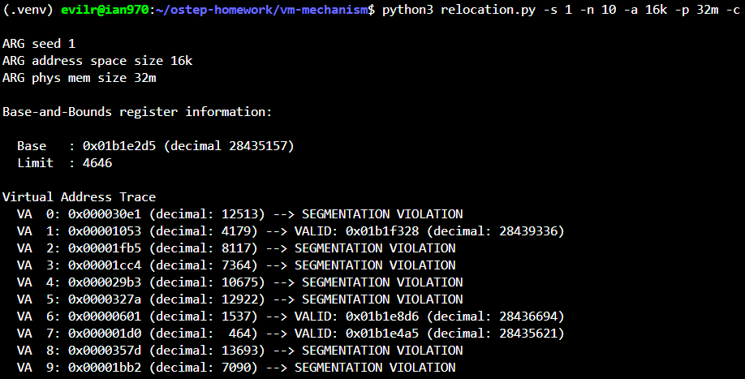
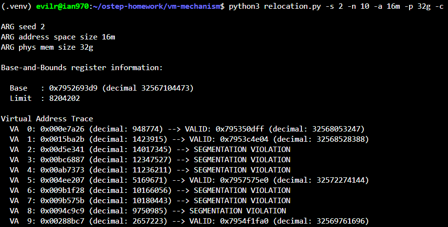
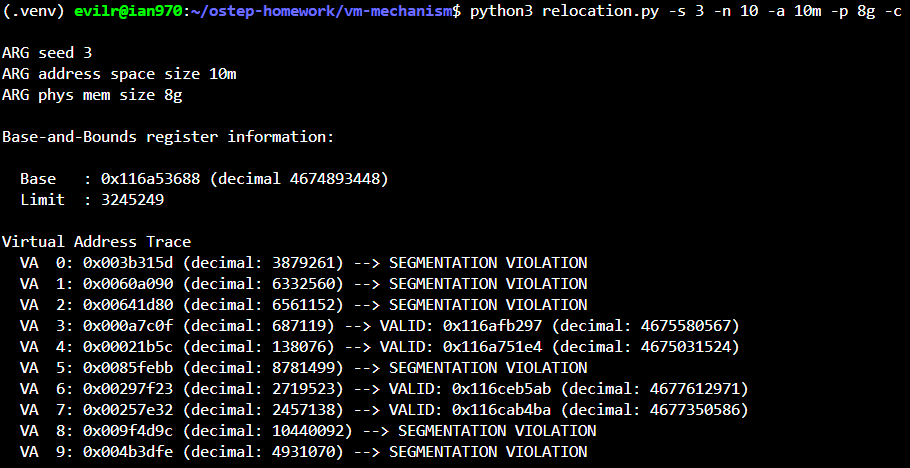
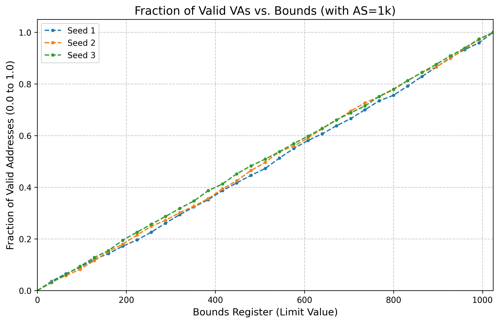

# Homework (Simulation)

The program relocation.py allows you to see how address translations are performed in a system with base and bounds registers. See the
README for details.

## Questions

1. Run with seeds 1, 2, and 3, and compute whether each virtual address generated by the process is in or out of bounds. If in bounds,
compute the translation.

    - 
    - 
    - 

2. Run with these flags: -s 0 -n 10. What value do you have to set
-l (the bounds register) to in order to ensure that all the generated
virtual addresses are within bounds?

    - Find the max VA, and plus 1 to it, which is 929 + 1 = 930
    - 

3. Run with these flags: -s 1 -n 10 -l 100. What is the maximum value that base can be set to, such that the address space still
fits into physical memory in its entirety?

    - base + (limit - 1) <= PA, base + (100 - 1) <= 16k - 1, base = 16k - 100 = 16284

4. Run some of the same problems above, but with larger address
spaces (-a) and physical memories (-p).

    - 
    - 
    - 

5. What fraction of randomly-generated virtual addresses are valid,
as a function of the value of the bounds register? Make a graph
from running with different random seeds, with limit values ranging from 0 up to the maximum size of the address space.

    - [q5.py](./q5.py)
    - 
