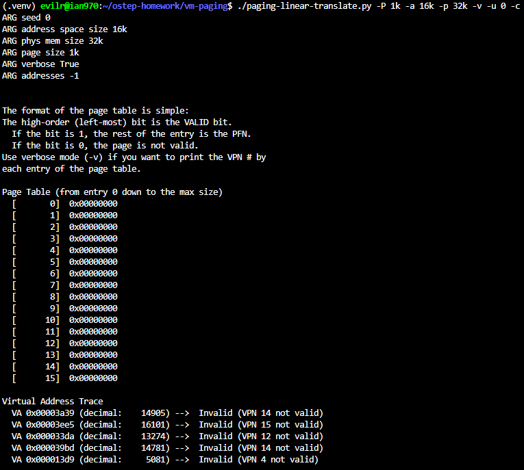
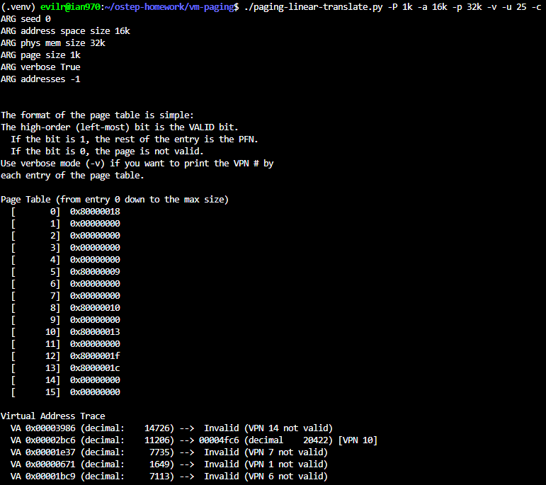
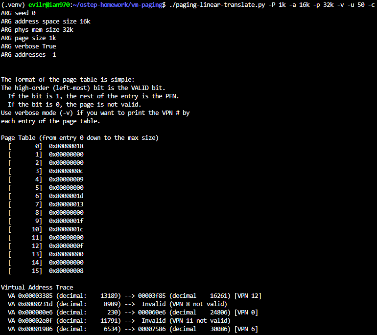
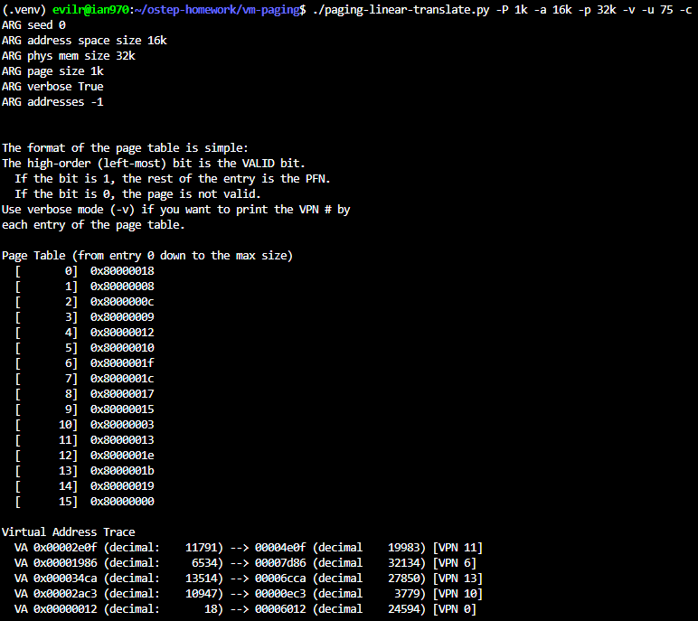
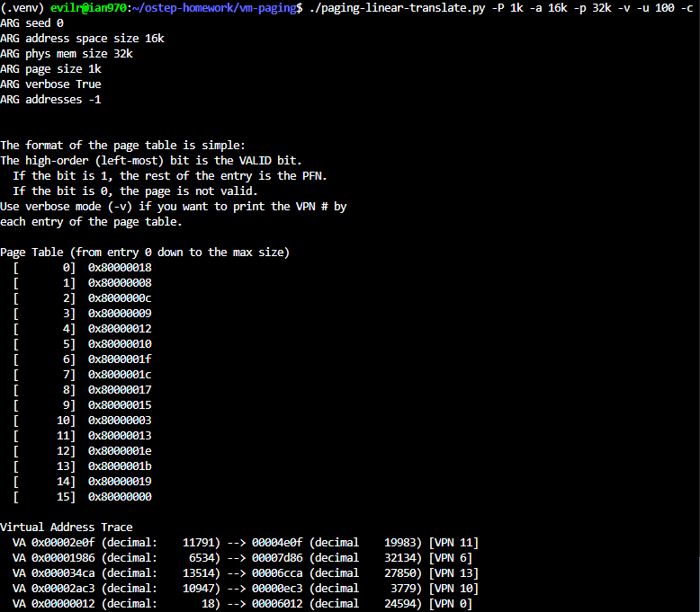
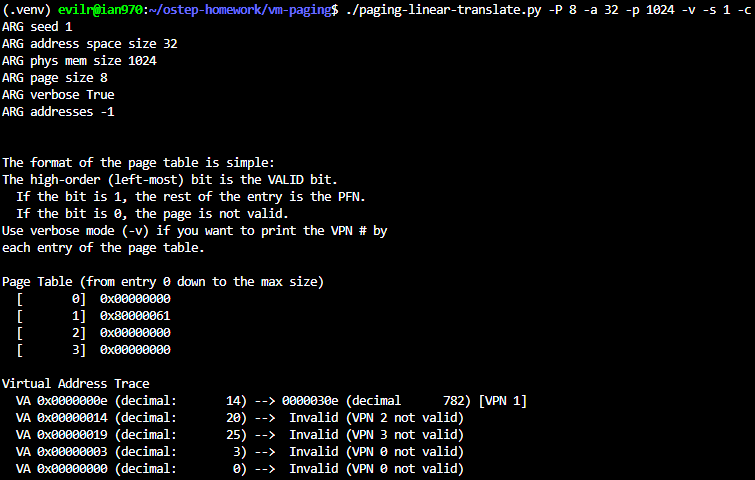
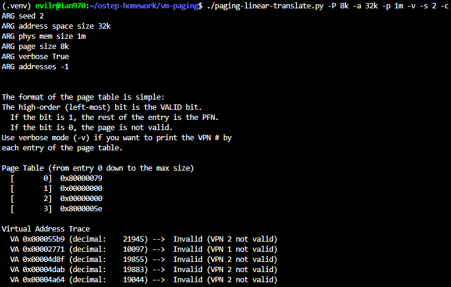
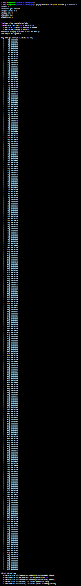
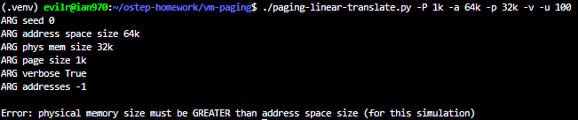
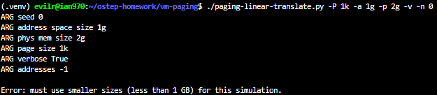

# Homework (Simulation)

In this homework, you will use a simple program, which is known as
paging-linear-translate.py, to see if you understand how simple
virtual-to-physical address translation works with linear page tables. See
the README for details.

## Questions

1. Before doing any translations, let’s use the simulator to study how linear page tables change size given different parameters. Compute the size of linear page tables as different parameters change. Some
suggested inputs are below; by using the -v flag, you can see how many page-table entries are filled. First, to understand how linear page table size changes as the address space grows, run with these flags:
    - -P 1k -a 1m -p 512m -v -n 0
      - 1m / 1k = **1024**
    - -P 1k -a 2m -p 512m -v -n 0
      - 2m / 1k = **2048**
    - -P 1k -a 4m -p 512m -v -n 0
      - 4m / 1k = **4096**
2. Then, let’s understand how linear page table size changes as page size grows. Before running any of these, try to think about the expected trends. How should page-table size change as the address space grows? As the page size grows? Why not use big pages in
general?
    - -P 1k -a 1m -p 512m -v -n 0
      - 1m / 1k = **1024**
    - -P 2k -a 1m -p 512m -v -n 0
      - 1m / 2k = **512**
    - -P 4k -a 1m -p 512m -v -n 0
      - 1m / 4k = **256**
    - How should page-table size change as the address space grows?
      - It increases proportionally. (Or: The page-table size grows linearly with the address space.)
    - As the page size grows?
      - It decreases. (Or: The page-table size is inversely proportional to the page size.)
    - Why not use big pages in general?
      - Because large pages lead to severe internal fragmentation, wasting physical memory.
3. Now let’s do some translations. Start with some small examples, and change the number of pages that are allocated to the address space with the -u flag. What happens as you increase the percentage of pages that are allocated in each address space?
    - -P 1k -a 16k -p 32k -v -u 0
      - 
    - -P 1k -a 16k -p 32k -v -u 25
      - 
    - -P 1k -a 16k -p 32k -v -u 50
      - 
    - -P 1k -a 16k -p 32k -v -u 75
      - 
    - -P 1k -a 16k -p 32k -v -u 100
      - 
4. Now let’s try some different random seeds, and some different (and sometimes quite crazy) address-space parameters, for variety. Which of these parameter combinations are unrealistic? Why?
    - -P 8 -a 32 -p 1024 -v -s 1
      - 
      - Unrealistic because: The page size (8 bytes) is incredibly small, resulting in unacceptable page-table management overhead. Also, an address space of 32 bytes is too tiny to run any real program.
    - -P 8k -a 32k -p 1m -v -s 2
      - 
      - Unrealistic because: The virtual address space (32 KB) is significantly smaller than the physical memory (1 MB), which entirely defeats the purpose of using virtual memory.
    - -P 1m -a 256m -p 512m -v -s 3
      - 
      - nrealistic because: The page size (1 MB) is excessively large, which would lead to severe internal fragmentation. Again, the virtual address space is smaller than the physical memory.
5. Use the program to try out some other problems. Can you find the limits of where the program doesn’t work anymore? For example, what happens if the address-space size is bigger than physical memory?
    - 
      - Address Space exceeds Physical Memory:
If you set the allocated address space larger than the physical memory (e.g., -P 1k -a 64k -p 32k -u 100), the simulator will fail/crash. This happens because the simulator does not implement a swapping mechanism to disk, so it simply runs out of physical frames.
    - 
      - Massive Address Space (Memory Overhead Limit):
If you set an extremely large address space or physical memory larger than or equal to 1g (e.g., -P 1k -a 1g -p 2g), the script will throw a Error.
