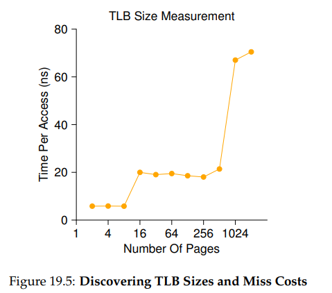
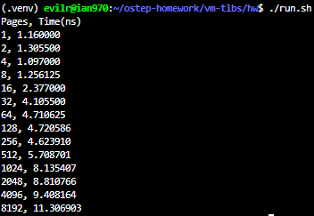
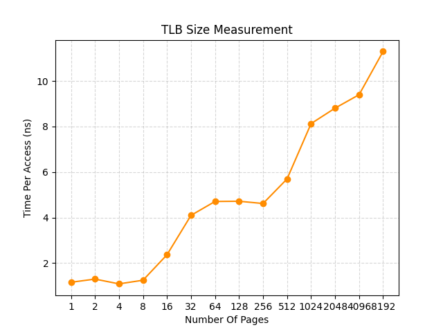

# Homework (Measurement)

In this homework, you are to measure the size and cost of accessing a TLB. The idea is based on work by Saavedra-Barrera [SB92], who developed a simple but beautiful method to measure numerous aspects of cache hierarchies, all with a very simple user-level program. Read his work for more details.

The basic idea is to access some number of pages within a large data structure (e.g., an array) and to time those accesses. For example, let’s say the TLB size of a machine happens to be 4 (which would be very small, but useful for the purposes of this discussion). If you write a program that touches 4 or fewer pages, each access should be a TLB hit, and thus relatively fast. However, once you touch 5 pages or more, repeatedly in a loop, each access will suddenly jump in cost, to that of a TLB miss.

The basic code to loop through an array once should look like this:

```c
int jump = PAGESIZE / sizeof(int);
for (i = 0; i < NUMPAGES * jump; i += jump)
    a[i] += 1;
```

In this loop, one integer per page of the array a is updated, up to the number of pages specified by NUMPAGES. By timing such a loop repeatedly (say, a few hundred million times in another loop around this one, or however many loops are needed to run for a few seconds), you can time how long each access takes (on average). By looking for jumps in cost as NUMPAGES increases, you can roughly determine how big the first-level TLB is, determine whether a second-level TLB exists (and how big it is if it does), and in general get a good sense of how TLB hits and misses can affect performance.



Figure 19.5 (page 15) shows the average time per access as the number of pages accessed in the loop is increased. As you can see in the graph, when just a few pages are accessed (8 or fewer), the average access time is roughly 5 nanoseconds. When 16 or more pages are accessed, there is a sudden jump to about 20 nanoseconds per access. A final jump in cost occurs at around 1024 pages, at which point each access takes around 70 nanoseconds. From this data, we can conclude that there is a two-level TLB hierarchy; the first is quite small (probably holding between 8 and 16 entries); the second is larger but slower (holding roughly 512 entries). The overall difference between hits in the first-level TLB and misses is quite large, roughly a factor of fourteen. TLB performance matters!

## Questions

1. For timing, you’ll need to use a timer (e.g., gettimeofday()).How precise is such a timer? How long does an operation have to take in order for you to time it precisely? (this will help determine how many times, in a loop, you’ll have to repeat a page access in order to time it successfully)

    > **Precision of the timer**: A timer like gettimeofday() typically provides microsecond (one-millionth of a second) precision. However, a single memory access or TLB lookup (as seen in the graph) takes only a few nanoseconds (one-billionth of a second).
    >
    > **How long the operation needs to take**: Because a single page access is much faster than the timer's resolution, and the function call overhead of gettimeofday() itself might take longer than the memory access, the measured operation needs to take at least several milliseconds to seconds to be timed precisely and minimize the impact of the timer's overhead.
    >
    > **Conclusion (Why we need loops)**: To accurately measure an operation that takes only a few nanoseconds, we must repeat the page access in a loop for millions of iterations (trials). By measuring the total time elapsed for all iterations and dividing it by the number of trials, we can amortize the overhead of the timer and get a highly precise average time per access.

2. Write the program, called tlb.c, that can roughly measure the cost of accessing each page. Inputs to the program should be: the number of pages to touch and the number of trials.

    > [tlb.c](./tlb.c)

3. Now write a script in your favorite scripting language (bash?) to run this program, while varying the number of pages accessed from 1 up to a few thousand, perhaps incrementing by a factor of two per iteration. Run the script on different machines and gather some data. How many trials are needed to get reliable measurements?

    > [run.sh](./run.sh)
    >
    > 
    >
    > How many trials are needed to get reliable measurements?
    >
    > 1. **Timer Resolution and Amortization**: A timer like gettimeofday() only provides microsecond ($10^{-6}$ seconds) precision, whereas a single memory access takes only a few nanoseconds ($10^{-9}$ seconds). We cannot directly measure a nanosecond event with a microsecond stopwatch. By running millions of trials, we accumulate the total execution time into the milliseconds or seconds range. Dividing this total time by the number of trials effectively amortizes the overhead of the loop and the timer function call itself.
    >
    > 2. **Smoothing Out System Noise**: The operating system constantly performs background tasks, handles interrupts, and schedules other processes (context switching). If the test runs too quickly (e.g., finishing in a few microseconds), a single OS interrupt could severely skew the data. Running millions of trials ensures the test runs long enough (e.g., a few tenths of a second to a few seconds) to average out these unpredictable system disturbances, resulting in a much smoother and more accurate graph.

4. Next, graph the results, making a graph that looks similar to the one above. Use a good tool like ploticus or even zplot. Visualization usually makes the data much easier to digest; why do you think that is?

    > 
    > Why is visualization helpful?
    >
    > Visualization is extremely helpful because it transforms thousands of raw numbers into an instantly recognizable pattern, specifically revealing the underlying hardware architecture of the machine.
    >
    > Our human brains are excellent at spotting geometric patterns (like lines, slopes, and sudden jumps) but poor at finding meaning in tables of raw figures. As seen in our generated plot with a logarithmic x-axis, the visualization translates the data into distinct 'plateaus' (representing cache hits within specific TLB levels) and sharp 'cliffs' or 'jumps' (representing cache misses). By looking at the graph, we can immediately identify the L1 TLB boundary at 8 pages and the L2 TLB boundary at 256 pages, allowing us to 'see' the physical limits and relative speed differences of the TLB hierarchy without performing mental calculations on raw numbers.

5. One thing to watch out for is compiler optimization. Compilers do all sorts of clever things, including removing loops which increment values that no other part of the program subsequently uses. How can you ensure the compiler does not remove the main loop above from your TLB size estimator?

    > When compiling C code with optimization flags (such as gcc -O3), modern compilers employ a technique called Dead Code Elimination (DCE). If the compiler detects that the values being updated inside the array are never actually used or printed later in the program, it will assume the loop is useless and completely remove it to speed up execution. This will result in an incorrectly measured access time of nearly zero.
    >
    > To prevent the compiler from optimizing away our main loop, we must ensure the loop produces observable side effects. There are two common approaches to achieve this:
    >
    > 1. **Print or use the final result**: We can calculate the sum of the array's elements or simply read a value from the array after the loop finishes, and output it using printf(). Because the program's final output now directly depends on the memory modifications made inside the loop, the compiler is forced to execute it.
    >
    > 2. **Use the volatile keyword (Recommended)**: We can declare the pointer to our array with the volatile qualifier (e.g., volatile int *large_ary = malloc(...)). This keyword explicitly instructs the compiler that the memory address may change in ways it cannot predict, strictly forbidding it from making any optimization assumptions. The compiler will then perform every single read and write memory operation exactly as written in the source code.

6. Another thing to watch out for is the fact that most systems today ship with multiple CPUs, and each CPU, of course, has its own TLB hierarchy. To really get good measurements, you have to run your code on just one CPU, instead of letting the scheduler bounce it from one CPU to the next. How can you do that? (hint: look up “pinning a thread” on Google for some clues) What will happen if you don’t do this, and the code moves from one CPU to the other?

    > taskset -c 0 ./tlb 4096 10000
    >
    > If we do not pin the program to a specific CPU, the operating system's scheduler might migrate the process from one CPU core to another during execution. Because each CPU core has its own private TLB hierarchy, migrating to a new core means the program will encounter a "cold" TLB. It will suffer a massive storm of initial TLB misses on the new core as it builds up its translation state again, severely skewing the average access time and introducing noise into the measurements.
    >
    > To prevent this and get reliable measurements, we must "pin" the thread to a single CPU core (a concept known as setting CPU affinity). In Linux, this can be easily done using the command-line tool taskset. For example, running taskset -c 0 ./tlb `<pages>` `<trials>` forces the program to execute exclusively on CPU core 0, ensuring the TLB stays "warm" and the measurements reflect true access costs rather than migration penalties.

7. Another issue that might arise relates to initialization. If you don’t initialize the array a above before accessing it, the first time you access it will be very expensive, due to initial access costs such as demand zeroing. Will this affect your code and its timing? What can you do to counterbalance these potential costs?

    > Yes, failing to initialize the array before timing will severely skew the results. When we allocate a large array using malloc, the operating system uses "lazy allocation." It does not immediately assign physical RAM. Instead, upon the very first access to each page, the CPU triggers a page fault. The OS must then intervene to allocate a physical page and fill it with zeros for security (a process known as demand zeroing).
    >
    > This OS intervention takes a massive amount of time (often microseconds) compared to a simple hardware TLB miss (nanoseconds). If these initial page faults are included within our timing loop, the average access time will be artificially inflated and highly inaccurate.
    >
    > To counterbalance this, we must add a "warm-up" loop immediately before starting the timer. This loop should iterate through the array, touching one element per page (e.g., large_ary[j] += 1). This forces the OS to resolve all page faults and complete demand zeroing beforehand. Once the timer starts, the physical memory is fully allocated, allowing us to accurately measure only the hardware TLB access costs.
